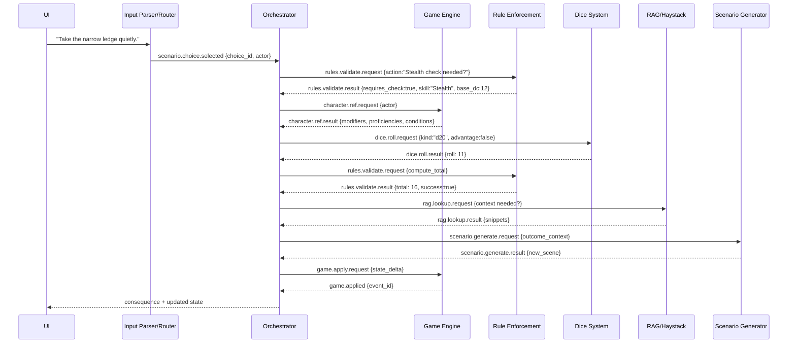

# D&D Assistant Implementation Plan: Orchestrated Architecture

## Executive Summary

This document provides an implementation roadmap for transforming the current D&D Assistant into a fully orchestrated, pipeline-based architecture. Based on the orchestrated implementation plan, this focuses on strict message-passing discipline, reliability patterns, and deterministic skill check flows while building incrementally on the existing AgentOrchestrator foundation.

---

## Current Architecture Analysis

### ✅ What We Already Have
- **AgentOrchestrator**: Central coordination system with message bus
- **Pluggable Command Handler**: `ManualCommandHandler` with 126+ commands
- **13+ Specialized Agents**: Complete D&D domain coverage
- **Game State Management**: Basic state tracking and persistence
- **Save/Load System**: `GameSaveManager` with JSON persistence
- **Caching Layer**: `SimpleInlineCache` for performance
- **Narrative Tracking**: `NarrativeContinuityTracker`

### ❌ What's Missing (Priority Order)
1. **Formal Command Envelopes** - Commands lack structured headers and correlation
2. **Orchestrator-Only Communication** - Agents can still call each other directly
3. **Deterministic Skill Check Pipeline** - No standardized DC derivation and outcome flow
4. **Context Broker** - No policy-driven RAG/Rules decision making
5. **Event Model** - Limited structured logging and auditability
6. **Agent Contracts** - No formal interfaces or versioning
7. **Policy Engine** - No house rules or customizable game mechanics
8. **Security/Roles** - No player vs DM permission system

---

## Implementation Roadmap

### Phase 1: Command Infrastructure (Week 1-2)
**Priority: Critical** - Foundation for all other improvements

#### 1.1 Enhanced Message System
**Target Files:** 
- `core/messages.py` (new)
- `agent_framework.py` (modify)
- `input_parser/manual_command_handler.py` (modify)

**Implementation:**
```python
# core/messages.py
@dataclass
class CommandHeader:
    message_id: str
    timestamp: str
    intent: str  # SKILL_CHECK, ACTION, RULE_QUERY, etc.
    actor: Dict[str, Any]  # player_id, role (PLAYER/DM/SYSTEM)
    correlation_id: str
    saga_id: Optional[str] = None
    ttl_ms: int = 30000
    version: str = "1.0"

@dataclass
class CommandEnvelope:
    header: CommandHeader
    body: Dict[str, Any]
    
    def to_agent_message(self) -> AgentMessage:
        """Convert to existing AgentMessage format"""
        return AgentMessage(
            message_id=self.header.message_id,
            source_agent="command_handler",
            target_agent="orchestrator",
            message_type=MessageType.COMMAND,
            data={
                "header": asdict(self.header),
                "body": self.body
            },
            correlation_id=self.header.correlation_id
        )
```

**Changes to ManualCommandHandler:**
```python
# input_parser/manual_command_handler.py
class ManualCommandHandler(BaseCommandHandler):
    def handle_command(self, instruction: str) -> str:
        # 1. Parse instruction to CommandEnvelope
        envelope = self._compile_instruction(instruction)
        
        # 2. Send to orchestrator instead of direct agent calls
        response = self.dm_assistant.orchestrator.handle_command(envelope)
        
        # 3. Format response for user
        return self._format_response(response)
    
    def _compile_instruction(self, instruction: str) -> CommandEnvelope:
        """Convert natural language to structured command"""
        intent = self._classify_intent(instruction)
        entities = self._extract_entities(instruction, intent)
        
        header = CommandHeader(
            message_id=str(uuid.uuid4()),
            timestamp=datetime.utcnow().isoformat(),
            intent=intent,
            actor={"role": "DM", "player_id": "dm"},  # TODO: Get from session
            correlation_id=str(uuid.uuid4())
        )
        
        return CommandEnvelope(
            header=header,
            body={
                "utterance": instruction,
                "entities": entities,
                "options": {
                    "allow_rag": True,
                    "allow_rules_lookup": True
                }
            }
        )
```

#### 1.2 Orchestrator Command Handling
**Target Files:**
- `agent_framework.py` (modify AgentOrchestrator)

**Implementation:**
```python
# agent_framework.py - Add to AgentOrchestrator
class AgentOrchestrator:
    def handle_command(self, envelope: CommandEnvelope) -> Dict[str, Any]:
        """Central command handling - all commands flow through here"""
        intent = envelope.header.intent
        
        if intent == "SKILL_CHECK":
            return self._handle_skill_check_saga(envelope)
        elif intent == "RULE_QUERY":
            return self._handle_rule_query(envelope)
        elif intent == "SCENARIO_CHOICE":
            return self._handle_scenario_choice(envelope)
        # ... other intents
        
        # Fallback to existing manual handling
        return self._handle_legacy_command(envelope)
```

**Success Criteria:**
- All commands generate structured CommandEnvelopes
- Orchestrator receives all commands first
- Correlation IDs track command flow
- Legacy commands still work during transition

---

### Phase 2: Input Parser & Pipeline Router (Week 3-4)
**Priority: High** - Intent classification and pipeline routing

#### 2.1 Input Parser Implementation
**Target Files:**
- `core/parser/` (new directory)
- `core/router.py` (new)
- `core/pipelines/` (new directory)

**Implementation:**
```python
# core/parser/grammar.py
INTENT_PATTERNS = [
    (r"^(?:choose|take|pick|select)", "scenario.choose"),
    (r"^(?:roll|check)\s+(\w+)(?:\s+vs?\s+dc\s*(\d+))?", "skill.check"),
    (r"^(?:attack|cast|dash|dodge|move|help)\b", "combat.action"),
    (r"^(?:what does|rule for|explain)\b.*", "rule.lookup"),
    (r"^(?:who|what|where).+(?:know|about)\b.*", "lore.lookup"),
    (r"^(?:generate|create)\s+(?:scenario|encounter)", "scenario.generate")
]

# core/parser/entities.py
SKILLS = {
    "stealth", "perception", "investigation", "insight", "deception",
    "persuasion", "intimidation", "athletics", "acrobatics", "sleight_of_hand"
}

ABILITIES = {
    "strength": ["str"], "dexterity": ["dex"], "constitution": ["con"],
    "intelligence": ["int"], "wisdom": ["wis"], "charisma": ["cha"]
}

# core/router.py
class Router:
    def __init__(self):
        self.pipelines = {
            "scenario.choose": ChoicePipeline,
            "skill.check": SkillCheckPipeline,
            "combat.action": CombatActionPipeline,
            "rule.lookup": RuleLookupPipeline,
            "lore.lookup": RagLookupPipeline,
            "scenario.generate": ScenarioGenPipeline
        }
    
    def route(self, parsed_command: Dict[str, Any]) -> "Pipeline":
        """Route parsed command to appropriate pipeline"""
        intent = parsed_command["intent"]
        pipeline_class = self.pipelines.get(intent)
        if not pipeline_class:
            raise ValueError(f"No pipeline for intent: {intent}")
        return pipeline_class()
```

#### 2.2 Skill Check Pipeline Implementation
**Target Files:**
- `core/pipelines/skill_check.py` (new)
- `core/pipelines/base.py` (new)

**Implementation:**
```python
# core/pipelines/base.py
@dataclass
class PipelineContext:
    saga_id: str
    correlation_id: str
    user_id: Optional[str] = None

class Pipeline:
    def __init__(self, orchestrator):
        self.orchestrator = orchestrator

    async def send(self, target: str, type_: str, data: Dict[str, Any], 
                   ctx: PipelineContext, reply_to: str = "orchestrator"):
        return await self.orchestrator.send_message(
            source="router",
            target=target,
            type=type_,
            data=data,
            correlation_id=ctx.correlation_id,
            saga_id=ctx.saga_id,
            reply_to=reply_to,
        )

# core/pipelines/skill_check.py  
class SkillCheckPipeline(Pipeline):
    async def run(self, cmd: Dict[str, Any], ctx: PipelineContext):
        """Orchestrated skill check flow"""
        actor = cmd["slots"]["actor"]
        skill = cmd["slots"]["skill"]
        dc = cmd["slots"].get("dc")

        # Step 1: Validate if skill check is required
        rules = await self.send("rule_enforcement", "rules.validate.request",
                               {"kind": "skill_check_required", "skill": skill, "dc": dc}, ctx)

        # Step 2: Get character data
        char_data = await self.send("game_engine", "character.get.request", 
                                   {"actor": actor}, ctx)

        # Step 3: Roll dice with advantage/disadvantage
        dice_result = await self.send("dice", "dice.roll.request",
                                     {"expr": "1d20", "advantage": char_data["advantage"],
                                      "disadvantage": char_data["disadvantage"]}, ctx)

        # Step 4: Compute final result
        final_result = await self.send("rule_enforcement", "rules.validate.request",
                                      {"kind": "skill_check_total", "roll": dice_result["total"],
                                       "skill": skill, "character": char_data, "dc": dc}, ctx)

        # Step 5: Apply result to game state
        await self.send("game_engine", "game.apply.request",
                       {"event": "skill_check.resolved", 
                        "payload": {**final_result, "actor": actor, "skill": skill}}, ctx)

        return {"type": "skill.check.result", "data": final_result}
```

**Success Criteria:**
- All skill checks follow deterministic pipeline
- DC derivation is transparent and auditable
- Results include full breakdown of modifiers
- Game state changes only through GameEngine

---

### Phase 3: Game Engine as Single Source of Truth (Week 5-6)
**Priority: High** - Centralized state management and event emission

#### 3.1 Enhanced Game Engine Implementation
**Target Files:**
- `agents/game_engine.py` (modify)
- `core/events.py` (new)

**Implementation:**
```python
# agents/game_engine.py - Enhanced with query handlers and events
class GameEngineAgent(BaseAgent):
    def _setup_handlers(self):
        """Enhanced handlers for centralized state management"""
        # Existing handlers...
        self.register_handler("character.get.request", self._handle_character_get)
        self.register_handler("character.ref.request", self._handle_character_ref)
        self.register_handler("game.apply.request", self._handle_apply_state_change)
        self.register_handler("state.query.request", self._handle_state_query)
    
    def _handle_character_get(self, message: AgentMessage) -> Dict[str, Any]:
        """Get full character data"""
        actor = message.data.get("actor")
        character = self.game_state.get("characters", {}).get(actor)
        
        if not character:
            return {"success": False, "error": f"Character {actor} not found"}
        
        return {"success": True, "character_data": character}
    
    def _handle_character_ref(self, message: AgentMessage) -> Dict[str, Any]:
        """Get character reference data for skill checks"""
        actor = message.data.get("actor")
        character = self.game_state.get("characters", {}).get(actor)
        
        if not character:
            return {"success": False, "error": f"Character {actor} not found"}
        
        # Compute advantage/disadvantage from conditions, help, etc.
        conditions = character.get("conditions", [])
        has_help = self.game_state.get("help_actions", {}).get(actor, False)
        
        advantage = "helped" in conditions or has_help
        disadvantage = any(cond in ["exhausted", "frightened"] for cond in conditions)
        
        return {
            "success": True,
            "modifiers": character.get("skill_modifiers", {}),
            "proficiencies": character.get("proficiencies", {}),
            "conditions": conditions,
            "advantage": advantage and not disadvantage,
            "disadvantage": disadvantage and not advantage
        }
    
    def _handle_apply_state_change(self, message: AgentMessage) -> Dict[str, Any]:
        """Apply state changes and emit events"""
        event_type = message.data.get("event")
        payload = message.data.get("payload", {})
        
        # Apply state change
        event_id = str(uuid.uuid4())
        
        if event_type == "skill_check.resolved":
            self._apply_skill_check_result(payload)
        
        # Emit domain event
        domain_event = GameEvent(
            event_id=event_id,
            event_type=event_type,
            timestamp=datetime.utcnow().isoformat(),
            correlation_id=message.correlation_id,
            data=payload
        )
        
        # Broadcast to interested agents
        self.send_message("*", "game.event.broadcast", {
            "event": domain_event
        })
        
        return {"success": True, "event_id": event_id}

# core/events.py
@dataclass 
class GameEvent:
    event_id: str
    event_type: str
    timestamp: str
    correlation_id: str
    data: Dict[str, Any]
```

#### 3.2 Policy Engine for House Rules
**Target Files:**
- `core/policy_engine.py` (new)

**Implementation:**
```python
# core/policy_engine.py
class PolicyEngine:
    def __init__(self, house_rules_profile: str = "default"):
        self.profile = house_rules_profile
        self.rules = self._load_house_rules(house_rules_profile)
    
    def compute_advantage(self, game_state: Dict, actor: str, 
                         skill: str, situation: Dict) -> str:
        """Compute advantage/disadvantage based on policy"""
        factors = []
        
        # Help from allies
        if situation.get("has_help"):
            factors.append("advantage_help")
        
        # Environmental conditions
        if situation.get("darkness") and skill in ["perception", "investigation"]:
            factors.append("disadvantage_darkness")
        
        # Class/race features
        char_features = game_state.get("characters", {}).get(actor, {}).get("features", [])
        for feature in char_features:
            if self._feature_grants_advantage(feature, skill, situation):
                factors.append(f"advantage_{feature}")
        
        # Apply house rules
        if self.profile == "gritty":
            factors.extend(self._apply_gritty_rules(situation))
        
        return self._resolve_advantage_factors(factors)
    
    def _resolve_advantage_factors(self, factors: List[str]) -> str:
        """Resolve competing advantage/disadvantage factors"""
        adv_count = len([f for f in factors if f.startswith("advantage")])
        dis_count = len([f for f in factors if f.startswith("disadvantage")])
        
        if adv_count > 0 and dis_count > 0:
            return "normal"  # Cancel out
        elif adv_count > 0:
            return "advantage"
        elif dis_count > 0:
            return "disadvantage"
        else:
            return "normal"
```

**Success Criteria:**
- Context retrieval is policy-driven, not automatic
- House rules can be configured via profiles
- Advantage computation considers all relevant factors
- Policy decisions are logged for transparency

---

### Phase 4: Observability & Reliability (Week 7-8)
**Priority: High** - Production-ready patterns

#### 4.1 Structured Logging & Distributed Tracing
**Target Files:**
- `infra/logging.py` (new)
- `infra/tracing.py` (new)
- `infra/metrics.py` (new)

**Implementation:**
```python
# infra/logging.py
import structlog

def setup_structured_logging():
    """Configure structured logging with correlation fields"""
    structlog.configure(
        processors=[
            structlog.stdlib.filter_by_level,
            structlog.stdlib.add_logger_name,
            structlog.stdlib.add_log_level,
            structlog.processors.TimeStamper(fmt="iso"),
            structlog.processors.add_log_level,
            structlog.processors.JSONRenderer()
        ],
        wrapper_class=structlog.stdlib.BoundLogger,
        logger_factory=structlog.stdlib.LoggerFactory(),
        cache_logger_on_first_use=True,
    )

class CorrelatedLogger:
    def __init__(self, correlation_id: str, saga_id: Optional[str] = None):
        self.logger = structlog.get_logger().bind(
            correlation_id=correlation_id,
            saga_id=saga_id
        )
    
    def info(self, event: str, **kwargs):
        self.logger.info(event, **kwargs)

# infra/tracing.py  
from opentelemetry import trace
from opentelemetry.exporter.jaeger.thrift import JaegerExporter
from opentelemetry.sdk.trace import TracerProvider
from opentelemetry.sdk.trace.export import BatchSpanProcessor

class TracingManager:
    def __init__(self):
        self.tracer = trace.get_tracer(__name__)
    
    def start_pipeline_span(self, pipeline_name: str, correlation_id: str):
        """Start tracing span for pipeline execution"""
        return self.tracer.start_span(
            f"pipeline.{pipeline_name}",
            attributes={
                "correlation_id": correlation_id,
                "component": "orchestrator"
            }
        )
```

#### 4.2 Circuit Breakers & Dead Letter Queue
**Target Files:**
- `infra/circuit_breaker.py` (new)
- `infra/dlq.py` (new)

**Implementation:**
```python
# infra/circuit_breaker.py
class CircuitBreaker:
    def __init__(self, failure_threshold: int = 5, recovery_timeout: int = 60):
        self.failure_threshold = failure_threshold
        self.recovery_timeout = recovery_timeout
        self.failure_count = 0
        self.last_failure_time = None
        self.state = "CLOSED"  # CLOSED, OPEN, HALF_OPEN
    
    async def call(self, func, *args, **kwargs):
        """Execute function with circuit breaker protection"""
        if self.state == "OPEN":
            if time.time() - self.last_failure_time > self.recovery_timeout:
                self.state = "HALF_OPEN"
            else:
                raise CircuitBreakerOpenError("Circuit breaker is OPEN")
        
        try:
            result = await func(*args, **kwargs)
            if self.state == "HALF_OPEN":
                self.state = "CLOSED"
                self.failure_count = 0
            return result
        except Exception as e:
            self.failure_count += 1
            self.last_failure_time = time.time()
            
            if self.failure_count >= self.failure_threshold:
                self.state = "OPEN"
            
            raise e

# infra/dlq.py
class DeadLetterQueue:
    def __init__(self):
        self.dead_messages = []
    
    def add_message(self, message: AgentMessage, error: str, attempts: int):
        """Add failed message to DLQ"""
        self.dead_messages.append({
            "message": message,
            "error": error,
            "attempts": attempts,
            "timestamp": datetime.utcnow().isoformat()
        })
    
    def get_messages(self) -> List[Dict[str, Any]]:
        """Get all dead letter messages"""
        return self.dead_messages
    
    def replay_message(self, message_id: str) -> Optional[AgentMessage]:
        """Remove message from DLQ for replay"""
        for i, entry in enumerate(self.dead_messages):
            if entry["message"].message_id == message_id:
                return self.dead_messages.pop(i)["message"]
        return None
```

**Success Criteria:**
- All major decisions are logged with full context
- Decision logs can be queried for audit trails
- Correlation IDs connect related events
- Transparency information shows rule sources

---

### Phase 5: Complete Orchestrated Flow Demo (Week 9-10)
**Priority: High** - End-to-end scenario choice → skill check → consequence

#### 5.1 Orchestrated Flow Implementation
**Target Files:**
- `core/pipelines/scenario_choice.py` (new)
- Integration of all previous phases

**Complete Flow:**


#### 5.2 Scenario Choice Pipeline
**Implementation:**
```python
# core/pipelines/scenario_choice.py
class ScenarioChoicePipeline(Pipeline):
    async def run(self, cmd: Dict[str, Any], ctx: PipelineContext):
        """Complete scenario choice → skill check → consequence flow"""
        choice_id = cmd["slots"]["choice_id"]
        actor = cmd["slots"]["actor"]
        
        # Step 1: Determine if skill check is required
        rules_check = await self.send("rule_enforcement", "rules.validate.request",
                                     {"kind": "choice_requires_check", "choice_id": choice_id}, ctx)
        
        if not rules_check["requires_check"]:
            # Direct consequence without skill check
            consequence = await self.send("scenario_generator", "scenario.generate.request",
                                         {"type": "choice_consequence", "choice_id": choice_id, 
                                          "outcome": "automatic_success"}, ctx)
            await self.send("game_engine", "game.apply.request",
                           {"event": "choice.resolved", "payload": consequence}, ctx)
            return {"type": "choice.result", "data": consequence}
        
        # Step 2: Execute skill check via SkillCheckPipeline
        skill_check_cmd = {
            "intent": "skill.check",
            "slots": {
                "actor": actor,
                "skill": rules_check["skill"],
                "dc": rules_check.get("dc")
            }
        }
        
        skill_result = await SkillCheckPipeline(self.orchestrator).run(skill_check_cmd, ctx)
        
        # Step 3: Generate consequence based on skill check outcome
        outcome = "success" if skill_result["data"]["success"] else "failure"
        
        # Optional: Query RAG for additional context
        rag_context = await self.send("rag_haystack", "rag.lookup.request",
                                     {"query": f"consequences of {outcome} on {rules_check['skill']}",
                                      "max_results": 3}, ctx)
        
        # Generate final consequence
        consequence = await self.send("scenario_generator", "scenario.generate.request",
                                     {"type": "skill_check_consequence", 
                                      "choice_id": choice_id,
                                      "skill_result": skill_result["data"],
                                      "context": rag_context.get("results", [])}, ctx)
        
        return {"type": "choice.result", "data": consequence}
```

#### 5.3 Enhanced Pipeline Context and Error Handling
**Target Files:**
- `core/pipeline_context.py` (new)
- Enhancement of existing pipeline infrastructure

**Implementation:**
```python
# core/pipeline_context.py
@dataclass
class PipelineContext:
    """Enhanced context for pipeline execution"""
    correlation_id: str
    saga_id: Optional[str]
    user_id: str
    session_id: str
    game_state_version: int
    timeout_ms: int = 30000
    circuit_breaker_config: Dict[str, Any] = None
    retry_config: Dict[str, Any] = None
    
    # Accumulated data through pipeline steps
    accumulated_data: Dict[str, Any] = field(default_factory=dict)
    
    # Error handling
    error_handler: Optional[Callable] = None
    fallback_strategy: str = "graceful_degradation"
    
    def add_step_result(self, step_name: str, result: Any):
        """Add result from a pipeline step"""
        self.accumulated_data[step_name] = result
    
    def get_step_result(self, step_name: str) -> Optional[Any]:
        """Get result from previous pipeline step"""
        return self.accumulated_data.get(step_name)

class PipelineExecutor:
    """Enhanced pipeline executor with reliability patterns"""
    
    async def execute_step(self, step_name: str, target_agent: str, 
                          message_type: str, data: Dict, ctx: PipelineContext):
        """Execute a single pipeline step with full error handling"""
        
        # Circuit breaker check
        if self.circuit_breaker.is_open(target_agent):
            raise CircuitBreakerOpenError(f"Circuit breaker open for {target_agent}")
        
        try:
            # Execute with timeout
            result = await asyncio.wait_for(
                self.orchestrator.send_message(
                    source="pipeline_executor",
                    target=target_agent,
                    message_type=message_type,
                    data=data,
                    correlation_id=ctx.correlation_id
                ),
                timeout=ctx.timeout_ms / 1000
            )
            
            # Record success
            self.circuit_breaker.record_success(target_agent)
            ctx.add_step_result(step_name, result)
            
            return result
            
        except Exception as e:
            # Record failure
            self.circuit_breaker.record_failure(target_agent)
            
            # Apply retry logic if configured
            if ctx.retry_config and step_name in ctx.retry_config:
                return await self._retry_step(step_name, target_agent, message_type, data, ctx, e)
            
            # Apply fallback strategy
            return await self._handle_step_failure(step_name, target_agent, e, ctx)
    
    async def _handle_step_failure(self, step_name: str, target_agent: str, 
                                  error: Exception, ctx: PipelineContext):
        """Handle pipeline step failure with configured strategy"""
        
        if ctx.fallback_strategy == "graceful_degradation":
            # Return safe default or use cached data
            return {"status": "degraded", "error": str(error), "fallback": True}
        
        elif ctx.fallback_strategy == "fail_fast":
            # Propagate error immediately
            raise error
        
        elif ctx.fallback_strategy == "alternative_agent":
            # Try alternative agent if available
            alt_agent = self.find_alternative_agent(target_agent, step_name)
            if alt_agent:
                return await self.execute_step(step_name, alt_agent, message_type, data, ctx)
        
        # Default: graceful degradation
        return {"status": "failed", "error": str(error)}
```

**Success Criteria:**
- Complete scenario choice → skill check → consequence flow
- All communication through orchestrator
- Pipeline steps execute with full error handling
- Circuit breakers prevent cascade failures
- Graceful degradation maintains system availability
- Full audit trail with correlation IDs

---

### Phase 6: Security & Role Management (Week 11-12)
**Priority: Low** - Multi-user support

#### 6.1 Role-Based Command Authorization
**Target Files:**
- `core/security.py` (new)
- `input_parser/manual_command_handler.py` (modify)

**Implementation:**
```python
# core/security.py
class SecurityManager:
    def __init__(self):
        self.role_permissions = {
            "PLAYER": {
                "allowed_commands": ["roll", "skill_check", "character_sheet", "inventory"],
                "forbidden_commands": ["create_npc", "set_dc", "modify_rules"]
            },
            "DM": {
                "allowed_commands": ["*"],  # All commands
                "forbidden_commands": []
            },
            "SYSTEM": {
                "allowed_commands": ["*"],
                "forbidden_commands": []
            }
        }
    
    def authorize_command(self, command_intent: str, actor_role: str) -> bool:
        """Check if actor role can execute command"""
        perms = self.role_permissions.get(actor_role, {})
        
        if "*" in perms.get("allowed_commands", []):
            return command_intent not in perms.get("forbidden_commands", [])
        
        return command_intent in perms.get("allowed_commands", [])
```

**Success Criteria:**
- Commands are filtered by role permissions
- Player actions are limited to character management
- DM has full system access
- Security violations are logged

---

## Integration Strategy

### Backward Compatibility Approach
1. **Gradual Migration**: Keep existing ManualCommandHandler working during transition
2. **Feature Flags**: Enable new features incrementally via configuration
3. **Parallel Systems**: Run old and new command processing side by side
4. **Graceful Fallbacks**: New system falls back to existing system when needed

### Testing Strategy
1. **Contract Tests**: Each agent's capabilities tested against schema
2. **Saga Tests**: End-to-end skill check scenarios with timeouts/retries
3. **Golden Transcripts**: Record and replay D&D sessions for regression testing
4. **Performance Tests**: Ensure new messaging overhead is acceptable

### Rollout Plan
1. **Phase 1-2**: Core infrastructure (can be used immediately)
2. **Phase 3-4**: Enhanced features (improves gameplay experience)  
3. **Phase 5-6**: System improvements (better maintainability)

---

## Risk Mitigation

### Technical Risks
- **Message Overhead**: New command envelopes increase latency
  - *Mitigation*: Async processing, connection pooling, caching
- **Complexity Increase**: More layers can introduce bugs
  - *Mitigation*: Comprehensive testing, gradual rollout, monitoring
- **Agent Coupling**: Orchestrator becomes bottleneck
  - *Mitigation*: Async message processing, circuit breakers

### Implementation Risks  
- **Scope Creep**: Full implementation is 12+ weeks
  - *Mitigation*: Implement in phases, deliver value incrementally
- **Breaking Changes**: Existing functionality might break
  - *Mitigation*: Backward compatibility layer, feature flags

---

## Success Metrics

### Technical Metrics
- **Message Throughput**: Commands/second processed
- **Latency**: P95 response time for skill checks
- **Error Rate**: Failed commands/total commands
- **Coverage**: % of commands using new envelope system

### Functional Metrics
- **Decision Transparency**: % of skill checks with full audit trail
- **Policy Compliance**: House rules correctly applied
- **Context Relevance**: RAG queries that improve outcomes
- **User Experience**: Subjective DM satisfaction with system

---

## Conclusion

The current D&D Assistant has excellent foundations. This implementation plan builds incrementally on the existing AgentOrchestrator and command handling architecture while adding the missing pieces for production-ready orchestration, transparency, and policy-driven decision making.

**Key Benefits:**
- **Deterministic Gameplay**: Skill checks become predictable and auditable
- **Smart Context**: RAG/Rules only called when actually needed
- **House Rules Support**: Customizable game mechanics via policy
- **Better Testing**: Formal contracts enable comprehensive testing
- **Audit Trail**: Full transparency into all system decisions

**Recommended Start**: Begin with Phase 1 (Command Infrastructure) as it provides immediate benefits and enables all subsequent improvements.