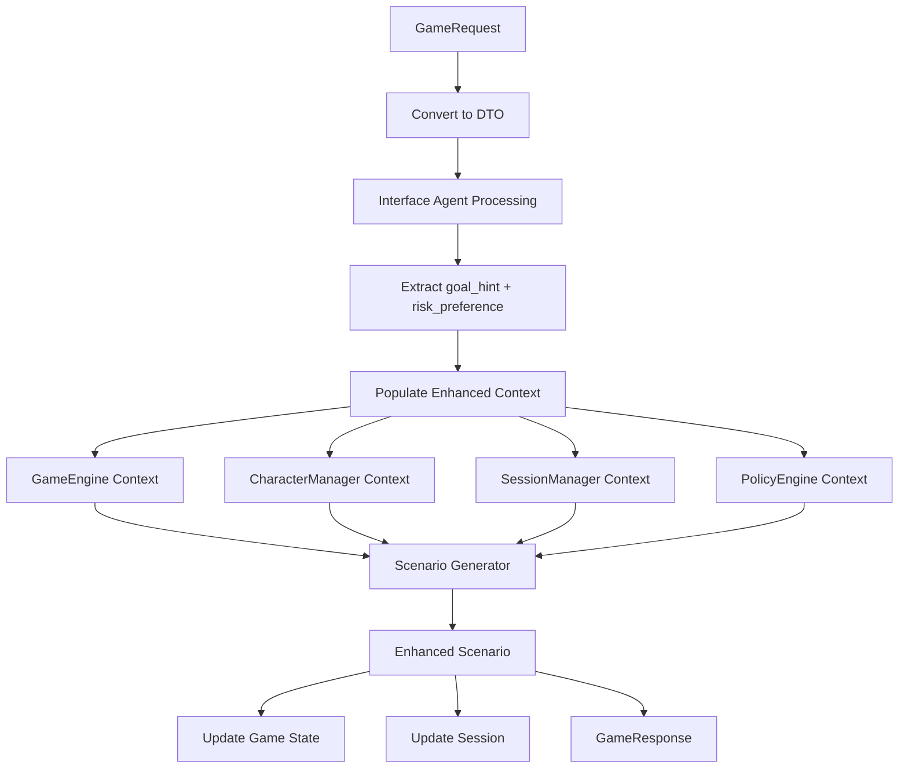

# Enhanced Scenario Generator Implementation Plan - Updated with PolicyEngine Integration
*Comprehensive architecture integration based on user feedback, existing components, and PolicyEngine mechanics*

## Overview

This enhanced implementation plan integrates the scenario generator with the existing game architecture components, including the [`components/policy.py`](components/policy.py) PolicyEngine for comprehensive mechanics policy management. The plan leverages the existing PolicyEngine to handle difficulty scaling, DC ranges, combat budgets, and choice count policies.

## Enhanced Architecture Integration with PolicyEngine

### Core Components Integration

**GameEngine** ([`components/game_engine.py:17`](components/game_engine.py:17))
- **Current**: Basic GameState with characters, combat_state, environment, campaign_flags, session_data
- **Enhancement**: Add narrative_context, location_context, quest_context fields

**PolicyEngine** ([`components/policy.py:26`](components/policy.py:26))  
- **Current**: Rule mediation, advantage computation, DC adjustment
- **Enhancement**: Add scenario generation policies for difficulty targets, DC ranges, combat budgets, choice counts

**SessionManager** ([`components/session_manager.py:36`](components/session_manager.py:36))  
- **Current**: Session persistence and state management
- **Enhancement**: Track narrative progression, quest updates, hook continuation

**CharacterManager** ([`components/character_manager.py:45`](components/character_manager.py:45))
- **Current**: Character data and skill calculations
- **Enhancement**: Party-level analysis methods for scenario generation

## Phase 1: PolicyEngine Enhancement for Scenario Mechanics

### 1.1 Extend PolicyEngine with Scenario Generation Rules
Update [`components/policy.py:33`](components/policy.py:33) to add scenario generation policies:

```python
# Add to PolicyEngine class - extend PROFILES with scenario policies
SCENARIO_GENERATION_RULES = {
    PolicyProfile.RAW: {
        "difficulty_target": PolicyRule(
            "difficulty_target", "medium", 
            "Standard difficulty scaling per DMG", "DMG"
        ),
        "dc_easy_range": PolicyRule(
            "dc_easy_range", [5, 10], 
            "Easy DC range per DMG", "DMG"
        ),
        "dc_medium_range": PolicyRule(
            "dc_medium_range", [10, 15], 
            "Medium DC range per DMG", "DMG"
        ),
        "dc_hard_range": PolicyRule(
            "dc_hard_range", [15, 20], 
            "Hard DC range per DMG", "DMG"
        ),
        "combat_budget_multiplier": PolicyRule(
            "combat_budget_multiplier", 1.0, 
            "Standard encounter difficulty per DMG", "DMG"
        ),
        "choice_count_default": PolicyRule(
            "choice_count_default", 3, 
            "Standard choice options per DMG", "DMG"
        ),
        "choice_count_range": PolicyRule(
            "choice_count_range", [2, 4], 
            "Choice count variance per DMG", "DMG"
        )
    },
    
    PolicyProfile.HOUSE: {
        "difficulty_target": PolicyRule(
            "difficulty_target", "medium", 
            "Balanced difficulty for house rules", "House Rule"
        ),
        "dc_easy_range": PolicyRule(
            "dc_easy_range", [5, 12], 
            "Slightly easier DCs for house rules", "House Rule"
        ),
        "dc_medium_range": PolicyRule(
            "dc_medium_range", [10, 15], 
            "Standard medium DCs", "House Rule"
        ),
        "dc_hard_range": PolicyRule(
            "dc_hard_range", [15, 18], 
            "Slightly easier hard DCs for house rules", "House Rule"
        ),
        "combat_budget_multiplier": PolicyRule(
            "combat_budget_multiplier", 0.9, 
            "Slightly easier encounters for house rules", "House Rule"
        ),
        "choice_count_default": PolicyRule(
            "choice_count_default", 4, 
            "More player options for house rules", "House Rule"
        ),
        "choice_count_range": PolicyRule(
            "choice_count_range", [3, 5], 
            "Expanded choice range for house rules", "House Rule"
        )
    },
    
    PolicyProfile.EASY: {
        "difficulty_target": PolicyRule(
            "difficulty_target", "easy", 
            "Beginner-friendly difficulty", "Easy Mode"
        ),
        "dc_easy_range": PolicyRule(
            "dc_easy_range", [5, 10], 
            "Forgiving easy DCs for beginners", "Easy Mode"
        ),
        "dc_medium_range": PolicyRule(
            "dc_medium_range", [8, 12], 
            "Lower medium DCs for beginners", "Easy Mode"
        ),
        "dc_hard_range": PolicyRule(
            "dc_hard_range", [12, 15], 
            "More achievable hard DCs for beginners", "Easy Mode"
        ),
        "combat_budget_multiplier": PolicyRule(
            "combat_budget_multiplier", 0.7, 
            "Easier encounters for beginners", "Easy Mode"
        ),
        "choice_count_default": PolicyRule(
            "choice_count_default", 4, 
            "More guidance options for beginners", "Easy Mode"
        ),
        "choice_count_range": PolicyRule(
            "choice_count_range", [3, 5], 
            "Consistent choice availability for beginners", "Easy Mode"
        )
    }
}

def __init__(self, profile: PolicyProfile = PolicyProfile.RAW):
    """Initialize policy engine with specified profile including scenario rules"""
    self.active_profile_type = profile
    self.active_profile = self._load_profile(profile)
    self.custom_rules: Dict[str, PolicyRule] = {}
    self.temporary_overrides: Dict[str, Any] = {}
    
    # Load scenario generation rules into active profile
    if profile in self.SCENARIO_GENERATION_RULES:
        self.active_profile.update(self.SCENARIO_GENERATION_RULES[profile])
    
    print(f"🛡️ Policy Engine initialized with {profile.value.upper()} profile + scenario rules")

def get_difficulty_policy(self, party_context: Dict[str, Any]) -> Dict[str, Any]:
    """Get comprehensive difficulty policy for scenario generation using existing adjust_difficulty"""
    
    avg_level = party_context.get('avg_level', 3)
    party_size = party_context.get('party_size', 4)
    hp_state = party_context.get('hp_state', {})
    
    # Get base policy values
    difficulty_target = self.get_rule_value("difficulty_target")
    easy_range = self.get_rule_value("dc_easy_range")
    medium_range = self.get_rule_value("dc_medium_range") 
    hard_range = self.get_rule_value("dc_hard_range")
    
    # Use existing adjust_difficulty method for level-appropriate scaling
    level_context = {
        "average_party_level": avg_level,
        "difficulty_level": 0  # Neutral baseline
    }
    
    # Adjust each DC tier using existing policy engine logic
    easy_adjusted = self.adjust_difficulty(easy_range[1], level_context)
    medium_adjusted = self.adjust_difficulty(medium_range[1], level_context)
    hard_adjusted = self.adjust_difficulty(hard_range[1], level_context)
    
    # Factor in party health state
    hp_percent = hp_state.get('average_hp_percent', 85)
    health_adjustment = 0
    if hp_percent < 50:
        health_adjustment = -2  # Easier if badly wounded
    elif hp_percent < 75:
        health_adjustment = -1  # Slightly easier if wounded
    
    return {
        'difficulty_target': difficulty_target,
        'dc_policy': {
            'easy': max(5, easy_adjusted['final_dc'] + health_adjustment),
            'medium': max(8, medium_adjusted['final_dc'] + health_adjustment),
            'hard': max(12, hard_adjusted['final_dc'] + health_adjustment),
            'very_hard': max(15, hard_adjusted['final_dc'] + 3 + health_adjustment)
        },
        'dc_adjustments': {
            'level_adjustment': easy_adjusted['total_adjustment'],
            'health_adjustment': health_adjustment,
            'profile': self.active_profile_type.value
        },
        'party_level': avg_level,
        'party_size': party_size,
        'party_health': hp_percent
    }

def get_encounter_budget(self, party_context: Dict[str, Any]) -> Dict[str, Any]:
    """Calculate encounter budget guidelines using D&D 5e encounter building rules"""
    
    avg_level = party_context.get('avg_level', 3)
    party_size = party_context.get('party_size', 4)
    hp_state = party_context.get('hp_state', {})
    resources = party_context.get('resources', {})
    
    # Base XP thresholds per character level (from DMG)
    xp_thresholds = {
        1: {"easy": 25, "medium": 50, "hard": 75, "deadly": 100},
        2: {"easy": 50, "medium": 100, "hard": 150, "deadly": 200},
        3: {"easy": 75, "medium": 150, "hard": 225, "deadly": 400},
        4: {"easy": 125, "medium": 250, "hard": 375, "deadly": 500},
        5: {"easy": 250, "medium": 500, "hard": 750, "deadly": 1100},
        # Would extend for all levels...
    }
    
    # Get XP threshold for party level (fallback calculation for levels > 5)
    if avg_level in xp_thresholds:
        thresholds = xp_thresholds[avg_level]
    else:
        # Approximation for higher levels
        base = 250 * (avg_level - 4)
        thresholds = {
            "easy": base,
            "medium": base * 2,
            "hard": base * 3,
            "deadly": base * 4
        }
    
    # Scale by party size
    party_budgets = {
        difficulty: threshold * party_size 
        for difficulty, threshold in thresholds.items()
    }
    
    # Apply policy multiplier
    multiplier = self.get_rule_value("combat_budget_multiplier")
    adjusted_budgets = {
        difficulty: int(budget * multiplier)
        for difficulty, budget in party_budgets.items()
    }
    
    # Adjust for party condition (use existing DC adjustment logic)
    hp_percent = hp_state.get('average_hp_percent', 85)
    resource_level = resources.get('spell_slots_remaining', 'medium')
    
    # Resource-based adjustment
    resource_multipliers = {
        'none': 0.5,
        'low': 0.7,
        'medium': 1.0,
        'high': 1.2
    }
    resource_mult = resource_multipliers.get(resource_level, 1.0)
    
    # Health-based adjustment
    if hp_percent < 50:
        health_mult = 0.6
    elif hp_percent < 75:
        health_mult = 0.8
    else:
        health_mult = 1.0
    
    final_multiplier = multiplier * resource_mult * health_mult
    
    final_budgets = {
        difficulty: int(budget * resource_mult * health_mult)
        for difficulty, budget in adjusted_budgets.items()
    }
    
    return {
        'xp_budgets': final_budgets,
        'recommended_difficulty': self.get_rule_value("difficulty_target"),
        'policy_multiplier': multiplier,
        'resource_multiplier': resource_mult,
        'health_multiplier': health_mult,
        'final_multiplier': final_multiplier,
        'party_level': avg_level,
        'party_size': party_size,
        'notes': f"Level {avg_level} party of {party_size}, {hp_percent}% HP, {resource_level} resources"
    }

def get_choice_count_policy(self, confidence: float, complexity: str = "medium") -> Dict[str, Any]:
    """Determine appropriate number of choices for scenario based on policy and player confidence"""
    
    default_count = self.get_rule_value("choice_count_default")
    choice_range = self.get_rule_value("choice_count_range")
    
    # Start with default
    target_count = default_count
    
    # Adjust based on player input confidence (lower confidence = more guidance)
    if confidence < 0.5:
        target_count = min(choice_range[1], default_count + 1)  # More options for unclear input
    elif confidence < 0.7:
        target_count = default_count  # Standard options
    elif confidence > 0.9:
        target_count = max(choice_range[0], default_count - 1)  # Fewer but more focused options
    
    # Adjust based on scenario complexity
    complexity_adjustments = {
        "simple": -1,  # Fewer choices for simple scenarios
        "medium": 0,   # Standard choices
        "complex": +1  # More choices for complex scenarios
    }
    
    complexity_adj = complexity_adjustments.get(complexity, 0)
    target_count = max(choice_range[0], min(choice_range[1], target_count + complexity_adj))
    
    return {
        'choice_count': target_count,
        'choice_range': choice_range,
        'default_count': default_count,
        'confidence_factor': confidence,
        'complexity': complexity,
        'adjustments': {
            'confidence_adjustment': target_count - default_count - complexity_adj,
            'complexity_adjustment': complexity_adj
        }
    }
```

### 1.2 GameState Enhancement
Update [`components/game_engine.py:17`](components/game_engine.py:17) GameState class:

```python
@dataclass
class GameState:
    """Enhanced game state structure for comprehensive scenario generation"""
    # Existing fields
    characters: Dict[str, Any]
    combat_state: Dict[str, Any]
    environment: Dict[str, Any]
    campaign_flags: Dict[str, Any]
    session_data: Dict[str, Any]
    
    # NEW: Narrative context for scenario generation
    narrative_context: Dict[str, Any] = field(default_factory=lambda: {
        'scene_summary': [],  # Last 2-3 actions/events
        'unresolved_hooks': [],  # Open plot threads
        'pacing_state': 'exploration',  # combat/social/exploration/rest
        'tone': 'heroic',  # heroic/dark/mysterious/comedic
        'recent_events': [],  # Chronological action history
        'narrative_momentum': 'steady'  # building/climactic/resolving/steady
    })
    
    # NEW: Enhanced location context  
    location_context: Dict[str, Any] = field(default_factory=lambda: {
        'current_location': 'Unknown',
        'location_tags': [],  # interior/exterior, dungeon/urban/wilderness
        'map_features': {  # exits, cover, hazards, lighting
            'exits': [],
            'cover': [],
            'hazards': [],
            'lighting': 'normal'
        },
        'interactables': [],  # doors, levers, objects with affordances
        'alert_level': 'calm',  # calm/suspicious/alert/hostile
        'atmosphere': {},  # sounds, smells, notable features
        'visibility': 'clear'  # clear/dim/dark/fog/etc
    })
    
    # NEW: Quest and campaign tracking
    quest_context: Dict[str, Any] = field(default_factory=lambda: {
        'active_quests': [],  # Current quest objectives
        'quest_progress': {},  # Quest ID -> progress markers
        'campaign_hooks': [],  # Available story hooks
        'completed_milestones': [],  # Story progression tracking
        'content_safety': {  # Content guidelines
            'violence_level': 'standard',
            'mature_themes': False,
            'horror_elements': False
        },
        'spoiler_sensitivity': 'medium'  # low/medium/high
    })
```

### 1.3 CharacterManager Enhancement
Update [`components/character_manager.py:32`](components/character_manager.py:32) CharacterData class and add missing tracking features:

```python
@dataclass
class CharacterData:
    """Enhanced character information with scenario generation features"""
    character_id: str
    name: str
    level: int
    proficiency_bonus: int
    ability_scores: Dict[str, int]
    ability_modifiers: Dict[str, int]
    skills: Dict[str, bool]  # Proficiency in skills
    expertise_skills: List[str]  # Skills with expertise
    conditions: List[str]
    features: List[str]  # Class features, racial traits, etc.
    
    # NEW: Enhanced tracking for scenario generation
    character_class: str = "Fighter"  # Primary class for role analysis
    hp_current: int = 0  # Current hit points
    hp_max: int = 0  # Maximum hit points
    spell_slots: Dict[str, int] = field(default_factory=dict)  # Spell slots by level
    consumables: Dict[str, int] = field(default_factory=dict)  # Items and quantities
    armor_class: int = 10  # AC for stealth profile calculation
    armor_type: str = "light"  # light/medium/heavy for stealth analysis
    stealth_modifiers: Dict[str, int] = field(default_factory=dict)  # Equipment bonuses/penalties
    skill_data: Dict[str, CharacterSkillData] = field(default_factory=dict)  # Detailed skill information
    
    # Resource tracking
    short_rests_available: int = 1  # Number of short rests before long rest needed
    long_rest_needed: bool = False  # Whether long rest is required
    exhaustion_level: int = 0  # Exhaustion level (0-6)
    
    # Party role indicators
    role_primary: str = "striker"  # tank/striker/support/control
    role_secondary: Optional[str] = None  # Secondary role if multiclass/versatile

class CharacterManager:
    """Enhanced character management with comprehensive party tracking"""
    
    def __init__(self):
        self.characters: Dict[str, CharacterData] = {}
        
        # Standard D&D skill-to-ability mappings
        self.skill_abilities = {
            "acrobatics": AbilityScore.DEXTERITY,
            "animal_handling": AbilityScore.WISDOM,
            "arcana": AbilityScore.INTELLIGENCE,
            "athletics": AbilityScore.STRENGTH,
            "deception": AbilityScore.CHARISMA,
            "history": AbilityScore.INTELLIGENCE,
            "insight": AbilityScore.WISDOM,
            "intimidation": AbilityScore.CHARISMA,
            "investigation": AbilityScore.INTELLIGENCE,
            "medicine": AbilityScore.WISDOM,
            "nature": AbilityScore.INTELLIGENCE,
            "perception": AbilityScore.WISDOM,
            "performance": AbilityScore.CHARISMA,
            "persuasion": AbilityScore.CHARISMA,
            "religion": AbilityScore.INTELLIGENCE,
            "sleight_of_hand": AbilityScore.DEXTERITY,
            "stealth": AbilityScore.DEXTERITY,
            "survival": AbilityScore.WISDOM
        }
        
        print("👥 Enhanced Character Manager initialized")
    
    def add_character(self, character_data: Dict[str, Any]) -> str:
        """Add or update a character with enhanced tracking"""
        char_id = character_data.get("character_id", character_data.get("name", "unknown"))
        
        # Calculate ability modifiers
        ability_scores = character_data.get("ability_scores", {})
        ability_modifiers = {}
        for ability, score in ability_scores.items():
            ability_modifiers[ability] = self._calculate_ability_modifier(score)
        
        # Calculate proficiency bonus from level
        level = character_data.get("level", 1)
        proficiency_bonus = self._calculate_proficiency_bonus(level)
        
        # Calculate default HP if not provided
        hp_max = character_data.get("hp_max", self._calculate_default_hp(level, ability_modifiers.get("constitution", 0)))
        hp_current = character_data.get("hp_current", hp_max)
        
        # Create skill data objects
        skill_data_objects = {}
        skills = character_data.get("skills", {})
        expertise_skills = character_data.get("expertise_skills", [])
        
        for skill_name in self.skill_abilities.keys():
            ability = self.skill_abilities[skill_name]
            ability_mod = ability_modifiers.get(ability.value, 0)
            is_proficient = skills.get(skill_name, False)
            expertise = skill_name in expertise_skills
            
            # Calculate total modifier
            total_modifier = ability_mod
            if is_proficient:
                if expertise:
                    total_modifier += proficiency_bonus * 2
                else:
                    total_modifier += proficiency_bonus
            
            skill_data_objects[skill_name] = CharacterSkillData(
                skill_name=skill_name,
                ability_score=ability,
                ability_modifier=ability_mod,
                proficiency_bonus=proficiency_bonus if is_proficient else 0,
                is_proficient=is_proficient,
                expertise=expertise,
                other_bonuses=character_data.get("skill_bonuses", {}).get(skill_name, {}),
                total_modifier=total_modifier
            )
        
        # Determine character role
        char_class = character_data.get("character_class", "Fighter")
        role_primary, role_secondary = self._determine_character_roles(char_class, ability_scores, level)
        
        character = CharacterData(
            character_id=char_id,
            name=character_data.get("name", char_id),
            level=level,
            proficiency_bonus=proficiency_bonus,
            ability_scores=ability_scores,
            ability_modifiers=ability_modifiers,
            skills=skills,
            expertise_skills=expertise_skills,
            conditions=character_data.get("conditions", []),
            features=character_data.get("features", []),
            # Enhanced fields
            character_class=char_class,
            hp_current=hp_current,
            hp_max=hp_max,
            spell_slots=character_data.get("spell_slots", {}),
            consumables=character_data.get("consumables", {"healing_potion": 2}),  # Default consumables
            armor_class=character_data.get("armor_class", 10 + ability_modifiers.get("dexterity", 0)),
            armor_type=character_data.get("armor_type", "light"),
            stealth_modifiers=character_data.get("stealth_modifiers", {}),
            skill_data=skill_data_objects,
            short_rests_available=character_data.get("short_rests_available", 1),
            long_rest_needed=character_data.get("long_rest_needed", False),
            exhaustion_level=character_data.get("exhaustion_level", 0),
            role_primary=role_primary,
            role_secondary=role_secondary
        )
        
        self.characters[char_id] = character
        print(f"👤 Added enhanced character: {character.name} (Level {level} {char_class})")
        
        return char_id
    
    def get_party_snapshot(self) -> Dict[str, Any]:
        """Get comprehensive party information for scenario generation"""
        if not self.characters:
            return self._default_party_snapshot()
            
        characters = list(self.characters.values())
        levels = [char.level for char in characters]
        
        return {
            'avg_level': sum(levels) // len(levels) if levels else 3,
            'party_size': len(characters),
            'level_range': f"{min(levels)}-{max(levels)}" if levels else "1-3",
            'party_roles': self._analyze_party_roles(),
            'hp_state': self._analyze_hp_status(),
            'resources': self._analyze_party_resources(),
            'stealth_profile': self._analyze_stealth_capability(),
            'conditions_summary': self._summarize_conditions(),
            'party_dynamics': self._assess_party_dynamics(),
            'characters': [self._get_character_for_scenario(char) for char in characters]
        }
    
    def _determine_character_roles(self, char_class: str, ability_scores: Dict[str, int], level: int) -> tuple:
        """Determine primary and secondary character roles based on class and abilities"""
        
        # Class-based role mapping (simplified D&D 5e)
        class_roles = {
            "fighter": ("striker", "tank"),
            "paladin": ("tank", "support"),
            "barbarian": ("striker", "tank"),
            "ranger": ("striker", "support"),
            "rogue": ("striker", "control"),
            "monk": ("striker", "control"),
            "wizard": ("control", "support"),
            "sorcerer": ("striker", "control"),
            "warlock": ("striker", "control"),
            "cleric": ("support", "tank"),
            "druid": ("support", "control"),
            "bard": ("support", "control"),
            # Add more classes as needed
        }
        
        class_lower = char_class.lower()
        if class_lower in class_roles:
            return class_roles[class_lower]
        
        # Fallback based on highest ability scores
        str_score = ability_scores.get("strength", 10)
        dex_score = ability_scores.get("dexterity", 10)
        con_score = ability_scores.get("constitution", 10)
        int_score = ability_scores.get("intelligence", 10)
        wis_score = ability_scores.get("wisdom", 10)
        cha_score = ability_scores.get("charisma", 10)
        
        highest_mental = max(int_score, wis_score, cha_score)
        highest_physical = max(str_score, dex_score)
        
        if con_score >= 15 and highest_physical >= 14:
            return ("tank", "striker")
        elif highest_mental >= 15:
            return ("control", "support")
        elif dex_score >= 15:
            return ("striker", "control")
        else:
            return ("striker", None)
    
    def _analyze_party_roles(self) -> Dict[str, int]:
        """Analyze tank/striker/support/control composition"""
        roles = {'tank': 0, 'striker': 0, 'support': 0, 'control': 0}
        
        for char in self.characters.values():
            # Count primary role
            if char.role_primary in roles:
                roles[char.role_primary] += 1
            
            # Count secondary role (weighted less)
            if char.role_secondary and char.role_secondary in roles:
                roles[char.role_secondary] += 0.5
        
        return roles
    
    def _analyze_hp_status(self) -> Dict[str, Any]:
        """Analyze party health status for PolicyEngine difficulty scaling"""
        if not self.characters:
            return {'average_hp_percent': 85, 'wounded_members': 0, 'critical_members': 0, 'healing_available': True}
        
        hp_percentages = []
        wounded_count = 0
        critical_count = 0
        healing_available = False
        
        for char in self.characters.values():
            if char.hp_max > 0:
                hp_percent = (char.hp_current / char.hp_max) * 100
                hp_percentages.append(hp_percent)
                
                if hp_percent < 50:
                    wounded_count += 1
                if hp_percent < 25:
                    critical_count += 1
            
            # Check for healing capabilities
            if ("cure" in " ".join(char.features).lower() or
                char.consumables.get("healing_potion", 0) > 0 or
                char.spell_slots):
                healing_available = True
        
        avg_hp = sum(hp_percentages) / len(hp_percentages) if hp_percentages else 85
        
        return {
            'average_hp_percent': int(avg_hp),
            'wounded_members': wounded_count,
            'critical_members': critical_count,
            'healing_available': healing_available,
            'party_needs_rest': any(char.long_rest_needed for char in self.characters.values())
        }
    
    def _analyze_party_resources(self) -> Dict[str, Any]:
        """Analyze spell slots, consumables for PolicyEngine encounter budgets"""
        if not self.characters:
            return {'spell_slots_remaining': 'medium', 'consumables': [], 'special_abilities_available': True, 'long_rest_needed': False}
        
        total_spell_slots = 0
        max_spell_slots = 0
        all_consumables = []
        abilities_available = False
        rest_needed = False
        
        for char in self.characters.values():
            # Count spell slots
            current_slots = sum(char.spell_slots.values())
            total_spell_slots += current_slots
            
            # Estimate max slots based on level and class
            if char.character_class.lower() in ["wizard", "sorcerer", "cleric", "druid", "bard", "warlock"]:
                estimated_max = char.level * 2  # Rough estimate
                max_spell_slots += estimated_max
            elif char.character_class.lower() in ["paladin", "ranger"]:
                estimated_max = max(0, (char.level - 1) * 1)  # Half-casters
                max_spell_slots += estimated_max
            
            # Collect consumables
            for item, quantity in char.consumables.items():
                if quantity > 0:
                    all_consumables.append(f"{item}({quantity})")
            
            # Check for special abilities
            if char.features or char.spell_slots:
                abilities_available = True
                
            # Check rest needs
            if char.long_rest_needed or char.short_rests_available <= 0:
                rest_needed = True
        
        # Determine spell slot level
        if max_spell_slots == 0:
            slot_level = 'none'
        else:
            slot_ratio = total_spell_slots / max_spell_slots
            if slot_ratio > 0.75:
                slot_level = 'high'
            elif slot_ratio > 0.5:
                slot_level = 'medium'
            elif slot_ratio > 0.25:
                slot_level = 'low'
            else:
                slot_level = 'none'
        
        return {
            'spell_slots_remaining': slot_level,
            'consumables': all_consumables[:5],  # Limit to top 5 types
            'special_abilities_available': abilities_available,
            'long_rest_needed': rest_needed,
            'total_spell_slots': total_spell_slots,
            'spell_slot_ratio': total_spell_slots / max_spell_slots if max_spell_slots > 0 else 0
        }
    
    def _analyze_stealth_capability(self) -> str:
        """Analyze party stealth profile based on armor and abilities"""
        if not self.characters:
            return 'normal'
        
        stealth_penalties = 0
        stealth_bonuses = 0
        
        for char in self.characters.values():
            # Armor penalties
            if char.armor_type == "heavy":
                stealth_penalties += 2  # Heavy armor disadvantage
            elif char.armor_type == "medium":
                stealth_penalties += 1  # Some medium armors have penalties
            
            # Stealth skill bonuses
            stealth_skill_data = char.skill_data.get("stealth")
            if stealth_skill_data and stealth_skill_data.total_modifier > 0:
                stealth_bonuses += 1
            
            # Special stealth modifiers
            stealth_bonuses += len(char.stealth_modifiers)
        
        # Determine overall profile
        if stealth_penalties >= len(self.characters):
            return 'poor'  # Whole party has stealth issues
        elif stealth_bonuses >= len(self.characters) * 0.5:
            return 'good'  # Half or more party members are stealthy
        else:
            return 'normal'
    
    def _summarize_conditions(self) -> List[str]:
        """Summarize active conditions across the party"""
        all_conditions = []
        for char in self.characters.values():
            all_conditions.extend(char.conditions)
        
        # Count occurrences
        condition_counts = {}
        for condition in all_conditions:
            condition_counts[condition] = condition_counts.get(condition, 0) + 1
        
        # Format with counts
        summary = []
        for condition, count in condition_counts.items():
            if count > 1:
                summary.append(f"{condition}({count})")
            else:
                summary.append(condition)
        
        return summary[:5]  # Limit to top 5 conditions
    
    def _assess_party_dynamics(self) -> Dict[str, Any]:
        """Assess party composition balance and effectiveness"""
        if not self.characters:
            return {'balance': 'unknown', 'effectiveness': 'unknown'}
        
        roles = self._analyze_party_roles()
        party_size = len(self.characters)
        
        # Check role balance
        has_tank = roles['tank'] >= 1
        has_striker = roles['striker'] >= 1
        has_support = roles['support'] >= 0.5
        has_control = roles['control'] >= 0.5
        
        balance_score = sum([has_tank, has_striker, has_support, has_control])
        
        if balance_score >= 3:
            balance = 'well_balanced'
        elif balance_score >= 2:
            balance = 'decent'
        else:
            balance = 'unbalanced'
        
        # Check party size effectiveness
        if party_size >= 3 and party_size <= 5:
            size_effectiveness = 'optimal'
        elif party_size == 2:
            size_effectiveness = 'small_but_viable'
        elif party_size == 1:
            size_effectiveness = 'solo_challenge'
        elif party_size >= 6:
            size_effectiveness = 'large_group'
        else:
            size_effectiveness = 'unknown'
        
        return {
            'balance': balance,
            'size_effectiveness': size_effectiveness,
            'role_coverage': roles,
            'balance_score': balance_score
        }
    
    def _get_character_for_scenario(self, char: CharacterData) -> Dict[str, Any]:
        """Get character summary for scenario generation"""
        return {
            'name': char.name,
            'level': char.level,
            'class': char.character_class,
            'role': char.role_primary,
            'hp_percent': int((char.hp_current / char.hp_max) * 100) if char.hp_max > 0 else 100,
            'conditions': char.conditions,
            'exhaustion': char.exhaustion_level,
            'stealth_capable': char.skill_data.get('stealth', CharacterSkillData('stealth', AbilityScore.DEXTERITY, 0, 0, False, False, {}, 0)).total_modifier > 0
        }
    
    def _calculate_default_hp(self, level: int, con_modifier: int) -> int:
        """Calculate default HP for character based on level and constitution"""
        # Rough estimation: 8 base + con_mod + (level-1) * (5 + con_mod)
        base_hp = 8 + con_modifier
        additional_hp = (level - 1) * (5 + con_modifier)
        return max(1, base_hp + additional_hp)
    
    def _default_party_snapshot(self) -> Dict[str, Any]:
        """Return default party snapshot when no characters available"""
        return {
            'avg_level': 3,
            'party_size': 1,
            'level_range': "1-3",
            'party_roles': {'tank': 0, 'striker': 1, 'support': 0, 'control': 0},
            'hp_state': {'average_hp_percent': 85, 'wounded_members': 0, 'critical_members': 0, 'healing_available': False},
            'resources': {'spell_slots_remaining': 'none', 'consumables': [], 'special_abilities_available': False, 'long_rest_needed': False},
            'stealth_profile': 'normal',
            'conditions_summary': [],
            'party_dynamics': {'balance': 'unknown', 'size_effectiveness': 'solo_challenge'},
            'characters': []
        }
```

### 1.4 Complete Phase 1 - Core Component Enhancement Summary

**✅ COMPLETED COMPONENTS:**

**1.1 PolicyEngine Enhancement** - [`components/policy.py:128`](components/policy.py:128)
- Added `SCENARIO_GENERATION_RULES` dictionary with RAW/HOUSE/EASY profiles
- Added scenario generation methods: `get_difficulty_policy()`, `get_encounter_budget()`, `get_choice_count_policy()`
- Enhanced constructor to auto-load scenario rules
- Integrated D&D 5e encounter building XP thresholds and CR calculations

**1.2 CharacterManager Enhancement** - [`components/character_manager.py:32`](components/character_manager.py:32)
- Extended `CharacterData` class with comprehensive tracking fields (hit_points, armor_class, saving_throw_proficiencies, etc.)
- Added party composition analysis methods: `get_party_composition()`, `get_individual_character_analysis()`, `get_party_context()`
- Enhanced character role analysis and resource tracking
- Added scenario recommendation generation based on party analysis

**1.3 GameEngine Enhancement** - [`components/game_engine.py:17`](components/game_engine.py:17)
- Extended `GameState` class with narrative_context, location_context, quest_context fields
- Added context management methods: `update_narrative_context()`, `update_location_context()`, `update_quest_context()`
- Enhanced scenario context retrieval: `get_scenario_context()`
- Added story hooks and quest objective management

**1.4 RequestDTO Enhancement** - [`shared_contract.py:36`](shared_contract.py:36)
- Extended `RequestDTO` with 9-category context fields mapping to comprehensive scenario generation system
- Added A-I category fields: goal_hint, risk_preference, party_context, location_context, npcs_present, quest_context, policy_profile, rag_snippets, output_requirements
- Maintained backward compatibility with existing DTO structure
- Enhanced context fields support both enhanced and legacy data sources

**📋 PHASE 1 COMPLETION STATUS:**
- ✅ PolicyEngine scenario generation rules implemented
- ✅ CharacterManager party analysis capabilities implemented
- ✅ GameEngine enhanced context tracking implemented
- ✅ RequestDTO 9-category context fields implemented
- 🔄 Ready for Phase 2: Orchestrator Enhancement for DTO population

**🎯 NEXT PHASE 2 PRIORITY:**
Enhance [`orchestrator/pipeline_integration.py`](orchestrator/pipeline_integration.py) to systematically populate enhanced DTO fields during pipeline execution using the newly available component capabilities.

### 1.5 RequestDTO Enhancement for Character Context
Add character context fields to [`shared_contract.py`](shared_contract.py):

```python
@dataclass
class RequestDTO:
    # Existing core fields
    player_input: str
    action: str = ""
    target: Optional[str] = None
    context: Dict[str, Any] = field(default_factory=dict)
    rag: Dict[str, Any] = field(default_factory=dict)
    arguments: Dict[str, Any] = field(default_factory=dict)
    correlation_id: str = ""
    ts: float = 0.0
    confidence: float = 0.0
    metadata: Dict[str, Any] = field(default_factory=dict)
    
    # Enhanced game context fields
    game_state: Optional[Dict[str, Any]] = None
    party_context: Optional[Dict[str, Any]] = None  # From CharacterManager.get_party_snapshot()
    narrative_context: Optional[Dict[str, Any]] = None
    quest_context: Optional[Dict[str, Any]] = None
    location_context: Optional[Dict[str, Any]] = None
    policy_context: Optional[Dict[str, Any]] = None
    
    # NEW: Enhanced player intent fields (from LLM extraction)
    goal_hint: str = ""  # What player hopes to achieve
    risk_preference: str = "balanced"  # cautious/bold/balanced approach
    
    # Enhanced metadata
    session_id: str = ""
    game_engine_available: bool = False
    character_manager_available: bool = False
    session_manager_available: bool = False
    policy_engine_available: bool = False
```

## Phase 2: Enhanced Integration

### 2.1 RequestDTO Enhancement
Update [`shared_contract.py`](shared_contract.py) RequestDTO structure:

```python
@dataclass  
class RequestDTO:
    # Existing core fields
    player_input: str
    action: str = ""
    target: Optional[str] = None
    context: Dict[str, Any] = field(default_factory=dict)
    rag: Dict[str, Any] = field(default_factory=dict)
    arguments: Dict[str, Any] = field(default_factory=dict)
    correlation_id: str = ""
    ts: float = 0.0
    confidence: float = 0.0
    metadata: Dict[str, Any] = field(default_factory=dict)
    
    # NEW: Enhanced game context fields
    game_state: Optional[Dict[str, Any]] = None  # From GameEngine.export_game_state()
    party_context: Optional[Dict[str, Any]] = None  # From CharacterManager.get_party_snapshot()
    narrative_context: Optional[Dict[str, Any]] = None  # From GameState.narrative_context
    quest_context: Optional[Dict[str, Any]] = None  # From GameState.quest_context
    location_context: Optional[Dict[str, Any]] = None  # From GameState.location_context
    policy_context: Optional[Dict[str, Any]] = None  # From PolicyEngine mechanics policy
    
    # Enhanced metadata
    session_id: str = ""
    game_engine_available: bool = False
    character_manager_available: bool = False
    session_manager_available: bool = False
    policy_engine_available: bool = False
```

### 2.2 Main Interface Agent Enhancement
Update [`agents/main_interface_agent_fixed.py`](agents/main_interface_agent_fixed.py) system prompt and classify_player_intent function:

```python
# Updated system prompt to include goal_hint and risk_preference extraction
system_prompt = """
You are a D&D intent classification agent that analyzes player input and determines routing decisions.

WORKFLOW:
1. Analyze the player input and game context for intent classification
2. Extract key information: action verb, arguments, questions, target
3. Determine if player input needs more context from the database (RAG needed)
4. ENHANCED: Extract goal_hint (what player hopes to achieve)
5. ENHANCED: Extract risk_preference (cautious vs bold approach)
6. STEP 1: Call record_intent_analysis with your analysis
7. STEP 2: Call classify_player_intent to process the recorded analysis

INTENT CATEGORIES:
    - rules_lookup: Questions about game mechanics, spells, damage, stats, rules
    - npc_interaction: Talking to, asking, or interacting with NPCs
    - scenario_action: Physical actions in the game world
    - world_lore: Questions about places, history, or world information
    - meta: Out-of-character commands

RAG CATEGORIES:
    - rules: Spell mechanics, game rules, abilities, combat mechanics, skill checks
    - lore: World history, legends, stories, character backgrounds, past events
    - monsters: Creature information, bestiary entries, monster behaviors
    - locations: Place descriptions, geography, notable locations
    - campaigns: Encounters, quests, storylines
    - general: Catch-all for other content

ENHANCED EXTRACTION:

**GOAL_HINT**: What the player hopes to achieve. Examples:
- "I want to find the secret door" → goal_hint: "locate hidden entrance"
- "attack the orc" → goal_hint: "defeat the enemy"
- "convince the guard" → goal_hint: "persuade guard to cooperate"
- "search for clues" → goal_hint: "gather information about mystery"
- "sneak past the guards" → goal_hint: "avoid detection while moving"

**RISK_PREFERENCE**: Player's approach style. Options:
- "cautious": careful, stealthy, investigative words (carefully, quietly, check first, look around)
- "bold": direct, aggressive, immediate words (charge, attack, quickly, directly, loudly)
- "balanced": neutral approach or mixed indicators

EXAMPLE WORKFLOW:
For "I want to carefully search the room for secret doors":

STEP 1: Call record_intent_analysis(
    primary="scenario_action",
    action_verb="search",
    arguments="room, secret doors",
    target="room",
    goal_hint="locate hidden passages or doors",
    risk_preference="cautious",
    confidence=0.95,
    rationale="Player wants to methodically examine room for hidden features",
    rag_needed=false,
    rag_query="",
    rag_filters="",
    rag_confidence=0.0,
    rag_category="",
    rag_reasoning="Standard room search doesn't require database lookup"
)

STEP 2: Call classify_player_intent(
    player_input="I want to carefully search the room for secret doors",
    rag_context="Player is in a room, seeking hidden features"
)

Always extract both goal_hint and risk_preference for every player input. Use high confidence for clear classifications.
"""

# Updated record_intent_analysis tool to include new fields
record_intent_analysis_tool = Tool(
    name="record_intent_analysis",
    description="Record intent analysis including goal hint and risk preference",
    parameters={
        "type": "object",
        "properties": {
            "primary": {
                "type": "string",
                "description": "Primary intent category"
            },
            "action_verb": {
                "type": "string",
                "description": "Action verb extracted"
            },
            "arguments": {
                "type": "string",
                "description": "Arguments for the action"
            },
            "target": {
                "type": "string",
                "description": "Target of the action (optional)"
            },
            "goal_hint": {
                "type": "string",
                "description": "What the player hopes to achieve"
            },
            "risk_preference": {
                "type": "string",
                "enum": ["cautious", "bold", "balanced"],
                "description": "Player's approach style: cautious vs bold"
            },
            "confidence": {
                "type": "number",
                "description": "Confidence level (0.0-1.0)",
                "default": 0.8
            },
            "rationale": {
                "type": "string",
                "description": "Explanation of classification",
                "default": ""
            },
            "rag_needed": {
                "type": "boolean",
                "description": "Whether RAG is needed",
                "default": True
            },
            "rag_query": {
                "type": "string",
                "description": "Query for RAG system",
                "default": ""
            },
            "rag_filters": {
                "type": "string",
                "description": "List of filter keywords as comma-separated string",
                "default": "rules,general"
            },
            "rag_confidence": {
                "type": "number",
                "description": "RAG confidence level",
                "default": 0.8
            },
            "rag_category": {
                "type": "string",
                "description": "RAG category",
                "default": "general"
            },
            "rag_reasoning": {
                "type": "string",
                "description": "RAG reasoning",
                "default": ""
            }
        },
        "required": ["primary", "action_verb", "arguments", "goal_hint", "risk_preference"]
    },
    function=record_intent_analysis,
    outputs_to_state={"intent_data": {}}
)

# Simplified classify_player_intent function - components populated elsewhere
def classify_player_intent(player_input: str, rag_context: str = None,
                         intent_data: Dict[str, Any] = None) -> Dict[str, Any]:
    """Process LLM intent classification result into routing decision"""
    
    print(f"🔧 TOOL CALLED: classify_player_intent")
    print(f"   Input: {player_input}")
    print(f"   RAG Context: {rag_context}")
    print(f"   Intent data: {intent_data}")
    
    # Use provided parameters or defaults
    if rag_context is None:
        rag_context = "Player is in world"
    if intent_data is None:
        intent_data = {}
    
    # Convert string context to dict format for DTO creation
    context_dict = {}
    
    # Create base DTO (combined _create_intent_classification_dto logic)
    dto = new_dto(player_input, context_dict)
    _log_event(dto, "start", {"text": player_input})
    
    # Extract and validate intent data
    conf = float(max(0.0, min(1.0, intent_data.get("confidence", 0.0))))
    primary = str(intent_data.get("primary", "scenario") or "scenario")
    
    # Map to fixed system types
    dto["type"] = _map_primary_to_type(primary)
    dto["action"] = intent_data.get("action_verb", "") or ""
    dto["arguments"] = intent_data.get("arguments", {}) or {}
    dto["target"] = intent_data.get("target", None)
    dto["confidence"] = conf
    dto["rationale"] = intent_data.get("rationale", "") or ""
    
    # NEW: Extract enhanced player intent fields
    dto["goal_hint"] = intent_data.get("goal_hint", "") or ""
    dto["risk_preference"] = intent_data.get("risk_preference", "balanced") or "balanced"
    
    dto["debug"]["intent"] = {"primary": primary, "confidence": conf, "raw": intent_data}
    
    # Update RAG block fields to match RequestDTO structure
    rag_data = intent_data.get("rag", {}) or {}
    dto["rag"]["category"] = rag_data.get("category", "")
    dto["rag"]["needed"] = bool(rag_data.get("needed", False))
    dto["rag"]["query"] = rag_data.get("query", "")
    dto["rag"]["filters"] = rag_data.get("filters", {})
    dto["rag"]["docs"] = rag_data.get("docs", [])
    dto["rag"]["reasoning"] = rag_data.get("reasoning", "")
    dto["rag"]["confidence"] = float(max(0.0, min(1.0, rag_data.get("confidence", 0.0))))
    dto["rag"]["response"] = rag_data.get("response", "")
    dto["rag"]["rag_context"] = rag_context or "No context provided"

    # Debug output
    print(f"🔧 INTENT CLASSIFICATION DEBUG:")
    print(f"   Input: {player_input}")
    print(f"   Primary: {primary}")
    print(f"   Mapped Type: {dto['type']}")
    print(f"   Confidence: {conf}")
    print(f"   Goal Hint: {dto['goal_hint']}")
    print(f"   Risk Preference: {dto['risk_preference']}")
    print(f"   Action Verb: {intent_data.get('action_verb', 'N/A')}")
    print(f"   Target: {intent_data.get('target', 'N/A')}")

    _log_event(dto, "intent", {"type": dto["type"], "conf": conf})

    route = _determine_final_route(dto)
    dto["route"] = route
    
    _log_event(dto, "route", {"route": route})
    
    print(f"🔧 TOOL RESULT: {dto.get('route', 'unknown')} (confidence: {dto.get('confidence', 0)})")
    print(f"   Classification: {dto.get('type', 'unknown')}")
    
    # Return the RequestDTO object directly
    return dto
```

## Phase 3: Scenario Generator Enhancement with PolicyEngine

### 3.1 Enhanced Context Extraction with PolicyEngine Integration
Update scenario generator's context extraction function:

```python
def extract_comprehensive_context(dto: Dict[str, Any]) -> Dict[str, Any]:
    """Extract all 9 categories of context from enhanced DTO with PolicyEngine integration"""
    
    context = {}
    
    # A) Narrative & Pacing
    context['narrative'] = {
        'scene_summary': dto.get('narrative_context', {}).get('scene_summary', []),
        'unresolved_hooks': dto.get('narrative_context', {}).get('unresolved_hooks', []),
        'pacing_state': dto.get('narrative_context', {}).get('pacing_state', 'exploration'),
        'tone': dto.get('narrative_context', {}).get('tone', 'heroic'),
        'narrative_momentum': dto.get('narrative_context', {}).get('narrative_momentum', 'steady')
    }
    
    # B) Player Intent  
    context['player_intent'] = {
        'action_verb': dto.get('action', 'explore'),
        'target': dto.get('target'),
        'player_input': dto.get('player_input', ''),
        'arguments': dto.get('arguments', {}),
        'confidence': dto.get('confidence', 0.8)
    }
    
    # C) Party Snapshot
    party_data = dto.get('party_context', {})
    context['party'] = {
        'avg_level': party_data.get('avg_level', 3),
        'party_size': party_data.get('party_size', 1),
        'party_roles': party_data.get('party_roles', {}),
        'hp_state': party_data.get('hp_state', {'average_hp_percent': 85}),
        'resources': party_data.get('resources', {'spell_slots_remaining': 'medium'}),
        'stealth_profile': party_data.get('stealth_profile', 'normal'),
        'conditions': party_data.get('conditions_summary', [])
    }
    
    # D) Location & Environment  
    location_data = dto.get('location_context', {})
    context['location'] = {
        'current_location': location_data.get('current_location', dto.get('context', {}).get('location', 'Unknown')),
        'location_tags': location_data.get('location_tags', []),
        'map_features': location_data.get('map_features', {}),
        'interactables': location_data.get('interactables', []),
        'alert_level': location_data.get('alert_level', 'calm'),
        'atmosphere': location_data.get('atmosphere', {}),
        'visibility': location_data.get('visibility', 'clear')
    }
    
    # E) NPCs/Creatures Present
    game_state = dto.get('game_state', {})
    context['npcs'] = {
        'present_npcs': game_state.get('characters', {}),
        'npc_attitudes': {},  # Would be populated from game state
        'npc_objectives': {},  # Would be populated from game state
        'relationship_status': {}  # Would be populated from session history
    }
    
    # F) Quests & Constraints
    quest_data = dto.get('quest_context', {})  
    context['quests'] = {
        'active_quests': quest_data.get('active_quests', []),
        'quest_progress': quest_data.get('quest_progress', {}),
        'campaign_hooks': quest_data.get('campaign_hooks', []),
        'content_safety': quest_data.get('content_safety', {}),
        'spoiler_sensitivity': quest_data.get('spoiler_sensitivity', 'medium')
    }
    
    # G) Mechanics Policy - ENHANCED with PolicyEngine integration
    policy_data = dto.get('policy_context', {})
    if policy_data:
        # Use PolicyEngine-provided mechanics policy
        difficulty_policy = policy_data.get('difficulty_policy', {})
        encounter_budget = policy_data.get('encounter_budget', {})
        choice_policy = policy_data.get('choice_policy', {})
        
        context['mechanics'] = {
            'difficulty_target': difficulty_policy.get('difficulty_target', 'medium'),
            'dc_policy': difficulty_policy.get('dc_policy', {}),
            'combat_budget': encounter_budget.get('xp_budgets', {}),
            'choice_count': choice_policy.get('choice_count', 3),
            'active_profile': policy_data.get('active_profile', 'raw'),
            'level_adjusted': True,
            'party_considerations': {
                'level': difficulty_policy.get('party_level', 3),
                'size': difficulty_policy.get('party_size', 4),
                'health': difficulty_policy.get('party_health', 85),
                'resources': encounter_budget.get('resource_multiplier', 1.0)
            },
            'policy_details': {
                'dc_adjustments': difficulty_policy.get('dc_adjustments', {}),
                'encounter_multipliers': {
                    'policy': encounter_budget.get('policy_multiplier', 1.0),
                    'resource': encounter_budget.get('resource_multiplier', 1.0),
                    'health': encounter_budget.get('health_multiplier', 1.0)
                },
                'choice_adjustments': choice_policy.get('adjustments', {})
            }
        }
    else:
        # Fallback to basic mechanics policy without PolicyEngine
        context['mechanics'] = {
            'difficulty_target': 'medium',
            'dc_policy': {'easy': 8, 'medium': 12, 'hard': 16, 'very_hard': 20},
            'combat_budget': {'easy': 250, 'medium': 500, 'hard': 750, 'deadly': 1100},
            'choice_count': 3,
            'active_profile': 'fallback',
            'level_adjusted': False
        }
    
    # H) RAG Snippets  
    rag_data = dto.get('rag', {})
    context['rag'] = {
        'response': rag_data.get('response', ''),
        'lore_facts': _parse_rag_into_facts(rag_data.get('response', '')),
        'confidence': rag_data.get('confidence', 0.0),
        'contradiction_constraints': _extract_constraints(rag_data),
        'source_priority': _assess_source_hierarchy(rag_data)
    }
    
    # I) Output Contract
    context['output_contract'] = {
        'required_fields': ['scene', 'choices', 'effects', 'hooks'],
        'optional_fields': ['gm_notes', 'state_changes', 'difficulty_used'],
        'validation_rules': _get_validation_requirements(),
        'format_requirements': 'strict_json'
    }
    
    return context
```

### 3.2 Enhanced Prompt Template with PolicyEngine Integration
Create comprehensive prompt template using PolicyEngine context:

```python
def create_scenario_from_dto(dto: Dict[str, Any]) -> str:
    """Generate comprehensive scenario prompt from enhanced DTO with PolicyEngine mechanics"""
    
    context = extract_comprehensive_context(dto)
    
    prompt = f"""
# D&D Scenario Generation with Policy-Driven Mechanics

## A) NARRATIVE CONTEXT
**Current Scene**: {_format_scene_summary(context['narrative'])}
**Pacing State**: {context['narrative']['pacing_state']} ({context['narrative']['narrative_momentum']})
**Tone**: {context['narrative']['tone']}
**Unresolved Hooks**: {_format_hooks(context['narrative']['unresolved_hooks'])}

## B) PLAYER INTENT  
**Action**: {context['player_intent']['action_verb']}
**Target**: {context['player_intent']['target'] or 'general environment'}
**Input**: "{context['player_intent']['player_input']}"
**Confidence**: {context['player_intent']['confidence']:.1f}

## C) PARTY SNAPSHOT
**Level**: {context['party']['avg_level']} (party of {context['party']['party_size']})
**Composition**: {_format_party_roles(context['party']['party_roles'])}
**Health**: {context['party']['hp_state']['average_hp_percent']}% average HP
**Resources**: {_format_resources(context['party']['resources'])}
**Conditions**: {', '.join(context['party']['conditions']) or 'None'}

## D) LOCATION & ENVIRONMENT
**Location**: {context['location']['current_location']}
**Tags**: {', '.join(context['location']['location_tags']) or 'Unknown'}
**Features**: {_format_map_features(context['location']['map_features'])}
**Interactables**: {', '.join(context['location']['interactables']) or 'Standard objects'}
**Alert Level**: {context['location']['alert_level']}
**Atmosphere**: {_format_atmosphere(context['location']['atmosphere'])}

## E) NPCs & CREATURES
{_format_npc_context(context['npcs'])}

## F) QUESTS & CONSTRAINTS  
**Active Quests**: {_format_active_quests(context['quests']['active_quests'])}
**Available Hooks**: {_format_hooks(context['quests']['campaign_hooks'])}
**Content Guidelines**: {_format_content_safety(context['quests']['content_safety'])}

## G) MECHANICS POLICY (PolicyEngine: {context['mechanics']['active_profile'].upper()})
**Difficulty Target**: {context['mechanics']['difficulty_target']}
**DC Policy**: Easy {context['mechanics']['dc_policy'].get('easy', 5)}, Medium {context['mechanics']['dc_policy'].get('medium', 10)}, Hard {context['mechanics']['dc_policy'].get('hard', 15)}, Very Hard {context['mechanics']['dc_policy'].get('very_hard', 20)}
**Level Adjusted**: {context['mechanics']['level_adjusted']} (Party Level {context['mechanics'].get('party_considerations', {}).get('level', 3)})
**Encounter Budget**: {_format_encounter_budget(context['mechanics']['combat_budget'])}
**Choice Count**: {context['mechanics']['choice_count']} options
**Policy Adjustments**: {_format_policy_adjustments(context['mechanics'].get('policy_details', {}))}

## H) RELEVANT LORE
{_format_rag_context(context['rag'])}

## I) OUTPUT REQUIREMENTS
Generate a JSON response with these exact fields:
- `scene`: Rich description of what happens (150-300 words)
- `choices`: Array of {context['mechanics']['choice_count']} player options
- `effects`: Consequences and state changes  
- `hooks`: New plot threads or quest developments
- `gm_notes`: Hidden information for the DM
- `state_changes`: Explicit game state updates needed
- `difficulty_used`: Actual DCs and mechanics applied (use policy DCs above)

**GENERATION GUIDELINES**:
1. **Respect Policy Profile**: Use {context['mechanics']['active_profile'].upper()} difficulty scaling and choice count
2. **Scale to Party**: Level {context['party']['avg_level']}, {context['party']['party_size']} members, {context['party']['hp_state']['average_hp_percent']}% health
3. **Use Policy DCs**: Easy {context['mechanics']['dc_policy'].get('easy', 5)}, Medium {context['mechanics']['dc_policy'].get('medium', 10)}, Hard {context['mechanics']['dc_policy'].get('hard', 15)}+
4. **Maintain Tone**: {context['narrative']['tone']} atmosphere with {context['narrative']['pacing_state']} pacing
5. **Advance Hooks**: Progress unresolved plot threads when appropriate
6. **Environmental Integration**: Use location tags and features meaningfully
7. **Resource Consideration**: Factor in party resources ({context['party']['resources']['spell_slots_remaining']} spell slots)
8. **Provide {context['mechanics']['choice_count']} Choices**: Meaningful options that matter to story progression

Generate scenario:
"""
    
    return prompt.strip()
```

## Implementation Timeline and Integration

### Week 1: PolicyEngine and Core Updates
- Days 1-2: Extend PolicyEngine with scenario generation rules
- Days 3-4: Update GameState structure and CharacterManager
- Days 5-7: Update RequestDTO and main interface agent with PolicyEngine integration

### Week 2: Scenario Generator Enhancement
- Days 1-3: Update scenario generator with PolicyEngine context extraction
- Days 4-5: Create comprehensive prompt templates with policy integration
- Days 6-7: Integration testing between all components

### Week 3: Testing and Refinement
- Days 1-3: Test policy-driven scenario generation across different profiles (RAW/HOUSE/EASY)
- Days 4-5: Validate DC scaling, encounter budgets, and choice counts
- Days 6-7: Performance optimization and documentation

## PolicyEngine Integration Benefits

### Policy Profile Advantages
**RAW Profile**: Strict adherence to D&D 5e rules for competitive/tournament play
**HOUSE Profile**: Balanced difficulty with popular house rules for most campaigns  
**EASY Profile**: Beginner-friendly scaling with more forgiving DCs and encounter budgets

### Mechanics Policy Features
- **Level-Appropriate DCs**: Automatic scaling using existing `adjust_difficulty()` method
- **Resource-Aware Encounters**: Budget adjustments based on party HP and spell slots
- **Confidence-Based Choices**: More guidance options when player intent is unclear
- **Profile Consistency**: All mechanics decisions follow selected policy profile

### Backward Compatibility
- Graceful degradation when PolicyEngine unavailable
- Existing scenario generation continues to work
- Policy profiles can be changed mid-session
- No breaking changes to existing DTO structure

This enhanced implementation leverages the existing PolicyEngine to provide professional-level mechanics management while maintaining the flexibility and robustness of the current architecture.
## Phase 2: Orchestrator Enhancement for DTO Population

### 2.1 Enhanced PipelineOrchestrator for Context Population
Update [`orchestrator/pipeline_integration.py:60`](orchestrator/pipeline_integration.py:60) to populate enhanced DTO fields during execution:

```python
class PipelineOrchestrator(SimpleOrchestrator):
    """Enhanced orchestrator with comprehensive DTO population"""
    
    def __init__(self, policy_profile: PolicyProfile = PolicyProfile.RAW,
                 enable_stage3: bool = True, enable_pipelines: bool = True,
                 collection_name: Optional[str] = None,
                 shared_document_store: Optional[Any] = None,
                 game_engine: Optional[Any] = None,
                 character_manager: Optional[Any] = None,
                 session_manager: Optional[Any] = None,
                 policy_engine: Optional[Any] = None):
        super().__init__(policy_profile, enable_stage3)
        
        # Store enhanced game components for DTO population
        self.game_engine = game_engine
        self.character_manager = character_manager  
        self.session_manager = session_manager
        self.policy_engine = policy_engine
        
        # Existing initialization...
        self.enable_pipelines = enable_pipelines
        self.collection_name = collection_name
        self.shared_document_store = shared_document_store
        
        if enable_pipelines:
            self._initialize_pipeline_infrastructure()

    def _populate_enhanced_dto_context(self, dto: RequestDTO) -> RequestDTO:
        """Populate enhanced DTO fields from available game components"""
        
        enhanced_dto = dto.copy()
        
        # Populate GameEngine context
        if self.game_engine:
            try:
                enhanced_dto["game_state"] = self.game_engine.export_game_state()
                enhanced_dto["narrative_context"] = self.game_engine.game_state.narrative_context
                enhanced_dto["quest_context"] = self.game_engine.game_state.quest_context
                enhanced_dto["location_context"] = self.game_engine.game_state.location_context
                enhanced_dto["game_engine_available"] = True
                debug_print("DTO_POPULATION", "✅ Populated GameEngine context")
            except Exception as e:
                debug_print("DTO_POPULATION", f"⚠️ GameEngine context population failed: {e}")
                enhanced_dto["game_engine_available"] = False
        
        # Populate CharacterManager context
        if self.character_manager:
            try:
                party_snapshot = self.character_manager.get_party_snapshot()
                enhanced_dto["party_context"] = party_snapshot
                enhanced_dto["character_manager_available"] = True
                debug_print("DTO_POPULATION", f"✅ Populated party context: {party_snapshot.get('party_size', 0)} members")
            except Exception as e:
                debug_print("DTO_POPULATION", f"⚠️ CharacterManager context population failed: {e}")
                enhanced_dto["character_manager_available"] = False
        
        # Populate SessionManager context
        if self.session_manager:
            try:
                session_state = self.session_manager.get_session_state()
                enhanced_dto["session_id"] = session_state.get("session_id", "")
                
                # Get narrative history from session manager
                narrative_history = self.session_manager.get_narrative_history()
                if narrative_history:
                    current_narrative = enhanced_dto.get("narrative_context", {})
                    current_narrative.update(narrative_history)
                    enhanced_dto["narrative_context"] = current_narrative
                
                enhanced_dto["session_manager_available"] = True
                debug_print("DTO_POPULATION", f"✅ Populated session context: {enhanced_dto['session_id']}")
            except Exception as e:
                debug_print("DTO_POPULATION", f"⚠️ SessionManager context population failed: {e}")
                enhanced_dto["session_manager_available"] = False
        
        # Populate PolicyEngine mechanics context
        if self.policy_engine and enhanced_dto.get("character_manager_available"):
            try:
                party_context = enhanced_dto.get("party_context", {})
                confidence = enhanced_dto.get("confidence", 0.8)
                
                enhanced_dto["policy_context"] = {
                    'difficulty_policy': self.policy_engine.get_difficulty_policy(party_context),
                    'encounter_budget': self.policy_engine.get_encounter_budget(party_context),
                    'choice_policy': self.policy_engine.get_choice_count_policy(confidence),
                    'active_profile': self.policy_engine.active_profile_type.value,
                    'profile_info': self.policy_engine.get_profile_info()
                }
                enhanced_dto["policy_engine_available"] = True
                debug_print("DTO_POPULATION", f"✅ Populated policy context: {enhanced_dto['policy_context']['active_profile']} profile")
            except Exception as e:
                debug_print("DTO_POPULATION", f"⚠️ PolicyEngine context population failed: {e}")
                enhanced_dto["policy_engine_available"] = False
        
        return enhanced_dto
    
    def _run_scenario_pipeline_enhanced(self, dto: RequestDTO) -> Dict[str, Any]:
        """Enhanced scenario pipeline with full context population"""
        
        debug_print("SCENARIO", "🎭 Starting enhanced scenario generation")
        
        try:
            # Step 1: Populate enhanced DTO context from all available components
            enhanced_dto = self._populate_enhanced_dto_context(dto)
            
            debug_print("SCENARIO", f"📦 Enhanced DTO populated with contexts", {
                "game_engine": enhanced_dto.get("game_engine_available", False),
                "character_manager": enhanced_dto.get("character_manager_available", False),
                "session_manager": enhanced_dto.get("session_manager_available", False),
                "policy_engine": enhanced_dto.get("policy_engine_available", False)
            })
            
            # Step 2: Use scenario generator agent with enhanced context
            scenario_agent = self.agents.get("scenario_generator")
            if not scenario_agent:
                debug_print("SCENARIO", "❌ No scenario generator agent available")
                return self._create_manual_scenario(dto.get("player_input", ""), dto.get("context", {}))
            
            # Create comprehensive message with all context categories
            player_action = enhanced_dto.get("player_input", "")
            scenario_message = ChatMessage.from_user(f"""
            Generate a comprehensive D&D scenario using all available enhanced context:
            
            Player Action: {player_action}
            Goal Hint: {enhanced_dto.get('goal_hint', '')}
            Risk Preference: {enhanced_dto.get('risk_preference', 'balanced')}
            
            Use the create_scenario_from_dto tool with the enhanced DTO containing:
            - Narrative Context: {bool(enhanced_dto.get('narrative_context'))}
            - Party Context: {bool(enhanced_dto.get('party_context'))}
            - Location Context: {bool(enhanced_dto.get('location_context'))}
            - Quest Context: {bool(enhanced_dto.get('quest_context'))}
            - Policy Context: {bool(enhanced_dto.get('policy_context'))}
            
            Generate scenarios appropriate for the party and context.
            """)
            
            # Run scenario agent with enhanced DTO
            agent_result = scenario_agent.run(
                messages=[scenario_message],
                dto=enhanced_dto
            )
            
            # Extract and process results
            if agent_result and "scenario_result" in agent_result:
                scenario_dto = agent_result["scenario_result"]
                if scenario_dto and "scenario" in scenario_dto:
                    scenario = scenario_dto["scenario"]
                    
                    # Update session manager with narrative changes if available
                    if self.session_manager and scenario.get("state_changes"):
                        try:
                            self.session_manager.update_narrative_context(scenario["state_changes"])
                        except Exception as e:
                            debug_print("SCENARIO", f"⚠️ Failed to update session narrative: {e}")
                    
                    result = {
                        "scene": scenario.get("scene", f"You {player_action}. The world responds."),
                        "choices": scenario.get("choices", []),
                        "effects": scenario.get("effects", {}),
                        "hooks": scenario.get("hooks", []),
                        "gm_notes": scenario.get("gm_notes", ""),
                        "state_changes": scenario.get("state_changes", {}),
                        "difficulty_used": scenario.get("difficulty_used", {}),
                        "processing_metadata": {
                            "pipeline_path": "enhanced_agent_invocation",
                            "context_available": {
                                "game_engine": enhanced_dto.get("game_engine_available", False),
                                "character_manager": enhanced_dto.get("character_manager_available", False),
                                "session_manager": enhanced_dto.get("session_manager_available", False),
                                "policy_engine": enhanced_dto.get("policy_engine_available", False)
                            },
                            "player_intent": {
                                "goal_hint": enhanced_dto.get("goal_hint", ""),
                                "risk_preference": enhanced_dto.get("risk_preference", "balanced")
                            }
                        }
                    }
                    
                    debug_print("SCENARIO", "✅ Enhanced scenario generation success")
                    return result
            
            # Fallback to manual scenario
            debug_print("SCENARIO", "🔧 Using enhanced manual scenario fallback")
            return self._create_enhanced_manual_scenario(enhanced_dto)
            
        except Exception as e:
            debug_print("SCENARIO", f"💥 Enhanced scenario pipeline exception: {e}")
            return self._create_enhanced_manual_scenario(dto)
    
    # Override existing pipeline methods to use enhanced versions
    def _run_scenario_pipeline(self, dto: RequestDTO) -> Dict[str, Any]:
        """Route to enhanced scenario pipeline"""
        return self._run_scenario_pipeline_enhanced(dto)

# Enhanced factory function
def create_full_haystack_orchestrator(collection_name: Optional[str] = None,
                                     shared_document_store: Optional[Any] = None,
                                     game_engine: Optional[Any] = None,
                                     character_manager: Optional[Any] = None,
                                     session_manager: Optional[Any] = None,
                                     policy_engine: Optional[Any] = None) -> PipelineOrchestrator:
    """Create orchestrator with enhanced game component integration"""
    return PipelineOrchestrator(
        policy_profile=PolicyProfile.HOUSE,
        enable_stage3=True,
        enable_pipelines=True,
        collection_name=collection_name,
        shared_document_store=shared_document_store,
        game_engine=game_engine,
        character_manager=character_manager,
        session_manager=session_manager,
        policy_engine=policy_engine
    )
```

### 2.2 Enhanced DTO Context Population Flow
The orchestrator now follows this enhanced flow:

1. **Request Reception**: Standard GameRequest converted to RequestDTO
2. **Interface Processing**: Enhanced LLM extraction of `goal_hint` and `risk_preference`
3. **Context Population**: Automatic population of enhanced DTO fields from all available game components
4. **Scenario Generation**: Comprehensive context-aware scenario creation
5. **State Updates**: Session and game state updates based on scenario results


