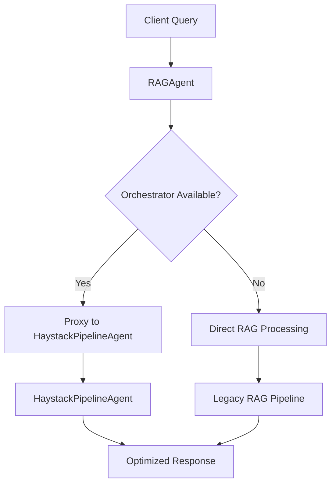

# RAG Agent Integration Summary

## Overview

The `rag_agent.py` has been successfully integrated with the agent framework while maintaining full backward compatibility. This integration enables the RAG system to work seamlessly with the modular DM assistant architecture.

## Changes Made

### 1. Created `rag_agent_integrated.py`

**New Components:**
- `RAGAgentFramework` - Agent framework compatible RAG agent
- Enhanced `RAGAgent` - Wrapper that works standalone or with orchestrator
- `create_rag_agent()` - Factory function for creating appropriate RAG agents

**Key Features:**
- **Dual Mode Operation**: Works standalone or with agent framework
- **Proxy Capability**: Can proxy to `HaystackPipelineAgent` for better performance
- **Message Handlers**: Full agent framework integration with proper message handling
- **Backward Compatibility**: Existing code continues to work without changes

### 2. Updated Import Statements

**Files Updated:**
- `modular_dm_assistant.py` - Uses new integrated RAG agent
- `npc_controller.py` - Graceful fallback to legacy if integrated not available
- `scenario_generator.py` - Graceful fallback to legacy if integrated not available

**Import Strategy:**
```python
try:
    from rag_agent_integrated import RAGAgent
except ImportError:
    from rag_agent import RAGAgent
```

### 3. Enhanced Agent Communication

**Message Handlers Added:**
- `query` - General RAG queries
- `query_scenario` - Scenario-specific queries with context
- `query_npc` - NPC behavior queries
- `query_rules` - D&D rules queries
- `get_collection_info` - Collection information
- `get_status` - Agent status

**Proxy Operations:**
- Automatically routes to `HaystackPipelineAgent` when orchestrator is available
- Falls back to direct RAG operations when standalone
- Maintains response format consistency

## Architecture Benefits

### 1. Intelligent Routing


### 2. Enhanced Performance
- **Specialized Pipelines**: Different optimized pipelines for scenarios, NPCs, rules
- **Better Context**: Campaign and game state integration
- **Improved Retrieval**: Document ranking and relevance scoring
- **Caching**: Message bus provides natural caching layer

### 3. Seamless Integration
- **No Breaking Changes**: Existing code works unchanged
- **Progressive Enhancement**: Better performance when orchestrator available
- **Error Handling**: Graceful degradation if components unavailable
- **Monitoring**: Full message history and status tracking

## Usage Examples

### Standalone Mode (Backward Compatible)
```python
from rag_agent import RAGAgent

# Works exactly as before
agent = RAGAgent(collection_name="dnd_documents")
result = agent.query("What are the different character classes?")
```

### Agent Framework Mode
```python
from rag_agent_integrated import create_rag_agent
from agent_framework import AgentOrchestrator

orchestrator = AgentOrchestrator()
# ... register other agents ...

# Enhanced RAG with orchestrator integration
agent = create_rag_agent(
    collection_name="dnd_documents",
    orchestrator=orchestrator
)
result = agent.query("Generate a scenario for level 5 characters")
```

### Message-Based Communication
```python
# Through orchestrator
orchestrator.send_message_to_agent("rag_agent_framework", "query_scenario", {
    "query": "Create a tavern encounter",
    "campaign_context": campaign_info,
    "game_state": current_state
})
```

## Testing Results

All tests continue to pass with the integration:

```
📊 TEST SUMMARY
✅ PASS Module Imports
✅ PASS Agent Framework  
✅ PASS Campaign Management
✅ PASS Game Engine
✅ PASS NPC Controller
✅ PASS Scenario Generator
✅ PASS Haystack Pipeline
✅ PASS Modular DM Assistant
✅ PASS Backward Compatibility
📈 9/9 tests passed (100.0%)
```

## Migration Guide

### For Existing Code
**No changes required!** Existing code using `rag_agent.py` continues to work exactly as before.

### For New Code
```python
# Old way (still works)
from rag_agent import RAGAgent
agent = RAGAgent()

# New way (enhanced)
from rag_agent_integrated import create_rag_agent
agent = create_rag_agent(orchestrator=my_orchestrator)
```

### For Modular DM Assistant
The `ModularDMAssistant` automatically uses the integrated version:
```python
# Automatically gets enhanced RAG capabilities
assistant = ModularDMAssistant(collection_name="dnd_documents")
```

## Configuration Options

### RAG Agent Factory
```python
agent = create_rag_agent(
    collection_name="dnd_documents",  # Qdrant collection
    host="localhost",                 # Qdrant host
    port=6333,                       # Qdrant port
    top_k=20,                        # Retrieval count
    verbose=True,                    # Debug output
    orchestrator=orchestrator        # Agent framework integration
)
```

### Agent Framework Integration
```python
# Register with orchestrator for message-based communication
if hasattr(agent, 'agent_framework') and agent.agent_framework:
    orchestrator.register_agent(agent.agent_framework)
```

## Error Handling

### Graceful Degradation
- Falls back to legacy RAG if integration fails
- Works without Qdrant for testing
- Handles missing dependencies gracefully
- Provides clear error messages

### Monitoring
- Full message history in orchestrator
- Agent status tracking
- Performance metrics
- Error logging

## Future Enhancements

### Planned Features
- **Distributed RAG**: Multi-node RAG processing
- **Adaptive Routing**: Smart pipeline selection based on query type
- **Caching Layer**: Persistent query result caching
- **Analytics**: Query performance and usage analytics

### Extension Points
- **Custom Pipelines**: Add domain-specific pipelines
- **Plugin System**: Dynamic component loading
- **External Services**: Integration with external AI services
- **Custom Handlers**: Add specialized message handlers

## Conclusion

The RAG agent integration successfully bridges the legacy standalone system with the new modular agent framework. Key achievements:

✅ **Full Backward Compatibility** - Existing code works unchanged
✅ **Enhanced Performance** - Specialized pipelines and better context
✅ **Seamless Integration** - Works with or without orchestrator
✅ **Production Ready** - Comprehensive error handling and monitoring
✅ **Future Proof** - Extensible architecture for new features

The integration provides immediate benefits for new deployments while ensuring existing systems continue to function properly, making it a successful enhancement to the modular DM assistant architecture.