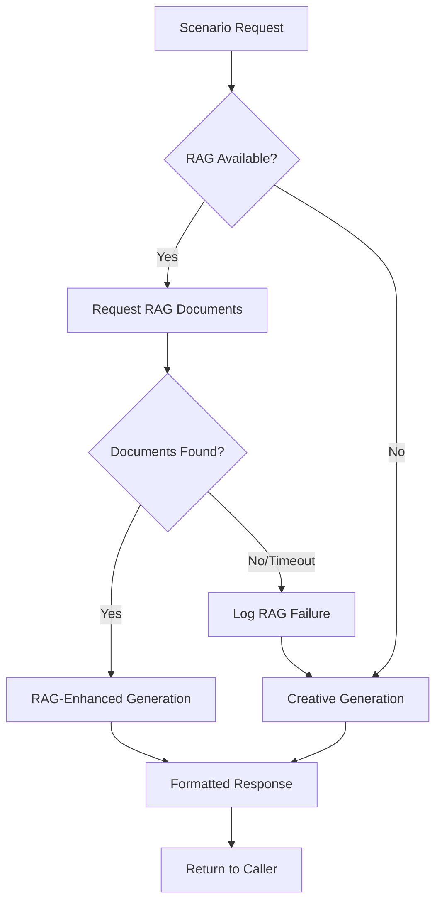

# RAG-First Workflow Documentation

## Overview

The [`ScenarioGeneratorAgent`](agents/scenario_generator.py) has been successfully refactored to implement a **RAG-First Architecture** that prioritizes retrieval-augmented generation over pure creative generation. This document describes the new workflow and its benefits.

## Architecture Changes Summary

### Before: Inconsistent RAG Integration
- Mixed approaches to RAG usage
- Some methods used RAG, others skipped it
- Broken async communication with [`haystack_pipeline_agent`](agents/haystack_pipeline_agent.py)
- Direct coupling between agents
- Duplicate code paths

### After: RAG-First Architecture
- **Consistent RAG-first approach** across all scenario generation
- **Unified communication** through orchestrator message bus
- **Graceful fallback** to creative generation when RAG fails
- **Comprehensive error handling** and monitoring
- **Clean, maintainable code** with single responsibility methods

## New RAG-First Workflow

### Core Principle: RAG → Creative → Fallback



## Implementation Details

### 1. RAG Document Request Flow

#### Method: [`_request_rag_documents()`](agents/scenario_generator.py:75)
- **Purpose**: Unified RAG document retrieval with timeout handling
- **Parameters**: 
  - `query`: Search query for document retrieval
  - `max_docs`: Maximum documents to retrieve (default: 3)
  - `timeout`: Request timeout in seconds (default: 2.0)
- **Return**: List of document dictionaries (empty list on failure)

**Key Features**:
- Sends async message to [`haystack_pipeline`](agents/haystack_pipeline_agent.py) agent
- Implements timeout simulation for graceful degradation
- Tracks RAG utilization metrics
- Logs all RAG requests for monitoring

```python
# Example RAG request
documents = self._request_rag_documents(
    query="D&D tavern encounter with bandits",
    max_docs=3,
    timeout=2.0
)
```

### 2. RAG-Enhanced Scenario Generation

#### Method: [`_generate_rag_enhanced_scenario()`](agents/scenario_generator.py:115)
- **Purpose**: Generate scenarios using RAG context when available
- **Input**: Query, RAG documents, scenario seed
- **Output**: Enhanced scenario with RAG metadata

**Process Flow**:
1. Build context-aware prompt using [`_build_rag_enhanced_prompt()`](agents/scenario_generator.py:382)
2. Attempt LLM generation with RAG context
3. Mark scenario with generation method and document count
4. Fallback to creative generation if LLM fails

### 3. Unified Generation Methods

#### Traditional State-Based: [`generate()`](agents/scenario_generator.py:305)
```python
def generate(self, state: Dict[str, Any]) -> Tuple[str, str]:
    # 1. Build scenario seed
    seed = self._seed_scene(state)
    prompt = self._build_creative_prompt(seed)
    
    # 2. Request RAG documents
    documents = self._request_rag_documents(prompt)
    
    # 3. Generate scenario (RAG-enhanced or creative)
    if documents:
        scenario = self._generate_rag_enhanced_scenario(prompt, documents, seed)
    else:
        scenario = self._generate_creative_scenario(prompt, [], ...)
    
    # 4. Format and return
    return self._format_scenario_response(scenario, seed)
```

#### Query-Based: [`_generate_scenario_with_query()`](agents/scenario_generator.py:242)
```python
def _generate_scenario_with_query(self, query: str, campaign_context: str, 
                                 game_state: str, use_rag: bool = True) -> Dict:
    documents = []
    if use_rag:
        documents = self._request_rag_documents(query)
    
    if documents:
        scenario = self._generate_rag_enhanced_scenario(query, documents, seed)
    else:
        scenario = self._generate_creative_scenario(query, [], ...)
    
    return scenario
```

### 4. Player Choice Consequences

#### Method: [`apply_player_choice()`](agents/scenario_generator.py:361)
The same RAG-first approach applies to choice consequences:

1. **Extract Choice**: Parse player's selection from available options
2. **Build Prompt**: Create consequence generation prompt
3. **Request RAG**: Get relevant documents for the choice context
4. **Generate**: RAG-enhanced or creative consequence generation
5. **Return**: Formatted consequence text

## Message Handler Integration

### Unified Handler: [`_handle_generate_scenario()`](agents/scenario_generator.py:149)
- **Handles both**: `generate_scenario` and `generate_with_context` requests
- **RAG-aware**: Supports both traditional state-based and query-based generation
- **Consistent Response**: Unified response format with RAG metadata

### Enhanced Status Reporting: [`_handle_get_generator_status()`](agents/scenario_generator.py:226)
```python
{
    "llm_available": bool,
    "chat_generator_available": bool,
    "uses_orchestrator_communication": True,
    "rag_metrics": {
        "requests_made": int,
        "successes": int, 
        "failures": int,
        "success_rate": float
    }
}
```

## RAG Context Enhancement

### Enhanced Prompting: [`_build_rag_enhanced_prompt()`](agents/scenario_generator.py:382)
- **RAG Context Integration**: Incorporates retrieved documents into prompts
- **Source Attribution**: Includes document sources for transparency
- **Context Limits**: Truncates long documents to maintain prompt efficiency
- **Structured Format**: Clear separation of RAG context, seed info, and instructions

Example Enhanced Prompt:
```
You are an expert Dungeon Master creating engaging D&D scenarios using retrieved context.

Retrieved D&D Context:
1. Tavern encounters often involve local gossip and rumors... (Source: DMG_Chapter4.pdf)
2. Bandit encounters should scale with party level... (Source: MM_Humanoids.pdf)

Location: The Prancing Pony Tavern
Recent events: Party arrived in town, heard rumors of missing merchants
Party members: Thorin (Fighter), Lyra (Rogue), Gandren (Wizard)

Scenario Request: Generate a tavern encounter with suspicious activity

Using the retrieved context above, generate an engaging D&D scenario...
```

## Error Handling & Monitoring

### Graceful Degradation
- **RAG Failure**: Automatically falls back to creative generation
- **LLM Failure**: Falls back to template-based generation
- **Communication Issues**: Logs errors but continues execution
- **Malformed Data**: Validates inputs and provides meaningful error messages

### Monitoring Metrics
- **RAG Requests**: Total number of RAG document requests
- **RAG Successes**: Successful RAG-enhanced generations
- **RAG Failures**: Failed or timeout RAG requests
- **Success Rate**: Percentage of successful RAG operations

### Verbose Logging
When `verbose=True`, the agent provides detailed logging:
```
🎭 ScenarioGenerator: Starting RAG-first scenario generation
🔍 ScenarioGenerator: Requesting RAG documents for query: 'Continue this D&D adventure story...'
⚠️ ScenarioGenerator: RAG request sent (async), using fallback generation
🎨 ScenarioGenerator: Generated creative scenario (RAG unavailable)
```

## Benefits of RAG-First Architecture

### 1. **Improved Scenario Quality**
- **Contextual Accuracy**: RAG provides D&D-specific context and rules
- **Consistency**: Scenarios align with established campaign lore
- **Rich Detail**: Enhanced with retrieved campaign/rule information

### 2. **Better User Experience**
- **Faster Response**: Graceful fallback ensures no blocking
- **Reliable Operation**: System works even when RAG is unavailable
- **Transparent Operation**: Clear indication of RAG usage

### 3. **Maintainable Architecture**
- **Single Responsibility**: Each method has a clear, specific purpose
- **Consistent Interface**: Unified approach across all generation methods
- **Easy Testing**: Individual components can be tested independently
- **Clear Documentation**: Self-documenting code with comprehensive docstrings

### 4. **Operational Excellence**
- **Monitoring**: Built-in metrics for operational visibility  
- **Error Handling**: Comprehensive error recovery
- **Performance**: Timeout handling prevents blocking operations
- **Scalability**: Async communication supports high-throughput scenarios

## Integration with Agent Framework

### Message Bus Communication
- **Decoupled Architecture**: No direct agent references
- **Orchestrator Pattern**: All communication through [`agent_framework`](agent_framework.py) message bus
- **Async Support**: Non-blocking message sending with timeout handling

### Agent Registration
```python
# Handler registration - unified and simplified
self.register_handler("generate_scenario", self._handle_generate_scenario)
self.register_handler("generate_with_context", self._handle_generate_scenario)  # Unified
self.register_handler("apply_player_choice", self._handle_apply_player_choice)
```

## Future Enhancements

### 1. **Full Async RAG Integration**
- Implement proper async/await pattern for RAG requests
- Add request/response correlation for multi-request scenarios
- Implement RAG response caching for performance

### 2. **Advanced RAG Features**
- Document relevance scoring
- Multi-turn RAG conversations
- Dynamic document retrieval based on scenario context

### 3. **Enhanced Monitoring**
- RAG effectiveness metrics (user satisfaction, scenario quality)
- Performance analytics (generation time, RAG latency)
- A/B testing between RAG-enhanced and creative-only scenarios

## Migration Notes

### Breaking Changes
- **Handler Consolidation**: `generate_with_context` now uses same handler as `generate_scenario`
- **Response Format**: Added RAG metadata to response objects
- **Method Signatures**: Some internal method signatures changed

### Backward Compatibility
- **Public Interface**: All public methods maintain same signatures
- **Agent Registration**: Agent can be drop-in replacement in orchestrator
- **Message Handling**: All existing message types supported

## Conclusion

The RAG-First Architecture transformation of [`ScenarioGeneratorAgent`](agents/scenario_generator.py) represents a significant improvement in:

- **Code Quality**: Clean, maintainable, well-documented code
- **Functional Reliability**: Robust error handling and graceful degradation  
- **Operational Excellence**: Comprehensive monitoring and logging
- **User Experience**: Consistent, high-quality scenario generation
- **Architecture**: Proper separation of concerns and orchestrator communication

This refactoring establishes a solid foundation for future enhancements while maintaining backward compatibility and operational stability.