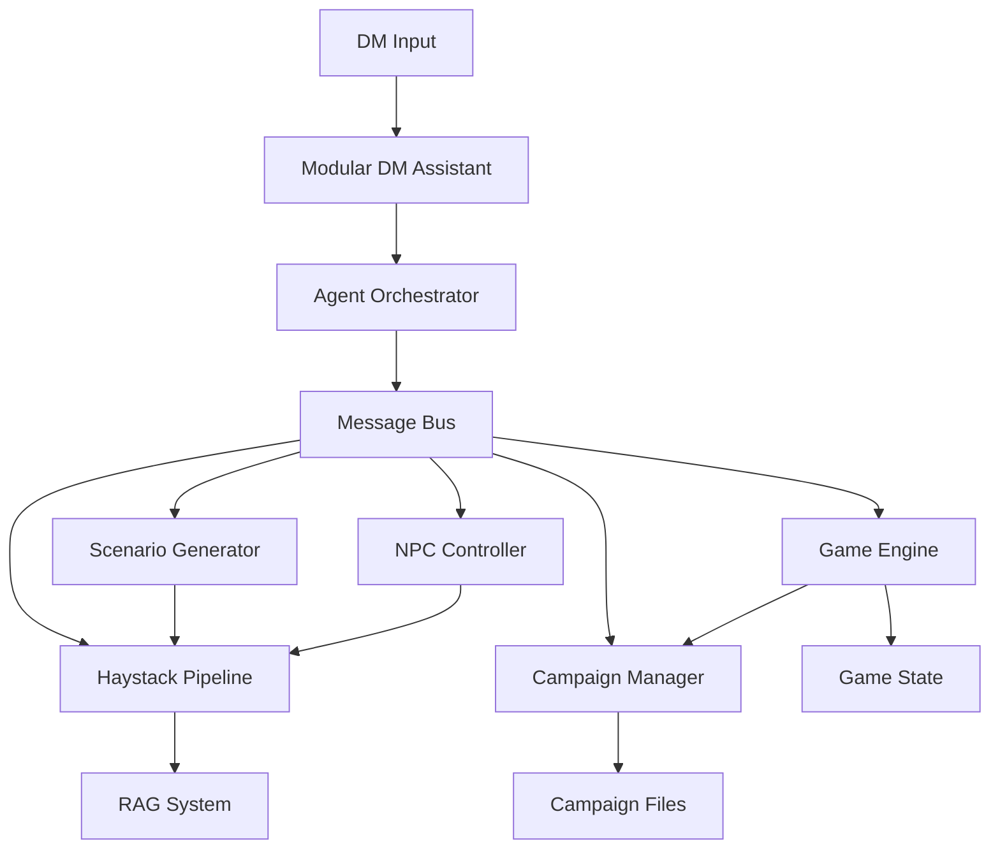

# Modular DM Assistant Architecture

## Overview

This document describes the modular architecture of the RAG-Powered Dungeon Master Assistant. The original monolithic [`rag_dm_assistant.py`](rag_dm_assistant.py) has been intelligently split into separate, specialized modules that communicate through an agent framework, with enhanced Haystack pipeline integration.

## Architecture Components

### 🤖 Agent Framework (`agent_framework.py`)
The core communication system that enables different AI agents to interact seamlessly.

**Key Features:**
- **Message Bus**: Central communication hub for all agents
- **BaseAgent**: Abstract base class for all specialized agents
- **AgentOrchestrator**: Manages the lifecycle and coordination of multiple agents
- **Message Types**: REQUEST, RESPONSE, EVENT, BROADCAST, ERROR
- **Thread-safe**: Concurrent message processing and agent execution

**Classes:**
- `BaseAgent` - Base class for all agents
- `MessageBus` - Central message routing system
- `AgentOrchestrator` - Agent lifecycle management
- `AgentMessage` - Structured message format

### 🎮 Game Engine (`game_engine.py`)
Manages game state, action processing, and real-time game loop.

**Key Features:**
- **GameEngineAgent**: Agent-based game engine with message handling
- **Action Queue**: FIFO processing of player and NPC actions
- **State Persistence**: JSON-based game state checkpointing
- **Real-time Processing**: Configurable tick-based game loop
- **Backward Compatibility**: Legacy `GameEngine` class maintained

**Message Handlers:**
- `enqueue_action` - Queue actions for processing
- `get_game_state` - Retrieve current game state
- `update_game_state` - Update game state
- `process_player_action` - Process individual player actions

### 👥 NPC Controller (`npc_controller.py`)
Manages NPC behavior and decision-making using RAG and rule-based systems.

**Key Features:**
- **NPCControllerAgent**: Agent-based NPC management
- **Hybrid Decision Making**: RAG-enhanced + rule-based fallback
- **Behavioral Modes**: "rag", "rule_based", or "hybrid"
- **Smart Actions**: Movement, engagement, and patrol behaviors
- **Context-Aware**: Uses game state and recent events for decisions

**Message Handlers:**
- `make_decisions` - Generate decisions for all NPCs
- `decide_for_npc` - Generate decision for specific NPC
- `get_npc_status` - Retrieve NPC controller status

### 🎭 Scenario Generator (`scenario_generator.py`)
Generates dynamic scenarios and handles player choices using RAG and LLM.

**Key Features:**
- **ScenarioGeneratorAgent**: Agent-based scenario generation
- **RAG-Enhanced Creativity**: Uses lore and rules for context-aware scenarios
- **Player Choice Processing**: Handles option selection and consequences
- **Adaptive Content**: Responds to game state and campaign context
- **Fallback Options**: Rule-based alternatives when RAG unavailable

**Message Handlers:**
- `generate_scenario` - Create new scenarios
- `apply_player_choice` - Process player option selections
- `get_generator_status` - Retrieve generator status

### 📚 Campaign Management (`campaign_management.py`)
Handles campaign data, player management, and campaign operations.

**Key Features:**
- **CampaignManagerAgent**: Agent-based campaign management
- **Multi-format Support**: JSON and structured text campaign files
- **Player Loading**: Automatic character sheet parsing from text files
- **Data Classes**: Structured representations for Players, NPCs, Locations, Encounters
- **Campaign Context**: Provides contextual information to other agents

**Message Handlers:**
- `list_campaigns` - List available campaigns
- `select_campaign` - Select active campaign
- `get_campaign_info` - Retrieve campaign details
- `list_players` - List available players
- `get_player_info` - Get detailed player information

### 🔍 Haystack Pipeline Agent (`haystack_pipeline_agent.py`)
Integrates Haystack RAG pipelines with the agent framework for enhanced DM operations.

**Key Features:**
- **HaystackPipelineAgent**: Agent-based RAG services
- **Specialized Pipelines**: Different pipelines for scenarios, NPCs, and rules
- **Claude Sonnet 4 Integration**: Advanced LLM capabilities
- **Document Ranking**: Improved retrieval quality with cross-encoders
- **Multiple Query Types**: General, scenario, NPC, and rules-specific queries

**Message Handlers:**
- `query_rag` - General RAG queries
- `query_scenario` - Scenario-specific queries with context
- `query_npc` - NPC behavior queries
- `query_rules` - Rules and mechanics queries
- `get_pipeline_status` - Pipeline health and capabilities

### 🎯 Modular DM Assistant (`modular_dm_assistant.py`)
Main orchestrator that coordinates all agents for comprehensive D&D management.

**Key Features:**
- **Agent Coordination**: Manages all specialized agents
- **Unified Interface**: Single entry point for all DM operations
- **Message Orchestration**: Coordinates complex multi-agent workflows
- **Backward Compatibility**: Maintains compatibility with existing interfaces
- **Interactive CLI**: Enhanced command-line interface with agent status

## Communication Flow



## Usage Examples

### Basic Usage
```python
from modular_dm_assistant import ModularDMAssistant

# Initialize the modular assistant
assistant = ModularDMAssistant(
    collection_name="dnd_documents",
    verbose=True
)

# Start the agent orchestrator
assistant.start()

# Process DM commands
response = assistant.process_dm_input("list campaigns")
print(response)

# Stop when done
assistant.stop()
```

### Interactive Mode
```python
# Run interactive CLI
assistant = ModularDMAssistant(verbose=True)
assistant.run_interactive()
```

### Agent-to-Agent Communication
```python
# Agents communicate through the message bus
orchestrator.send_message_to_agent("scenario_generator", "generate_scenario", {
    "game_state": current_state,
    "campaign_context": campaign_info
})
```

## Key Improvements

### 🏗️ Modular Design
- **Single Responsibility**: Each agent handles one specific domain
- **Loose Coupling**: Agents communicate only through messages
- **High Cohesion**: Related functionality grouped together
- **Extensible**: Easy to add new agents or modify existing ones

### 🔄 Agent Framework Benefits
- **Concurrent Processing**: Multiple agents can work simultaneously
- **Fault Tolerance**: Agent failures don't crash the entire system
- **Message History**: Full audit trail of all agent communications
- **Scalable**: Can easily distribute agents across multiple processes/machines

### 🚀 Enhanced Haystack Integration
- **Specialized Pipelines**: Different pipelines optimized for different use cases
- **Better Context**: Campaign and game state context for more relevant responses
- **Improved Retrieval**: Document ranking for higher quality results
- **Multi-modal Queries**: Support for different types of questions

### 🔧 Backward Compatibility
- **Legacy Classes**: Original classes still available for existing code
- **API Compatibility**: Existing interfaces maintained
- **Gradual Migration**: Can adopt modular architecture incrementally

## Testing

The architecture includes comprehensive tests in [`test_modular_architecture.py`](test_modular_architecture.py):

```bash
python test_modular_architecture.py
```

**Test Coverage:**
- ✅ Module imports and dependencies
- ✅ Agent framework message passing
- ✅ Individual agent creation and handlers
- ✅ Modular DM assistant orchestration
- ✅ Backward compatibility with legacy classes

## Performance Benefits

### Memory Efficiency
- **Lazy Loading**: Agents only initialize when needed
- **Shared Resources**: RAG components shared across agents
- **State Management**: Centralized game state reduces duplication

### Processing Efficiency
- **Parallel Processing**: Multiple agents can process simultaneously
- **Specialized Pipelines**: Optimized queries for different use cases
- **Caching**: Message history and state caching

### Scalability
- **Horizontal Scaling**: Agents can be distributed across machines
- **Load Balancing**: Message bus can distribute work
- **Resource Isolation**: Agent failures don't affect others

## Migration Guide

### From Original `rag_dm_assistant.py`

#### Old Way:
```python
from rag_dm_assistant import RAGDMAssistant
assistant = RAGDMAssistant()
assistant.run_interactive()
```

#### New Way:
```python
from modular_dm_assistant import ModularDMAssistant
assistant = ModularDMAssistant()
assistant.run_interactive()
```

### Using Individual Components
```python
# Use specific agents for targeted functionality
from campaign_management import CampaignManagerAgent
from game_engine import GameEngineAgent
from agent_framework import AgentOrchestrator

orchestrator = AgentOrchestrator()
orchestrator.register_agent(CampaignManagerAgent())
orchestrator.register_agent(GameEngineAgent())
orchestrator.start()
```

## Configuration

### Environment Variables
```bash
export TOKENIZERS_PARALLELISM=false  # Avoid threading warnings
```

### Agent Configuration
```python
assistant = ModularDMAssistant(
    collection_name="your_collection",
    campaigns_dir="path/to/campaigns",
    players_dir="path/to/players",
    verbose=True,
    enable_game_engine=True,
    tick_seconds=0.8
)
```

## Troubleshooting

### Common Issues

1. **Qdrant Connection Errors**
   - Ensure Qdrant is running: `docker run -p 6333:6333 qdrant/qdrant`
   - Check collection exists in Qdrant

2. **Agent Communication Timeouts**
   - Increase timeout in `_send_message_and_wait()`
   - Check agent is properly registered

3. **Import Errors**
   - Ensure all dependencies installed
   - Check Python path includes all modules

### Debug Mode
```python
assistant = ModularDMAssistant(verbose=True)
# Check agent status
print(assistant._get_system_status())
```

## Future Enhancements

### Planned Features
- **Distributed Agents**: Support for remote agent deployment
- **Plugin System**: Dynamic agent loading and unloading
- **Advanced Analytics**: Agent performance monitoring
- **Web Interface**: Browser-based DM interface
- **Voice Integration**: Speech-to-text and text-to-speech

### Extensibility Points
- **Custom Agents**: Easy to create domain-specific agents
- **Pipeline Extensions**: Add new Haystack pipeline types
- **Message Handlers**: Extend agents with new capabilities
- **Data Sources**: Integrate additional campaign data sources

## Conclusion

The modular architecture provides a robust, scalable, and maintainable foundation for the DM Assistant. By splitting the monolithic code into specialized agents that communicate through a message bus, we've achieved:

- **Better Separation of Concerns**: Each agent has a clear, focused responsibility
- **Enhanced Testability**: Individual components can be tested in isolation
- **Improved Maintainability**: Changes to one agent don't affect others
- **Greater Flexibility**: Easy to reconfigure, extend, or replace components
- **Production Ready**: Built-in fault tolerance and monitoring capabilities

The system maintains full backward compatibility while providing a path forward for advanced features and scalability.