# D&D Game Haystack Migration Implementation Plan

## Executive Summary

This document provides a comprehensive implementation plan for migrating the current [`simple_dnd_game.py`](simple_dnd_game.py) to use the Haystack framework and integrating it with the sophisticated D&D architecture defined in [`dnd_haystack_revised_plan.md`](dnd_haystack_revised_plan.md).

**Key Finding**: The current [`simple_dnd_game.py`](simple_dnd_game.py) is a basic implementation that bypasses the entire Haystack architecture, while the project already has a sophisticated Haystack-based infrastructure that needs to be properly integrated.

---

## Current State Analysis

### simple_dnd_game.py Analysis

**Current Architecture**:
```python
SimpleDnDGame
├── hwtgenielib.AppleGenAIChatGenerator (direct call)
├── Basic game state (dict)
├── Simple turn processing
├── Location detection (keyword-based)
├── JSON save/load
└── Interactive CLI loop
```

**Issues Identified**:
1. ❌ **Not using Haystack Agents framework** - Direct LLM calls
2. ❌ **Not using Haystack Components framework** - Monolithic class
3. ❌ **Not using Haystack Pipelines** - No orchestration
4. ❌ **Missing integration with existing sophisticated components**
5. ❌ **No policy engine integration** - Hardcoded behavior
6. ❌ **No rules enforcement** - No D&D rule validation
7. ❌ **No saga management** - Single-turn interactions only
8. ❌ **No decision logging** - No audit trail
9. ❌ **No character management** - Basic player name only
10. ❌ **No skill checks** - No dice rolling or mechanics

### Existing Haystack Infrastructure Analysis

**Already Implemented (Sophisticated)** ✅:
- [`components/character_manager.py`](components/character_manager.py) - Full D&D character sheets
- [`components/dice.py`](components/dice.py) - Comprehensive dice system with logging
- [`components/game_engine.py`](components/game_engine.py) - 7-step skill pipeline
- [`components/policy.py`](components/policy.py) - Rule mediation (RAW/House/Easy profiles)
- [`components/rules.py`](components/rules.py) - Authoritative D&D rule interpretation
- [`orchestrator/simple_orchestrator.py`](orchestrator/simple_orchestrator.py) - Sophisticated request routing
- [`orchestrator/saga_manager.py`](orchestrator/saga_manager.py) - Multi-step workflow tracking
- [`orchestrator/decision_logger.py`](orchestrator/decision_logger.py) - Comprehensive audit trail

**Missing from Target Architecture** ❌:
- **Agents (AI-driven)**:
  - RAG Retriever Agent
  - Scenario Generator Agent
  - NPC & Enemy Controller Agent
  - Main Interface Agent
- **Components (deterministic)**:
  - Inventory/Loot Manager
  - Experience/Leveling Manager
  - Campaign Manager
  - Spell Manager
  - Session Manager
  - Combat Engine
  - Memory/World Summaries
- **Orchestrator enhancements**:
  - Context Broker
  - Dead Letter Queue
  - Enhanced observability

---

## Missing Features Analysis

### Phase 1 Requirements (from revised plan)

#### Critical Missing Agents
1. **RAG Retriever Agent** - Semantic document retrieval
2. **Scenario Generator Agent** - Creative scene generation with metadata
3. **NPC & Enemy Controller Agent** - Character interactions
4. **Main Interface Agent** - User interaction management

#### Critical Missing Components  
1. **Inventory/Loot Manager** - Item tracking and distribution
2. **Experience/Leveling Manager** - Character progression
3. **Campaign Manager** - Campaign state and progression
4. **Spell Manager** - Magic system management
5. **Session Manager** - Game session persistence
6. **Combat Engine** - Turn-based combat system
7. **Memory/World Summaries** - Context summarization

#### Integration Gaps
1. **Haystack Pipeline integration** - Current orchestrator doesn't use Haystack pipelines
2. **Agent framework adoption** - No Haystack agents implemented
3. **Component framework compliance** - Components not following Haystack patterns
4. **Contract standardization** - Scenario generator doesn't follow contract specification

---

## Migration Strategy

### Phase 1: Foundation Migration (Weeks 1-2)

#### 1.1 Migrate simple_dnd_game.py to Use Orchestrator
```python
# Current (direct LLM call)
chat_generator = AppleGenAIChatGenerator(model="...")
response = chat_generator.run(messages=[...])

# Target (orchestrator integration)
orchestrator = create_stage3_orchestrator()
request = GameRequest("scenario", {"action": player_input, "context": context})
response = orchestrator.process_request(request)
```

#### 1.2 Implement Missing Agents Using Haystack Framework
```python
# Agent structure following Haystack patterns
from haystack import Agent, Pipeline

class ScenarioGeneratorAgent(Agent):
    def __init__(self, chat_generator, rag_retriever):
        self.chat_generator = chat_generator
        self.rag_retriever = rag_retriever
    
    def run(self, action: str, context: Dict[str, Any]) -> Dict[str, Any]:
        # Implement scenario generator contract from revised plan
        pass
```

#### 1.3 Create Context Broker
```python
class ContextBroker:
    def __init__(self, rag_retriever, memory_manager):
        self.rag_retriever = rag_retriever
        self.memory_manager = memory_manager
    
    def enrich_context(self, request: Dict[str, Any]) -> Dict[str, Any]:
        # Decide when to query RAG/Rules based on request
        pass
```

### Phase 2: Component Enhancement (Weeks 3-4)

#### 2.1 Implement Missing Core Components
1. **Inventory Manager** - Item tracking, encumbrance, magic items
2. **Experience Manager** - XP calculation, leveling, milestones
3. **Campaign Manager** - Story state, flags, progression tracking
4. **Session Manager** - Save/load, session persistence

#### 2.2 Haystack Pipeline Integration
```python
from haystack import Pipeline

# Create D&D gameplay pipeline
dnd_pipeline = Pipeline()
dnd_pipeline.add_component("interface_agent", MainInterfaceAgent())
dnd_pipeline.add_component("scenario_agent", ScenarioGeneratorAgent())
dnd_pipeline.add_component("game_engine", GameEngine())
dnd_pipeline.add_component("character_manager", CharacterManager())

# Connect components
dnd_pipeline.connect("interface_agent.output", "scenario_agent.input")
dnd_pipeline.connect("scenario_agent.output", "game_engine.input")
```

#### 2.3 Scenario Generator Contract Implementation
```python
# Implement exact contract from revised plan
@dataclass
class ScenarioOutput:
    scene: str
    choices: List[Dict[str, Any]]
    effects: List[Dict[str, Any]]
    hooks: List[Dict[str, Any]]

class ScenarioGeneratorAgent:
    def generate_scenario(self, context: Dict[str, Any]) -> ScenarioOutput:
        # Return structured output as specified in revised plan
        return ScenarioOutput(
            scene="Narrative description...",
            choices=[{
                "id": "c1",
                "title": "Action title",
                "description": "Action description",
                "skill_hints": ["stealth"],
                "suggested_dc": {"easy": 10, "medium": 15, "hard": 20},
                "combat_trigger": False
            }],
            effects=[{"type": "flag", "name": "alert_guard", "value": True}],
            hooks=[{"quest": "rescue_hostage", "progress": "advance"}]
        )
```

### Phase 3: Advanced Features (Weeks 5-6)

#### 3.1 Combat Engine Implementation
Following the revised plan's combat pipeline:
1. Combat Engine → initiative, turn order, legal actions
2. NPC Agent → proposes actions (creative)
3. Combat Engine → validates, applies deterministically
4. Game Engine → records results, awards XP/loot
5. Scenario Generator → post-combat consequence

#### 3.2 Spell Manager Implementation
- Spell slot tracking
- Concentration rules
- Component requirements (policy-driven)
- Spell effect resolution

#### 3.3 Memory/World Summaries
- Campaign history summarization
- Context compression for long sessions
- Important event extraction

---

## Implementation Architecture

### Target Architecture (Post-Migration)

```mermaid
flowchart TB
    UI[Migrated simple_dnd_game.py Interface]
    ORCH[Enhanced Orchestrator + Context Broker + Pipeline Integration]

    subgraph Agents [Haystack Agents - Creative]
        RAG[RAG Retriever Agent]
        SCEN[Scenario Generator Agent]
        NPC[NPC & Enemy Controller Agent]
        IFACE[Main Interface Agent]
    end

    subgraph Components [Haystack Components - Deterministic]
        CM[Character Manager ✓]
        DICE[Dice Roller ✓]
        INV[Inventory Manager ❌]
        XP[Experience Manager ❌]
        GE[Game Engine ✓]
        CAMP[Campaign Manager ❌]
        RULES[Rules Enforcer ✓]
        POLICY[Policy Engine ✓]
        SPELL[Spell Manager ❌]
        SESS[Session Manager ❌]
        COMBAT[Combat Engine ❌]
        MEM[Memory Manager ❌]
        KB[Document Store ✓]
    end

    subgraph Orchestrator [Enhanced Orchestrator]
        ROUTER[Router ✓]
        SAGA[Saga Manager ✓]
        CONTEXT[Context Broker ❌]
        DECISION[Decision Logger ✓]
    end

    UI --> ORCH
    ORCH --> IFACE
    ORCH --> RAG
    ORCH --> SCEN
    ORCH --> NPC
    
    ORCH --> CM
    ORCH --> DICE
    ORCH --> INV
    ORCH --> XP
    ORCH --> GE
    ORCH --> CAMP
    ORCH --> RULES
    ORCH --> POLICY
    ORCH --> SPELL
    ORCH --> SESS
    ORCH --> COMBAT
    ORCH --> MEM
    RAG --> KB
```



### Refactored simple_dnd_game.py Structure

```python
class HaystackDnDGame:
    """Haystack-integrated D&D Game"""
    
    def __init__(self):
        # Initialize Haystack pipeline
        self.pipeline = self._create_dnd_pipeline()
        self.orchestrator = create_stage3_orchestrator()
        self.session_manager = SessionManager()
        
    def _create_dnd_pipeline(self) -> Pipeline:
        """Create main D&D gameplay pipeline"""
        pipeline = Pipeline()
        
        # Add agents
        pipeline.add_component("interface_agent", MainInterfaceAgent())
        pipeline.add_component("scenario_agent", ScenarioGeneratorAgent())
        pipeline.add_component("rag_agent", RAGRetrieverAgent())
        pipeline.add_component("npc_agent", NPCControllerAgent())
        
        # Connect pipeline
        pipeline.connect("interface_agent", "scenario_agent")
        pipeline.connect("rag_agent", "scenario_agent")
        
        return pipeline
    
    def play_turn(self, player_input: str) -> Dict[str, Any]:
        """Process turn using Haystack pipeline and orchestrator"""
        # Create structured request
        request = GameRequest(
            request_type="gameplay_turn",
            data={
                "player_input": player_input,
                "game_state": self.get_current_state()
            }
        )
        
        # Process through orchestrator
        response = self.orchestrator.process_request(request)
        
        # Run through pipeline if needed
        if response.success:
            pipeline_result = self.pipeline.run({
                "user_input": player_input,
                "context": response.data
            })
            return pipeline_result
        
        return response.data
```

---

## Detailed Implementation Tasks

### Week 1: Foundation Setup

#### Task 1.1: Create Haystack Agents Framework
```bash
# File structure
agents/
├── __init__.py
├── base_agent.py              # Base Haystack agent class
├── rag_retriever_agent.py     # Document retrieval agent
├── scenario_generator_agent.py # Scene generation agent  
├── npc_controller_agent.py    # NPC interaction agent
└── main_interface_agent.py    # User interface agent
```

**File: `agents/base_agent.py`**
```python
from abc import ABC, abstractmethod
from typing import Dict, Any
from haystack import component

@component
class BaseDnDAgent(ABC):
    """Base class for all D&D game agents following Haystack patterns"""
    
    def __init__(self, name: str):
        self.name = name
        
    @abstractmethod
    def run(self, **kwargs) -> Dict[str, Any]:
        """Process agent request and return structured response"""
        pass
```

**File: `agents/scenario_generator_agent.py`**
```python
from haystack import component
from hwtgenielib.components.generators.chat import AppleGenAIChatGenerator
from .base_agent import BaseDnDAgent

@component
class ScenarioGeneratorAgent(BaseDnDAgent):
    """Creative scenario generation following revised plan contract"""
    
    def __init__(self, chat_generator: AppleGenAIChatGenerator, rag_retriever=None):
        super().__init__("scenario_generator")
        self.chat_generator = chat_generator
        self.rag_retriever = rag_retriever
        
    @component.output_types(scene=str, choices=list, effects=list, hooks=list)
    def run(self, action: str, context: Dict[str, Any], rag_context: str = "") -> Dict[str, Any]:
        """Generate scenario following the exact contract from revised plan"""
        
        # Build context-aware prompt
        prompt = self._build_scenario_prompt(action, context, rag_context)
        
        # Generate with structured output requirements
        messages = [ChatMessage.from_user(prompt)]
        response = self.chat_generator.run(messages=messages)
        
        # Parse response into contract format
        scenario_data = self._parse_to_contract(response, context)
        
        return scenario_data
    
    def _build_scenario_prompt(self, action: str, context: Dict[str, Any], rag_context: str) -> str:
        """Build scenario generation prompt with RAG context"""
        return f"""
        You are a D&D Dungeon Master. Generate a scenario response with structured output.
        
        Player Action: {action}
        Game Context: {context}
        RAG Context: {rag_context}
        
        Return JSON with:
        - scene: Narrative description
        - choices: Array of choices with id, title, description, skill_hints, suggested_dc, combat_trigger
        - effects: Array of game state effects
        - hooks: Array of quest progression hooks
        """
    
    def _parse_to_contract(self, response, context) -> Dict[str, Any]:
        """Parse LLM response to match revised plan contract exactly"""
        # Implementation to ensure contract compliance
        return {
            "scene": "Generated narrative...",
            "choices": [{
                "id": "c1",
                "title": "Approach carefully",
                "description": "Move forward with caution",
                "skill_hints": ["stealth", "perception"],
                "suggested_dc": {"easy": 10, "medium": 15, "hard": 20},
                "combat_trigger": False
            }],
            "effects": [{"type": "flag", "name": "approached_area", "value": True}],
            "hooks": [{"quest": "main_story", "progress": "advance"}]
        }
```

#### Task 1.2: Enhance Orchestrator with Pipeline Integration
**File: `orchestrator/context_broker.py`**
```python
from typing import Dict, Any, Optional

class ContextBroker:
    """Decides when to query RAG/Rules based on request context"""
    
    def __init__(self, rag_retriever, memory_manager):
        self.rag_retriever = rag_retriever
        self.memory_manager = memory_manager
        
    def enrich_context(self, request: Dict[str, Any]) -> Dict[str, Any]:
        """Enrich request with relevant context from RAG and memory"""
        enriched_request = request.copy()
        
        # Determine if RAG lookup is needed
        if self._needs_rag_context(request):
            rag_context = self._get_rag_context(request)
            enriched_request["rag_context"] = rag_context
            
        # Add memory context
        if self._needs_memory_context(request):
            memory_context = self._get_memory_context(request)
            enriched_request["memory_context"] = memory_context
            
        return enriched_request
    
    def _needs_rag_context(self, request: Dict[str, Any]) -> bool:
        """Determine if request needs RAG document lookup"""
        request_type = request.get("type", "")
        action = request.get("data", {}).get("action", "")
        
        # Rules for when to use RAG
        rag_triggers = [
            "generate_scenario",
            "lore_question", 
            "spell_lookup",
            "monster_encounter"
        ]
        
        return (request_type in rag_triggers or 
                any(trigger in action.lower() for trigger in ["history", "lore", "monster", "spell"]))
```

#### Task 1.3: Migrate simple_dnd_game.py 
**File: `haystack_dnd_game.py`** (new migrated version)
```python
"""
Haystack-Integrated D&D Game - Migrated from simple_dnd_game.py
Uses full Haystack architecture with orchestrator and pipeline integration
"""

from typing import Dict, Any, Optional
import time
import json
from pathlib import Path

from haystack import Pipeline
from orchestrator.simple_orchestrator import create_stage3_orchestrator, GameRequest
from agents.scenario_generator_agent import ScenarioGeneratorAgent
from agents.main_interface_agent import MainInterfaceAgent
from agents.rag_retriever_agent import RAGRetrieverAgent
from components.session_manager import SessionManager

class HaystackDnDGame:
    """Haystack-integrated D&D Game - Full Architecture Implementation"""
    
    def __init__(self, policy_profile="house"):
        """Initialize with full Haystack integration"""
        
        # Core orchestrator with all Stage 3 components
        self.orchestrator = create_stage3_orchestrator()
        
        # Create main gameplay pipeline
        self.pipeline = self._create_gameplay_pipeline()
        
        # Session management
        self.session_manager = SessionManager()
        
        # Initialize with a default character
        self._initialize_default_character()
        
        print("🎲 Haystack D&D Game initialized with full architecture!")
    
    def _create_gameplay_pipeline(self) -> Pipeline:
        """Create the main D&D gameplay pipeline"""
        pipeline = Pipeline()
        
        # Add components following Haystack patterns
        pipeline.add_component("interface_agent", MainInterfaceAgent())
        pipeline.add_component("scenario_agent", ScenarioGeneratorAgent())
        pipeline.add_component("rag_agent", RAGRetrieverAgent())
        
        # Connect pipeline flow
        pipeline.connect("interface_agent", "scenario_agent") 
        pipeline.connect("rag_agent", "scenario_agent")
        
        return pipeline
    
    def _initialize_default_character(self):
        """Initialize default character using character manager"""
        default_character = {
            "character_id": "player",
            "name": "Adventurer",
            "level": 1,
            "ability_scores": {
                "strength": 14,
                "dexterity": 12,
                "constitution": 13,
                "intelligence": 11,
                "wisdom": 15,
                "charisma": 10
            },
            "skills": {
                "perception": True,
                "investigation": True
            },
            "expertise_skills": [],
            "conditions": []
        }
        
        # Add through orchestrator
        request = GameRequest(
            request_type="character_add",
            data={"character_data": default_character}
        )
        self.orchestrator.process_request(request)
    
    def play_turn(self, player_input: str) -> Dict[str, Any]:
        """Process game turn using orchestrator and pipeline integration"""
        if not player_input.strip():
            return {"response": "The world waits for your action..."}
        
        # Create gameplay request
        request = GameRequest(
            request_type="gameplay_turn",
            data={
                "player_input": player_input,
                "actor": "player",
                "context": self._get_current_context()
            }
        )
        
        # Process through orchestrator first
        orchestrator_response = self.orchestrator.process_request(request)
        
        if orchestrator_response.success:
            # Determine if we need pipeline processing
            if self._needs_pipeline_processing(player_input):
                # Run through Haystack pipeline for complex interactions
                pipeline_result = self.pipeline.run({
                    "user_input": player_input,
                    "game_context": orchestrator_response.data,
                    "session_state": self.session_manager.get_session_state()
                })
                return pipeline_result
            else:
                # Simple orchestrator response for basic actions
                return orchestrator_response.data
        else:
            return {"error": "Failed to process turn", "details": orchestrator_response.data}
    
    def _needs_pipeline_processing(self, player_input: str) -> bool:
        """Determine if input needs full pipeline processing"""
        complex_triggers = [
            "search", "investigate", "talk to", "cast spell", 
            "attack", "persuade", "intimidate", "history", "lore"
        ]
        return any(trigger in player_input.lower() for trigger in complex_triggers)
    
    def _get_current_context(self) -> Dict[str, Any]:
        """Get current game context for processing"""
        # Get game state from orchestrator
        state_request = GameRequest("game_state", {})
        state_response = self.orchestrator.process_request(state_request)
        
        return {
            "location": "Current Area",  # Will be enhanced with proper location tracking
            "game_state": state_response.data if state_response.success else {},
            "session_duration": time.time() - getattr(self, 'session_start', time.time())
        }
    
    def save_game(self, filename: str = None) -> bool:
        """Save game using session manager"""
        return self.session_manager.save_session(filename)
    
    def load_game(self, filename: str) -> bool:
        """Load game using session manager"""
        return self.session_manager.load_session(filename)
    
    def run_interactive(self):
        """Run interactive game loop with enhanced features"""
        print("=" * 60)
        print("🎲 HAYSTACK D&D GAME - Full Architecture Edition")
        print("=" * 60)
        print("Enhanced with: Orchestrator, Agents, Pipelines & Components")
        print("Type 'help' for commands, 'quit' to exit")
        print()
        
        # Show current character info
        char_stats_request = GameRequest("game_statistics", {})
        stats_response = self.orchestrator.process_request(char_stats_request)
        if stats_response.success:
            print(f"🎯 Current Character: {stats_response.data.get('game_statistics', {}).get('active_characters', 0)} active")
        
        self.session_start = time.time()
        
        while True:
            try:
                player_input = input("\n> ").strip()
                
                if not player_input:
                    continue
                
                # Handle special commands
                if player_input.lower() in ["quit", "exit", "q"]:
                    print("👋 Thanks for playing! Goodbye!")
                    break
                
                elif player_input.lower() == "help":
                    self._show_enhanced_help()
                    continue
                
                elif player_input.lower() == "save":
                    success = self.save_game()
                    print("💾 Game saved!" if success else "❌ Save failed!")
                    continue
                
                elif player_input.lower() == "stats":
                    self._show_detailed_stats()
                    continue
                
                # Process game turn
                print("\n🎲 Processing (Haystack Pipeline)...")
                result = self.play_turn(player_input)
                
                # Display results
                if "scene" in result:
                    print(f"\n🎭 {result['scene']}")
                    if "choices" in result and result["choices"]:
                        print("\n📋 Available actions:")
                        for choice in result["choices"]:
                            print(f"  • {choice.get('title', 'Action')}: {choice.get('description', '')}")
                elif "response" in result:
                    print(f"\n🎭 {result['response']}")
                elif "error" in result:
                    print(f"\n❌ {result['error']}")
                
            except KeyboardInterrupt:
                print("\n\n👋 Game interrupted. Goodbye!")
                break
            except Exception as e:
                print(f"❌ Unexpected error: {e}")
                print("The enhanced architecture is handling this gracefully...")
    
    def _show_enhanced_help(self):
        """Show enhanced help with Haystack features"""
        print("\n📖 ENHANCED D&D GAME HELP:")
        print("This game uses the full Haystack architecture with:")
        print("  🎯 Orchestrator - Request routing and saga management")
        print("  🤖 Agents - AI-driven creative responses")
        print("  ⚙️ Components - Deterministic game mechanics")
        print("  🔄 Pipelines - Multi-step processing workflows")
        print()
        print("Commands:")
        print("  help     - Show this help")
        print("  save     - Save the game")
        print("  stats    - Show detailed statistics")
        print("  quit     - Exit the game")
        print()
        print("Enhanced Gameplay:")
        print("  • Full D&D skill checks with 7-step pipeline")
        print("  • Policy engine (house rules, difficulty scaling)")
        print("  • Saga manager for multi-step interactions")
        print("  • Decision logging with complete audit trail")
        print("  • RAG-enhanced scenario generation")
        print()
    
    def _show_detailed_stats(self):
        """Show comprehensive statistics using orchestrator"""
        stats_request = GameRequest("game_statistics", {})
        response = self.orchestrator.process_request(stats_request)
        
        if response.success:
            data = response.data
            print("\n📊 ENHANCED GAME STATISTICS:")
            print(f"  🎮 Game Statistics: {data.get('game_statistics', {})}")
            print(f"  📝 Decision Logger: {data.get('session_summary', {}).get('total_skill_checks', 0)} skill checks")
            print(f"  🎯 Saga Manager: {data.get('saga_statistics', {}).get('active_sagas', 0)} active sagas")
            print(f"  ⚖️ Policy Engine: {data.get('policy_info', {}).get('active_profile', 'unknown')} profile")
        else:
            print("❌ Could not retrieve statistics")


def main():
    """Main function to run the Haystack-integrated D&D game"""
    print("🚀 Initializing Haystack D&D Game...")
    
    try:
        game = HaystackDnDGame()
        game.run_interactive()
        
    except Exception as e:
        print(f"❌ Failed to start game: {e}")
        print("Make sure all Haystack components are properly configured.")


if __name__ == "__main__":
    main()
```

### Week 2: Missing Components Implementation

#### Task 2.1: Session Manager
**File: `components/session_manager.py`**
```python
"""
Session Manager - Persistent game session handling
Integrates with orchestrator for complete state management
"""

import json
import time
from pathlib import Path
from typing import Dict, Any, Optional

class SessionManager:
    """Manages game session persistence and state"""
    
    def __init__(self, save_directory: str = "saves"):
        self.save_directory = Path(save_directory)
        self.save_directory.mkdir(exist_ok=True)
        self.current_session_id = None
        self.session_metadata = {}
        
    def save_session(self, filename: Optional[str] = None) -> bool:
        """Save complete session state"""
        try:
            if not filename:
                timestamp = int(time.time())
                filename = f"session_{timestamp}.json"
            
            filepath = self.save_directory / filename
            
            # Collect state from orchestrator and all components
            session_data = {
                "session_id": self.current_session_id,
                "save_timestamp": time.time(),
                "metadata": self.session_metadata,
                # Additional session data would be collected from orchestrator
            }
            
            with open(filepath, 'w') as f:
                json.dump(session_data, f, indent=2)
            
            print(f"💾 Session saved to {filepath}")
            return True
            
        except Exception as e:
            print(f"❌ Session save failed: {e}")
            return False
    
    def get_session_state(self) -> Dict[str, Any]:
        """Get current session state for pipeline processing"""
        return {
            "session_id": self.current_session_id,
            "metadata": self.session_metadata,
            "save_directory": str(self.save_directory)
        }
```

#### Task 2.2: Inventory Manager
**File: `components/inventory_manager.py`**
```python
"""
Inventory Manager - Item tracking and loot distribution
Following Haystack component patterns
"""

from haystack import component
from typing import Dict, Any, List
from dataclasses import dataclass

@dataclass
class Item:
    """D&D item with complete metadata"""
    id: str
    name: str
    type: str  # weapon, armor, consumable, etc.
    rarity: str  # common, uncommon, rare, etc.
    weight: float
    value: int  # in gold pieces
    properties: Dict[str, Any]
    magical: bool = False

@component
class InventoryManager:
    """Manages character inventories and loot distribution"""
    
    def __init__(self):
        self.character_inventories: Dict[str, List[Item]] = {}
        self.item_database: Dict[str, Item] = {}
        
    @component.output_types(success=bool, inventory=dict)
    def add_item_to_character(self, character_id: str, item_id: str) -> Dict[str, Any]:
        """Add item to character inventory"""
        if character_id not in self.character_inventories:
            self.character_inventories[character_id] = []
        
        if item_id in self.item_database:
            item = self.item_database[item_id]
            self.character_inventories[character_id].append(item)
            
            return {
                "success": True,
                "inventory": self._get_character_inventory(character_id),
                "added_item": item.name
            }
        
        return {"success": False, "error": f"Item {item_id} not found"}
    
    def _get_character_inventory(self, character_id: str) -> Dict[str, Any]:
        """Get formatted character inventory"""
        if character_id not in self.character_inventories:
            return {"items": [], "total_weight": 0, "total_value": 0}
        
        items = self.character_inventories[character_id]
        return {
            "items": [{"name": item.name, "type": item.type, "weight": item.weight} for item in items],
            "total_weight": sum(item.weight for item in items),
            "total_value": sum(item.value for item in items)
        }
```

### Week 3: Advanced Agent Implementation

#### Task 3.1: RAG Retriever Agent
**File: `agents/rag_retriever_agent.py`**
```python
"""
RAG Retriever Agent - Semantic document retrieval
Integrates with existing document store for context enhancement
"""

from haystack import component
from .base_agent import BaseDnDAgent
from storage.simple_document_store import SimpleDocumentStore

@component 
class RAGRetrieverAgent(BaseDnDAgent):
    """Retrieves relevant documents for context enhancement"""
    
    def __init__(self, document_store: SimpleDocumentStore):
        super().__init__("rag_retriever")
        self.document_store = document_store
        
    @component.output_types(documents=list, context=str)
    def run(self, query: str, top_k: int = 3) -> Dict[str, Any]:
        """Retrieve relevant documents for query"""
        
        # Retrieve documents using existing document store
        documents = self.document_store.retrieve_documents(query, top_k=top_k)
        
        # Format context for scenario generation
        context = self._format_context(documents)
        
        return {
            "documents": [{"content": doc.content, "meta": doc.meta} for doc in documents],
            "context": context,
            "query": query
        }
    
    def _format_context(self, documents) -> str:
        """Format retrieved documents into context string"""
        if not documents:
            return ""
            
        context_parts = []
        for doc in documents:
            context_parts.append(f"Context: {doc.content[:200]}...")
            
        return "\n".join(context_parts)
```

#### Task 3.2: NPC Controller Agent
**File: `agents/npc_controller_agent.py`**
```python
"""
NPC Controller Agent - NPC behavior and dialogue
Handles creative NPC interactions and responses
"""

from haystack import component
from .base_agent import BaseDnDAgent
from hwtgenielib.components.generators.chat import AppleGenAIChatGenerator

@component
class NPCControllerAgent(BaseDnDAgent):
    """Controls NPC behavior and dialogue generation"""
    
    def __init__(self, chat_generator: AppleGenAIChatGenerator):
        super().__init__("npc_controller")
        self.chat_generator = chat_generator
        self.npc_memory: Dict[str, Dict[str, Any]] = {}
        
    @component.output_types(response=str, attitude_change=dict, memory_update=dict)
    def run(self, npc_id: str, player_action: str, context: Dict[str, Any]) -> Dict[str, Any]:
        """Generate NPC response to player action"""
        
        # Get NPC context and memory
        npc_context = self._get_npc_context(npc_id, context)
        
        # Generate response
        prompt = self._build_npc_prompt(npc_id, player_action, npc_context)
        messages = [ChatMessage.from_user(prompt)]
        response = self.chat_generator.run(messages=messages)
        
        # Update NPC memory
        self._update_npc_memory(npc_id, player_action, response)
        
        return {
            "response": response["replies"][0].text if response and "replies" in response else "The NPC seems confused.",
            "attitude_change": self._assess_attitude_change(npc_id, player_action),
            "memory_update": self.npc_memory.get(npc_id, {})
        }
    
    def _get_npc_context(self, npc_id: str, context: Dict[str, Any]) -> Dict[str, Any]:
        """Get NPC-specific context and memory"""
        return {
            "npc_memory": self.npc_memory.get(npc_id, {}),
            "game_context": context,
            "npc_id": npc_id
        }
    
    def _build_npc_prompt(self, npc_id: str, player_action: str, npc_context: Dict[str, Any]) -> str:
        """Build NPC response prompt"""
        return f"""
        You are {npc_id}, an NPC in a D&D game.
        
        Player Action: {player_action}
        Your Memory: {npc_context.get('npc_memory', {})}
        Current Context: {npc_context.get('game_context', {})}
        
        Respond in character. Consider your personality, current attitude toward the player, and the situation.
        """
```

### Week 4: Pipeline Integration and Testing

#### Task 4.1: Enhanced Orchestrator Integration
**File: `orchestrator/pipeline_integration.py`**
```python
"""
Pipeline Integration for Orchestrator
Connects Haystack pipelines with existing orchestrator infrastructure
"""

from haystack import Pipeline
from typing import Dict, Any
from .simple_orchestrator import SimpleOrchestrator, GameRequest, GameResponse

class PipelineOrchestrator(SimpleOrchestrator):
    """Enhanced orchestrator with Haystack pipeline integration"""
    
    def __init__(self, policy_profile="raw", enable_stage3=True):
        super().__init__(policy_profile, enable_stage3)
        self.pipelines: Dict[str, Pipeline] = {}
        self._register_pipelines()
        
    def _register_pipelines(self):
        """Register Haystack pipelines for different request types"""
        
        # Scenario generation pipeline
        scenario_pipeline = Pipeline()
        scenario_pipeline.add_component("rag_retriever", RAGRetrieverAgent())
        scenario_pipeline.add_component("scenario_generator", ScenarioGeneratorAgent())
        scenario_pipeline.connect("rag_retriever", "scenario_generator")
        self.pipelines["scenario_generation"] = scenario_pipeline
        
        # NPC interaction pipeline
        npc_pipeline = Pipeline()
        npc_pipeline.add_component("npc_controller", NPCControllerAgent())
        self.pipelines["npc_interaction"] = npc_pipeline
    
    def process_request(self, request) -> GameResponse:
        """Enhanced request processing with pipeline integration"""
        
        # Determine if request needs pipeline processing
        if self._needs_pipeline_processing(request):
            return self._process_with_pipeline(request)
        else:
            # Use existing orchestrator for simple requests
            return super().process_request(request)
    
    def _needs_pipeline_processing(self, request) -> bool:
        """Determine if request requires pipeline processing"""
        if isinstance(request, GameRequest):
            request_type = request.request_type
        else:
            request_type = request.get("type", "")
            
        pipeline_types = ["scenario", "npc_interaction", "complex_skill_check"]
        return request_type in pipeline_types
    
    def _process_with_pipeline(self, request) -> GameResponse:
        """Process request using appropriate Haystack pipeline"""
        try:
            if isinstance(request, GameRequest):
                request_type = request.request_type
                data = request.data
            else:
                request_type = request.get("type", "")
                data = request.get("data", {})
            
            # Select appropriate pipeline
            if request_type == "scenario":
                pipeline = self.pipelines["scenario_generation"]
                result = pipeline.run({
                    "query": data.get("action", ""),
                    "context": data.get("context", {})
                })
            elif request_type == "npc_interaction":
                pipeline = self.pipelines["npc_interaction"]
                result = pipeline.run({
                    "npc_id": data.get("npc_id", ""),
                    "player_action": data.get("action", ""),
                    "context": data.get("context", {})
                })
            else:
                # Fallback to orchestrator
                return super().process_request(request)
            
            return GameResponse(
                success=True,
                data=result,
                request_id=getattr(request, 'correlation_id', None)
            )
            
        except Exception as e:
            return GameResponse(
                success=False,
                data={"error": str(e), "pipeline_error": True},
                request_id=getattr(request, 'correlation_id', None)
            )
```

---

## Testing and Validation Strategy

### Unit Testing
```python
# tests/test_haystack_integration.py
def test_scenario_agent_contract_compliance():
    """Test that scenario agent returns exact contract format"""
    agent = ScenarioGeneratorAgent(mock_generator)
    result = agent.run("explore cave", {"difficulty": "medium"})
    
    # Verify contract compliance
    assert "scene" in result
    assert "choices" in result
    assert "effects" in result
    assert "hooks" in result
    
    # Verify choice structure
    for choice in result["choices"]:
        assert "id" in choice
        assert "suggested_dc" in choice
        assert isinstance(choice["suggested_dc"], dict)

def test_pipeline_integration():
    """Test that Haystack pipelines integrate correctly"""
    orchestrator = PipelineOrchestrator()
    request = GameRequest("scenario", {"action": "test"})
    response = orchestrator.process_request(request)
    
    assert response.success
    assert "scene" in response.data
```

### Integration Testing
```python
def test_full_migration_compatibility():
    """Test that migrated game maintains compatibility"""
    game = HaystackDnDGame()
    
    # Test basic functionality still works
    result = game.play_turn("look around")
    assert "response" in result or "scene" in result
    
    # Test enhanced features work
    result = game.play_turn("search for clues")
    assert "scene" in result  # Should trigger pipeline processing
```

---

## Success Metrics

### Phase 1 Complete When:
- ✅ [`simple_dnd_game.py`](simple_dnd_game.py) migrated to use orchestrator
- ✅ All 4 core agents implemented with Haystack framework
- ✅ Scenario generator follows exact contract from revised plan
- ✅ Pipeline integration working with orchestrator
- ✅ Backward compatibility maintained

### Phase 2 Complete When:
- ✅ All missing components implemented
- ✅ Session persistence working
- ✅ Inventory management functional
- ✅ Experience/leveling system operational
- ✅ Campaign management integrated

### Final Success When:
- ✅ Original [`simple_dnd_game.py`](simple_dnd_game.py) functionality preserved and enhanced
- ✅ Full Haystack architecture integration complete
- ✅ All features from [`dnd_haystack_revised_plan.md`](dnd_haystack_revised_plan.md) Phase 1 implemented
- ✅ Testing suite validates all integrations
- ✅ Documentation updated to reflect new architecture

---

## Risk Mitigation

### Technical Risks
1. **Haystack Framework Compatibility** - Ensure all components follow Haystack patterns
2. **Performance Overhead** - Monitor pipeline processing performance
3. **Backward Compatibility** - Maintain existing functionality during migration

### Mitigation Strategies
1. **Incremental Migration** - Migrate piece by piece, maintaining functionality
2. **Comprehensive Testing** - Unit and integration tests at each stage
3. **Fallback Mechanisms** - Keep orchestrator fallbacks for pipeline failures

---

## Conclusion

This implementation plan provides a comprehensive roadmap for migrating [`simple_dnd_game.py`](simple_dnd_game.py) to the full Haystack architecture while implementing all missing features from the revised plan. The phased approach ensures stability while building toward the sophisticated D&D assistant architecture defined in the original plan.

**Key Deliverables**:
1. ✅ Complete migration from basic game to Haystack architecture
2. ✅ All missing agents and components implemented
3. ✅ Pipeline integration with existing orchestrator
4. ✅ Contract compliance with scenario generator specification
5. ✅ Enhanced functionality while maintaining simplicity
6. ✅ Foundation for Phase 2 (Combat MVP) implementation

The result will be a sophisticated, modular D&D game that leverages the full power of the Haystack framework while maintaining the simplicity and accessibility of the original [`simple_dnd_game.py`](simple_dnd_game.py).