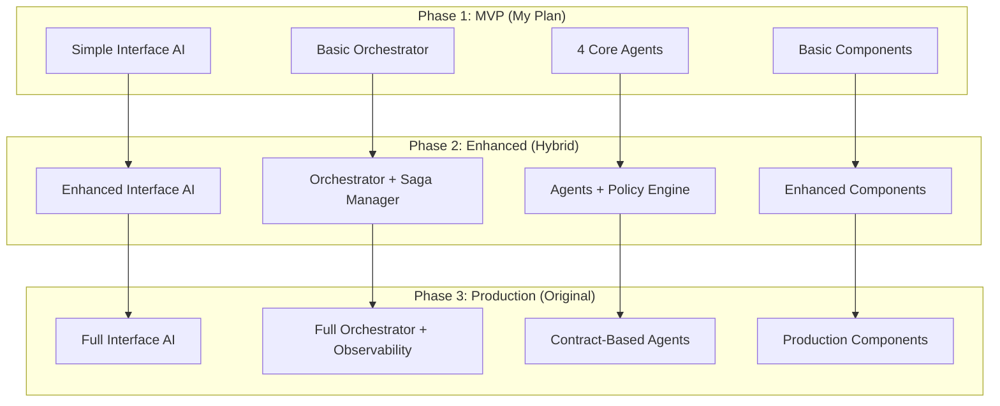

# Architecture Comparison Analysis
*Comparing dnd_game_architecture_plan.md vs dnd_haystack_revised_plan.md*

## Executive Summary

Both plans share the same **core vision** (4 AI agents + deterministic components) but differ significantly in **architectural sophistication** and **implementation approach**.

---

## Key Similarities ✅

### Shared Architecture Elements
- **4 AI Agents**: RAG Retriever, Scenario Generator, NPC & Enemy Controller, Main Interface
- **Agent vs Component Separation**: AI creativity vs deterministic mechanics
- **Orchestrator Pattern**: Central routing and coordination
- **Haystack Integration**: RAG pipelines with document stores
- **Game Flow**: Campaign → Scenario → Choices → Combat → Progression
- **Phased Implementation**: Build core loop first, add features incrementally

### Shared Components
- Character Manager, Dice Roller, Combat Engine, Game Engine
- Campaign Manager, Rules Enforcer, Spell Manager, Session Manager
- Inventory/XP systems, Document Store/Vector DB

---

## Major Differences

## 1. Orchestrator Architecture

| Aspect | My Plan (Simple) | Original Plan (Advanced) |
|--------|------------------|--------------------------|
| **Structure** | Intent Router + Game Flow Manager | Router + Saga Manager + Context Broker |
| **Features** | Basic routing and flow control | Multi-step flow tracking, Dead Letter Queue |
| **Observability** | Basic metrics and logging | OpenTelemetry tracing, correlation IDs |
| **Error Handling** | Standard try/catch | Dead Letter Queue, chaos recovery |

**Pros of My Approach:**
- ✅ Simpler to implement and debug
- ✅ Faster initial development
- ✅ Easier to understand and maintain
- ✅ Lower complexity for MVP

**Pros of Original Approach:**
- ✅ Production-ready error handling
- ✅ Full audit trail for debugging
- ✅ Handles complex multi-step scenarios
- ✅ Better observability and monitoring

## 2. Policy Engine & Rule Management

| Aspect | My Plan | Original Plan |
|--------|---------|---------------|
| **Rule Handling** | Basic difficulty scaling in Game Engine | Dedicated Policy Engine component |
| **House Rules** | Configuration-based | Policy profiles (RAW, House, Easy) |
| **Advantage Computation** | Simple rule checks | Sophisticated context analysis |
| **Scalability** | Limited to basic rules | Extensible rule system |

**Pros of My Approach:**
- ✅ Simpler initial setup
- ✅ Fewer moving parts
- ✅ Direct configuration

**Pros of Original Approach:**
- ✅ Handles complex house rules
- ✅ Supports multiple rule profiles
- ✅ Centralized rule mediation
- ✅ Better for advanced DMs

## 3. Scenario Generation Contracts

| Aspect | My Plan | Original Plan |
|--------|---------|---------------|
| **Output Format** | Simple dataclass with choices | Standardized JSON with metadata |
| **Metadata** | Basic (combat trigger, difficulty) | Rich (effects, hooks, skill hints, DCs) |
| **Integration** | Direct scenario → choice flow | Contract-based with game state effects |
| **Extensibility** | Limited structure | Highly extensible with flags/hooks |

**Example Comparison:**

**My Plan:**
```python
@dataclass
class Scenario:
    description: str
    choices: List[Choice]
    triggers_combat: bool = False
    difficulty_modifier: int = 0
```

**Original Plan:**
```json
{
  "scene": "Narrative description",
  "choices": [
    {
      "id": "c1", 
      "title": "Sneak across the ledge",
      "skill_hints": ["Stealth"],
      "suggested_dc": {"easy": 10, "medium": 15, "hard": 20},
      "combat_trigger": false
    }
  ],
  "effects": [{"type": "flag", "name": "alert_guard", "value": true}],
  "hooks": [{"quest": "rescue_hostage", "progress": "advance"}]
}
```

**Pros of My Approach:**
- ✅ Faster to implement
- ✅ Less overhead per scenario
- ✅ Simpler agent code

**Pros of Original Approach:**
- ✅ Rich scenario metadata
- ✅ Better game state integration
- ✅ More sophisticated choice handling
- ✅ Supports complex quest systems

## 4. Decision Logging & Determinism

| Aspect | My Plan | Original Plan |
|--------|---------|---------------|
| **Skill Checks** | Basic roll + result logging | 7-step deterministic pipeline |
| **Combat** | Standard turn processing | Validated actions with provenance |
| **Decision Trail** | Basic logs | Complete audit trail with correlation IDs |
| **Debugging** | Manual log analysis | Structured replay capability |

**Original Plan's Skill Check Pipeline:**
1. Rules Enforcer → determine if check needed, derive DC
2. Character Manager → get skill/ability modifiers, conditions  
3. Policy Engine → compute advantage/disadvantage, house rules
4. Dice Roller → execute rolls with full logging
5. Rules Enforcer → compare vs DC, determine success/failure
6. Game Engine → apply state changes, log outcome
7. Decision Log → record complete provenance chain

**Pros of My Approach:**
- ✅ Simpler implementation
- ✅ Faster execution
- ✅ Standard D&D feel

**Pros of Original Approach:**
- ✅ Complete audit trail
- ✅ Debuggable and replayable
- ✅ Production-grade determinism
- ✅ Better for competitive/streaming

## 5. Testing Strategy

| Aspect | My Plan (Basic) | Original Plan (Comprehensive) |
|--------|-----------------|-------------------------------|
| **Test Types** | Functional tests | Contract + Golden + Chaos tests |
| **Coverage** | Core functionality | Every component interface |
| **Regression** | Manual testing | Automated golden scenarios |
| **Reliability** | Standard unit tests | Chaos engineering approach |

**Pros of My Approach:**
- ✅ Faster to implement testing
- ✅ Standard testing practices
- ✅ Good enough for MVP

**Pros of Original Approach:**
- ✅ Production-ready testing
- ✅ Comprehensive coverage  
- ✅ Automated regression detection
- ✅ Better long-term maintenance

## 6. Implementation Timeline

| Aspect | My Plan | Original Plan |
|--------|---------|---------------|
| **Detail Level** | Week-by-week tasks (15 weeks) | Phase-based approach (4 phases) |
| **Focus** | Game functionality first | Architecture robustness first |
| **MVP Timeline** | 6 weeks to playable game | Minimal playable loop focus |
| **Complexity Growth** | Linear feature addition | Architectural maturity path |

**Pros of My Approach:**
- ✅ Clear timeline with milestones
- ✅ Playable game quickly  
- ✅ Feature-driven development
- ✅ Easier project management

**Pros of Original Approach:**
- ✅ Scalable foundation
- ✅ Architecture-first approach
- ✅ Better for long-term growth
- ✅ Production-ready from start

---

## Recommendation Matrix

### Choose My Plan If:
- 🎯 **Priority**: Fast playable prototype
- 🎯 **Team**: Small team, limited resources
- 🎯 **Timeline**: Need working game in 6-8 weeks
- 🎯 **Complexity**: Want simple, understandable codebase
- 🎯 **Use Case**: Personal/hobbyist D&D assistant
- 🎯 **Risk Tolerance**: Okay with technical debt for speed

### Choose Original Plan If:
- 🎯 **Priority**: Production-ready, scalable system
- 🎯 **Team**: Experienced developers, adequate resources
- 🎯 **Timeline**: Can invest in proper architecture upfront
- 🎯 **Complexity**: Comfortable with sophisticated systems
- 🎯 **Use Case**: Commercial product, multiple DMs, streaming
- 🎯 **Risk Tolerance**: Want robust, maintainable system

---

## Hybrid Approach Recommendation

**Best of Both Worlds**: Start with my plan's **simplified approach** but adopt key elements from the original:

### Phase 1 (My Plan's Approach)
- Simple orchestrator with Intent Router
- Basic scenario generation with dataclass contracts
- Functional testing approach
- Focus on playable game in 6 weeks

### Phase 2 (Adopt Original's Architecture)
- Add Saga Manager for complex flows
- Implement Policy Engine for house rules
- Upgrade to standardized scenario contracts
- Add decision logging infrastructure

### Phase 3 (Original's Advanced Features)
- Full observability and tracing
- Comprehensive testing framework
- Contract validation system
- Production-ready error handling

---

## Final Merged Architecture Recommendation



This hybrid approach gives you:
- ✅ **Fast time to playable game** (6 weeks)
- ✅ **Clear evolution path** to production quality
- ✅ **Manageable complexity** at each phase
- ✅ **Best practices** adopted incrementally
- ✅ **Risk mitigation** through early validation

---

## Conclusion

Both plans are excellent, but serve different goals:

- **My Plan**: Fast, simple, focused on getting a playable D&D game quickly
- **Original Plan**: Sophisticated, robust, focused on long-term scalability

The **hybrid approach** gives you the best of both worlds - fast initial development with a clear path to production-ready architecture.