# Modular DM Assistant - System Architecture & Data Flow Analysis

The [`modular_dm_assistant.py`](modular_dm_assistant.py) file implements a sophisticated multi-agent AI system for D&D game management. This document provides a comprehensive breakdown of the system's architecture, agents, and data flow patterns.

## Core Agents

### 1. **Primary Agents**

- **[`AgentOrchestrator`](agent_framework.py)** - Central coordinator managing all agents and message routing
- **[`HaystackPipelineAgent`](haystack_pipeline_agent.py)** - Core RAG services using Haystack for document retrieval and generation
- **[`CampaignManagerAgent`](campaign_management.py)** - Manages campaign data, player information, and campaign context
- **[`GameEngineAgent`](game_engine.py)** - Handles game state persistence, turn tracking, and save/load functionality
- **[`ScenarioGeneratorAgent`](scenario_generator.py)** - Generates scenarios and handles player choice consequences
- **[`NPCControllerAgent`](npc_controller.py)** - Controls NPC behavior and interactions
- **[`DiceSystemAgent`](dice_system.py)** - Handles all dice rolling operations with skill check detection
- **[`CombatEngineAgent`](combat_engine.py)** - Manages combat encounters, initiative, and turn order
- **[`RuleEnforcementAgent`](rule_enforcement_agent.py)** - Enforces D&D rules and provides rule lookups

### 2. **Enhanced System Components**

- **[`NarrativeContinuityTracker`](modular_dm_assistant.py#L42)** - Tracks story consistency and narrative elements
- **[`AdaptiveErrorRecovery`](modular_dm_assistant.py#L193)** - Learning-based error recovery system
- **[`PerformanceMonitoringDashboard`](modular_dm_assistant.py#L302)** - Real-time performance monitoring and alerting

## Architecture Overview

```mermaid
graph TB
    User[👤 DM User Input] --> DMA[🎭 ModularDMAssistant]
    DMA --> AO[🤖 AgentOrchestrator]
    
    AO --> HPA[🔍 HaystackPipelineAgent]
    AO --> CMA[📚 CampaignManagerAgent] 
    AO --> GEA[⚙️ GameEngineAgent]
    AO --> SGA[🎲 ScenarioGeneratorAgent]
    AO --> NCA[👥 NPCControllerAgent]
    AO --> DSA[🎲 DiceSystemAgent]
    AO --> CEA[⚔️ CombatEngineAgent]
    AO --> REA[📖 RuleEnforcementAgent]
    
    subgraph "Enhanced Pipeline Layer"
        PM[📦 PipelineManager]
        SPR[🧠 SmartPipelineRouter]
        ICache[💾 IntelligentCache]
    end
    
    subgraph "Monitoring Layer"
        NCT[📈 NarrativeContinuityTracker]
        AER[🔧 AdaptiveErrorRecovery]
        PMD[📊 PerformanceMonitoringDashboard]
    end
    
    DMA --> PM
    DMA --> SPR
    DMA --> NCT
    DMA --> AER
    DMA --> PMD
```



## Data Flow Architecture

### 1. **Command Processing Flow**

```mermaid
sequenceDiagram
    participant User as 👤 DM User
    participant DMA as 🎭 ModularDMAssistant
    participant Cache as 💾 Cache
    participant AO as 🤖 AgentOrchestrator
    participant Agent as 🎯 SpecificAgent
    
    User->>DMA: Input Command
    DMA->>DMA: Parse & Route Command
    DMA->>Cache: Check Cache (if enabled)
    
    alt Cache Hit
        Cache-->>DMA: Return Cached Result
    else Cache Miss
        DMA->>AO: Send Message to Agent
        AO->>Agent: Route Message
        Agent->>Agent: Process Request
        Agent-->>AO: Return Response
        AO-->>DMA: Forward Response
        DMA->>Cache: Store Result (if cacheable)
    end
    
    DMA-->>User: Formatted Response
```



### 2. **Scenario Generation Flow**

```mermaid
graph LR
    A[User: "Generate Scenario"] --> B[Parse Command]
    B --> C{Async Enabled?}
    
    C -->|Yes| D[Parallel Context Gathering]
    C -->|No| E[Sequential Context Gathering]
    
    D --> F[Campaign Context]
    D --> G[Game State]
    E --> F
    E --> G
    
    F --> H[Smart Context Reduction]
    G --> H
    H --> I[Enhanced Query Building]
    I --> J[HaystackPipelineAgent]
    J --> K[Extract Options]
    K --> L[Update Game State]
    L --> M[Return Formatted Response]
```

## Key Data Structures & State Management

### 1. **Game State Tracking**

- **[`game_state`](modular_dm_assistant.py#L495)** - Current game session state
- **[`last_scenario_options`](modular_dm_assistant.py#L497)** - Player choices from last scenario
- **[`game_save_data`](modular_dm_assistant.py#L467)** - Comprehensive save data structure

### 2. **Caching Strategy**

The system uses intelligent query pattern recognition:

```python
query_patterns = {
    'scenario_generation': r'generate|scenario|story|continue',
    'rule_queries': r'rule|how does|what happens|mechanics',
    'dice_rolls': r'roll|dice|d\d+',
    'campaign_info': r'campaign|setting|location|npc'
}
```

**Cache Priorities & TTL:**
- **Scenario Generation** - Low cache priority, creative content (1h TTL)
- **Rule Queries** - High cache priority, static rules (24h TTL)
- **Dice Rolls** - Never cached, random results
- **Campaign Info** - Medium cache priority (12h TTL)

### 3. **Performance Optimization Features**

- **Smart Caching** - Different TTL based on query type
- **Async Processing** - Parallel context gathering via [`_generate_scenario_optimized_async()`](modular_dm_assistant.py#L1109)
- **Context Reduction** - Essential information only via [`_create_optimized_context()`](modular_dm_assistant.py#L1193)
- **Error Recovery** - Multiple fallback strategies

## Message Bus Communication

### 1. **Agent Communication Pattern**

The [`_send_message_and_wait()`](modular_dm_assistant.py#L894) method implements:

1. **Intelligent cache checking** - Query pattern recognition and cache lookup
2. **Performance monitoring** - Operation timing and success tracking
3. **Message routing** - Through orchestrator to appropriate agent
4. **Response waiting** - With configurable timeout handling
5. **Result caching** - For future query optimization

### 2. **Message Flow Types**

- **Query Messages** - Information requests to agents
- **Command Messages** - Action execution requests
- **Broadcast Messages** - System-wide notifications (e.g., combat turn changes)
- **Response Messages** - Agent response data with success/error indicators

### 3. **Message Bus Features**

```python
# Example message structure
{
    "agent_id": "haystack_pipeline",
    "action": "query_scenario", 
    "data": {
        "query": "enhanced_query",
        "campaign_context": "json_context",
        "game_state": "json_state"
    },
    "timeout": 20.0
}
```

## Pipeline Routing Intelligence

### 1. **Smart Pipeline Router**

The [`SmartPipelineRouter`](enhanced_pipeline_components.py) manages multiple specialized pipelines:

- **Creative Pipeline** - Story generation and narrative content
- **Factual Pipeline** - Rule lookups and campaign data retrieval
- **Rules Pipeline** - D&D rule enforcement and queries
- **Hybrid Pipeline** - Complex requests requiring multiple approaches

### 2. **Query Classification System**

The system automatically classifies queries using pattern recognition in [`_get_enhanced_cache_key_with_pattern()`](modular_dm_assistant.py#L956):

```python
def _get_enhanced_cache_key_with_pattern(self, agent_id: str, action: str, data: Dict[str, Any]) -> tuple[str, str]:
    # Determines query type based on agent and action
    # Returns (cache_key, query_type) for optimized processing
```

## Advanced Features

### 1. **Skill Check & Combat Detection**

#### Skill Check Handling
- **[`_handle_skill_check_option()`](modular_dm_assistant.py#L1588)** - Automatic detection and rolling of skill checks from scenario options
- **Pattern Recognition** - Detects formats like `**Stealth Check (DC 15)**`
- **Auto-Rolling** - Integrates with DiceSystemAgent for immediate results

#### Combat System Integration
- **[`_handle_combat_option()`](modular_dm_assistant.py#L1632)** - Combat initialization with enemy parsing and setup
- **Enemy Parsing** - Extracts enemy counts and types from scenario text
- **Auto-Setup** - Automatically adds players and enemies to combat engine

### 2. **Save/Load System**

Comprehensive game persistence via [`_save_game()`](modular_dm_assistant.py#L2340) and [`_load_game_save()`](modular_dm_assistant.py#L2306):

#### Save Data Structure
```python
save_data = {
    'save_name': str,
    'save_date': str,
    'version': str,
    'game_state': dict,           # Current game session state
    'campaign_info': dict,        # Campaign data and context
    'players': list,              # Player character information
    'combat_state': dict,         # Active combat status
    'last_scenario_options': list, # Available player choices
    'assistant_config': dict      # System configuration
}
```

#### Features
- **Complete State Capture** - All agent states and game data
- **Metadata Tracking** - Timestamps, progress indicators, campaign info
- **Auto-Restore** - Complete session restoration on load
- **Version Control** - Save format versioning for compatibility

### 3. **Performance Monitoring**

The [`PerformanceMonitoringDashboard`](modular_dm_assistant.py#L302) provides comprehensive system monitoring:

#### Metrics Tracked
- **Response Times** - Per-operation performance measurement
- **Error Rates** - Success/failure tracking by operation type
- **Cache Hit Rates** - Caching effectiveness analysis
- **System Health** - Overall system performance scoring
- **Agent Health** - Individual agent status monitoring

#### Alert System
```python
alert_thresholds = {
    'response_time': 15.0,  # seconds
    'error_rate': 0.1,      # 10%
    'cache_hit_rate': 0.2   # 20%
}
```

## Narrative Continuity & Story Management

### 1. **Narrative Continuity Tracker**

The [`NarrativeContinuityTracker`](modular_dm_assistant.py#L42) provides advanced story consistency:

#### Story Element Tracking
```python
story_elements = {
    'characters': {},           # Character appearances and status
    'locations': {},           # Location visits and descriptions
    'plot_threads': {},        # Active story threads
    'unresolved_conflicts': [] # Pending story elements
}
```

#### Features
- **Entity Extraction** - Automatic character and location detection
- **Consistency Checking** - Contradiction detection (e.g., dead characters appearing)
- **Coherence Scoring** - Narrative quality assessment
- **History Tracking** - Complete narrative event logging

### 2. **Story Progression System**

- **Choice Tracking** - Records player decisions and consequences
- **Event Continuity** - Maintains story flow across sessions
- **Context Building** - Uses recent events for scenario generation

## Error Handling & Recovery

### 1. **Adaptive Error Recovery System**

The [`AdaptiveErrorRecovery`](modular_dm_assistant.py#L193) system provides intelligent error handling:

#### Error Classification
```python
recovery_strategies = {
    'timeout': self._handle_timeout_recovery,
    'generation_failure': self._handle_generation_failure,
    'context_overflow': self._handle_context_overflow,
    'agent_communication': self._handle_agent_communication_failure
}
```

#### Learning Features
- **Pattern Recognition** - Identifies recurring error types
- **Success Rate Tracking** - Measures recovery strategy effectiveness
- **Strategy Adaptation** - Improves recovery approaches over time

### 2. **Fallback Mechanisms**

#### Multi-Level Fallbacks
- **Pipeline Fallbacks** - Alternative processing routes when primary fails
- **Agent Fallbacks** - Redundant functionality across multiple agents
- **Cache Fallbacks** - Fresh generation when cached results are invalid
- **LLM Fallbacks** - Graceful degradation when AI services are unavailable

#### Error Recovery Flow
1. **Error Detection** - Classify error type and context
2. **Strategy Selection** - Choose appropriate recovery method
3. **Recovery Execution** - Apply recovery strategy
4. **Learning Update** - Record success/failure for future improvement

## Agent Initialization & Lifecycle

### 1. **Agent Initialization Sequence**

The [`_initialize_agents()`](modular_dm_assistant.py#L523) method follows a specific order:

1. **HaystackPipelineAgent** - Core RAG services foundation
2. **CampaignManagerAgent** - Campaign and player data management
3. **GameEngineAgent** - Game state and persistence (if enabled)
4. **DiceSystemAgent** - Dice rolling capabilities
5. **CombatEngineAgent** - Combat management system
6. **RAGAgent** - Legacy compatibility agent
7. **RuleEnforcementAgent** - Rule checking and enforcement
8. **NPCControllerAgent** - NPC behavior management
9. **ScenarioGeneratorAgent** - Story and scenario generation

### 2. **Enhanced Pipeline Setup**

The [`_setup_enhanced_pipelines()`](modular_dm_assistant.py#L594) method configures:

- **Creative Consequence Pipeline** - With optional LLM integration
- **Smart Router Registration** - Multiple specialized pipelines
- **Error Recovery Pipeline** - Fallback chain configuration

## Command Processing & Routing

### 1. **Command Categories**

The [`process_dm_input()`](modular_dm_assistant.py#L683) method handles:

- **Campaign Management** - List/select campaigns, campaign info
- **Player Management** - List players, player details
- **Dice Rolling** - All dice expressions and skill checks
- **Combat Commands** - Combat initialization, status, turn management
- **Rule Queries** - Rule lookups and explanations
- **Scenario Generation** - Story creation and continuation
- **Game State** - Save/load, state viewing
- **General Queries** - RAG-powered Q&A

### 2. **Intelligent Command Routing**

```python
# Example command routing logic
if "list campaigns" in instruction_lower:
    # Route to CampaignManagerAgent
elif any(keyword in instruction_lower for keyword in ["roll", "dice"]):
    # Route to DiceSystemAgent  
elif "combat" in instruction_lower:
    # Route to CombatEngineAgent
# ... etc
```

## System Configuration & Options

### 1. **Initialization Options**

```python
ModularDMAssistant(
    collection_name: str = "dnd_documents",    # Qdrant collection
    campaigns_dir: str = "docs/current_campaign", # Campaign data path
    players_dir: str = "docs/players",         # Player data path
    verbose: bool = False,                     # Debug output
    enable_game_engine: bool = True,           # Game state tracking
    tick_seconds: float = 0.8,                # Game engine tick rate
    enable_caching: bool = True,               # Intelligent caching
    enable_async: bool = True,                 # Async processing
    game_save_file: Optional[str] = None       # Load existing save
)
```

### 2. **Feature Toggles**

- **Caching System** - Can be disabled for development/testing
- **Async Processing** - Falls back to sequential processing if disabled
- **Game Engine** - Optional for simpler use cases
- **Performance Monitoring** - Automatic when caching is enabled

## Conclusion

This modular architecture provides a robust, scalable, and intelligent D&D assistant system with:

- **Multi-Agent Coordination** - Specialized agents for different game aspects
- **Intelligent Caching** - Query-aware performance optimization
- **Advanced Error Recovery** - Learning-based failure handling
- **Comprehensive Monitoring** - Real-time system health tracking
- **Story Continuity** - Narrative consistency and progression tracking
- **Flexible Configuration** - Adaptable to different use cases and requirements

The system demonstrates sophisticated software architecture principles including separation of concerns, fault tolerance, performance optimization, and extensibility while maintaining focus on the core goal of enhancing D&D gameplay through AI assistance.