# Modular DM Assistant Haystack-Native Architecture Report

## Executive Summary

The `modular_dm_assistant_haystack_native.py` represents a complete refactor to pure Haystack orchestration for a D&D Assistant system. This Phase 5 implementation eliminates all backward compatibility and agent framework dependencies, creating a clean, single-framework architecture using pure Haystack components and pipelines.

## Table of Contents

1. [Python Files Used](#python-files-used)
2. [Dependencies Analysis](#dependencies-analysis)
3. [System Architecture](#system-architecture)
4. [Component Analysis](#component-analysis)
5. [Data Flow](#data-flow)
6. [Communication Patterns](#communication-patterns)
7. [Architecture Diagrams](#architecture-diagrams)
8. [Event Sourcing Pattern](#event-sourcing-pattern)

## Python Files Used

### Core Application Files

#### 1. Main Application
- **`modular_dm_assistant_haystack_native.py`** - Primary application entry point
  - Main class: [`HaystackNativeDMAssistant`](modular_dm_assistant_haystack_native.py:22)
  - Interactive mode: [`run_interactive()`](modular_dm_assistant_haystack_native.py:443)
  - Command processing: [`process_dm_input()`](modular_dm_assistant_haystack_native.py:97)

### Core Framework Files

#### 2. Orchestration Layer
- **`core/haystack_native_orchestrator_fixed.py`** - Core orchestration engine
  - [`HaystackDMOrchestrator`](core/haystack_native_orchestrator_fixed.py:69) - Main orchestrator
  - [`GameStateManager`](core/haystack_native_orchestrator_fixed.py:361) - State management
  - [`IntentClassificationComponent`](core/haystack_native_orchestrator_fixed.py:217) - Intent classification
  - [`SimpleNativePipelineRegistry`](core/haystack_native_orchestrator_fixed.py:49) - Pipeline registry

#### 3. Pipeline System
- **`core/haystack_native_pipelines.py`** - Specialized pipeline implementations
  - [`MasterRoutingPipelineNative`](core/haystack_native_pipelines.py:306) - Master request router
  - [`SkillCheckPipelineNative`](core/haystack_native_pipelines.py:20) - Skill check processing
  - [`CombatActionPipelineNative`](core/haystack_native_pipelines.py:125) - Combat mechanics
  - [`LoreQueryPipelineNative`](core/haystack_native_pipelines.py:198) - Lore retrieval
  - [`CharacterManagementPipelineNative`](core/haystack_native_pipelines.py:250) - Character operations
  - [`RuleQueryPipelineNative`](core/haystack_native_pipelines.py:679) - Rule lookups
  - [`ScenarioChoicePipelineNative`](core/haystack_native_pipelines.py:720) - Decision handling

#### 4. Component System
- **`core/haystack_native_components.py`** - Core Haystack components
  - [`CharacterDataComponent`](core/haystack_native_components.py:31) - Character data management
  - [`CampaignContextComponent`](core/haystack_native_components.py:193) - Campaign information
  - [`RuleEnforcementComponent`](core/haystack_native_components.py:260) - Rule validation
  - [`DiceSystemComponent`](core/haystack_native_components.py:444) - Dice rolling mechanics
  - [`CombatEngineComponent`](core/haystack_native_components.py:593) - Combat processing
  - [`GameStateComponent`](core/haystack_native_components.py:789) - State management

### Event Sourcing System

#### 5. Event Sourcing Implementation
- **`core/pure_event_sourcing.py`** - Event sourcing without external dependencies
  - [`GameEvent`](core/pure_event_sourcing.py:14) - Immutable event dataclass
  - [`EventStore`](core/pure_event_sourcing.py:39) - Event storage and indexing
  - [`StateProjector`](core/pure_event_sourcing.py:86) - State reconstruction from events

### Helper Systems

#### 6. Caching System
- **`cache_manager.py`** - In-memory caching with TTL
  - [`SimpleInlineCache`](cache_manager.py:9) - TTL-based cache implementation
  - Methods: [`get()`](cache_manager.py:16), [`set()`](cache_manager.py:33), [`get_stats()`](cache_manager.py:64)

#### 7. Persistence System
- **`game_save_manager.py`** - Game state persistence
  - [`GameSaveManager`](game_save_manager.py:13) - Save/load operations
  - Methods: [`list_game_saves()`](game_save_manager.py:40), [`load_game_save()`](game_save_manager.py:80), [`save_game_state()`](game_save_manager.py:236)

### Additional Supporting Files (Referenced but not directly imported)

#### 8. Enhanced Game Engine
- **`core/enhanced_game_engine.py`** - Referenced by haystack_native_components.py
  - Provides: `GameEvent`, `EventStore`, `StateProjector` classes
  - Used for event sourcing functionality

## Dependencies Analysis

### External Package Dependencies

#### Core Haystack Framework
```python
from haystack import Pipeline, component
from haystack.components.builders import PromptBuilder
from haystack_integrations.document_stores.qdrant import QdrantDocumentStore
```

#### Optional AI Integration
```python
# Conditional import for Apple GenAI
try:
    from hwtgenielib import component as hwtgenie_component
    from hwtgenielib.components.generators.chat import AppleGenAIChatGenerator
    from hwtgenielib.dataclasses import ChatMessage
    CLAUDE_AVAILABLE = True
except ImportError:
    CLAUDE_AVAILABLE = False
```

#### Standard Library Dependencies
```python
import json          # Data serialization
import time          # Performance tracking
import os            # File operations
import random        # Dice rolling
import warnings      # Warning suppression
from typing import Dict, List, Any, Optional  # Type hints
from datetime import datetime  # Timestamp handling
from dataclasses import dataclass, asdict     # Event structure
import uuid          # Unique identifiers
```

### Internal Module Dependencies

#### Import Graph


## System Architecture

### Architectural Pattern: **Pure Haystack Native Architecture**

The system follows a **pipeline-oriented architecture** where all operations flow through specialized Haystack pipelines.


### Key Architectural Principles

1. **Single Framework Consistency**: Pure Haystack implementation
2. **Event Sourcing**: All state changes captured as immutable events  
3. **Pipeline Orchestration**: Domain-specific specialized pipelines
4. **Graceful Degradation**: Continues functioning when optional components fail
5. **Performance Optimization**: Caching and response time tracking

## Component Analysis

### Primary Components

#### 1. HaystackNativeDMAssistant (Main Class)
- **File**: `modular_dm_assistant_haystack_native.py`
- **Lines**: 22-563
- **Purpose**: Main orchestration coordinator
- **Key Methods**:
  - [`__init__()`](modular_dm_assistant_haystack_native.py:28): System initialization
  - [`process_dm_input()`](modular_dm_assistant_haystack_native.py:97): Command processing
  - [`_extract_response()`](modular_dm_assistant_haystack_native.py:166): Response extraction
  - [`get_performance_stats()`](modular_dm_assistant_haystack_native.py:348): Performance tracking

#### 2. HaystackDMOrchestrator
- **File**: `core/haystack_native_orchestrator_fixed.py`
- **Lines**: 69-213
- **Purpose**: Core pipeline orchestration
- **Key Methods**:
  - [`classify_intent()`](core/haystack_native_orchestrator_fixed.py:137): Intent classification
  - [`process_command()`](core/haystack_native_orchestrator_fixed.py:152): Command processing
  - [`get_pipeline_info()`](core/haystack_native_orchestrator_fixed.py:194): Pipeline information

#### 3. GameStateManager
- **File**: `core/haystack_native_orchestrator_fixed.py`
- **Lines**: 361-438
- **Purpose**: Centralized state management with event sourcing
- **Key Methods**:
  - [`get_current_state()`](core/haystack_native_orchestrator_fixed.py:390): State retrieval
  - [`apply_state_update()`](core/haystack_native_orchestrator_fixed.py:397): State updates
  - [`get_active_characters()`](core/haystack_native_orchestrator_fixed.py:424): Character access

### Specialized Pipeline Components

#### 1. MasterRoutingPipelineNative
- **File**: `core/haystack_native_pipelines.py`
- **Lines**: 306-428
- **Purpose**: Central request routing and context enrichment
- **Supported Intents**: `SKILL_CHECK`, `COMBAT_ACTION`, `RULE_QUERY`, `LORE_LOOKUP`, `CHARACTER_MANAGEMENT`, `SCENARIO_CHOICE`

#### 2. Domain-Specific Pipelines
- **SkillCheckPipelineNative** (Lines 20-122): Handles D&D skill checks and dice rolling
- **CombatActionPipelineNative** (Lines 125-195): Manages combat mechanics and damage
- **LoreQueryPipelineNative** (Lines 198-247): Retrieves campaign and world lore
- **CharacterManagementPipelineNative** (Lines 250-303): Character data operations
- **RuleQueryPipelineNative** (Lines 679-717): D&D rule lookups
- **ScenarioChoicePipelineNative** (Lines 720-757): Decision point handling

## Data Flow

### Request Processing Flow

```mermaid
sequenceDiagram
    participant U as User
    participant DM as HaystackNativeDMAssistant
    participant C as Cache
    participant MP as MasterRoutingPipeline
    participant IC as IntentClassifier
    participant SP as SpecializedPipeline
    participant GS as GameStateManager
    participant ES as EventStore

    U->>DM: process_dm_input("I want to make a stealth check")
    DM->>C: get(cache_key)
    C-->>DM: None (cache miss)
    DM->>MP: run(query, context)
    MP->>IC: classify_intent(query)
    IC-->>MP: "SKILL_CHECK"
    MP->>SP: SkillCheckPipeline.run()
    SP->>GS: apply_state_update()
    GS->>ES: append_event()
    ES-->>GS: event_stored
    GS-->>SP: state_updated
    SP-->>MP: skill_check_result
    MP-->>DM: final_response
    DM->>C: set(cache_key, response)
    DM-->>U: "🎲 Stealth Check: SUCCESS..."
```



### Event Sourcing Flow

```mermaid
graph LR
    A[User Action] --> B[GameEvent Creation]
    B --> C[EventStore.append_event()]
    C --> D[Event Index Update]
    D --> E[StateProjector.project_state()]
    E --> F[Current State Update]
    F --> G[Response Generation]
```

## Communication Patterns

### 1. Pipeline Communication
- **Pattern**: Sequential pipeline execution
- **Implementation**: Direct method calls between pipeline stages
- **Error Handling**: Try-catch with graceful degradation

### 2. Event-Driven State Management
- **Pattern**: Event sourcing with state projection
- **Implementation**: Immutable events stored chronologically
- **Benefits**: Full audit trail, state reconstruction capability

### 3. Caching Strategy
- **Pattern**: Smart cache key generation with TTL
- **Implementation**: Hash-based keys with context normalization
- **Cache Keys**: Generated from normalized input + stable context

### 4. Response Extraction Strategy
- **Pattern**: Priority-based response extraction with fallbacks
- **Implementation**: Multiple extraction attempts with contextual fallbacks
- **Response Types**: `narrative_text`, `combat_narrative`, `rule_answer`, `formatted_lore`, etc.

## Architecture Diagrams

### System Component Diagram


### Event Sourcing Architecture


## Event Sourcing Pattern

### Event Structure
```python
@dataclass
class GameEvent:
    event_id: str           # Unique identifier
    event_type: str         # Event category
    actor: str              # Who performed the action
    payload: Dict[str, Any] # Event data
    timestamp: float        # When it occurred
```

### Supported Event Types
- `game_state.updated`: Direct state modifications
- `character.created`: New character creation
- `character.updated`: Character data changes
- `session.started/ended`: Session lifecycle
- `combat.started/ended`: Combat state changes
- `campaign.loaded`: Campaign initialization
- `skill_check_result`: Skill check outcomes

### State Projection Process
1. **Event Collection**: Gather all events chronologically
2. **Event Application**: Apply each event to state in order
3. **State Reconstruction**: Build current state from event history
4. **Cache Update**: Store projected state for performance

## Technical Implementation

### Performance Optimizations

#### 1. Intelligent Caching
- **Cache Key Strategy**: Normalized input + stable context hash
- **TTL Management**: 5-minute default with configurable expiration
- **Hit Rate Tracking**: Cache statistics for performance monitoring

#### 2. Response Time Tracking
- **Metrics Collected**: Min, max, average response times
- **Performance Stats**: Commands per minute, total processed
- **Session Monitoring**: Uptime and throughput tracking

#### 3. Graceful Degradation
- **LLM Fallback**: Mock generator when Claude unavailable
- **Document Store**: Continues without Qdrant if unavailable
- **Component Isolation**: Individual component failures don't crash system

### Error Handling Strategy

#### 1. Component-Level Error Handling
```python
try:
    result = self.master_pipeline.run(inputs)
except Exception as e:
    return {"error": f"Pipeline failed: {str(e)}", "success": False}
```

#### 2. Response Extraction Fallbacks
- Priority-based extraction with multiple fallback strategies
- Contextual response generation for failed extractions
- Default responses for unknown scenarios

#### 3. State Management Resilience
- Event store continues operating despite projection failures
- State updates are atomic and consistent
- Recovery mechanisms for corrupted state

## Summary

### Key Strengths
1. **Pure Architecture**: Single-framework consistency with Haystack
2. **Robust State Management**: Event sourcing with full audit trail
3. **Performance**: Intelligent caching and response time optimization
4. **Resilience**: Graceful degradation and comprehensive error handling
5. **Modularity**: Clear separation of concerns with specialized pipelines

### Architecture Benefits
- **Clean Dependencies**: No circular imports or mixed frameworks
- **Testability**: Components can be tested in isolation
- **Scalability**: Pipeline-based architecture allows easy extension
- **Maintainability**: Clear code organization and documentation
- **Performance**: Optimized for quick response times with caching

This architecture represents a mature, production-ready implementation of a D&D assistant using modern software engineering practices and the Haystack framework.