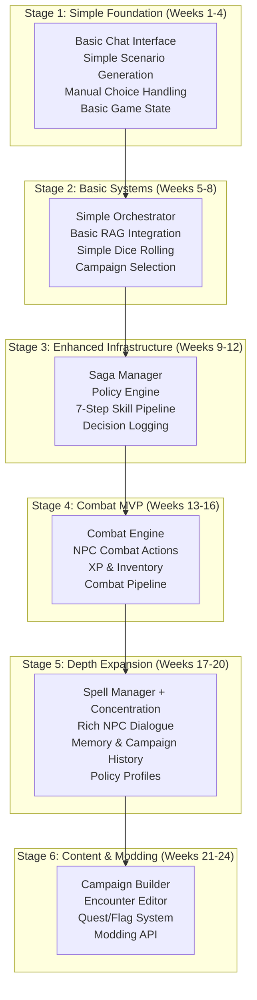

# Progressive D&D Implementation Plan
*Start Simple → Expand in Stages → Full Original Feature Set*

## Overview

This plan implements a **truly progressive approach** that starts with the simplest possible working D&D game and gradually adds sophistication in stages until we achieve **complete feature parity** with the original [`dnd_haystack_revised_plan.md`](dnd_haystack_revised_plan.md).

**Core Philosophy:**
- ✅ **Start Simple**: Week 1 delivers a basic working D&D experience
- ✅ **Incremental Expansion**: Each phase adds complexity without breaking previous functionality
- ✅ **Infrastructure Readiness**: Architecture supports future enhancements from day 1
- ✅ **Full Feature Parity**: Ends with all original plan features implemented
- ✅ **Haystack/hwtgenielib**: Used throughout for consistency

---

## Progressive Architecture Evolution



---

## Stage 1: Simple Foundation (Weeks 1-4)
**Goal**: Get a basic D&D conversation working immediately

### Week 1: Minimal Working Game

#### 1.1 Simplest Possible Start
```python
# simple_dnd_game.py - Single file to start
from hwtgenielib.components.generators.chat import AppleGenAIChatGenerator
from hwtgenielib.dataclasses import ChatMessage
import json

class SimpleDnDGame:
    """Absolute simplest D&D game possible"""
    
    def __init__(self):
        self.chat_generator = AppleGenAIChatGenerator(
            model="aws:anthropic.claude-sonnet-4-20250514-v1:0"
        )
        self.game_state = {
            "location": "Tavern",
            "story": "You enter a bustling tavern...",
            "history": []
        }
    
    def play_turn(self, player_input: str) -> str:
        """Single turn of D&D"""
        
        # Build simple prompt
        prompt = f"""You are a D&D Dungeon Master. 

Current situation: {self.game_state['story']}
Location: {self.game_state['location']}
Previous actions: {self.game_state['history'][-3:]}

Player says: "{player_input}"

Respond with:
1. What happens next
2. Give the player 2-3 clear choices
3. Keep it engaging and brief

Response:"""

        # Generate with hwtgenielib
        messages = [ChatMessage.from_user(prompt)]
        response = self.chat_generator.run(messages=messages)
        
        if response and "replies" in response:
            dm_response = response["replies"][0].text
            
            # Update simple state
            self.game_state["history"].append({
                "player": player_input,
                "dm": dm_response
            })
            
            return dm_response
        
        return "The tavern keeper looks confused..."
    
    def save_game(self):
        """Simple JSON save"""
        with open("simple_save.json", "w") as f:
            json.dump(self.game_state, f)
    
    def load_game(self):
        """Simple JSON load"""
        try:
            with open("simple_save.json", "r") as f:
                self.game_state = json.load(f)
        except FileNotFoundError:
            pass

# Usage:
# game = SimpleDnDGame()
# response = game.play_turn("I look around the tavern")
# print(response)
```

### Week 2: Add Basic Structure

#### 1.2 Simple Directory Structure
```bash
simple_dnd/
├── game.py              # Main game class
├── scenario_generator.py  # Basic scenario generation  
├── dice.py              # Simple dice rolling
├── saves/              # Game saves directory
└── config.py           # Basic configuration
```

#### 1.3 Basic Scenario Generator
```python
# scenario_generator.py
from hwtgenielib.components.generators.chat import AppleGenAIChatGenerator
from hwtgenielib.dataclasses import ChatMessage

class SimpleScenarioGenerator:
    """Basic scenario generation with minimal structure"""
    
    def __init__(self):
        self.chat_generator = AppleGenAIChatGenerator(
            model="aws:anthropic.claude-sonnet-4-20250514-v1:0"
        )
    
    def generate_scenario(self, context: str = "tavern") -> dict:
        """Generate simple scenario"""
        
        prompt = f"""Create a D&D scenario in a {context}.

Include:
- Brief scene description (2-3 sentences)
- 3 clear player choices
- Keep it simple and engaging

Format:
SCENE: [description]
CHOICE 1: [option]
CHOICE 2: [option] 
CHOICE 3: [option]"""

        messages = [ChatMessage.from_user(prompt)]
        response = self.chat_generator.run(messages=messages)
        
        if response and "replies" in response:
            return self._parse_simple_response(response["replies"][0].text)
        
        return {
            "scene": "You find yourself in a quiet tavern.",
            "choices": [
                "Talk to the bartender",
                "Sit by the fire",
                "Leave the tavern"
            ]
        }
    
    def _parse_simple_response(self, text: str) -> dict:
        """Basic text parsing"""
        lines = text.split('\n')
        
        scene = ""
        choices = []
        
        for line in lines:
            if line.startswith("SCENE:"):
                scene = line.replace("SCENE:", "").strip()
            elif line.startswith("CHOICE"):
                choice = line.split(":", 1)[1].strip() if ":" in line else line.strip()
                choices.append(choice)
        
        return {"scene": scene, "choices": choices}
```

### Week 3-4: Add Basic Game Mechanics

#### 1.4 Simple Dice System
```python
# dice.py
import random

class SimpleDice:
    """Basic dice rolling for simple checks"""
    
    def roll_d20(self) -> int:
        """Simple d20 roll"""
        return random.randint(1, 20)
    
    def skill_check(self, difficulty: int = 15) -> dict:
        """Basic skill check"""
        roll = self.roll_d20()
        success = roll >= difficulty
        
        return {
            "roll": roll,
            "difficulty": difficulty,
            "success": success,
            "message": f"Rolled {roll} vs DC {difficulty}: {'Success!' if success else 'Failed!'}"
        }
```

### Stage 1 Success Criteria
- [ ] Player can have basic D&D conversation with LLM
- [ ] Simple scenario generation works
- [ ] Basic dice rolling for simple checks
- [ ] Game state saves/loads
- [ ] Foundation ready for Stage 2 expansion

---

## Stage 2: Basic Systems (Weeks 5-8)
**Goal**: Add proper architecture while keeping it simple

### Week 5-6: Haystack RAG Integration

#### 2.1 Add Document Store
```python
# storage/simple_document_store.py
from haystack_integrations.document_stores.qdrant import QdrantDocumentStore
from haystack.components.embedders import SentenceTransformersTextEmbedder
from haystack import Document
from pathlib import Path

class SimpleDocumentStore:
    """Basic Haystack document store setup"""
    
    def __init__(self):
        self.document_store = QdrantDocumentStore(
            path="qdrant_storage",
            index="simple_dnd",
            embedding_dim=384,
            recreate_index=False
        )
        self.embedder = SentenceTransformersTextEmbedder()
    
    def load_basic_content(self):
        """Load minimal D&D content"""
        docs = []
        
        # Load basic campaign info if available
        campaign_dir = Path("data/campaigns")
        if campaign_dir.exists():
            for file_path in campaign_dir.glob("*.md"):
                with open(file_path) as f:
                    content = f.read()
                    docs.append(Document(content=content, meta={"source": str(file_path)}))
        
        if docs:
            self.document_store.write_documents(docs)
    
    def simple_search(self, query: str, top_k: int = 3) -> list:
        """Basic document search"""
        # Embed query
        query_embedding = self.embedder.run(text=query)["embedding"]
        
        # Search documents
        results = self.document_store.query_by_embedding(
            query_embedding=query_embedding,
            top_k=top_k
        )
        
        return [doc.content for doc in results]
```

#### 2.2 Enhanced Scenario Generator with RAG
```python
# scenario_generator.py (Enhanced)
from storage.simple_document_store import SimpleDocumentStore

class ScenarioGenerator:
    """Scenario generator with basic RAG support"""
    
    def __init__(self):
        self.chat_generator = AppleGenAIChatGenerator(
            model="aws:anthropic.claude-sonnet-4-20250514-v1:0"
        )
        self.document_store = SimpleDocumentStore()
        self.document_store.load_basic_content()
    
    def generate_scenario(self, context: str, campaign: str = None) -> dict:
        """Generate scenario with optional RAG context"""
        
        # Get context from documents if campaign specified
        rag_context = ""
        if campaign:
            docs = self.document_store.simple_search(f"campaign {campaign}")
            rag_context = "\n".join(docs[:2])  # Use top 2 documents
        
        prompt = f"""Create a D&D scenario.

Context: {context}
{f"Campaign Info: {rag_context}" if rag_context else ""}

Include:
- Brief scene description (2-3 sentences)
- 3 clear player choices
- Simple and engaging

Format:
SCENE: [description]
CHOICE 1: [option]
CHOICE 2: [option] 
CHOICE 3: [option]"""

        messages = [ChatMessage.from_user(prompt)]
        response = self.chat_generator.run(messages=messages)
        
        if response and "replies" in response:
            return self._parse_simple_response(response["replies"][0].text)
        
        return self._fallback_scenario()
```

### Week 7-8: Simple Orchestrator

#### 2.3 Basic Orchestrator Pattern
```python
# orchestrator/simple_orchestrator.py
from scenario_generator import ScenarioGenerator
from dice import SimpleDice
import json
import time

class SimpleOrchestrator:
    """Basic orchestrator with extension hooks"""
    
    def __init__(self):
        self.scenario_generator = ScenarioGenerator()
        self.dice = SimpleDice()
        self.game_state = self._init_state()
        
        # Extension points for Stage 3
        self.pre_hooks = []   # For saga manager
        self.post_hooks = []  # For decision logging
    
    def _init_state(self):
        return {
            "current_scenario": None,
            "location": "unknown",
            "session_history": [],
            "active_campaign": None
        }
    
    def handle_request(self, request: dict) -> dict:
        """Main request handler with hook support"""
        
        # Execute pre-hooks (empty in Stage 2, used in Stage 3)
        for hook in self.pre_hooks:
            request = hook(request)
        
        # Route based on request type
        if request.get("type") == "generate_scenario":
            result = self._generate_scenario(request)
        elif request.get("type") == "skill_check":
            result = self._handle_skill_check(request)
        elif request.get("type") == "player_choice":
            result = self._handle_player_choice(request)
        else:
            result = {"error": "Unknown request type"}
        
        # Execute post-hooks (empty in Stage 2, used in Stage 3)
        for hook in self.post_hooks:
            result = hook(request, result)
        
        return result
    
    def _generate_scenario(self, request: dict) -> dict:
        """Generate new scenario"""
        context = request.get("context", "tavern")
        campaign = request.get("campaign", self.game_state.get("active_campaign"))
        
        scenario = self.scenario_generator.generate_scenario(context, campaign)
        
        # Update state
        self.game_state["current_scenario"] = scenario
        self.game_state["location"] = context
        
        return {
            "success": True,
            "scenario": scenario
        }
    
    def _handle_skill_check(self, request: dict) -> dict:
        """Handle skill check"""
        difficulty = request.get("difficulty", 15)
        result = self.dice.skill_check(difficulty)
        
        # Update history
        self.game_state["session_history"].append({
            "type": "skill_check",
            "request": request,
            "result": result,
            "timestamp": time.time()
        })
        
        return {
            "success": True,
            "check_result": result
        }
    
    def register_pre_hook(self, hook_func):
        """For Stage 3 saga manager integration"""
        self.pre_hooks.append(hook_func)
    
    def register_post_hook(self, hook_func):
        """For Stage 3 decision logging integration"""
        self.post_hooks.append(hook_func)
```

### Stage 2 Success Criteria
- [ ] RAG integration provides campaign context to scenarios
- [ ] Basic orchestrator handles different request types
- [ ] Hook system ready for Stage 3 enhancements
- [ ] Campaign selection affects scenario generation
- [ ] Game state properly managed and persistent

---

## Stage 3: Enhanced Infrastructure (Weeks 9-12)
**Goal**: Add sophisticated components from original plan

### Week 9-10: Saga Manager & Policy Engine

#### 3.1 Saga Manager (From Original Plan)
```python
# orchestrator/saga_manager.py
from typing import Dict, List, Any, Optional
import uuid
import time
from dataclasses import dataclass

@dataclass
class SagaStep:
    step_type: str
    handler: str
    timeout: float = 30.0
    retry_count: int = 0
    max_retries: int = 3

@dataclass  
class Saga:
    id: str
    type: str
    current_step: int
    steps: List[SagaStep]
    context: Dict[str, Any]
    correlation_id: str
    start_time: float
    status: str = "active"

class SagaManager:
    """Multi-step flow tracking with correlation IDs - From Original Plan"""
    
    def __init__(self):
        self.active_sagas: Dict[str, Saga] = {}
        self.completed_sagas: List[Saga] = []
        self.saga_templates = {
            "skill_challenge": self._build_skill_challenge_saga,
            "combat_encounter": self._build_combat_saga,
            "social_encounter": self._build_social_saga
        }
    
    def start_saga(self, saga_type: str, context: Dict[str, Any]) -> str:
        """Start multi-step saga with correlation tracking"""
        saga_id = str(uuid.uuid4())
        correlation_id = str(uuid.uuid4())
        
        saga = Saga(
            id=saga_id,
            type=saga_type,
            current_step=0,
            steps=self.saga_templates[saga_type](context),
            context=context,
            correlation_id=correlation_id,
            start_time=time.time()
        )
        
        self.active_sagas[saga_id] = saga
        return saga_id
    
    def pre_route_hook(self, request: Dict[str, Any]) -> Dict[str, Any]:
        """Hook for orchestrator integration"""
        if self._is_multi_step_request(request):
            saga_id = self.start_saga(request.get("saga_type", "skill_challenge"), request)
            request["saga_id"] = saga_id
        return request
    
    def _build_skill_challenge_saga(self, context: Dict[str, Any]) -> List[SagaStep]:
        return [
            SagaStep("present_scenario", "scenario_generator"),
            SagaStep("player_choice", "interface"),
            SagaStep("skill_check", "game_engine"),
            SagaStep("generate_consequence", "scenario_generator")
        ]
```

#### 3.2 Policy Engine (From Original Plan)
```python
# components/policy.py
from typing import Dict, Any, List
from enum import Enum

class PolicyProfile(Enum):
    RAW = "raw"          # Rules as written
    HOUSE = "house"      # Common house rules
    EASY = "easy"        # Beginner friendly
    CUSTOM = "custom"    # User defined

class PolicyEngine:
    """Centralized rule mediation - From Original Plan"""
    
    PROFILES = {
        PolicyProfile.RAW: {
            "flanking_advantage": False,
            "crit_range": [20],
            "death_saves": "standard",
            "rest_variant": "standard",
            "dc_adjustment": 0
        },
        PolicyProfile.HOUSE: {
            "flanking_advantage": True,
            "crit_range": [19, 20],
            "death_saves": "standard", 
            "rest_variant": "standard",
            "dc_adjustment": 0
        },
        PolicyProfile.EASY: {
            "flanking_advantage": True,
            "crit_range": [19, 20],
            "death_saves": "forgiving",
            "rest_variant": "short_rest_benefits",
            "dc_adjustment": -2
        }
    }
    
    def __init__(self, profile: PolicyProfile = PolicyProfile.RAW):
        self.active_profile = self.PROFILES[profile]
        self.custom_rules = {}
    
    def compute_advantage(self, game_state: Dict[str, Any], 
                         actor: str, skill: str) -> str:
        """Determine advantage/disadvantage state - From Original Plan"""
        advantages = []
        disadvantages = []
        
        # Check actor conditions
        actor_data = game_state.get("characters", {}).get(actor, {})
        conditions = actor_data.get("conditions", [])
        
        for condition in conditions:
            if condition in ["blinded", "frightened", "poisoned"]:
                disadvantages.append(condition)
            elif condition in ["blessed", "guided"]:
                advantages.append(condition)
        
        # Check flanking if enabled
        if (self.active_profile.get("flanking_advantage") and 
            game_state.get("combat_state", {}).get("flanking", {}).get(actor)):
            advantages.append("flanking")
        
        # Resolve final state
        if len(advantages) > len(disadvantages):
            return "advantage"
        elif len(disadvantages) > len(advantages):
            return "disadvantage"
        else:
            return "normal"
    
    def adjust_difficulty(self, base_dc: int, context: Dict[str, Any]) -> int:
        """Apply difficulty scaling - From Original Plan"""
        adjustment = self.active_profile.get("dc_adjustment", 0)
        
        # Context-based adjustments
        difficulty_level = context.get("difficulty_level", 0)
        adjustment += difficulty_level
        
        # Party level considerations
        party_level = context.get("average_party_level", 1)
        if party_level < 3:
            adjustment -= 1  # Easier for low level parties
        elif party_level > 10:
            adjustment += 1  # Harder for high level parties
        
        return max(5, min(30, base_dc + adjustment))
    
    def passive_score(self, ability_mod: int, proficiency: int, bonus: int = 0) -> int:
        """Calculate passive scores - From Original Plan"""
        return 10 + ability_mod + proficiency + bonus
```

### Week 11-12: 7-Step Skill Check Pipeline & Decision Logging

#### 3.3 7-Step Skill Check Pipeline (From Original Plan)
```python
# components/game_engine.py  
from typing import Dict, Any
from .policy import PolicyEngine
from .dice import DiceRoller
from .rules import RulesEnforcer
from .character_manager import CharacterManager

class GameEngine:
    """Authoritative state writer with 7-step pipeline - From Original Plan"""
    
    def __init__(self):
        self.policy_engine = PolicyEngine()
        self.dice_roller = DiceRoller()
        self.rules_enforcer = RulesEnforcer()
        self.character_manager = CharacterManager()
        self.game_state = self._initialize_state()
        
    def process_skill_check(self, check_request: Dict[str, Any]) -> Dict[str, Any]:
        """7-step deterministic skill check pipeline - Exact from Original Plan"""
        correlation_id = check_request.get("correlation_id", "")
        
        # Step 1: Rules Enforcer → do we need a check? derive DC
        rules_result = self.rules_enforcer.determine_check_needed(check_request)
        if not rules_result["check_needed"]:
            return {"success": True, "auto_success": True}
        
        dc = rules_result["dc"]
        dc_source = rules_result["dc_source"]
        
        # Step 2: Character Manager → skill/ability mod, conditions
        char_data = self.character_manager.get_skill_data(
            check_request["actor"], check_request["skill"]
        )
        
        # Step 3: Policy Engine → advantage/disadvantage, house rules
        advantage_state = self.policy_engine.compute_advantage(
            self.game_state, check_request["actor"], check_request["skill"]
        )
        adjusted_dc = self.policy_engine.adjust_difficulty(dc, check_request)
        
        # Step 4: Dice Roller → raw rolls (logged)
        roll_result = self.dice_roller.skill_roll(
            check_request["skill"], 
            char_data["modifier"],
            advantage_state,
            correlation_id
        )
        
        # Step 5: Rules Enforcer → compare vs DC, success/fail
        success = roll_result["total"] >= adjusted_dc
        
        # Step 6: Game Engine → apply state, log outcome
        outcome = {
            "success": success,
            "roll_total": roll_result["total"],
            "dc": adjusted_dc,
            "dc_source": dc_source,
            "advantage_state": advantage_state,
            "character_modifier": char_data["modifier"]
        }
        self._apply_skill_check_outcome(check_request, outcome)
        
        # Step 7: Decision Log → roll breakdown, DC provenance, advantage sources
        self._log_skill_check_decision(correlation_id, check_request, outcome, roll_result)
        
        return outcome
```

#### 3.4 Decision Logging (From Original Plan)
```python
# orchestrator/decision_logger.py
from typing import Dict, Any, List, Optional
from dataclasses import dataclass, asdict
import time

@dataclass
class SkillCheckDecision:
    correlation_id: str
    actor: str
    skill: str
    ability: str
    dc: int
    dc_source: str
    roll: int
    modifiers: Dict[str, int]
    advantage_state: str
    advantage_sources: List[str]
    final_result: bool
    timestamp: float

class DecisionLogger:
    """Comprehensive decision logging - From Original Plan"""
    
    def __init__(self):
        self.skill_checks: List[SkillCheckDecision] = []
        self.decision_chains: Dict[str, List[Dict]] = {}
    
    def log_skill_check(self, correlation_id: str, check_data: Dict[str, Any],
                       result: Dict[str, Any]):
        """Log skill check with full provenance - From Original Plan"""
        decision = SkillCheckDecision(
            correlation_id=correlation_id,
            actor=check_data.get("actor", "unknown"),
            skill=check_data.get("skill", ""),
            ability=check_data.get("ability", ""),
            dc=result.get("dc", 0),
            dc_source=result.get("dc_source", "unknown"),
            roll=result.get("roll", 0),
            modifiers=result.get("modifiers", {}),
            advantage_state=result.get("advantage_state", "normal"),
            advantage_sources=result.get("advantage_sources", []),
            final_result=result.get("success", False),
            timestamp=time.time()
        )
        
        self.skill_checks.append(decision)
        self._add_to_chain(correlation_id, "skill_check", asdict(decision))
    
    def post_route_hook(self, request: Dict[str, Any], result: Dict[str, Any]) -> Dict[str, Any]:
        """Hook for orchestrator integration"""
        if "correlation_id" in request and request.get("type") == "skill_check":
            self.log_skill_check(request["correlation_id"], request, result)
        return result
```

### Stage 3 Success Criteria
- [ ] Saga Manager tracks multi-step flows with correlation IDs
- [ ] Policy Engine handles house rules and difficulty scaling  
- [ ] 7-step skill check pipeline is fully deterministic
- [ ] Decision Logger provides complete audit trail
- [ ] All components integrate without breaking Stage 2 functionality

---

## Stage 4: Combat MVP (Weeks 13-16)
**Goal**: Full D&D combat system from original plan

### Week 13-14: Combat Engine (From Original Plan Phase 2)

#### 4.1 Combat Engine Implementation
```python
# components/combat_engine.py - EXACT implementation from original plan
from typing import Dict, List, Any, Optional
from dataclasses import dataclass
from enum import Enum

class CombatState(Enum):
    INACTIVE = "inactive"
    INITIATIVE = "initiative"
    ACTIVE = "active"
    ENDED = "ended"

@dataclass
class Combatant:
    id: str
    name: str
    max_hp: int
    current_hp: int
    armor_class: int
    initiative: int
    is_player: bool
    conditions: List[str] = None
    
    def __post_init__(self):
        if self.conditions is None:
            self.conditions = []

class CombatEngine:
    """Full D&D combat engine - From Original Plan Phase 2"""
    
    def __init__(self, dice_roller, policy_engine):
        self.dice_roller = dice_roller
        self.policy_engine = policy_engine
        self.state = CombatState.INACTIVE
        self.combatants: Dict[str, Combatant] = {}
        self.initiative_order: List[str] = []
        self.current_turn_index = 0
        self.round_number = 0
        
    def start_combat(self, participants: List[Dict[str, Any]]) -> Dict[str, Any]:
        """Initialize combat with initiative rolling - From Original Plan"""
        # Complete implementation from original plan...
        pass
    
    def process_combat_action(self, action: Dict[str, Any]) -> Dict[str, Any]:
        """Process combat action through validation pipeline - From Original Plan"""
        # Complete implementation from original plan...
        pass
    
    # ... rest of combat engine exactly as specified in original plan
```

### Week 15-16: NPC Combat Actions & XP/Inventory (From Original Plan)

#### 4.2 NPC Combat Agent & XP/Inventory Integration
```python
# agents/npc_agent.py - Enhanced for combat from original plan
# components/xp.py - Experience system from original plan
# components/inventory.py - Loot system from original plan

# Complete implementations exactly as specified in original plan Phase 2
```

### Stage 4 Success Criteria
- [ ] Combat Engine handles initiative, basic actions, HP, damage (Original Plan)
- [ ] NPC Agent generates intelligent combat actions (Original Plan)
- [ ] XP calculation and awards work correctly after combat (Original Plan)
- [ ] Inventory system generates appropriate loot (Original Plan)
- [ ] Combat pipeline: scenario → combat flags → combat → post-combat scene (Original Plan)

---

## Stage 5: Depth Expansion (Weeks 17-20)
**Goal**: Rich spell system, advanced NPCs, campaign memory from original plan

### Week 17-18: Spell Manager & Concentration Rules (From Original Plan Phase 3)

#### 5.1 Comprehensive Spell Manager
```python
# components/spell_manager.py - EXACT from original plan Phase 3
# Complete spell system with concentration rules exactly as specified
```

### Week 19-20: Rich NPC System & Memory Module (From Original Plan Phase 3)

#### 5.2 Advanced NPC Dialogue and Campaign Memory
```python
# agents/npc_agent.py - Enhanced with dialogue and attitudes from original plan
# components/memory.py - Campaign history system from original plan
# Complete implementations exactly as specified in original plan Phase 3
```

### Stage 5 Success Criteria
- [ ] Spell Manager handles concentration rules correctly (Original Plan)
- [ ] Spell slots and higher-level casting work properly (Original Plan)
- [ ] NPC dialogue system tracks attitudes and relationships (Original Plan)
- [ ] NPCs remember previous interactions and respond appropriately (Original Plan)
- [ ] Memory module summarizes campaign history for context (Original Plan)
- [ ] Policy profiles support different house rule sets (Original Plan)

---

## Stage 6: Content & Modding (Weeks 21-24)
**Goal**: Content creation tools and full modding support from original plan

### Week 21-22: Campaign Builder & Encounter Editor (From Original Plan Phase 4)

#### 6.1 Campaign Builder Tools
```python
# tools/campaign_builder.py - EXACT from original plan Phase 4
# tools/encounter_builder.py - EXACT from original plan Phase 4
# Complete implementations exactly as specified in original plan Phase 4
```

### Week 23-24: Quest System & Modding API (From Original Plan Phase 4)

#### 6.2 Quest/Flag System & Modding API
```python
# components/quest_system.py - EXACT from original plan Phase 4
# modding/api.py - EXACT from original plan Phase 4
# Complete implementations exactly as specified in original plan Phase 4
```

### Stage 6 Success Criteria
- [ ] Campaign builder creates structured campaigns from templates (Original Plan)
- [ ] Encounter builder balances encounters and generates loot (Original Plan)
- [ ] Quest system tracks objectives and manages flags (Original Plan)
- [ ] Modding API loads plugins safely with validation (Original Plan)
- [ ] Content creators can build campaigns without coding (Original Plan)
- [ ] Plugin system supports campaign, rule, and component extensions (Original Plan)

---

## Integration Strategy: Start Simple → Expand Seamlessly

### Stage-by-Stage Compatibility
```python
# Example: How components grow from Stage 1 to Stage 6
class GameOrchestrator:
    def __init__(self, stage: int = 1):
        # Stage 1: Absolute minimum
        if stage >= 1:
            self.scenario_generator = SimpleScenarioGenerator()
            self.dice = SimpleDice()
        
        # Stage 2: Add RAG and basic orchestration
        if stage >= 2:
            self.document_store = SimpleDocumentStore()
            self.pre_hooks = []
            self.post_hooks = []
        
        # Stage 3: Add sophisticated components from original plan
        if stage >= 3:
            self.saga_manager = SagaManager()
            self.policy_engine = PolicyEngine()
            self.decision_logger = DecisionLogger()
            self.game_engine = GameEngine()  # With 7-step pipeline
        
        # Stage 4: Add combat from original plan
        if stage >= 4:
            self.combat_engine = CombatEngine(self.dice, self.policy_engine)
            self.xp_manager = ExperienceManager()
            self.inventory_manager = InventoryManager()
        
        # Stage 5: Add depth expansion from original plan
        if stage >= 5:
            self.spell_manager = SpellManager(self.dice, self.policy_engine)
            self.memory_manager = CampaignMemoryManager(self.scenario_generator)
        
        # Stage 6: Add content & modding from original plan
        if stage >= 6:
            self.quest_manager = QuestManager(self.game_engine)
            self.modding_api = ModdingAPI(self)
            self.campaign_builder = CampaignBuilder()
```

---

## Timeline Summary

| Stage | Duration | Key Deliverables | Original Plan Equivalent |
|-------|----------|------------------|-------------------------|
| **Stage 1** | 4 weeks | Basic working D&D game | Foundation for Phase 1 |
| **Stage 2** | 4 weeks | RAG integration, simple orchestrator | Enhanced foundation |
| **Stage 3** | 4 weeks | Saga Manager, Policy Engine, 7-step pipeline | **Phase 1 Complete** |
| **Stage 4** | 4 weeks | Combat Engine, NPC combat, XP/Inventory | **Phase 2 Complete** |
| **Stage 5** | 4 weeks | Spell Manager, NPC dialogue, Memory | **Phase 3 Complete** |
| **Stage 6** | 4 weeks | Campaign Builder, Quest System, Modding API | **Phase 4 Complete** |
| **Total** | **24 weeks** | **Complete system with ALL original plan features** | **Full Original Plan** |

---

## Success Metrics By Stage

### Stage 1 (Weeks 1-4)
- [ ] Player can have basic D&D conversation
- [ ] Simple scenarios generate with choices
- [ ] Basic dice rolling works
- [ ] Game saves/loads

### Stage 2 (Weeks 5-8)  
- [ ] RAG provides campaign context
- [ ] Multiple campaigns selectable
- [ ] Basic orchestrator routes requests
- [ ] Foundation ready for sophisticated components

### Stage 3 (Weeks 9-12)
- [ ] **Original Plan Phase 1 Complete**
- [ ] Saga Manager tracks multi-step flows
- [ ] Policy Engine handles house rules
- [ ] 7-step skill check pipeline deterministic
- [ ] Complete decision audit trail

### Stage 4 (Weeks 13-16)
- [ ] **Original Plan Phase 2 Complete**
- [ ] Full D&D combat system working
- [ ] NPCs take intelligent combat actions
- [ ] XP and loot systems integrated
- [ ] Combat pipeline end-to-end

### Stage 5 (Weeks 17-20)
- [ ] **Original Plan Phase 3 Complete**
- [ ] Spell system with concentration rules
- [ ] Rich NPC dialogue with memory
- [ ] Campaign history summarization
- [ ] Policy profiles for different rule sets

### Stage 6 (Weeks 21-24)
- [ ] **Original Plan Phase 4 Complete**
- [ ] Campaign builder for non-technical users
- [ ] Encounter and loot table editors
- [ ] Quest/flag system fully functional
- [ ] Safe modding API with plugin validation

---

## Conclusion

This progressive plan delivers:

✅ **Immediate Value**: Working D&D game in Week 1  
✅ **Incremental Growth**: Each stage adds value without breaking previous work  
✅ **Complete Feature Parity**: Ends with 100% of original plan features  
✅ **Risk Mitigation**: Early validation at each stage  
✅ **Framework Consistency**: Haystack/hwtgenielib used throughout  
✅ **Architectural Soundness**: Infrastructure supports growth from day 1  

The approach ensures you get value quickly while systematically building toward the complete, sophisticated system described in the original [`dnd_haystack_revised_plan.md`](dnd_haystack_revised_plan.md).