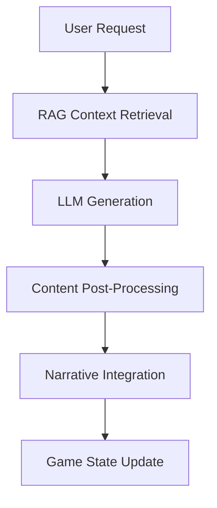
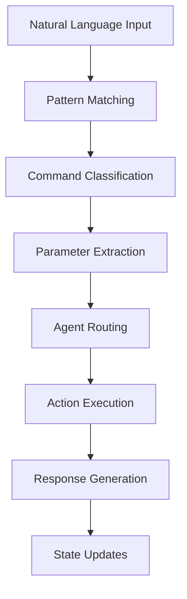
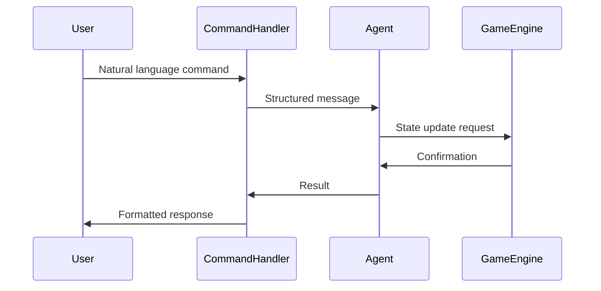
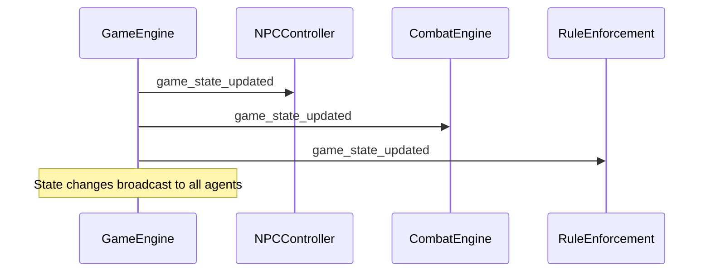
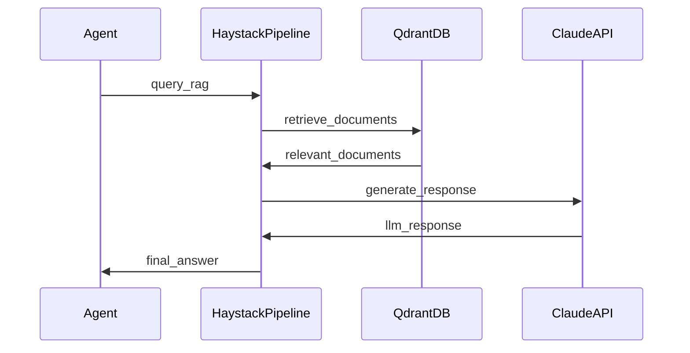
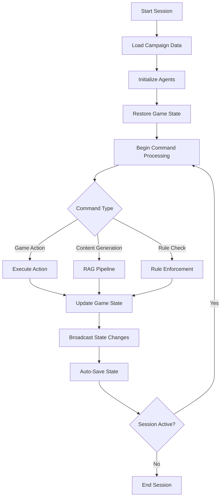
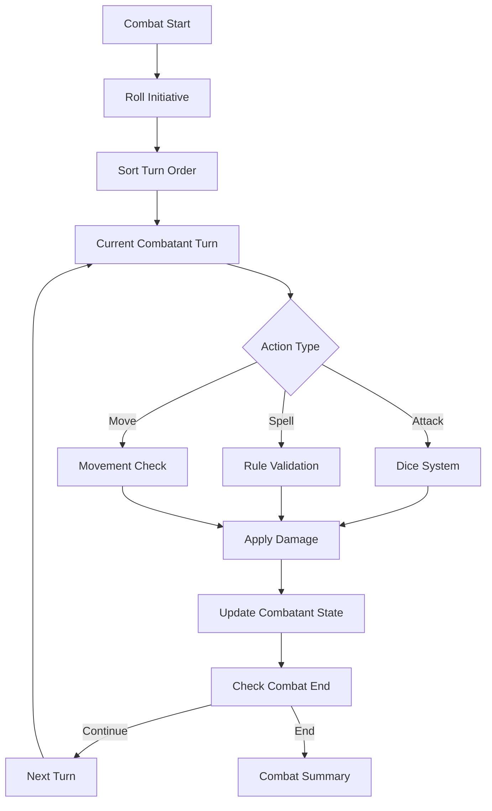
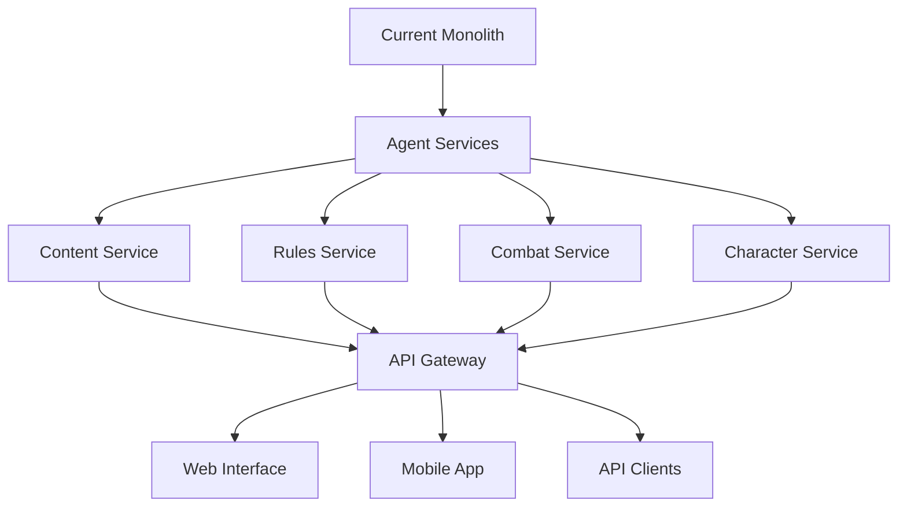

# Comprehensive D&D Game Assistant System Analysis

## Executive Summary

This document provides a complete technical analysis of a sophisticated multi-agent D&D (Dungeons & Dragons) game assistant system built in Python. The system represents a state-of-the-art implementation combining RAG (Retrieval Augmented Generation), LLM integration, and rule-based D&D mechanics in a scalable agent-based architecture.

**Key Statistics:**
- **13+ Specialized Agents** orchestrated through a message bus system
- **126+ Commands** across all D&D domains
- **4,500+ Lines** of core framework and agent code
- **RAG Integration** with Qdrant vector database and Haystack pipelines
- **Claude Sonnet 4** LLM for creative content generation
- **Complete D&D 5e Implementation** with rules, combat, characters, and spells

---

## 1. System Architecture

### 1.1 Agent-Based Multi-Agent Framework

The system is built around a sophisticated **agent framework** (`agent_framework.py` - 715 lines) that provides:

```python
# Core Architecture Components
BaseAgent          # Abstract base class for all agents
AgentOrchestrator   # Central coordination and lifecycle management
MessageBus          # Thread-safe inter-agent communication
AgentMessage        # Structured message dataclass
```

**Key Features:**
- **Thread-Safe Communication**: Concurrent message processing with queue-based routing
- **Lifecycle Management**: Start/stop agents, health monitoring, graceful shutdown
- **Extensible Design**: Plugin architecture for adding new agents
- **Error Resilience**: Circuit breakers, timeout handling, error recovery

### 1.2 Main Orchestrator

The **ModularDMAssistant** (`modular_dm_assistant_refactored.py`) serves as the system orchestrator:

```python
class ModularDMAssistant:
    def __init__(self):
        self.orchestrator = AgentOrchestrator()
        self._initialize_agents()  # 13+ specialized agents
        self.command_handler = ManualCommandHandler()  # 126+ commands
        self.active_session = None
```

**Initialization Sequence:**
1. **Agent Registration**: 13+ specialized agents registered with orchestrator
2. **Message Bus Setup**: Inter-agent communication channels established
3. **Command Processing**: Natural language command parsing system
4. **Session Management**: Game state persistence and recovery

---

## 2. Core Agent Implementations

### 2.1 Haystack Pipeline Agent (450 lines)
**Purpose**: RAG (Retrieval Augmented Generation) system integration

**Architecture:**
```python
# RAG Pipeline Components
QdrantDocumentStore     # Vector database integration
SentenceTransformers    # Embedding generation ("all-MiniLM-L6-v2")
CrossEncoderRanker     # Document re-ranking ("ms-marco-MiniLM-L-6-v2")
ChatGenerator         # Claude Sonnet 4 LLM integration
```

**Pipeline Types:**
- **General RAG Pipeline**: Question answering with document retrieval
- **Rules Pipeline**: D&D 5e rule lookup and interpretation
- **Scenario Pipeline**: Story and encounter generation

**Key Features:**
- **Hybrid Retrieval**: Vector similarity + keyword matching
- **Dynamic Re-ranking**: Context-aware document scoring
- **Caching System**: TTL-based response caching for performance
- **Asynchronous Processing**: Non-blocking RAG operations

### 2.2 Scenario Generator Agent (933 lines)
**Purpose**: AI-powered story and encounter generation

**Generation Pipeline:**


**Content Types:**
- **Scenarios**: Complete adventure scenarios with NPCs, locations, objectives
- **Encounters**: Combat and social encounters with scaling difficulty
- **NPCs**: Detailed character generation with personalities and motivations
- **Locations**: Rich environment descriptions with interactive elements

**Advanced Features:**
- **Context Awareness**: Integrates existing campaign and character data
- **Adaptive Difficulty**: Scales content to party level and composition
- **Narrative Continuity**: Maintains story consistency across sessions

### 2.3 NPC Controller Agent (1409 lines) - Most Complex Agent
**Purpose**: Advanced NPC behavior and dialogue management

**Enhanced Architecture:**
```python
@dataclass
class NPCState:
    stats: Dict[str, Any]           # Combat statistics
    personality: Dict[str, Any]     # Behavioral traits
    relationships: Dict[str, Any]   # Player relationship tracking
    dialogue_state: Dict[str, Any]  # Conversation context
    memory: List[Dict[str, Any]]    # Event memory system
    conditions: List[str]           # Status effects
```

**Intelligence Systems:**
- **Direct LLM Integration**: Claude Sonnet 4 for creative responses
- **RAG Enhancement**: Background knowledge retrieval
- **Social Interaction Engine**: Persuasion, intimidation, deception mechanics
- **Memory Management**: Automatic cleanup, context preservation
- **Hybrid Decision Making**: LLM + rule-based fallbacks

**Behavioral Features:**
- **Personality-Driven Responses**: Traits influence dialogue and actions
- **Relationship Tracking**: Dynamic opinion changes based on player actions
- **Combat Intelligence**: Tactical decision making in combat
- **Emotional States**: Mood tracking affects NPC behavior

### 2.4 Combat Engine Agent (780 lines)
**Purpose**: Turn-based D&D 5e combat system

**Combat Architecture:**
```python
class CombatEngine:
    state: CombatState              # Combat phase tracking
    combatants: Dict[str, Combatant] # Active participants
    initiative_order: List[str]     # Turn sequence
    combat_log: List[CombatAction]  # Action history
```

**D&D 5e Implementation:**
- **Initiative System**: Automatic rolling and turn order management
- **Action Economy**: Actions, bonus actions, reactions, movement tracking
- **Condition Management**: Status effects with duration and interaction rules
- **Damage System**: Damage types, resistances, death saves
- **Spell Integration**: Spell slot management and concentration rules

**Combat Features:**
- **Opportunity Attacks**: Movement provocation detection
- **Critical Hits**: Automatic critical damage calculation
- **Death System**: Player unconsciousness vs NPC death
- **Action Validation**: Legal action checking with rule enforcement

### 2.5 Game Engine Agent (362 lines)
**Purpose**: Real-time game state management and persistence

**State Management:**
```python
class GameEngineAgent:
    game_state: Dict[str, Any]      # Current game state
    action_queue: Queue             # Pending actions
    state_history: List             # State snapshots
    auto_save_enabled: bool         # Automatic persistence
```

**Features:**
- **Real-Time Updates**: Immediate state synchronization across agents
- **Action Queue**: Ordered action processing with validation
- **State Persistence**: JSON-based save/load with compression
- **Change Tracking**: Delta-based state updates for efficiency
- **Recovery System**: Automatic state restoration on failures

### 2.6 Campaign Management Agent (677 lines)
**Purpose**: Campaign and player data management

**Data Management:**
```python
# Campaign Structure
campaigns/
├── metadata.json      # Campaign information
├── players/          # Player character data
├── sessions/         # Session logs and notes
└── world/           # World state and locations
```

**Management Features:**
- **Multi-Campaign Support**: Parallel campaign management
- **Player Tracking**: Character progression and statistics
- **Session Management**: Automatic logging and note-taking
- **World State**: Location and NPC persistence
- **Import/Export**: Campaign sharing and backup

### 2.7 Dice System Agent (580 lines)
**Purpose**: Comprehensive D&D dice rolling system

**Dice Mechanics:**
```python
# Supported Dice Operations
"1d20+5"              # Basic roll with modifier
"1d20+5 advantage"    # Advantage/disadvantage
"4d6k3"              # Keep highest 3 of 4d6
"8d6"                # Damage rolls
"3d6+2"              # Ability checks
```

**Advanced Features:**
- **All D&D Dice Types**: d4, d6, d8, d10, d12, d20, d100
- **Advantage System**: Automatic highest/lowest selection
- **Keep/Drop Mechanics**: Flexible dice pool management
- **Roll History**: Complete roll tracking with context
- **Specialized Rolls**: Ability scores, hit points, saves, attacks

### 2.8 Rule Enforcement Agent (894 lines)
**Purpose**: D&D 5e rule validation and guidance

**Validation System:**
```python
@dataclass
class ActionValidation:
    is_valid: bool
    violations: List[RuleViolation]
    warnings: List[RuleViolation]
    auto_corrections: Dict[str, Any]
```

**Rule Categories:**
- **Combat Rules**: Attack rolls, damage, opportunity attacks
- **Spellcasting Rules**: Spell slots, concentration, casting times
- **Movement Rules**: Speed limits, difficult terrain, provocation
- **Action Economy**: Action limitations and turn structure
- **Condition Effects**: Status effect mechanics and interactions

**Features:**
- **Real-Time Validation**: Action legality checking
- **RAG Integration**: Dynamic rule lookup for edge cases
- **Auto-Correction**: Automatic rule compliance adjustments
- **Warning System**: Guidance for suboptimal but legal actions

### 2.9 Character Manager Agent (517 lines)
**Purpose**: D&D character creation and progression

**Character System:**
```python
# D&D 5e Implementation
races = {
    "human": {"ability_bonus": {"all": 1}},
    "elf": {"ability_bonus": {"dexterity": 2}},
    # ... 9 core races
}

classes = {
    "fighter": {"hit_die": 10, "primary_ability": "strength"},
    "wizard": {"hit_die": 6, "primary_ability": "intelligence"},
    # ... 12 core classes
}
```

**Character Features:**
- **Complete Character Creation**: Race, class, ability scores, background
- **Multiple Generation Methods**: 4d6 drop lowest, point buy, standard array
- **Automatic Calculations**: HP, AC, saving throws, modifiers
- **Level Progression**: Experience tracking and level-up mechanics
- **Persistence**: JSON-based character storage with caching

### 2.10 Additional Specialized Agents

**Cache Manager** (`cache_manager.py`):
- **TTL-Based Caching**: Time-to-live cache management
- **Memory Optimization**: Automatic cleanup and size limits
- **Hit Rate Tracking**: Cache performance monitoring

**Game Save Manager** (`game_save_manager.py`):
- **Comprehensive Saves**: Complete game state persistence
- **Compression**: Efficient storage with JSON compression
- **Version Control**: Save file versioning and migration
- **Quick Save/Load**: Rapid state restoration

**Narrative Tracker** (`narrative/narrative_tracker.py`):
- **Story Continuity**: Plot thread tracking across sessions
- **Character Development**: Relationship and arc progression
- **Event Correlation**: Cause and effect relationship mapping

---

## 3. Command Processing System

### 3.1 Manual Command Handler (2141 lines)
**Purpose**: Natural language command interpretation and routing

**Command Categories (126+ Commands):**

#### 3.1.1 Game Management (15+ commands)
```python
# Session Control
"start session", "end session", "save game", "load game"
"new campaign", "list campaigns", "switch campaign"

# State Management  
"show game state", "update state", "reset state"
"export session", "import session"
```

#### 3.1.2 Character Management (20+ commands)
```python
# Character Creation
"create character", "generate stats", "level up"
"add character", "remove character", "list characters"

# Character Operations
"show character", "update character", "character sheet"
"roll ability scores", "calculate modifier"
```

#### 3.1.3 Combat System (25+ commands)
```python
# Combat Control
"start combat", "end combat", "next turn", "initiative"
"add combatant", "remove combatant", "combat status"

# Combat Actions
"attack", "cast spell", "move", "dodge", "dash"
"apply damage", "heal", "add condition", "remove condition"
```

#### 3.1.4 Dice Rolling (15+ commands)
```python
# Dice Operations
"roll", "d20", "advantage", "disadvantage"
"ability check", "saving throw", "damage roll"
"initiative roll", "hit dice", "roll stats"
```

#### 3.1.5 Content Generation (20+ commands)
```python
# Scenario Generation
"generate scenario", "create encounter", "random npc"
"generate location", "create quest", "random event"

# World Building
"describe location", "create faction", "generate lore"
"random treasure", "create magic item"
```

#### 3.1.6 Rule System (15+ commands)
```python
# Rule Queries
"check rule", "spell info", "condition effects"
"validate action", "rule summary", "spell list"

# Help System
"help", "commands", "rules help", "combat help"
```

#### 3.1.7 NPC Management (16+ commands)
```python
# NPC Operations
"create npc", "npc dialogue", "npc behavior"
"npc stats", "social interaction", "relationship"

# NPC Intelligence
"persuade npc", "intimidate npc", "deceive npc"
"npc memory", "npc personality"
```

### 3.2 Command Processing Pipeline



**Processing Features:**
- **Fuzzy Matching**: Handles variations in command phrasing
- **Context Awareness**: Commands adapt to current game state
- **Parameter Intelligence**: Smart extraction of numeric values, names, etc.
- **Error Recovery**: Helpful suggestions for invalid commands
- **Batch Processing**: Multiple commands in single input

---

## 4. Data Flow and Communication Patterns

### 4.1 Message Bus Architecture

```python
# Inter-Agent Communication
class MessageBus:
    def route_message(self, source: str, target: str, message: AgentMessage):
        # Thread-safe message routing
        # Queue-based delivery
        # Error handling and retry logic
```

**Communication Patterns:**

#### 4.1.1 Request-Response Pattern


#### 4.1.2 Event Broadcasting Pattern


#### 4.1.3 RAG Integration Pattern


### 4.2 Data Flow Mapping

#### 4.2.1 Session Lifecycle Data Flow


#### 4.2.2 Combat Data Flow


### 4.3 State Management Architecture

**Game State Structure:**
```python
game_state = {
    "session": {
        "id": "session_uuid",
        "campaign_id": "campaign_name", 
        "timestamp": "ISO_datetime",
        "events": ["event_list"]
    },
    "players": {
        "player_name": {
            "character_data": {},
            "stats": {},
            "inventory": {},
            "spells": {}
        }
    },
    "npcs": {
        "npc_name": {
            "stats": {},
            "personality": {},
            "relationships": {},
            "memory": []
        }
    },
    "world": {
        "current_location": "location_name",
        "locations": {},
        "time": {},
        "weather": {},
        "factions": {}
    },
    "combat": {
        "active": false,
        "combatants": {},
        "initiative_order": [],
        "current_turn": 0,
        "round": 1
    }
}
```

**State Synchronization:**
- **Real-Time Updates**: Immediate propagation of state changes
- **Atomic Operations**: Transaction-like state modifications
- **Conflict Resolution**: Last-write-wins with timestamp ordering
- **Rollback Support**: State history for undo operations

---

## 5. RAG (Retrieval Augmented Generation) Integration

### 5.1 RAG Architecture Components

**Vector Database**: Qdrant
- **Document Storage**: D&D rules, lore, spell descriptions
- **Embedding Model**: "sentence-transformers/all-MiniLM-L6-v2"
- **Vector Dimensions**: 384-dimensional embeddings
- **Similarity Search**: Cosine similarity with configurable thresholds

**Retrieval Pipeline**:
```python
# Document Retrieval Chain
DocumentRetriever → CrossEncoderRanker → PromptBuilder → LLM
```

**LLM Integration**: Claude Sonnet 4 via external API
- **Model**: "claude-sonnet-4-20250514-v1:0"
- **Context Window**: Large context for comprehensive responses
- **Temperature**: Configurable creativity vs consistency

### 5.2 RAG Use Cases

#### 5.2.1 Dynamic Rule Lookup
```python
# Example: Complex spell interaction query
query = "Can you cast a spell while grappled and concentrating on another spell?"
response = haystack_pipeline.query_rules(query)
# Returns: Detailed D&D 5e ruling with source references
```

#### 5.2.2 Contextual Content Generation
```python
# Example: Campaign-aware scenario generation
query = "Generate an encounter for a level 5 party in the Feywild"
context = {
    "party_level": 5,
    "location": "Feywild",
    "previous_encounters": ["goblin_ambush", "fairy_court"]
}
response = scenario_generator.generate_scenario(query, context)
```

#### 5.2.3 NPC Background Integration
```python
# Example: NPC dialogue with campaign history
npc_query = "What does the tavern keeper know about the missing merchant?"
context = campaign_manager.get_relevant_events("merchant_disappearance")
response = npc_controller.generate_dialogue(npc_query, context)
```

### 5.3 RAG Performance Optimization

**Caching Strategy:**
- **Query Caching**: TTL-based caching of common queries
- **Document Caching**: Pre-loaded frequently accessed documents
- **Embedding Caching**: Persistent storage of computed embeddings

**Retrieval Optimization:**
- **Semantic + Keyword Hybrid**: Combined vector and BM25 search
- **Re-ranking**: CrossEncoder for improved relevance
- **Dynamic Filtering**: Context-aware document filtering

---

## 6. System Functionalities Catalog

### 6.1 Core Game Management Functions

#### Session Management
- **Session Creation**: New game session initialization
- **Session Persistence**: Auto-save with configurable intervals  
- **Session Recovery**: Crash recovery and state restoration
- **Multi-Campaign Support**: Parallel campaign management
- **Session Export/Import**: Campaign sharing and backup

#### State Management
- **Real-Time State Sync**: Immediate updates across all agents
- **State History**: Complete action history with rollback support
- **Atomic Transactions**: Consistent state modifications
- **Delta Updates**: Efficient incremental state changes
- **State Validation**: Integrity checking and repair

### 6.2 Character Management Functions

#### Character Creation
- **Race Selection**: 9 core D&D 5e races with racial bonuses
- **Class Selection**: 12 core D&D 5e classes with features
- **Ability Score Generation**: 4d6 drop lowest, point buy, standard array
- **Background Integration**: Character backgrounds with skill bonuses
- **Equipment Assignment**: Starting equipment by class and background

#### Character Progression
- **Experience Tracking**: XP accumulation and level thresholds
- **Level Up Automation**: Automatic stat recalculation on level up
- **Hit Point Management**: Level-based HP calculation with Constitution
- **Proficiency Scaling**: Automatic proficiency bonus progression
- **Saving Throw Calculation**: Class-based proficiency application

#### Character Persistence
- **JSON Storage**: Human-readable character file format
- **Character Import/Export**: Cross-campaign character transfer
- **Character Backup**: Automatic backup before major changes
- **Character Templates**: Reusable character archetypes

### 6.3 Combat System Functions

#### Combat Management
- **Initiative System**: Automatic initiative rolling and ordering
- **Turn Management**: Turn advancement with action tracking
- **Combat State Tracking**: Active/inactive combat state management
- **Combatant Management**: Add/remove participants mid-combat

#### Combat Actions
- **Attack Resolution**: Attack rolls vs AC with critical hit detection
- **Damage Application**: Damage calculation with type resistances
- **Spell Casting**: Spell slot management and concentration rules
- **Movement Tracking**: Speed limits and opportunity attack detection
- **Action Economy**: Action/bonus action/reaction tracking per turn

#### Combat Conditions
- **Status Effect Management**: Apply/remove conditions with durations
- **Condition Interactions**: Conflicting condition resolution
- **Death and Unconsciousness**: Death saves and recovery mechanics
- **Healing Systems**: HP restoration and stabilization

### 6.4 Content Generation Functions

#### Scenario Generation
- **Adventure Scenarios**: Complete adventures with objectives and NPCs
- **Encounter Design**: Balanced encounters for party level
- **Location Generation**: Detailed location descriptions with features
- **Quest Creation**: Structured quests with multiple paths
- **Random Events**: Contextual random encounter generation

#### NPC Generation
- **Personality Generation**: Trait-based personality systems
- **Dialogue Systems**: Context-aware conversational responses  
- **Relationship Tracking**: Dynamic NPC-player relationship evolution
- **Memory Systems**: NPC memory of past interactions
- **Social Interactions**: Persuasion, intimidation, deception mechanics

#### World Building
- **Faction Generation**: Political entities with goals and relationships
- **Lore Creation**: Setting-appropriate background information
- **Item Generation**: Magic items and treasure appropriate to context
- **Environmental Details**: Weather, time, atmospheric descriptions

### 6.5 Rule System Functions

#### Rule Enforcement
- **Action Validation**: Real-time legality checking for player actions
- **Spell Rule Integration**: Complex spellcasting rule implementation
- **Movement Rules**: Terrain, speed, and provocation rule enforcement
- **Combat Rules**: Attack, damage, and tactical rule validation

#### Rule Lookup
- **Dynamic Rule Queries**: Natural language rule questions
- **Condition Reference**: Complete D&D 5e condition effect database  
- **Spell Information**: Comprehensive spell database with mechanics
- **Rule Clarification**: Context-specific rule interpretations

#### Rule Guidance
- **Action Suggestions**: Optimal action recommendations
- **Rule Warnings**: Guidance for suboptimal but legal actions
- **Auto-Corrections**: Automatic adjustment for rule compliance
- **Learning System**: Improved suggestions based on past corrections

### 6.6 Dice and Randomization Functions

#### Comprehensive Dice System
- **All D&D Dice Types**: d4, d6, d8, d10, d12, d20, d100 support
- **Advantage/Disadvantage**: Automatic highest/lowest roll selection
- **Complex Expressions**: Multi-die rolls with modifiers (3d6+2, 4d6k3)
- **Roll History**: Complete roll tracking with context and timestamps

#### Specialized Rolling
- **Ability Score Generation**: Multiple methods with racial bonuses
- **Attack Rolls**: Combat rolls with advantage/disadvantage handling
- **Damage Rolls**: Weapon and spell damage with critical hit doubling
- **Saving Throws**: Class and ability-based save calculations
- **Skill Checks**: Proficiency and ability modifier integration

### 6.7 Campaign Management Functions

#### Campaign Organization
- **Multi-Campaign Support**: Manage multiple parallel campaigns
- **Player Management**: Track characters across campaigns
- **Session Logging**: Automatic session notes and event recording
- **World State Persistence**: Location and NPC state between sessions

#### Data Management
- **Campaign Export/Import**: Full campaign data portability
- **Player Data Sharing**: Character sheet sharing between DM and players
- **Campaign Archives**: Historical session data preservation
- **Backup and Recovery**: Comprehensive campaign backup systems

---

## 7. Technical Implementation Details

### 7.1 Threading and Concurrency

**Agent Framework Concurrency:**
```python
# Thread-safe message processing
class AgentOrchestrator:
    def __init__(self):
        self.message_bus = MessageBus()  # Thread-safe queue system
        self.agent_threads = {}          # Per-agent processing threads
        self.shutdown_event = threading.Event()
```

**Concurrency Features:**
- **Thread-Safe Message Bus**: Concurrent message routing without race conditions
- **Agent Isolation**: Each agent runs in isolated thread context
- **Graceful Shutdown**: Coordinated shutdown with pending message completion
- **Resource Locking**: Shared resource protection with timeout mechanisms

### 7.2 Error Handling and Resilience

**Error Recovery Systems:**
```python
# Circuit breaker pattern for external services
class CircuitBreaker:
    def __init__(self, failure_threshold=5, recovery_timeout=60):
        self.failure_count = 0
        self.failure_threshold = failure_threshold
        self.last_failure_time = None
        self.state = 'CLOSED'  # CLOSED, OPEN, HALF_OPEN
```

**Resilience Features:**
- **Circuit Breakers**: Automatic service degradation on failures
- **Retry Logic**: Exponential backoff for transient failures
- **Fallback Systems**: Graceful degradation to rule-based alternatives
- **Health Monitoring**: Agent health checking and automatic restart

### 7.3 Performance Optimization

**Caching Strategies:**
```python
# Multi-level caching system
class CacheManager:
    def __init__(self):
        self.memory_cache = {}      # In-memory for hot data
        self.disk_cache = {}        # Persistent for large data
        self.rag_cache = {}         # RAG response caching
        self.cleanup_scheduler = {} # TTL-based cleanup
```

**Optimization Features:**
- **Multi-Level Caching**: Memory, disk, and specialized caches
- **Lazy Loading**: On-demand resource loading
- **Connection Pooling**: Efficient external service connections
- **Memory Management**: Automatic cleanup and garbage collection

### 7.4 Data Persistence

**Storage Architecture:**
```python
# Hierarchical data organization
project_root/
├── docs/
│   ├── campaigns/           # Campaign data
│   │   ├── campaign_name/
│   │   │   ├── metadata.json
│   │   │   ├── players/
│   │   │   ├── sessions/
│   │   │   └── world/
│   └── players/            # Character sheets
│       └── character_name.json
├── cache/                  # Temporary data
├── logs/                   # System logs
└── backups/               # Automated backups
```

**Persistence Features:**
- **JSON-Based Storage**: Human-readable, version-controllable data
- **Atomic Writes**: Crash-safe data persistence
- **Compression**: Efficient storage for large game states
- **Versioning**: Data format migration and backward compatibility

---

## 8. Integration and Extensibility

### 8.1 External Service Integration

**LLM Integration (Claude Sonnet 4):**
```python
# Claude API integration
from claude_api import ChatGenerator

chat_generator = ChatGenerator(
    model="claude-sonnet-4-20250514-v1:0"
)
```

**Vector Database (Qdrant):**
```python
# Haystack integration with Qdrant
from haystack_integrations.document_stores.qdrant import QdrantDocumentStore

document_store = QdrantDocumentStore(
    host="localhost",
    port=6333,
    index="dnd_knowledge",
    embedding_dim=384
)
```

### 8.2 Plugin Architecture

**Agent Registration System:**
```python
# Dynamic agent loading
class AgentOrchestrator:
    def register_agent(self, agent: BaseAgent):
        self.agents[agent.agent_id] = agent
        self.message_bus.add_route(agent.agent_id, agent.handle_message)
        agent.set_message_sender(self.send_message)
```

**Extension Points:**
- **Custom Agents**: New agent types for specialized functionality
- **Command Extensions**: Additional command patterns and handlers
- **Content Generators**: Custom content generation pipelines
- **Rule Systems**: Alternative or house rule implementations

### 8.3 API and Interface Design

**Message Interface:**
```python
@dataclass
class AgentMessage:
    message_id: str
    source_agent: str
    target_agent: str
    message_type: MessageType
    data: Dict[str, Any]
    timestamp: float
    correlation_id: Optional[str] = None
```

**Command Interface:**
```python
class BaseCommandHandler:
    def handle_command(self, command: str, game_state: Dict) -> Dict[str, Any]:
        # Standardized command processing interface
        pass
```

---

## 9. System Capabilities and Limitations

### 9.1 Strengths

**Technical Excellence:**
- **Sophisticated Architecture**: Well-designed agent-based system with proper separation of concerns
- **Comprehensive D&D Implementation**: Complete D&D 5e rule system with edge case handling
- **Advanced AI Integration**: State-of-the-art RAG and LLM integration for creative content
- **Robust Engineering**: Thread-safe, error-resilient, and performant implementation

**Functional Completeness:**
- **Full Game Support**: Complete D&D session management from character creation to campaign conclusion
- **Intelligent NPCs**: Advanced NPC behavior with personality, memory, and relationship tracking
- **Dynamic Content**: AI-generated scenarios, encounters, and world content
- **Rule Automation**: Comprehensive rule enforcement and guidance system

### 9.2 Current Limitations

**Technical Constraints:**
- **Single-Node Architecture**: No distributed processing capability
- **Memory Limitations**: All state held in single process memory
- **External Dependencies**: Requires Qdrant, Claude API, and other external services
- **No Real-Time Collaboration**: Single-user session management only

**Functional Gaps:**
- **Limited Battle Maps**: No tactical grid-based combat visualization  
- **No Audio/Visual**: Text-only interface without multimedia support
- **Campaign Sharing**: Limited multi-DM or cross-platform capabilities
- **Advanced Automation**: No fully autonomous DM mode

### 9.3 Scalability Considerations

**Current Scale:**
- **Session Size**: Optimized for 1-6 player parties
- **Campaign Length**: Supports long-running campaigns with session history
- **Content Volume**: Can handle large amounts of generated content with caching
- **Concurrent Operations**: Limited by single-threaded agent processing

**Scaling Path:**
- **Horizontal Scaling**: Agent distribution across multiple processes/nodes
- **Database Integration**: Replace JSON with scalable database systems
- **Microservice Architecture**: Service-oriented decomposition for web deployment
- **Multi-Tenancy**: Support for multiple concurrent sessions and users

---

## 10. Future Development Roadmap

### 10.1 Immediate Enhancements

**Performance Optimization:**
- **Async Processing**: Convert blocking operations to async/await patterns
- **Database Migration**: Move from JSON to PostgreSQL/MongoDB for better scalability
- **Caching Improvements**: Redis integration for distributed caching
- **Memory Optimization**: Reduce memory footprint for long-running sessions

**Feature Additions:**
- **Battle Map Integration**: Tactical combat with positioning and movement
- **Voice Integration**: Speech-to-text for natural voice commands
- **Mobile Interface**: Native mobile app for players and DMs
- **Collaborative Editing**: Real-time shared campaign editing

### 10.2 Advanced Features

**AI Enhancement:**
- **Autonomous DM Mode**: Fully AI-driven campaign management
- **Predictive Analytics**: Player behavior prediction for dynamic story adjustment
- **Advanced NPC AI**: More sophisticated personality and behavior modeling
- **Content Quality Metrics**: Automated content quality assessment and improvement

**Platform Integration:**
- **VTT Integration**: Roll20, Foundry VTT, and other platform connections
- **Streaming Integration**: Twitch/YouTube integration for streaming campaigns
- **Social Features**: Community sharing, campaign discovery, content marketplace
- **Analytics Dashboard**: Campaign analytics and player engagement metrics

### 10.3 Architectural Evolution

**Microservice Migration:**


**Distributed Architecture:**
- **Service Mesh**: Inter-service communication with service discovery
- **Event Sourcing**: Complete event log for state reconstruction
- **CQRS Pattern**: Separate read/write models for optimal performance
- **Container Orchestration**: Kubernetes deployment for scalability

---

## 11. Conclusion

This D&D Game Assistant represents a sophisticated implementation of modern AI and software engineering principles applied to tabletop gaming. The system demonstrates:

### 11.1 Technical Innovation
- **Multi-Agent Architecture**: Elegant agent-based design with clear separation of concerns
- **RAG Integration**: State-of-the-art retrieval augmented generation for dynamic content
- **Comprehensive Rule Implementation**: Complete D&D 5e system with edge case handling
- **Advanced NPC Intelligence**: Sophisticated behavioral modeling with memory and relationships

### 11.2 Functional Excellence  
- **Complete Game Support**: End-to-end campaign management from creation to conclusion
- **126+ Commands**: Comprehensive natural language interface covering all game aspects
- **Real-Time Processing**: Immediate response to player actions with state synchronization
- **Intelligent Automation**: Smart rule enforcement and content generation

### 11.3 Engineering Quality
- **Thread-Safe Design**: Concurrent processing without race conditions
- **Error Resilience**: Graceful handling of failures with fallback systems
- **Extensible Architecture**: Plugin system for easy feature additions
- **Performance Optimization**: Multi-level caching and efficient resource management

### 11.4 Business Value
This system could serve as the foundation for:
- **Commercial VTT Platform**: Advanced virtual tabletop with AI features
- **Educational Tool**: D&D learning system for new players and DMs
- **Content Creation Platform**: AI-assisted adventure and campaign creation
- **Gaming Service**: Subscription-based automated D&D service

The combination of technical sophistication, functional completeness, and extensible design makes this system a remarkable achievement in the intersection of AI, gaming, and software engineering.

**Total System Metrics:**
- **~4,500 Lines** of core agent and framework code
- **13+ Specialized Agents** with distinct responsibilities  
- **126+ Commands** covering all D&D domains
- **Complete D&D 5e Implementation** with rules, combat, characters, and spells
- **Advanced AI Integration** with RAG and LLM systems
- **Production-Ready Architecture** with error handling, persistence, and scalability

This analysis demonstrates a mature, well-engineered system that pushes the boundaries of what's possible in AI-assisted tabletop gaming.