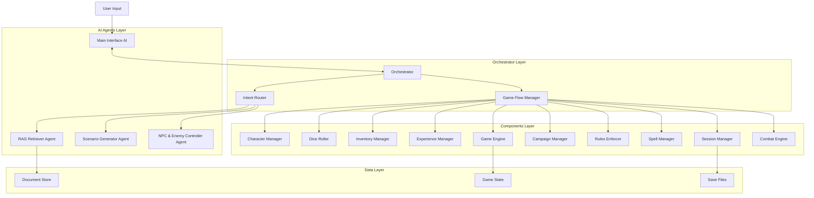

# D&D Game Assistant Architecture Plan
*Clean 4-Agent Architecture with Haystack Framework*

## Vision Overview

A streamlined D&D game assistant focused on core gameplay mechanics:
- **4 AI Agents** for creative/intelligent tasks
- **Deterministic Components** for game mechanics  
- **Orchestrator** for routing and coordination
- **Progressive game flow** from campaign selection to adventures

---

## Core Architecture



---

## Agent Specifications

### 1. Main Interface AI Agent
**Purpose**: User interaction and intent understanding

```python
class MainInterfaceAgent:
    def parse_user_intent(self, user_input: str) -> IntentResult:
        # Analyze user input and determine intent
        # Returns: action_type, parameters, confidence
        
    def generate_response(self, game_result: dict) -> str:
        # Convert game results into natural language response
        # Includes narrative flourish and game state updates
        
    def handle_clarification(self, ambiguous_input: str) -> str:
        # Ask clarifying questions when intent is unclear
```

**Haystack Integration**: Uses chat generators for natural language understanding and generation

### 2. RAG Retriever Agent  
**Purpose**: Document retrieval and knowledge queries

```python
class RAGRetrieverAgent:
    def retrieve_context(self, query: str, context_type: str) -> List[Document]:
        # Get relevant documents for scenario generation
        # context_type: "campaign", "rules", "monsters", "spells"
        
    def answer_query(self, question: str) -> str:
        # Direct question answering from documents
        # For rule clarifications, monster stats, etc.
```

**Haystack Integration**: 
- Document stores (Qdrant/InMemory)
- Embedding retrievers
- Answer generation pipelines

### 3. Scenario Generator Agent
**Purpose**: Create engaging scenarios with player choices

```python
class ScenarioGeneratorAgent:
    def generate_scenario(self, context: ScenarioContext) -> Scenario:
        # Create scenario based on:
        # - Campaign context (from RAG)
        # - Previous choices and outcomes
        # - Current difficulty level
        # Returns: narrative, 3-4 choice options
        
    def generate_consequence(self, choice: PlayerChoice, skill_result: SkillResult) -> Scenario:
        # Create follow-up scenario based on player choice
        # Adjust difficulty based on success/failure
```

**Haystack Integration**: Chat generators with RAG-enhanced prompts

### 4. NPC & Enemy Controller Agent
**Purpose**: Roleplay NPCs and control enemies

```python
class NPCControllerAgent:
    def generate_npc_dialogue(self, npc_context: dict, player_input: str) -> str:
        # Generate contextual NPC responses
        
    def generate_enemy_actions(self, combat_state: dict) -> List[Action]:
        # Decide enemy actions in combat
        # Returns structured actions for Combat Engine
        
    def update_npc_attitudes(self, interaction_result: dict):
        # Track relationship changes with NPCs
```

**Haystack Integration**: Chat generators with character-specific prompts

---

## Component Specifications

### Character Manager
```python
class CharacterManager:
    def create_character(self, char_data: dict) -> Character
    def update_stats(self, char_id: str, updates: dict)
    def get_character(self, char_id: str) -> Character
    def calculate_modifiers(self, char_id: str) -> dict
    def apply_condition(self, char_id: str, condition: str)
```

### Dice Roller
```python
class DiceRoller:
    def roll(self, expression: str) -> RollResult
    def skill_check(self, char_id: str, skill: str, dc: int) -> CheckResult  
    def attack_roll(self, attacker: str, target: str) -> AttackResult
    def damage_roll(self, weapon: str, crit: bool = False) -> DamageResult
```

### Combat Engine
```python
class CombatEngine:
    def start_combat(self, participants: List[str]) -> CombatState
    def process_turn(self, actor: str, action: Action) -> TurnResult
    def check_combat_end(self) -> bool
    def calculate_initiative(self) -> List[str]
```

### Game Engine
```python
class GameEngine:
    def update_state(self, changes: dict)
    def get_current_state(self) -> GameState
    def process_skill_check(self, check_data: dict) -> SkillResult
    def advance_story(self, choice: PlayerChoice)
```

---

## Game Flow Implementation

### 1. Campaign Selection Flow
```python
def start_new_game():
    # 1. Campaign Manager lists available campaigns
    campaigns = campaign_manager.list_campaigns()
    
    # 2. Interface AI presents options to user
    response = interface_ai.present_campaigns(campaigns) 
    
    # 3. User selects campaign
    selection = interface_ai.parse_selection(user_input)
    
    # 4. Load campaign context via RAG
    context = rag_agent.retrieve_context(selection, "campaign")
    
    # 5. Generate opening scenario
    scenario = scenario_agent.generate_scenario(context)
    
    return scenario
```

### 2. Choice Resolution Flow
```python
def process_player_choice(choice: PlayerChoice):
    # 1. Determine if skill check needed
    check_needed = rules_enforcer.requires_skill_check(choice)
    
    if check_needed:
        # 2. Execute skill check
        result = dice_roller.skill_check(
            char_id=choice.character,
            skill=choice.skill_type, 
            dc=choice.difficulty
        )
        
        # 3. Update difficulty for next scenario
        game_engine.adjust_difficulty(result.success)
        
        # 4. Generate consequence scenario
        consequence = scenario_agent.generate_consequence(choice, result)
    else:
        # Direct consequence without skill check
        consequence = scenario_agent.generate_consequence(choice, None)
    
    # 5. Check if combat triggered
    if consequence.triggers_combat:
        return start_combat_encounter(consequence)
    
    return consequence
```

### 3. Combat Flow
```python
def process_combat_round(combat_state: CombatState):
    current_actor = combat_state.current_turn
    
    if current_actor.is_player:
        # Wait for player input
        action = interface_ai.parse_combat_action(user_input)
    else:
        # NPC/Enemy turn
        action = npc_agent.generate_enemy_actions(combat_state)[0]
    
    # Execute action through combat engine
    result = combat_engine.process_turn(current_actor.id, action)
    
    # Update game state
    game_engine.update_state(result.state_changes)
    
    # Check combat end
    if combat_engine.check_combat_end():
        return end_combat(combat_state)
    
    return advance_initiative(combat_state)
```

---

## Haystack Framework Integration

### Pipeline Architecture

```python
# RAG Pipeline for Context Retrieval
retrieval_pipeline = Pipeline()
retrieval_pipeline.add_component("embedder", SentenceTransformersTextEmbedder())
retrieval_pipeline.add_component("retriever", QdrantEmbeddingRetriever(document_store))
retrieval_pipeline.add_component("prompt_builder", PromptBuilder(template=context_template))

# Scenario Generation Pipeline  
scenario_pipeline = Pipeline()
scenario_pipeline.add_component("context_retriever", retrieval_pipeline)
scenario_pipeline.add_component("prompt_builder", PromptBuilder(template=scenario_template))
scenario_pipeline.add_component("generator", OpenAIChatGenerator())

# NPC Dialogue Pipeline
npc_pipeline = Pipeline()
npc_pipeline.add_component("character_retriever", retrieval_pipeline) 
npc_pipeline.add_component("prompt_builder", PromptBuilder(template=npc_template))
npc_pipeline.add_component("generator", OpenAIChatGenerator())
```

### Document Store Structure
```
campaigns/
├── forgotten_realms/
│   ├── overview.md
│   ├── locations.md
│   ├── npcs.md
│   └── quests.md
├── strahd/
│   └── ...
rules/
├── combat.md
├── spells.md
├── conditions.md 
└── skills.md
monsters/
├── basic_monsters.md
├── boss_monsters.md
└── monster_abilities.md
```

---

## Implementation Phases

### Phase 1: Core Game Loop (4-6 weeks)
**Goal**: Basic playable game with scenario generation

#### Week 1-2: Foundation
- [ ] Set up Haystack document store with basic D&D content
- [ ] Implement basic RAG Retriever Agent
- [ ] Create simple Main Interface Agent
- [ ] Build basic Orchestrator routing

#### Week 3-4: Scenario Generation  
- [ ] Implement Scenario Generator Agent with choice options
- [ ] Create basic Game Engine for state management
- [ ] Add Campaign Manager for campaign selection
- [ ] Build simple Dice Roller for skill checks

#### Week 5-6: Choice Processing
- [ ] Add Rules Enforcer for skill check determination
- [ ] Implement difficulty scaling based on success/failure
- [ ] Create consequence generation system
- [ ] Add basic save/load functionality

**Phase 1 Success Criteria**:
- User can select campaign and get opening scenario
- Scenario presents 3-4 meaningful choices
- Player choices trigger appropriate skill checks
- Success/failure affects subsequent scenario difficulty
- Game state persists between sessions

### Phase 2: Combat System (3-4 weeks)
**Goal**: Full D&D combat with NPCs and enemies

#### Week 7-8: Combat Engine
- [ ] Implement Combat Engine with initiative, turns, actions
- [ ] Add Character Manager with full stat tracking
- [ ] Create NPC & Enemy Controller Agent
- [ ] Build combat action processing

#### Week 9-10: Combat Integration
- [ ] Integrate combat triggers into scenario flow
- [ ] Add enemy AI decision making
- [ ] Implement damage, healing, conditions
- [ ] Create post-combat rewards (XP, loot)

**Phase 2 Success Criteria**:
- Combat scenarios trigger from story choices
- Turn-based combat follows D&D 5e rules
- Enemies make intelligent combat decisions
- Players gain XP and loot after combat

### Phase 3: Advanced Features (4-5 weeks)
**Goal**: Rich D&D experience with full feature set

#### Week 11-12: Character Progression
- [ ] Add Experience Manager with leveling
- [ ] Implement Spell Manager for spellcasters  
- [ ] Create Inventory Manager with equipment
- [ ] Add character advancement choices

#### Week 13-14: Social & Exploration
- [ ] Enhance NPC dialogue and relationships
- [ ] Add exploration mechanics
- [ ] Implement more complex skill challenges
- [ ] Create side quest generation

#### Week 15: Polish & Testing
- [ ] Comprehensive testing of all systems
- [ ] Performance optimization
- [ ] User experience improvements
- [ ] Documentation and deployment

**Phase 3 Success Criteria**:
- Characters level up and gain new abilities
- Rich NPC interactions with persistent relationships  
- Inventory and equipment system functional
- Multiple quest types and exploration options

---

## Data Models

### Core Data Structures

```python
@dataclass
class Scenario:
    id: str
    title: str
    description: str
    choices: List[Choice]
    context: dict
    triggers_combat: bool = False
    difficulty_modifier: int = 0

@dataclass  
class Choice:
    id: str
    description: str
    skill_required: Optional[str] = None
    dc: Optional[int] = None
    leads_to_combat: bool = False
    narrative_consequence: str = ""

@dataclass
class Character:
    id: str
    name: str
    level: int
    ability_scores: dict  # STR, DEX, CON, INT, WIS, CHA
    skills: dict
    hp: int
    max_hp: int
    armor_class: int
    conditions: List[str]
    inventory: List[Item]
    
@dataclass
class GameState:
    current_scenario: Optional[Scenario]
    characters: List[Character] 
    campaign: str
    session_id: str
    story_history: List[dict]
    difficulty_level: int = 0  # Adjusts based on success/failure
    current_location: str = ""
    active_quests: List[Quest] = field(default_factory=list)
```

---

## Configuration & Extensibility

### Modular Configuration
```yaml
# config/game_config.yaml
agents:
  interface_ai:
    model: "gpt-4"
    max_tokens: 1000
  scenario_generator:
    model: "gpt-4"
    creativity: 0.8
  npc_controller:
    model: "gpt-3.5-turbo"
    personality_consistency: true

components:
  dice_roller:
    advantage_system: true
    critical_range: [20]
  combat_engine:
    initiative_ties: "dexterity"
    death_saves: true
    
difficulty:
  base_dc: 15
  scaling_factor: 2
  max_adjustment: 5
```

### Plugin Architecture
```python
# plugins/custom_campaign.py
class CustomCampaignPlugin:
    def register_documents(self) -> List[Document]:
        # Add custom campaign documents
        
    def register_scenarios(self) -> List[ScenarioTemplate]:
        # Add custom scenario templates
        
    def register_npcs(self) -> List[NPCTemplate]:
        # Add custom NPCs
```

---

## Success Metrics & Testing

### Functional Tests
- [ ] Campaign selection loads appropriate context
- [ ] Scenarios generate with consistent quality
- [ ] Skill checks follow D&D 5e rules correctly
- [ ] Combat system handles all basic actions
- [ ] Character progression works accurately
- [ ] Save/load preserves all game state

### Performance Targets
- [ ] Scenario generation: < 3 seconds
- [ ] RAG retrieval: < 1 second  
- [ ] Combat action processing: < 500ms
- [ ] Interface response: < 200ms

### User Experience Goals
- [ ] Intuitive command interface
- [ ] Engaging scenario variety
- [ ] Meaningful player choices
- [ ] Smooth combat flow
- [ ] Clear character progression

---

## Deployment Architecture

```
dnd_game/
├── agents/
│   ├── interface_agent.py
│   ├── rag_agent.py
│   ├── scenario_agent.py
│   └── npc_agent.py
├── components/
│   ├── character_manager.py
│   ├── dice_roller.py
│   ├── combat_engine.py
│   ├── game_engine.py
│   └── ... (other components)
├── orchestrator/
│   ├── orchestrator.py
│   ├── intent_router.py
│   └── game_flow_manager.py
├── data/
│   ├── campaigns/
│   ├── rules/
│   └── monsters/
├── config/
│   └── game_config.yaml
├── tests/
└── main.py
```

---

## Conclusion

This architecture provides a clean, focused D&D game assistant that:

1. **Separates AI creativity from deterministic mechanics**
2. **Scales from simple scenarios to complex adventures**  
3. **Maintains true D&D 5e gameplay feel**
4. **Supports easy extension and customization**
5. **Uses Haystack framework effectively for RAG and generation**

The phased implementation ensures a working game early, with rich features added incrementally. The modular design allows easy updates and feature additions as the system matures.