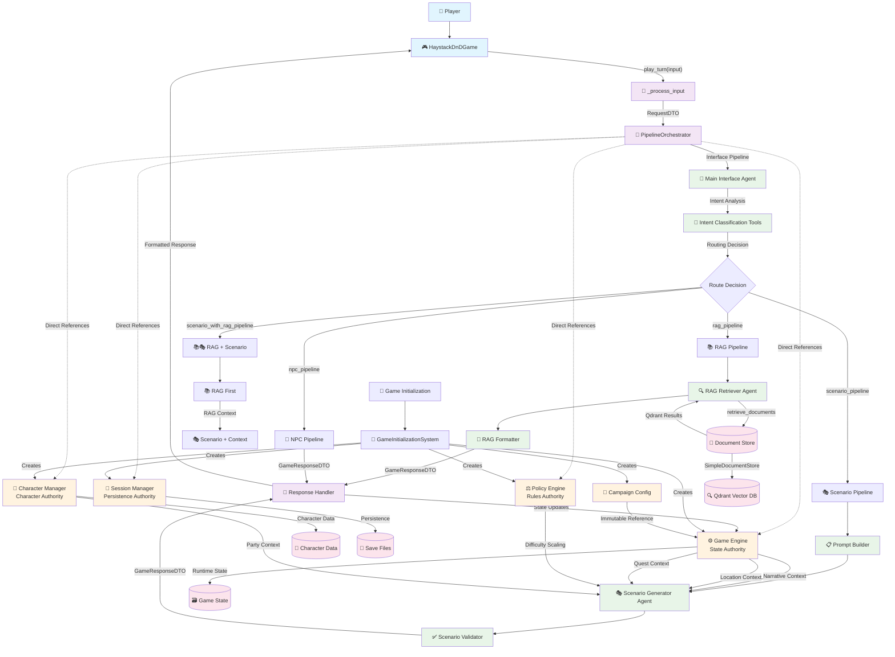

# D&D Game Implementation - Comprehensive Architecture Analysis

## Executive Summary

This report provides a detailed analysis of the Haystack-integrated D&D game implementation found in `haystack_dnd_game.py` and its supporting architecture. The system represents a sophisticated AI-powered tabletop RPG assistant that combines traditional game mechanics with modern AI orchestration patterns through the Haystack framework.

## System Architecture Overview

### Core Architecture Pattern: Orchestrated Component System

The system follows a **Haystack-Integrated Orchestration Pattern** with clear separation of concerns:

1. **Presentation Layer**: [`HaystackDnDGame`](haystack_dnd_game.py:25) class - Main game interface
2. **Orchestration Layer**: [`PipelineOrchestrator`](orchestrator/pipeline_integration.py:64) - Request routing and processing
3. **Agent Layer**: Specialized AI agents for different game functions
4. **Component Layer**: Core game mechanics and state management
5. **Storage Layer**: Document stores and persistence systems

## System Flow Diagram



## Detailed Architecture Analysis

### 1. Main Game Controller - [`HaystackDnDGame`](haystack_dnd_game.py:25)

**Purpose**: Primary interface between the player and the game system.

**Key Responsibilities**:
- Player input processing and validation
- Turn management and game loop coordination
- Response formatting and presentation
- UI state management (current choices, scenarios)
- System command handling (save, load, help, stats)

**Architecture Patterns**:
- **Facade Pattern**: Simplifies complex orchestrator interactions
- **State Management**: Maintains UI-only state (not game state)
- **Command Pattern**: Handles system commands (save, load, help)

**Critical Design Decision - State Separation**:
```python
# UI State (HaystackDnDGame responsibility)
self.current_scenario: Optional[Dict[str, Any]] = None
self.current_choices: List[Dict[str, Any]] = []
self.turn_counter: int = 0

# Game State (GameEngine responsibility) 
# Accessed via: self.game_engine.get_narrative_context()
```

### 2. Orchestration Layer - [`PipelineOrchestrator`](orchestrator/pipeline_integration.py:64)

**Purpose**: Central request routing and pipeline coordination system.

**Key Components**:
- **Pipeline Management**: Creates and manages Haystack pipelines
- **Agent Coordination**: Integrates specialized AI agents
- **Request Routing**: Determines appropriate processing pipeline based on intent
- **Component Integration**: Provides direct access to game components

**Pipeline Architecture**:

#### Interface Processing Pipeline
```python
interface_pipeline.add_component("interface_agent", self.agents["main_interface"])
interface_pipeline.add_component("prompt_builder", ChatPromptBuilder(...))
interface_pipeline.connect("prompt_builder", "interface_agent")
```

#### RAG Pipeline 
```python
rag_pipeline.add_component("retriever_agent", create_rag_retriever_agent_simplified(...))
rag_pipeline.add_component("formatter", RAGFormatterComponent())
rag_pipeline.connect("retriever_agent.messages", "formatter.messages")
```

#### Scenario Generation Pipeline
```python
scenario_pipeline.add_component("prompt_builder", PromptBuilderComponent())
scenario_pipeline.add_component("scenario_agent", create_scenario_generator_agent())
scenario_pipeline.add_component("validator", ScenarioValidatorComponent())
```

**Routing Logic**:
The orchestrator uses a sophisticated routing system based on player intent:

```python
def process_request(self, dto: RequestDTO) -> GameResponseDTO:
    dto_type = dto.get("type", "scenario")
    route = dto.get("route")
    
    if route == "rag_pipeline" or dto_type == "rag_query":
        return self._run_rag_pipeline(dto)
    elif route == "scenario_with_rag_pipeline":
        return self._run_rag_enhanced_scenario_pipeline(dto)
    elif route == "scenario_pipeline" or dto_type == "scenario":
        return self._run_scenario_pipeline(dto)
    # ... additional routing logic
```

### 3. Agent Layer - AI-Powered Game Logic

#### Main Interface Agent - [`create_fixed_interface_agent`](agents/main_interface_agent_fixed.py:314)

**Purpose**: Intelligent player intent classification and routing decisions.

**Key Features**:
- **Two-Step Workflow**: Analysis → Classification → Routing
- **Intent Categories**: Rules lookup, NPC interaction, scenario actions, world lore
- **RAG Decision Logic**: Selective RAG usage based on context sufficiency
- **Confidence Scoring**: Provides confidence metrics for downstream processing

**Tool Architecture**:
```python
record_intent_analysis_tool = Tool(
    name="record_intent_analysis",
    function=record_intent_analysis,
    outputs_to_state={"intent_data": {}}
)

classify_player_intent_tool = Tool(
    name="classify_player_intent", 
    function=classify_player_intent,
    inputs_from_state={"intent_data": "intent_data"},
    outputs_to_state={"interface_result": {}}
)
```

#### Scenario Generator Agent - [`create_scenario_generator_agent`](agents/scenario_generator_agent.py:492)

**Purpose**: Creative scenario generation using comprehensive game context.

**Context Integration Strategy**:
```python
def create_scenario_from_dto(dto: Dict[str, Any]) -> str:
    # Direct engine access (DTO compliance)
    game_engine = dto.get("_game_engine_ref")
    policy_engine = dto.get("_policy_engine_ref")
    
    # Access authoritative state directly
    narrative_context = game_engine.get_narrative_context()
    location_context = game_engine.get_location_context()
    quest_context = game_engine.get_quest_context()
```

**Generation Pipeline**:
1. **Context Extraction**: Retrieves current game state from authoritative sources
2. **Policy Integration**: Applies difficulty scaling and house rules
3. **RAG Integration**: Incorporates retrieved lore and world information
4. **Creative Generation**: Uses LLM to create contextually appropriate scenarios
5. **Validation**: Ensures scenario structure meets game requirements

#### RAG Retriever Agent - [`create_rag_retriever_agent_simplified`](agents/rag_retriever_agent.py:244)

**Purpose**: Semantic document retrieval and context enhancement.

**Retrieval Strategy**:
- **Context-Aware Filtering**: Uses context type to improve retrieval accuracy
- **Smart Query Enhancement**: Expands queries with relevant filters
- **Fallback Handling**: Graceful degradation when document store unavailable
- **Confidence Scoring**: Provides retrieval quality metrics

**Document Categories**:
- `lore`: World history, legends, character backgrounds
- `rules`: D&D mechanics, spells, combat rules
- `monsters`: Creature descriptions and stats  
- `locations`: Place descriptions and geography
- `campaigns`: Encounters and storylines

### 4. Component Layer - Core Game Mechanics

#### Game Engine - [`GameEngine`](components/game_engine.py:108)

**Purpose**: Authoritative source for all runtime game state and mechanics processing.

**7-Step Skill Check Pipeline**:
```python
def process_skill_check(self, check_request: Dict[str, Any]) -> Dict[str, Any]:
    # Step 1: Rules Enforcer → determine if check needed, derive DC
    # Step 2: Character Manager → skill/ability modifiers, conditions  
    # Step 3: Policy Engine → advantage/disadvantage, house rules
    # Step 4: Dice Roller → raw rolls (logged)
    # Step 5: Rules Enforcer → compare vs DC, success/fail
    # Step 6: Game Engine → apply state, log outcome
    # Step 7: Decision Log → roll breakdown, DC provenance
```

**State Management**:
```python
@dataclass
class GameState:
    characters: Dict[str, CharacterRuntimeState]
    combat_state: CombatState  
    environment: Environment
    campaign_flags: Dict[str, Any]
    session_data: SessionData
    narrative_context: NarrativeContext
    location_context: LocationContext
    quest_context: QuestContext
```

**Authority Pattern**: The GameEngine serves as the single source of truth for all runtime state, with other components accessing state through defined interfaces rather than maintaining copies.

#### Character Manager - [`CharacterManager`](components/character_manager.py:54)

**Purpose**: Authoritative source for character sheet data and skill calculations.

**Key Capabilities**:
- **Character Sheet Management**: Complete D&D 5e character data
- **Skill Calculation**: Handles proficiency, expertise, and modifiers
- **Party Analysis**: Provides comprehensive party composition analysis
- **Condition Tracking**: Manages temporary and persistent conditions

**Skill Data Integration**:
```python
def get_skill_data(self, character_id: str, skill: str) -> Dict[str, Any]:
    # Authority for Step 2 of 7-step pipeline
    character = self.characters[character_id]
    ability = self.skill_abilities.get(skill.lower())
    ability_modifier = character.ability_modifiers.get(ability.value, 0)
    
    # Calculate with proficiency and expertise
    skill_modifier = ability_modifier
    if character.skills.get(skill.lower(), False):
        if skill.lower() in character.expertise_skills:
            skill_modifier += character.proficiency_bonus * 2
        else:
            skill_modifier += character.proficiency_bonus
```

#### Session Manager - [`SessionManager`](components/session_manager.py:24)

**Purpose**: Persistence and analytics authority (not game state authority).

**Breaking Change - Clean Architecture**:
The Session Manager has been redesigned to handle only persistence and analytics, not game state management:

```python
def save_session(self, filename: Optional[str] = None,
                game_engine_state: Optional[Dict[str, Any]] = None,
                character_manager_state: Optional[Dict[str, Any]] = None) -> Dict[str, Any]:
    # Collects state from authoritative sources, doesn't manage state
    save_data = {
        "session_metadata": {...},
        "game_state": game_engine_state or {},  # From GameEngine
        "character_data": character_manager_state or {},  # From CharacterManager
    }
```

#### Policy Engine - [`PolicyEngine`](components/policy.py:26)

**Purpose**: Centralized rule interpretation and difficulty scaling authority.

**Policy Profiles**:
- **RAW**: Rules as Written (strict D&D 5e)
- **HOUSE**: Common house rules (flanking advantage, expanded crits)
- **EASY**: Beginner-friendly modifications

**Dynamic Policy Application**:
```python
def get_difficulty_policy(self, party_context: Dict[str, Any]) -> Dict[str, Any]:
    difficulty_target = self.get_rule_value("difficulty_target")
    dc_easy = self.get_rule_value("dc_easy_range")
    
    # Adjust ranges based on party level and health
    level_adjustment = max(0, (party_level - 1) // 4)
    health_adjustment = -2 if hp_percent < 50 else 0
```

### 5. Data Flow Patterns

#### Request Processing Flow

1. **Input Processing**: [`_process_input()`](haystack_dnd_game.py:238) validates and structures player input
2. **DTO Creation**: [`new_dto()`](components/shared_contract.py:190) creates standardized request format
3. **Engine References**: Direct references to components (not state copies)
4. **Orchestrator Routing**: [`process_request()`](orchestrator/pipeline_integration.py:222) determines appropriate pipeline
5. **Agent Processing**: Specialized agents handle domain-specific logic
6. **State Updates**: Authoritative components update their managed state
7. **Response Formatting**: [`_handle_response()`](haystack_dnd_game.py:357) presents results to player

#### State Management Pattern - Authority-Based Architecture

**Breaking Change: Eliminates State Duplication**

The system implements a strict authority pattern where each component owns specific aspects of game state:

- **GameEngine**: Runtime game state (narrative, location, quest contexts)
- **CharacterManager**: Character sheet data and skill calculations  
- **SessionManager**: Persistence metadata and analytics
- **PolicyEngine**: Rule interpretation and difficulty scaling

**No Cross-Component State Copying**: Components access each other's state through defined interfaces rather than maintaining copies.

#### Communication Patterns

##### 1. Direct Reference Pattern
Components pass direct references to each other rather than copying state:
```python
request_dto["_game_engine_ref"] = self.game_engine
request_dto["_policy_engine_ref"] = self.policy_engine
```

##### 2. Pipeline Communication
Haystack pipelines connect components with explicit data flow:
```python
scenario_pipeline.connect("prompt_builder.messages", "scenario_agent.messages")
scenario_pipeline.connect("scenario_agent.messages", "validator.messages")
```

##### 3. Event-Driven Updates
State changes flow through the authority hierarchy:
```python
def _update_state_via_authorities(self, processed_input: Dict[str, Any], response_data: Dict[str, Any]):
    if response_type == "scenario":
        scenario = response_data.get("scenario", {})
        self.game_engine.process_scenario_state_updates(scenario, self.turn_counter)
```

### 6. Haystack Integration Architecture

#### Framework Integration Strategy

The system leverages Haystack's Agent and Pipeline frameworks for AI orchestration:

**Agent Integration**:
- **Tools**: Custom tools for game-specific operations
- **State Schema**: Structured state management within agents
- **System Prompts**: Domain-specific AI behavior configuration
- **Exit Conditions**: Controlled agent execution flow

**Pipeline Integration**:
- **Component Connections**: Explicit data flow between processing stages
- **Input/Output Typing**: Type-safe data passing
- **Error Handling**: Graceful pipeline failure recovery
- **Performance Optimization**: Minimal agent coordination overhead

#### LLM Configuration Management

Centralized LLM configuration through [`LLMConfigManager`](config/llm_config.py):
```python
config_manager = get_global_config_manager()
generator = config_manager.create_generator("scenario_generator")
```

**Configuration Features**:
- **Provider Abstraction**: Supports multiple LLM providers
- **Role-Specific Configuration**: Different settings per agent type
- **Temperature Control**: Deterministic vs creative generation
- **Token Management**: Appropriate limits per use case

### 7. Initialization and Configuration System

#### Enhanced Game Initialization - [`GameInitializationSystem`](core/game_initialization.py:55)

**Multi-Stage Initialization Process**:

1. **Component Creation**: Creates all core components with defaults
2. **Document System Setup**: Initializes Qdrant document store
3. **Game Mode Selection**: New campaign vs saved game loading
4. **Campaign Configuration**: Creates immutable [`CampaignConfig`](components/campaign_config.py) 
5. **State Coordination**: Establishes component relationships
6. **Validation**: Ensures system readiness

**Campaign Configuration Pattern**:
```python
# BREAKING CHANGE: Immutable campaign configuration
config.campaign_config = self._create_campaign_config()
config.game_engine.campaign_config = config.campaign_config
```

#### Fallback System Architecture

The system implements comprehensive fallback patterns:

- **Agent Failures**: Deterministic fallbacks when AI agents fail
- **Document Store Issues**: Graceful degradation without external data
- **Component Initialization**: Partial functionality when components unavailable
- **Save/Load Operations**: Recovery from corrupted save files

### 8. Performance and Scalability Considerations

#### Pipeline Optimization

**Connected Pipelines**: Direct component connections reduce coordination overhead:
```python
rag_pipeline.connect("retriever_agent.messages", "formatter.messages")
```

**Component Reuse**: Haystack components are stateless and reusable across requests.

#### Memory Management

**State Ownership**: Clear ownership prevents memory leaks from duplicated state.
**Session Boundaries**: Session Manager maintains bounded history for analytics.
**Document Caching**: Vector database provides efficient semantic search caching.

#### Error Recovery

**Graceful Degradation**: System continues functioning with reduced capabilities when components fail.
**Deterministic Fallbacks**: Predictable behavior when AI systems unavailable.
**State Consistency**: Authority pattern ensures consistent state even during failures.

## Architecture Strengths

### 1. **Clean Separation of Concerns**
- Each component has a single, well-defined responsibility
- Clear boundaries between UI, orchestration, AI, and game mechanics
- Minimal coupling between layers

### 2. **Authoritative State Management** 
- Eliminates state duplication and synchronization issues
- Single source of truth for each data domain
- Predictable state updates through defined authority hierarchy

### 3. **AI Integration Excellence**
- Sophisticated intent classification and routing
- Context-aware document retrieval
- Creative scenario generation with game rule compliance
- Fallback patterns for AI system failures

### 4. **Extensibility and Modularity**
- Easy to add new agent types and pipelines
- Pluggable policy profiles for different rule interpretations
- Campaign configuration supports diverse D&D settings
- Component-based architecture enables independent evolution

### 5. **Production-Ready Patterns**
- Comprehensive error handling and recovery
- Performance optimizations through pipeline architecture
- Structured logging and debugging capabilities
- Save/load system with version compatibility

## Architecture Challenges and Considerations

### 1. **Complexity Management**
- Multiple abstraction layers may impact debugging
- Haystack framework learning curve for new developers
- AI agent behavior can be non-deterministic

### 2. **Dependency Management**
- External dependencies (Qdrant, LLM providers) create failure points
- Component initialization order matters
- Pipeline configuration requires careful coordination

### 3. **Performance Scaling**
- LLM calls introduce latency
- Vector database queries scale with document corpus size
- Memory usage grows with game session duration

## Recommendations for Future Development

### 1. **Enhanced Testing Framework**
- Comprehensive integration tests for pipeline flows
- Mock LLM providers for deterministic testing
- Performance benchmarking for scalability validation

### 2. **Monitoring and Observability**
- Request tracing through pipeline stages
- Performance metrics collection
- AI agent decision logging and analysis

### 3. **Advanced AI Features**
- Multi-turn conversation context management
- Personalized difficulty adaptation
- Dynamic campaign content generation

### 4. **Scalability Improvements**
- Async processing for non-blocking operations
- Caching layers for expensive AI operations
- Horizontal scaling patterns for multi-user support

## Conclusion

The Haystack-integrated D&D game implementation represents a sophisticated example of modern AI-powered application architecture. The system successfully combines traditional game mechanics with advanced AI orchestration while maintaining clean architectural principles and production-ready patterns.

The authority-based state management pattern eliminates common issues with distributed state, while the pipeline architecture provides flexibility and performance optimization. The comprehensive fallback systems ensure robust operation even when AI components experience failures.

This architecture serves as an excellent foundation for building complex AI-integrated applications that require both deterministic game mechanics and creative AI-generated content.

---

*Report generated from analysis of haystack_dnd_game.py and supporting architecture components.*