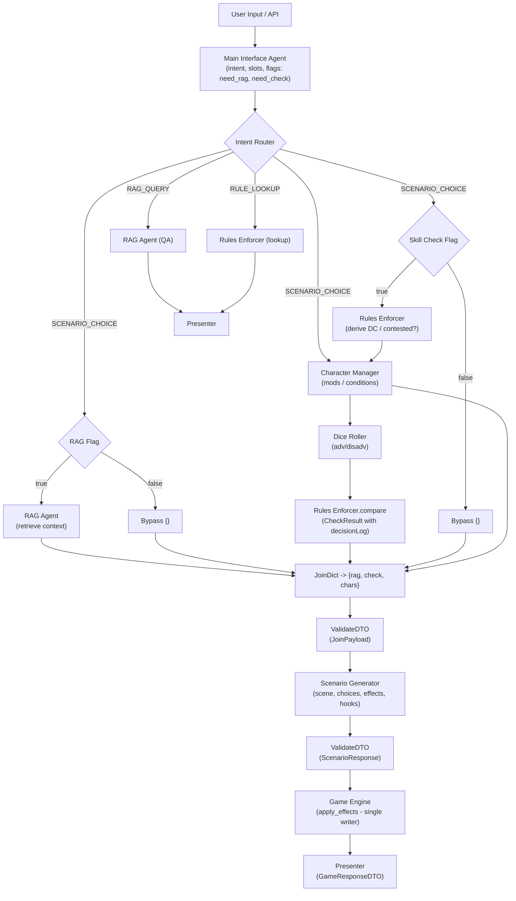
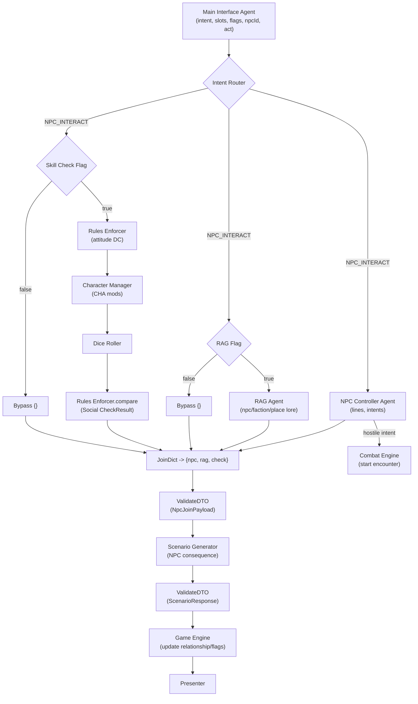
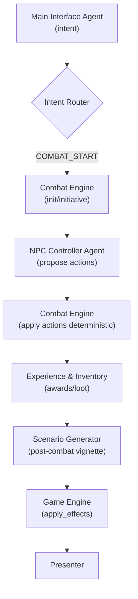
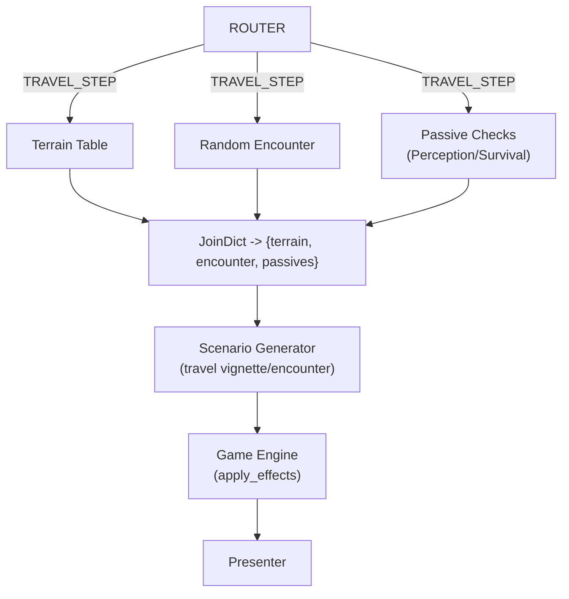
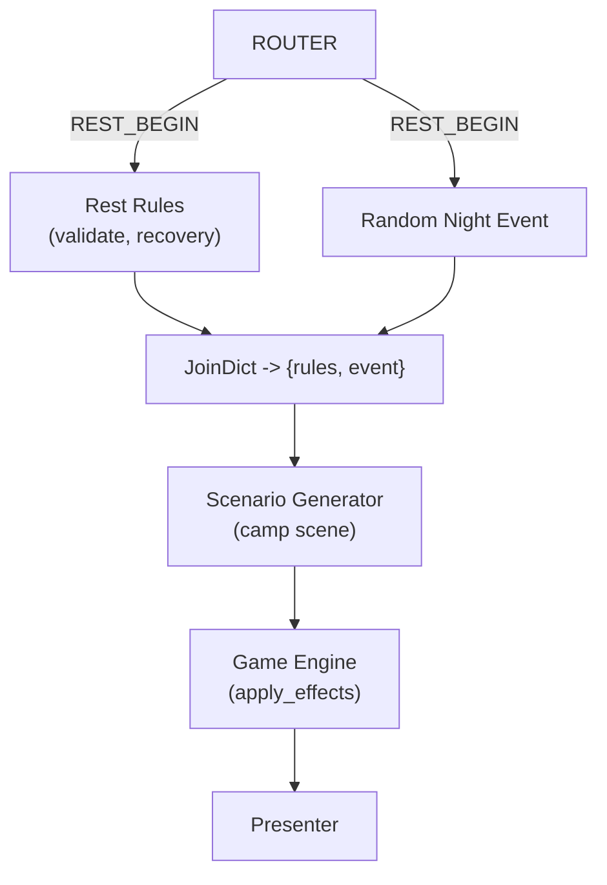

# D&D Assistant — Full Multi‑Phase Implementation Plan (Haystack v2 Compatible)
_Last updated: 2025-09-13 14:07 UTC_

This document expands the prior plan to include **all phases** with **Mermaid diagrams** and **Haystack v2 examples** for components, routers, joins, validation, and pipeline wiring. The design uses an **orchestrator-first** pipeline, **parallel fan‑out/fan‑in**, strict **DTO validation**, and a **single state writer** (Game Engine).

---

## Table of Contents
1. Principles & Contracts
2. Shared Components (reusable across phases)
3. **Phase 1+2:** Core Narrative + Parallel Skill Check & Optional RAG
4. **Phase 3:** NPC Interaction (Dialogue & Social)
5. **Phase 4:** Combat (Deterministic Core)
6. **Phase 5:** Travel & Rest (Exploration Loops)
7. Builders & Testing Utilities
8. Operations (timeouts, idempotency, tracing)
9. Acceptance Criteria by Phase

---

## 1) Principles & Contracts

- **Agents (LLM)**: Interface, RAG, Scenario, NPC.
- **Deterministic Components**: Rules, Characters, Dice, Game Engine, Presenter.
- **Single Writer**: Only Game Engine mutates state (`apply_effects` idempotent by `messageId`).
- **Parallelism**: RAG and skill checks run concurrently when flagged.
- **Router‑first**: `ConditionalRouter` chooses routes; tiny flag routers decide branch activation.
- **Strict DTOs (Pydantic)**: Validate joins and LLM outputs (fail fast, strip unknowns).

### Core DTOs (Pydantic)
```python
# models.py
from pydantic import BaseModel, Field
from typing import List, Dict, Optional, Any

class InterfaceOutput(BaseModel):
    intent: str
    slots: Dict[str, Any] = {}
    flags: Dict[str, bool] = {}
    utterance: str

class RagContext(BaseModel):
    snippets: List[Dict[str, Any]] = []
    citations: List[str] = []

class CheckResult(BaseModel):
    success: bool
    total: int
    rolls: List[int]
    advState: str = "none"
    dc: int
    dcSource: str
    decisionLog: Dict[str, Any]

class JoinPayload(BaseModel):
    rag: Dict[str, Any]
    check: Dict[str, Any]
    chars: Dict[str, Any]

class ScenarioResponse(BaseModel):
    scene: str
    choices: List[Dict[str, Any]]
    effects: List[Dict[str, Any]] = []
    hooks: List[Dict[str, Any]] = []

class GameResponseDTO(BaseModel):
    narrative: str
    choices: List[Dict[str, Any]] = []
    audit: Optional[Dict[str, Any]] = None
    events: Optional[List[Dict[str, Any]]] = None

class NpcResponse(BaseModel):
    lines: List[str]
    stance: str
    intents: List[Dict[str, Any]]  # {{type,target,rationale}}
```

---

## 2) Shared Components (reusable)

```python
# components/common.py
from haystack import component
from haystack.components.routers import ConditionalRouter
from pydantic import BaseModel, ValidationError

@component
class ValidateDTO:
    def __init__(self, model: type[BaseModel]):
        self.model = model
    def run(self, **payload):
        try:
            obj = self.model.model_validate(payload)
            return obj.model_dump()
        except ValidationError as e:
            return {"error": "validation_failed", "details": e.errors()}

@component
class RAGFlagRouter(ConditionalRouter):
    def __init__(self):
        super().__init__(conditions=[(lambda m: bool(m.get("flags",{}).get("need_rag")), "rag")],
                         default="bypass")

@component
class RulesFlagRouter(ConditionalRouter):
    def __init__(self):
        super().__init__(conditions=[(lambda m: bool(m.get("flags",{}).get("need_check")), "rules")],
                         default="bypass")

@component
class Bypass:
    def run(self, **_): return {}

@component
class JoinDict:
    def __init__(self, keys=("rag","check","chars")): self.keys = keys
    def run(self, rag=None, check=None, chars=None, **_):
        return {"rag": rag or {}, "check": check or {}, "chars": chars or {}}
```

Deterministic services (simplified stubs):

```python
# components/deterministic.py
from haystack import component
import random

@component
class RulesEnforcer:
    def run(self, choice_text:str=None, state:dict=None, **_):
        return {"dc": 15, "dcSource":"RAW:door_lock"}

@component
class RulesCompare:
    def run(self, total:int, dc:int, dcSource:str, mods:dict|None=None, advState:str="none"):
        success = total >= dc
        log = {"dc":dc,"dcSource":dcSource,"mods":mods or {}, "advState":advState,"total":total,"success":success}
        return {"success":success,"decisionLog":log, "dc":dc, "dcSource":dcSource}

@component
class CharacterManager:
    def run(self, actor_id:str=None, state:dict=None, **_):
        return {"mods":{"stealth":7,"persuasion":5},"advState":"none"}

@component
class DiceRoller:
    def run(self, expr:str="1d20", advState:str="none", seed:str|None=None):
        import random
        rng = random.Random(seed) if seed else random
        def d20(): return rng.randint(1,20)
        rolls = [d20(), d20()] if advState in ("adv","disadv") else [d20()]
        total = max(rolls) if advState=="adv" else min(rolls) if advState=="disadv" else rolls[0]
        return {"rolls":rolls,"total":total,"advState":advState}

@component
class GameEngineApply:
    def __init__(self, repo=None): self.repo = repo
    def run(self, scene:str=None, choices:list|None=None, effects:list|None=None, **_):
        # Apply effects (idempotent by messageId in a real impl)
        return {"events": [], "new_state": {"ok": True}}

@component
class Presenter:
    def run(self, scene:str=None, choices:list|None=None, events:list|None=None, **_):
        return {"narrative": scene or "", "choices": choices or [], "audit": None, "events": events or []}
```

LLM/Agent stubs (to be wired to your models):

```python
# components/agents.py
from haystack import component

@component
class MainInterfaceAgent:
    def __init__(self, llm, intent_schema): self.llm=llm; self.intent_schema=intent_schema
    def run(self, utterance:str, state:dict):
        return {"intent":"SCENARIO_CHOICE","slots":{},"flags":{"need_rag":True,"need_check":True},"utterance":utterance}

@component
class RAGAgent:
    def __init__(self, retriever, generator): self.retriever=retriever; self.generator=generator
    def run(self, query:str=None, **kwargs):
        # Return normalized context (snippets, citations)
        return {"snippets":[{"text":"...","source":"doc://1","score":0.82}],"citations":["doc://1"]}

@component
class ScenarioGenerator:
    def __init__(self, llm, prompt): self.llm=llm; self.prompt=prompt
    def run(self, rag:dict, check:dict, chars:dict, state:dict=None, **_):
        return {"scene":"You approach a locked door...",
                "choices":[{"id":"c1","title":"Pick the lock","description":"..." }],
                "effects":[], "hooks":[]}

@component
class NpcControllerAgent:
    def __init__(self, llm, prompt): self.llm=llm; self.prompt=prompt
    def run(self, npcId:str, act:str, scene_ctx:dict|None=None, **_):
        return {"lines":["'Halt,' says the guard."],
                "stance":"neutral",
                "intents":[{"type":"warn","target":"player","rationale":"Protect the vault"}]}
```

---

## 3) PHASE 1+2 — Core Narrative + Parallel Skill Check & Optional RAG

### Mermaid Flow


### Pipeline Wiring
```python
from haystack import Pipeline
from components.agents import MainInterfaceAgent, RAGAgent, ScenarioGenerator
from components.common import RAGFlagRouter, RulesFlagRouter, Bypass, JoinDict, ValidateDTO
from components.deterministic import RulesEnforcer, RulesCompare, CharacterManager, DiceRoller, GameEngineApply, Presenter
from models import JoinPayload, ScenarioResponse

p = Pipeline(async_enabled=True)
p.add_component("iface", MainInterfaceAgent(llm=..., intent_schema=...))
p.add_component("rag_rt", RAGFlagRouter())
p.add_component("rules_rt", RulesFlagRouter())
p.add_component("rag", RAGAgent(retriever=..., generator=...))
p.add_component("rag_bypass", Bypass())
p.add_component("rules", RulesEnforcer())
p.add_component("chars", CharacterManager())
p.add_component("dice", DiceRoller())
p.add_component("compare", RulesCompare())
p.add_component("join", JoinDict())
p.add_component("val_join", ValidateDTO(JoinPayload))
p.add_component("scen", ScenarioGenerator(llm=..., prompt=...))
p.add_component("val_scen", ValidateDTO(ScenarioResponse))
p.add_component("apply", GameEngineApply(repo=...))
p.add_component("present", Presenter())

p.connect("iface", "rag_rt"); p.connect("iface", "rules_rt"); p.connect("iface", "chars")
p.connect("rag_rt.rag", "rag"); p.connect("rag_rt.bypass", "rag_bypass")
p.connect("rules_rt.rules", "rules"); p.connect("rules_rt.bypass", "compare")
p.connect("rules", "chars"); p.connect("chars", "dice"); p.connect("dice", "compare")
p.connect("rag", "join"); p.connect("rag_bypass", "join"); p.connect("compare", "join"); p.connect("chars", "join")
p.connect("join", "val_join"); p.connect("val_join", "scen"); p.connect("scen", "val_scen")
p.connect("val_scen", "apply"); p.connect("apply", "present")
```

---

## 4) PHASE 3 — NPC Interaction (Dialogue & Social)

### Mermaid


**Wiring**: identical pattern to Phase 1+2, plus `npc` in join and validation.

---

## 5) PHASE 4 — Combat (Deterministic Core)

### Mermaid


**Notes**  
- The Combat Engine is the *deterministic* authority.  
- NPC Agent **proposes** actions only; invalid actions are rejected.

---

## 6) PHASE 5 — Travel & Rest

### Travel


### Rest


---

## 7) Builders & Testing Utilities

```python
# builders.py
def build_components(settings):
    return {
        "iface": MainInterfaceAgent(settings.llm_iface, settings.intent_schema),
        "rag": RAGAgent(settings.retriever, settings.generator),
        "scen": ScenarioGenerator(settings.llm_scen, settings.scenario_prompt),
        "rules": RulesEnforcer(),
        "compare": RulesCompare(),
        "chars": CharacterManager(),
        "dice": DiceRoller(),
        "apply": GameEngineApply(settings.repo),
        "present": Presenter(),
        "val_join": ValidateDTO(JoinPayload),
        "val_scen": ValidateDTO(ScenarioResponse),
        "rag_rt": RAGFlagRouter(),
        "rules_rt": RulesFlagRouter(),
        "rag_bypass": Bypass(),
        "join": JoinDict(),
    }
```

Testing:
- **Deterministic**: seed `DiceRoller` by sagaId.
- **Fake agents** for snapshot tests.
- **Golden transcripts**: pipeline I/O compared to saved JSON.

---

## 8) Operations

- **Timeouts** on RAG/LLM; proceed with empty context and `degraded=true` flag on failure.
- **Idempotency** in `GameEngineApply(effects, messageId)`.
- **Tracing**: add IDs (`messageId`, `correlationId`, `sagaId`) and measure per-node time.
- **Caching**: optional RAG and Scenario caches keyed by `(state_hash, choice_id)`.

---

## 9) Acceptance Criteria by Phase

**Phase 1+2**
- Interface emits `need_rag` and `need_check`.
- RAG and Skill‑check branches run in parallel; namespaced `JoinDict` merges results.
- Scenario output validated; only GE writes; `decisionLog` present.

**Phase 3**
- `NPC_INTERACT` route operational; NPC output validated; relationship/stance updates are effects via GE; can escalate to combat.

**Phase 4**
- `COMBAT_START` route operational; NPC proposes, Combat Engine applies; XP/Loot handled; post‑combat vignette applied.

**Phase 5**
- `TRAVEL_STEP` and `REST_BEGIN` routes operational; deterministic tables + optional checks; Presenter renders cleanly.

---
