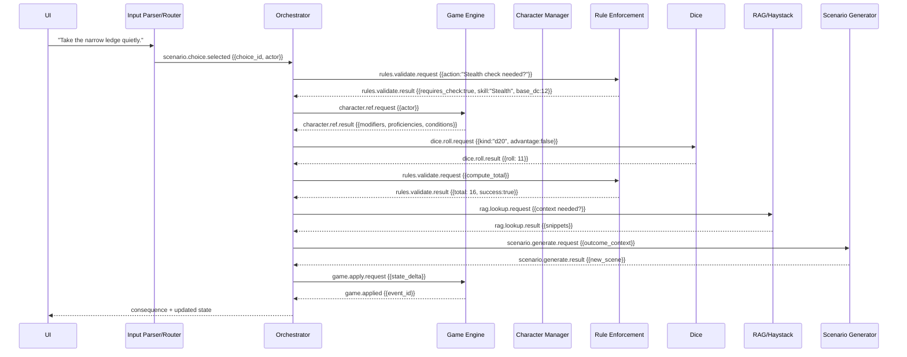

# D&D Assistant — Orchestrated, Modular Implementation Plan
_Last updated: 2025-08-17T06:31:35Z_

## Why this plan
Your system already has a robust multi‑agent core (MessageBus + AgentOrchestrator), rich agents (Scenario Generator, NPC Controller, Combat/Game Engine, RAG/Haystack), and a broad command surface (126+ commands). This plan closes the gaps to make **all communication strictly orchestrated**, adds a **deterministic Input Parser** (intent + routing), and wires **scenario→choice→skill‑check→consequence** flows end‑to‑end.

---

## 1) High‑level architecture (updated)

```mermaid
flowchart LR
  UI[UI / CLI / API]
  subgraph Core
    CP[Command Processor
(NLU + Parser)]
    ORCH[Agent Orchestrator]
    BUS[MessageBus]
  end

  subgraph Agents
    CHARMGR[Character Manager]
    GAME[Game Engine]
    COMBAT[Combat Engine]
    RULES[Rule Enforcement]
    DICE[Dice System]
    SCEN[Scenario Generator]
    NPC[NPC Controller]
    RAG[RAG/Haystack]
    CAMPAIGN[Campaign Manager]
    NARR[Narrative Tracker]
  end

  UI -- natural language --> CP --> ORCH --> BUS
  BUS <--> CHARMGR
  BUS <--> GAME
  BUS <--> COMBAT
  BUS <--> RULES
  BUS <--> DICE
  BUS <--> SCEN
  BUS <--> NPC
  BUS <--> RAG
  BUS <--> CAMPAIGN
  BUS <--> NARR

  classDef a fill:#f7f7ff,stroke:#ccd;
  class ORCH,BUS,CP a;
```

**Rules of the road (enforced):**
- **Agents never call each other directly.** Only `AgentOrchestrator` sends/receives via `MessageBus`.
- **Every message carries** `correlation_id`, `causation_id`, `reply_to`, `ttl`, and `saga_id` when part of a multi‑step flow.
- **Stateless agents** where possible; persistent state goes through **Game Engine** (authoritative source of truth).

---

## 2) Missing functionality & routing to implement

### A. Orchestration & Messaging
- **Correlation + Saga support** for multi‑hop tasks (e.g., choice → skill check → RAG → consequence).
- **Reply routing** (`reply_to` + auto timeouts + retries).
- **Outbox/Inbox** persistence for crash‑safe delivery (idempotent `message_id`).
- **Domain events** emitted only by Game Engine (e.g., `skill_check.resolved`, `state.updated`).

### B. Deterministic Input Parser (new)
- **Intent classifier** (small rules/regex + optional LLM fallback).
- **Command schema** with **slots** (entity extraction) + **validation**.
- **Router** mapping `intent → orchestration pipeline` (see §4).
- **Inline DSL** support for power users (e.g., `check Stealth vs DC 13 @Tamsin`).

### C. Routing Pipelines (examples)
- **Scenario Choice → Skill Check → Consequence** (full route in §5).
- **Combat action** (validate → dice → rules → game update → broadcast).
- **Lore/rule lookup** (RAG fetch → summarize → cite → cache).

### D. Game Engine as authoritative state
- **Query handlers** (get PC/NPC stats, conditions, proficiencies).
- **Event emission** after state mutations.
- **Transaction boundaries** (atomic apply / rollback).

### E. Rule & dice normalization
- **Single dice service** used by all agents.
- **Rule Enforcement** provides _advice + validation_ with machine‑readable violations and auto‑corrections.

### F. Observability (cross‑cutting)
- **Structured logs** with `correlation_id`, `saga_id`.
- **Distributed traces** (OpenTelemetry) around orchestrator and agents.
- **Metrics** (latency per agent, failure rates, queue depth).

### G. Reliability
- **Circuit breakers** for external services (LLM, Qdrant).
- **Dead‑letter queue** with human‑readable dump + replay tool.
- **Backoff + jitter** retry policy.

### H. DevEx & Testing
- **Contract tests** per message type.
- **Golden‑file tests** for parser + router.
- **End‑to‑end scenarios** (happy & failure cases).

---

## 3) Message contracts (canonical)

```ts
// AgentMessage (wire contract)
type AgentMessage = {
  message_id: string;           // uuid v7
  timestamp: string;            // ISO8601
  source: string;               // sender agent id
  target: string;               // receiver agent id
  type: string;                 // e.g., "skill.check.request"
  data: Record<string, any>;    // payload
  correlation_id?: string;      // ties request/response
  causation_id?: string;        // parent message_id
  reply_to?: string;            // mailbox/agent id
  ttl_ms?: number;              // time-to-live
  saga_id?: string;             // multi-step orchestration
};
```

**Key message types to add**
- `scenario.choice.selected`
- `skill.check.request` / `skill.check.result`
- `character.get.request` / `character.get.result`
- `rules.validate.request` / `.result`
- `dice.roll.request` / `.result`
- `rag.lookup.request` / `.result`
- `scenario.generate.request` / `.result`
- `game.apply.request` / `.applied` (state mutation)
- `game.event.broadcast` (fan‑out)

---

## 4) Input Parser & Router

### 4.1 Intent taxonomy (initial)
- `scenario.choose` — player selects option
- `skill.check` — explicit checks: “roll Stealth vs DC 13”
- `combat.action` — attack/cast/move/dash/dodge/help
- `rule.lookup` — “what does restrained do?”
- `lore.lookup` — world/campaign facts
- `character.query` — “show Tamsin”
- `scenario.generate` — “new social encounter in a market”
- `admin.*` — save/load/list campaigns/sessions

### 4.2 Command schema (examples)
```json
{
  "intent": "skill.check",
  "slots": {
    "actor": "Tamsin",
    "skill": "Stealth",
    "dc": 13,
    "advantage": false,
    "disadvantage": true
  },
  "meta": { "saga_id": "..." }
}
```

### 4.3 Parsing strategy
1. **Fast path**: grammar/regex for well‑known verbs (`roll|check|attack|cast|choose`).
2. **Entity extraction**: dictionary of skills/spells/conditions; fuzzy matching for names.
3. **LLM fallback**: only when ambiguous; returns normalized JSON.
4. **Validation**: schema check + coercion (e.g., “thirteen” → 13).
5. **Routing**: `intent → pipeline` table.

### 4.4 Routing table (snippet)
| Intent | Pipeline |
|---|---|
| `scenario.choose` | ChoicePipeline |
| `skill.check` | SkillCheckPipeline |
| `combat.action` | CombatActionPipeline |
| `rule.lookup` | RuleLookupPipeline |
| `lore.lookup` | RagLookupPipeline |
| `scenario.generate` | ScenarioGenPipeline |

---

## 5) Orchestrated flow: scenario choice → skill check → consequence



**Failure branches handled**:
- Character not found → ask Campaign Manager to resolve alias → retry.
- Dice service timeout → fallback to local RNG.
- RAG unavailable → proceed without extra lore; tag response.

---

## 6) Concrete module breakdown

```
/src
  /core
    agent_framework.py
    orchestrator.py
    message_bus.py
    contracts.py           # AgentMessage, result shapes
    router.py              # intent → pipeline
    parser/
      lexer.py             # tokenization
      grammar.py           # intent rules
      entities.py          # skills/spells/conditions dictionaries
      normalize.py         # coercion, validation
    pipelines/
      base.py
      scenario_choice.py
      skill_check.py
      combat_action.py
      rag_lookup.py
      rule_lookup.py
      scenario_gen.py
  /agents
    character_manager/
    game_engine/
    combat_engine/
    rule_enforcement/
    dice/
    rag_haystack/
    scenario_generator/
    npc_controller/
    campaign_manager/
    narrative_tracker/
  /infra
    logging.py
    tracing.py
    metrics.py
    persistence.py         # outbox/inbox stores
    dlq.py
  /tests
    e2e/
    contracts/
    parser/
    pipelines/
```

---

## 7) Pipeline skeletons (implement now)

```python
# core/pipelines/base.py
from dataclasses import dataclass
from typing import Any, Dict

@dataclass
class PipelineContext:
    saga_id: str
    correlation_id: str
    user_id: str | None = None

class Pipeline:
    def __init__(self, orch):
        self.orch = orch

    def send(self, target: str, type_: str, data: Dict[str, Any], ctx: PipelineContext, reply_to: str = "orchestrator"):
        return self.orch.send_message(
            source="router",
            target=target,
            type=type_,
            data=data,
            correlation_id=ctx.correlation_id,
            saga_id=ctx.saga_id,
            reply_to=reply_to,
        )
```

```python
# core/pipelines/skill_check.py
from .base import Pipeline, PipelineContext

class SkillCheckPipeline(Pipeline):
    async def run(self, cmd, ctx: PipelineContext):
        actor = cmd["slots"]["actor"]
        skill = cmd["slots"]["skill"]
        dc    = cmd["slots"].get("dc")

        rules = await self.send("rule_enforcement", "rules.validate.request",
                                {"kind":"skill_check_required","skill":skill,"dc":dc}, ctx)

        ch = await self.send("game_engine", "character.ref.request", {"actor": actor}, ctx)
        # derive advantage/disadvantage from conditions, expertise, etc.
        dice = await self.send("dice", "dice.roll.request",
                               {"expr":"1d20","advantage":ch["adv"],"disadvantage":ch["disadv"]}, ctx)

        result = await self.send("rule_enforcement", "rules.validate.request",
                                 {"kind":"skill_check_total","roll":dice["total"],"skill":skill,"char":ch,"dc":dc}, ctx)

        await self.send("game_engine", "game.apply.request",
                        {"event":"skill_check.resolved","payload":{**result,"actor":actor,"skill":skill}}, ctx)

        return {"type":"skill.check.result","data":result}
```

---

## 8) Parser rules (starter set)

```python
# core/parser/grammar.py (illustrative)
INTENTS = [
  (r"^(?:choose|take|pick)", "scenario.choose"),
  (r"^roll\s+(?P<expr>\d*d\d+(?:[+-]\d+)?)", "skill.check"),
  (r"^(attack|cast|dash|dodge|move)\b", "combat.action"),
  (r"^(what does|rule for|explain)\b.*", "rule.lookup"),
  (r"^(who|what|where).*(know|about)\b.*", "lore.lookup"),
]
```

Entity dictionaries: `SKILLS`, `CONDITIONS`, `SPELLS`.  
Normalizer coerces “with disadvantage”, “vs dc 13”, “for Tamsin” into slots.

---

## 9) Acceptance criteria (definition of done)

- **A. Orchestration**
  - All inter‑agent calls traverse Orchestrator/MessageBus.
  - Messages carry `correlation_id`, `saga_id`, `reply_to`.
  - Outbox/Inboxes persisted; DLQ + replay available.

- **B. Parser & Router**
  - 95% of common commands parsed without LLM fallback.
  - JSON commands validated against schemas.
  - Routing table covers: scenario.choose, skill.check, combat.action, rule.lookup, lore.lookup, scenario.generate.

- **C. Scenario→Choice→SkillCheck flow**
  - Demonstrated end‑to‑end with unit + e2e tests.
  - Failure modes handled (missing character, rules/dice timeout).
  - Game state mutation emits domain events.

- **D. Observability**
  - Trace spans for each pipeline hop.
  - Structured logs with correlation fields.
  - Metrics dashboards for latency/failures.

---

## 10) Milestones

1. **Week 1 — Contracts & Bus**
   - Add correlation/saga fields; persist outbox/inbox; DLQ.
   - Structured logging + OpenTelemetry stubs.

2. **Week 2 — Parser & Router**
   - Implement grammar, entities, normalizer.
   - Routing table + pipeline base + tests.

3. **Week 3 — Skill Check & Scenario Choice**
   - Implement `SkillCheckPipeline` + `ChoicePipeline`.
   - Wire Rule/Dice/Game/RAG/Scenario agents via orchestrator.
   - e2e tests for primary flow.

4. **Week 4 — Combat Action Pipeline**
   - Validate → dice → rules → apply → broadcast.
   - Golden tests for common actions.

5. **Week 5 — Observability & Hardening**
   - Tracing, metrics, circuit breakers, backoff.
   - Load test & tune queue back‑pressure.

---

## 11) Test plan

- **Parser**: table‑driven tests for phrases → JSON.
- **Pipelines**: mock agents; verify messages and correlation chaining.
- **E2E**: full scenario choice → consequence; combat round.
- **Chaos**: inject timeouts/errors in RAG/LLM; verify fallbacks and DLQ.

---

## 12) Example dev tasks (tickets)

- `CORE-12` Add `correlation_id`, `saga_id`, `reply_to` to `AgentMessage` and bus.
- `CORE-18` Implement Outbox/Inbox stores + idempotent delivery.
- `PARSER-01` Build skill/entity dictionaries; fuzzy matching for names.
- `PIPE-20` Implement `SkillCheckPipeline` with result application.
- `OBS-05` Add OpenTelemetry spans around orchestrator dispatch and agent handlers.
- `QA-09` Golden tests for “roll Stealth vs DC 13 for Tamsin (disadvantage)”.

---

## 13) Rollout notes

- Gate pipelines behind feature flags per environment.
- Provide a simple **developer CLI** to publish/inspect messages and replay DLQ.
- Add a “trace viewer” dev page to follow a saga across agents in real time.

---

## 14) Risks & mitigations

- **Parser ambiguity** → Keep LLM fallback with guardrails; surface `uncertain` flag to UI.
- **Queue buildup** → Back‑pressure + rate limiting; per‑agent concurrency caps.
- **External outages** → Circuit breakers + cached answers + graceful degradation.
- **State drift** → Single writer (Game Engine) pattern; event‑sourced audit log.

---

## 15) Done = Demo script (user‑visible)

1. Present scenario with 3 choices.
2. Player: “Take the narrow ledge quietly.”  
3. System: Performs `Stealth` check via orchestrated pipeline; shows roll, modifiers, DC, success.
4. Generates consequence scene + updates world state; broadcasts summary.

---

## 16) Appendix — Minimal interfaces

```python
# orchestrator.py
class AgentOrchestrator:
    async def send_message(self, source, target, type, data, correlation_id, saga_id, reply_to):
        ...

# router.py
class Router:
    def route(self, cmd_json) -> "Pipeline":
        ...

# dice agent handler
async def handle(message):
    if message.type == "dice.roll.request":
        return {"type":"dice.roll.result","total": roll_expr(message.data["expr"], ...)}
```

---

**End of plan**
