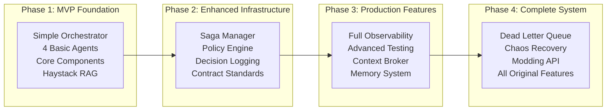

# Hybrid D&D Game Assistant Implementation Plan
*Progressive Architecture: Simple Start → Full Feature Implementation*

## Overview

This plan implements a **hybrid approach** that starts with a simple, playable D&D game but builds the **infrastructure foundation** needed to evolve into the full sophisticated system. Each phase adds capabilities while maintaining the architectural patterns needed for the final implementation.

**Key Principles:**
- ✅ **Haystack Framework**: Used for all RAG, document processing, and LLM interactions
- ✅ **hwtgenielib**: Used for Apple GenAI chat generators and components
- ✅ **Progressive Architecture**: Simple start with extensible foundation
- ✅ **Backward Compatibility**: Each phase builds on the previous without breaking changes
- ✅ **Future-Ready Infrastructure**: Built to support all original plan features

---

## Architecture Evolution Path



---

## Phase 1: MVP Foundation (Weeks 1-6)
**Goal**: Playable D&D game with extensible architecture

### Week 1-2: Core Infrastructure

#### 1.1 Project Setup & Haystack Foundation
```bash
# Project structure following original plan layout
dnd_game/
├── orchestrator/
│   ├── __init__.py
│   ├── orchestrator.py          # Simple version with extension points
│   ├── router.py               # Basic routing with hook system
│   └── message_bus.py          # Foundation for saga manager
├── agents/
│   ├── __init__.py
│   ├── rag_agent.py           # Haystack-based retrieval
│   ├── scenario_agent.py      # hwtgenielib + Haystack
│   ├── npc_agent.py          # hwtgenielib chat generators
│   └── interface_agent.py    # hwtgenielib for NLU/NLG
├── components/
│   ├── __init__.py
│   ├── character_manager.py   # Simple with extension hooks
│   ├── dice.py               # Future Policy Engine integration
│   ├── game_engine.py        # State management foundation
│   └── campaign_manager.py   # Document-based campaigns
├── storage/
│   ├── __init__.py
│   ├── document_store.py     # Haystack document store setup
│   └── state_repo.py        # JSON-based state (upgradeable)
└── config/
    └── game_config.yaml      # Extensible configuration
```

#### 1.2 Haystack Document Store Setup
```python
# storage/document_store.py
from haystack_integrations.document_stores.qdrant import QdrantDocumentStore
from haystack.components.embedders import SentenceTransformersTextEmbedder
from haystack import Pipeline, Document

class GameDocumentStore:
    def __init__(self, collection_name: str = "dnd_documents"):
        self.document_store = QdrantDocumentStore(
            path="../qdrant_storage",
            index=collection_name,
            embedding_dim=384,
            recreate_index=False
        )
        self.embedder = SentenceTransformersTextEmbedder()
        
    def initialize_with_content(self):
        """Load initial D&D content - extensible for Phase 4 modding"""
        documents = self._load_base_content()
        self.document_store.write_documents(documents)
    
    def _load_base_content(self) -> List[Document]:
        """Load campaigns, rules, monsters - structured for expansion"""
        # Implementation with clear content categories for future enhancement
```

#### 1.3 Basic Orchestrator with Extension Points
```python
# orchestrator/orchestrator.py
from typing import Dict, Any, Optional, Callable
from .router import Router
from .message_bus import MessageBus

class GameOrchestrator:
    """Simple orchestrator with hooks for Saga Manager integration"""
    
    def __init__(self):
        self.router = Router()
        self.message_bus = MessageBus()  # Foundation for saga tracking
        self.agents = {}
        
        # Extension points for Phase 2
        self.pre_route_hooks = []  # For saga manager integration
        self.post_route_hooks = [] # For decision logging
        self.context_brokers = []  # For Phase 3 context broker
    
    def route_request(self, request: Dict[str, Any]) -> Dict[str, Any]:
        # Execute pre-route hooks (empty in Phase 1)
        for hook in self.pre_route_hooks:
            request = hook(request)
        
        # Basic routing
        result = self.router.route(request)
        
        # Execute post-route hooks (empty in Phase 1) 
        for hook in self.post_route_hooks:
            result = hook(request, result)
        
        return result
    
    def register_pre_route_hook(self, hook: Callable):
        """For Phase 2 saga manager integration"""
        self.pre_route_hooks.append(hook)
    
    def register_post_route_hook(self, hook: Callable):
        """For Phase 2 decision logging integration"""
        self.post_route_hooks.append(hook)
```

### Week 3-4: Core Agents with Haystack

#### 1.4 RAG Retriever Agent
```python
# agents/rag_agent.py
from haystack import Pipeline
from haystack.components.embedders import SentenceTransformersTextEmbedder
from haystack_integrations.components.retrievers.qdrant import QdrantEmbeddingRetriever
from haystack.components.rankers import SentenceTransformersSimilarityRanker
from haystack.components.builders import PromptBuilder

class RAGRetrieverAgent:
    """Haystack-based retrieval agent with extension points"""
    
    def __init__(self, document_store, verbose: bool = False):
        self.document_store = document_store
        self.verbose = verbose
        
        # Core retrieval pipeline
        self.retrieval_pipeline = self._build_retrieval_pipeline()
        
        # Extension point for Phase 3 context broker integration
        self.context_filters = []
        self.result_processors = []
    
    def _build_retrieval_pipeline(self) -> Pipeline:
        pipeline = Pipeline()
        pipeline.add_component("embedder", SentenceTransformersTextEmbedder())
        pipeline.add_component("retriever", QdrantEmbeddingRetriever(
            document_store=self.document_store,
            top_k=10
        ))
        pipeline.add_component("ranker", SentenceTransformersSimilarityRanker(
            top_k=5
        ))
        
        # Connect components
        pipeline.connect("embedder.embedding", "retriever.query_embedding")
        pipeline.connect("retriever.documents", "ranker.documents")
        
        return pipeline
    
    def retrieve_context(self, query: str, context_type: str = "general") -> List[Document]:
        """Retrieve with extensible context filtering"""
        
        # Apply context filters (empty in Phase 1, used in Phase 3)
        filtered_query = query
        for filter_func in self.context_filters:
            filtered_query = filter_func(filtered_query, context_type)
        
        # Run retrieval
        result = self.retrieval_pipeline.run({
            "embedder": {"text": filtered_query},
            "ranker": {"query": filtered_query}
        })
        
        documents = result.get("ranker", {}).get("documents", [])
        
        # Apply result processors (empty in Phase 1, used in Phase 3)
        for processor in self.result_processors:
            documents = processor(documents, context_type)
        
        return documents
    
    def register_context_filter(self, filter_func: Callable):
        """For Phase 3 context broker integration"""
        self.context_filters.append(filter_func)
```

#### 1.5 Scenario Generator Agent with hwtgenielib
```python
# agents/scenario_agent.py
from hwtgenielib.components.generators.chat import AppleGenAIChatGenerator
from hwtgenielib.dataclasses import ChatMessage
from haystack import Pipeline
from haystack.components.builders import PromptBuilder
from typing import Dict, List, Any

class ScenarioGeneratorAgent:
    """hwtgenielib-based scenario generation with Haystack RAG"""
    
    def __init__(self, rag_agent, verbose: bool = False):
        self.rag_agent = rag_agent
        self.verbose = verbose
        
        # hwtgenielib chat generator
        self.chat_generator = AppleGenAIChatGenerator(
            model="aws:anthropic.claude-sonnet-4-20250514-v1:0"
        )
        
        # Haystack pipeline for RAG-enhanced generation
        self.scenario_pipeline = self._build_scenario_pipeline()
        
        # Extension points for Phase 2 contract standards
        self.output_validators = []
        self.contract_processors = []
    
    def _build_scenario_pipeline(self) -> Pipeline:
        pipeline = Pipeline()
        pipeline.add_component("prompt_builder", PromptBuilder(
            template=self._get_scenario_template()
        ))
        
        return pipeline
    
    def generate_scenario(self, context: Dict[str, Any]) -> Dict[str, Any]:
        """Generate scenario with simple structure, extensible to contract format"""
        
        # Retrieve RAG context
        campaign_context = ""
        if context.get("campaign"):
            docs = self.rag_agent.retrieve_context(
                f"campaign {context['campaign']}", "campaign"
            )
            campaign_context = "\n".join([doc.content[:200] for doc in docs[:3]])
        
        # Build prompt
        prompt_result = self.scenario_pipeline.run({
            "prompt_builder": {
                "campaign_context": campaign_context,
                "game_state": context.get("game_state", ""),
                "query": context.get("query", "generate a scenario")
            }
        })
        
        enhanced_prompt = prompt_result["prompt_builder"]["prompt"]
        
        # Generate with hwtgenielib
        messages = [ChatMessage.from_user(enhanced_prompt)]
        response = self.chat_generator.run(messages=messages)
        
        if response and "replies" in response:
            scenario_text = response["replies"][0].text
            parsed_scenario = self._parse_scenario_simple(scenario_text)
            
            # Apply contract processors (empty in Phase 1, used in Phase 2)
            for processor in self.contract_processors:
                parsed_scenario = processor(parsed_scenario)
            
            return parsed_scenario
        
        return self._fallback_scenario()
    
    def _parse_scenario_simple(self, text: str) -> Dict[str, Any]:
        """Simple parsing, extensible to full contract in Phase 2"""
        # Basic parsing that can be enhanced for contract compliance
        return {
            "scene": text,
            "choices": self._extract_choices(text),
            "triggers_combat": "combat" in text.lower(),
            # Phase 2 will add: effects, hooks, skill_hints, suggested_dc
        }
    
    def register_contract_processor(self, processor: Callable):
        """For Phase 2 contract standardization"""
        self.contract_processors.append(processor)
```

### Week 5-6: Basic Components & Game Flow

#### 1.6 Simple Game Engine with Extension Points
```python
# components/game_engine.py
from typing import Dict, Any, List, Optional
import json
import time

class GameEngine:
    """Simple game engine with hooks for Phase 2 enhancements"""
    
    def __init__(self):
        self.game_state = self._initialize_state()
        self.state_history = []
        
        # Extension points for Phase 2
        self.pre_update_hooks = []   # For decision logging
        self.post_update_hooks = []  # For state validation
        self.policy_engine = None    # Set in Phase 2
    
    def _initialize_state(self) -> Dict[str, Any]:
        return {
            "current_scenario": None,
            "characters": {},
            "campaign": "",
            "story_history": [],
            "difficulty_level": 0,  # Simple difficulty tracking
            "session_data": {
                "location": "unknown",
                "events": [],
                "time": time.time()
            }
        }
    
    def update_state(self, changes: Dict[str, Any]) -> Dict[str, Any]:
        """Update with extension hooks for Phase 2"""
        
        # Pre-update hooks (empty in Phase 1)
        for hook in self.pre_update_hooks:
            changes = hook(changes, self.game_state)
        
        # Apply changes
        old_state = self.game_state.copy()
        self._apply_changes(changes)
        
        # Post-update hooks (empty in Phase 1)
        result = {"success": True, "changes": changes}
        for hook in self.post_update_hooks:
            result = hook(old_state, self.game_state, result)
        
        return result
    
    def process_skill_check(self, check_data: Dict[str, Any]) -> Dict[str, Any]:
        """Simple skill check with hooks for Phase 2 policy integration"""
        
        # Phase 1: Basic implementation
        dc = check_data.get("dc", 15)
        roll = check_data.get("roll", 10)
        modifier = check_data.get("modifier", 0)
        
        # Extension point for Policy Engine in Phase 2
        if self.policy_engine:
            dc = self.policy_engine.adjust_difficulty(dc, check_data)
            advantage = self.policy_engine.compute_advantage(
                self.game_state, check_data.get("actor"), check_data.get("skill")
            )
            # Apply advantage logic when policy engine is available
        
        total = roll + modifier
        success = total >= dc
        
        # Update difficulty based on success/failure
        if success:
            self.game_state["difficulty_level"] = max(0, self.game_state["difficulty_level"] - 1)
        else:
            self.game_state["difficulty_level"] = min(5, self.game_state["difficulty_level"] + 1)
        
        return {
            "success": success,
            "total": total,
            "dc": dc,
            "roll": roll,
            "modifier": modifier
        }
    
    def register_pre_update_hook(self, hook: Callable):
        """For Phase 2 decision logging"""
        self.pre_update_hooks.append(hook)
```

#### 1.7 Basic Campaign Manager
```python
# components/campaign_manager.py
from pathlib import Path
from typing import List, Dict, Any
import json

class CampaignManager:
    """Simple campaign management with document integration"""
    
    def __init__(self, campaigns_dir: str = "data/campaigns"):
        self.campaigns_dir = Path(campaigns_dir)
        self.current_campaign = None
        
    def list_campaigns(self) -> List[Dict[str, Any]]:
        """List available campaigns from documents"""
        campaigns = []
        
        for campaign_dir in self.campaigns_dir.iterdir():
            if campaign_dir.is_dir():
                overview_path = campaign_dir / "overview.md"
                if overview_path.exists():
                    campaigns.append({
                        "name": campaign_dir.name,
                        "title": campaign_dir.name.replace("_", " ").title(),
                        "path": str(campaign_dir),
                        "has_overview": True
                    })
        
        return campaigns
    
    def select_campaign(self, campaign_name: str) -> Dict[str, Any]:
        """Select campaign and return context for RAG"""
        campaign_path = self.campaigns_dir / campaign_name
        
        if not campaign_path.exists():
            return {"success": False, "error": "Campaign not found"}
        
        self.current_campaign = campaign_name
        
        # Return campaign context that RAG agent can use
        return {
            "success": True,
            "campaign": campaign_name,
            "campaign_path": str(campaign_path),
            "context_query": f"campaign {campaign_name} overview setting"
        }
```

### Phase 1 Success Criteria
- [ ] User can select campaign and get RAG-enhanced opening scenario
- [ ] Scenario presents 3-4 meaningful choices with hwtgenielib generation
- [ ] Player choices trigger appropriate skill checks with basic difficulty scaling
- [ ] Game state persists and story continues based on choices
- [ ] All components use Haystack/hwtgenielib and have extension points for Phase 2

---

## Phase 2: Enhanced Infrastructure (Weeks 7-10)
**Goal**: Add sophisticated components while maintaining playability

### Week 7-8: Saga Manager & Policy Engine

#### 2.1 Saga Manager Implementation
```python
# orchestrator/saga_manager.py
from typing import Dict, List, Any, Optional
import uuid
import time
from dataclasses import dataclass

@dataclass
class SagaStep:
    step_type: str
    handler: str  # Agent/component to handle this step
    timeout: float = 30.0
    retry_count: int = 0
    max_retries: int = 3

@dataclass  
class Saga:
    id: str
    type: str
    current_step: int
    steps: List[SagaStep]
    context: Dict[str, Any]
    correlation_id: str
    start_time: float
    status: str = "active"

class SagaManager:
    """Multi-step flow tracking with correlation IDs"""
    
    def __init__(self):
        self.active_sagas: Dict[str, Saga] = {}
        self.completed_sagas: List[Saga] = []
        self.saga_templates = {
            "skill_challenge": self._build_skill_challenge_saga,
            "combat_encounter": self._build_combat_saga,
            "social_encounter": self._build_social_saga
        }
    
    def start_saga(self, saga_type: str, context: Dict[str, Any]) -> str:
        """Start multi-step saga with correlation tracking"""
        saga_id = str(uuid.uuid4())
        correlation_id = str(uuid.uuid4())
        
        saga = Saga(
            id=saga_id,
            type=saga_type,
            current_step=0,
            steps=self.saga_templates[saga_type](context),
            context=context,
            correlation_id=correlation_id,
            start_time=time.time()
        )
        
        self.active_sagas[saga_id] = saga
        return saga_id
    
    def advance_saga(self, saga_id: str, step_result: Dict[str, Any]) -> Dict[str, Any]:
        """Advance saga to next step"""
        if saga_id not in self.active_sagas:
            return {"success": False, "error": "Saga not found"}
        
        saga = self.active_sagas[saga_id]
        saga.context.update(step_result.get("context_updates", {}))
        
        # Move to next step
        saga.current_step += 1
        
        if saga.current_step >= len(saga.steps):
            # Saga complete
            saga.status = "completed"
            self.completed_sagas.append(saga)
            del self.active_sagas[saga_id]
            
            return {
                "success": True,
                "saga_complete": True,
                "final_result": saga.context
            }
        
        # Continue to next step
        next_step = saga.steps[saga.current_step]
        return {
            "success": True,
            "saga_complete": False,
            "next_step": next_step.step_type,
            "handler": next_step.handler,
            "correlation_id": saga.correlation_id
        }
    
    def _build_skill_challenge_saga(self, context: Dict[str, Any]) -> List[SagaStep]:
        return [
            SagaStep("present_scenario", "scenario_agent"),
            SagaStep("player_choice", "interface_agent"),
            SagaStep("skill_check", "game_engine"),
            SagaStep("generate_consequence", "scenario_agent")
        ]
```

#### 2.2 Policy Engine Implementation
```python
# components/policy.py
from typing import Dict, Any, List
from enum import Enum

class PolicyProfile(Enum):
    RAW = "raw"          # Rules as written
    HOUSE = "house"      # Common house rules
    EASY = "easy"        # Beginner friendly
    CUSTOM = "custom"    # User defined

class PolicyEngine:
    """Centralized rule mediation and house rule management"""
    
    PROFILES = {
        PolicyProfile.RAW: {
            "flanking_advantage": False,
            "crit_range": [20],
            "death_saves": "standard",
            "rest_variant": "standard",
            "dc_adjustment": 0
        },
        PolicyProfile.HOUSE: {
            "flanking_advantage": True,
            "crit_range": [19, 20],
            "death_saves": "standard", 
            "rest_variant": "standard",
            "dc_adjustment": 0
        },
        PolicyProfile.EASY: {
            "flanking_advantage": True,
            "crit_range": [19, 20],
            "death_saves": "forgiving",
            "rest_variant": "short_rest_benefits",
            "dc_adjustment": -2
        }
    }
    
    def __init__(self, profile: PolicyProfile = PolicyProfile.RAW):
        self.active_profile = self.PROFILES[profile]
        self.custom_rules = {}
    
    def compute_advantage(self, game_state: Dict[str, Any], 
                         actor: str, skill: str) -> str:
        """Determine advantage/disadvantage state"""
        advantages = []
        disadvantages = []
        
        # Check actor conditions
        actor_data = game_state.get("characters", {}).get(actor, {})
        conditions = actor_data.get("conditions", [])
        
        for condition in conditions:
            if condition in ["blinded", "frightened", "poisoned"]:
                disadvantages.append(condition)
            elif condition in ["blessed", "guided"]:
                advantages.append(condition)
        
        # Check flanking if enabled
        if (self.active_profile.get("flanking_advantage") and 
            game_state.get("combat_state", {}).get("flanking", {}).get(actor)):
            advantages.append("flanking")
        
        # Resolve final state
        if len(advantages) > len(disadvantages):
            return "advantage"
        elif len(disadvantages) > len(advantages):
            return "disadvantage"
        else:
            return "normal"
    
    def adjust_difficulty(self, base_dc: int, context: Dict[str, Any]) -> int:
        """Apply difficulty scaling based on context and policy"""
        adjustment = self.active_profile.get("dc_adjustment", 0)
        
        # Context-based adjustments
        difficulty_level = context.get("difficulty_level", 0)
        adjustment += difficulty_level
        
        # Party level considerations
        party_level = context.get("average_party_level", 1)
        if party_level < 3:
            adjustment -= 1  # Easier for low level parties
        elif party_level > 10:
            adjustment += 1  # Harder for high level parties
        
        return max(5, min(30, base_dc + adjustment))
    
    def passive_score(self, ability_mod: int, proficiency: int, bonus: int = 0) -> int:
        """Calculate passive scores (Perception, Investigation, etc.)"""
        return 10 + ability_mod + proficiency + bonus
```

### Week 9-10: Decision Logging & Contract Standards

#### 2.3 Decision Logger System
```python
# orchestrator/decision_logger.py
from typing import Dict, Any, List, Optional
from dataclasses import dataclass, asdict
import time
import json

@dataclass
class SkillCheckDecision:
    correlation_id: str
    actor: str
    skill: str
    ability: str
    dc: int
    dc_source: str
    roll: int
    modifiers: Dict[str, int]
    advantage_state: str
    advantage_sources: List[str]
    final_result: bool
    timestamp: float

@dataclass  
class CombatDecision:
    correlation_id: str
    actor: str
    action_type: str
    target: Optional[str]
    attack_roll: Optional[int]
    damage_roll: Optional[int]
    conditions_applied: List[str]
    state_changes: Dict[str, Any]
    timestamp: float

class DecisionLogger:
    """Comprehensive decision logging with correlation tracking"""
    
    def __init__(self):
        self.skill_checks: List[SkillCheckDecision] = []
        self.combat_actions: List[CombatDecision] = []
        self.decision_chains: Dict[str, List[Dict]] = {}
    
    def log_skill_check(self, correlation_id: str, check_data: Dict[str, Any],
                       result: Dict[str, Any]):
        """Log skill check with full provenance"""
        decision = SkillCheckDecision(
            correlation_id=correlation_id,
            actor=check_data.get("actor", "unknown"),
            skill=check_data.get("skill", ""),
            ability=check_data.get("ability", ""),
            dc=result.get("dc", 0),
            dc_source=result.get("dc_source", "unknown"),
            roll=result.get("roll", 0),
            modifiers=result.get("modifiers", {}),
            advantage_state=result.get("advantage_state", "normal"),
            advantage_sources=result.get("advantage_sources", []),
            final_result=result.get("success", False),
            timestamp=time.time()
        )
        
        self.skill_checks.append(decision)
        self._add_to_chain(correlation_id, "skill_check", asdict(decision))
    
    def log_combat_action(self, correlation_id: str, action_data: Dict[str, Any],
                         result: Dict[str, Any]):
        """Log combat action with validation results"""
        decision = CombatDecision(
            correlation_id=correlation_id,
            actor=action_data.get("actor", "unknown"),
            action_type=action_data.get("action_type", ""),
            target=action_data.get("target"),
            attack_roll=result.get("attack_roll"),
            damage_roll=result.get("damage_roll"),
            conditions_applied=result.get("conditions_applied", []),
            state_changes=result.get("state_changes", {}),
            timestamp=time.time()
        )
        
        self.combat_actions.append(decision)
        self._add_to_chain(correlation_id, "combat_action", asdict(decision))
    
    def _add_to_chain(self, correlation_id: str, decision_type: str, data: Dict):
        """Add decision to correlation chain"""
        if correlation_id not in self.decision_chains:
            self.decision_chains[correlation_id] = []
        
        self.decision_chains[correlation_id].append({
            "type": decision_type,
            "data": data,
            "sequence": len(self.decision_chains[correlation_id])
        })
    
    def get_decision_chain(self, correlation_id: str) -> List[Dict]:
        """Get complete decision chain for correlation ID"""
        return self.decision_chains.get(correlation_id, [])
```

#### 2.4 Contract Standardization
```python
# agents/scenario_agent.py (enhanced from Phase 1)

def _parse_scenario_enhanced(self, text: str) -> Dict[str, Any]:
    """Enhanced parsing for Phase 2 contract compliance"""
    
    # Extract basic scenario
    base_scenario = self._parse_scenario_simple(text)  # From Phase 1
    
    # Add Phase 2 contract fields
    enhanced_scenario = {
        "scene": base_scenario["scene"],
        "choices": self._extract_choices_with_metadata(text),
        "effects": self._extract_effects(text),
        "hooks": self._extract_hooks(text),
        # Maintain backward compatibility
        "triggers_combat": base_scenario["triggers_combat"]
    }
    
    return enhanced_scenario

def _extract_choices_with_metadata(self, text: str) -> List[Dict[str, Any]]:
    """Extract choices with Phase 2 metadata"""
    choices = []
    choice_lines = self._extract_choice_lines(text)
    
    for i, line in enumerate(choice_lines):
        choice = {
            "id": f"c{i+1}",
            "title": self._extract_choice_title(line),
            "description": self._extract_choice_description(line),
            "skill_hints": self._extract_skills(line),
            "suggested_dc": self._extract_dc_levels(line),
            "combat_trigger": "combat" in line.lower()
        }
        choices.append(choice)
    
    return choices

def _extract_skills(self, choice_text: str) -> List[str]:
    """Extract skill hints from choice text"""
    skills = ["Stealth", "Perception", "Investigation", "Athletics", 
             "Acrobatics", "Persuasion", "Deception", "Intimidation"]
    
    found_skills = []
    for skill in skills:
        if skill.lower() in choice_text.lower():
            found_skills.append(skill)
    
    return found_skills

def _extract_dc_levels(self, choice_text: str) -> Dict[str, int]:
    """Extract or infer DC levels for choice"""
    # Look for explicit DC mentions
    import re
    dc_match = re.search(r'DC (\d+)', choice_text)
    
    if dc_match:
        base_dc = int(dc_match.group(1))
        return {
            "easy": base_dc - 2,
            "medium": base_dc,
            "hard": base_dc + 3
        }
    
    # Default DC levels based on choice complexity
    if any(word in choice_text.lower() for word in ["sneak", "stealth", "quiet"]):
        return {"easy": 12, "medium": 15, "hard": 18}
    elif any(word in choice_text.lower() for word in ["climb", "jump", "athletics"]):
        return {"easy": 10, "medium": 13, "hard": 16}
    else:
        return {"easy": 10, "medium": 15, "hard": 20}
```

### Phase 2 Success Criteria
- [ ] Saga Manager tracks multi-step scenarios with correlation IDs
- [ ] Policy Engine handles house rules and difficulty scaling
- [ ] Decision Logger provides complete audit trail for all actions
- [ ] Scenario Generator outputs standardized contracts
- [ ] All components integrate without breaking Phase 1 functionality

---

## Phase 3: Production Features (Weeks 11-14)
**Goal**: Add production-ready observability and advanced features

### Week 11-12: Observability & Context Broker

#### 3.1 Observability Manager
```python
# orchestrator/observability.py
from typing import Dict, Any, Optional, List
import time
import uuid
import json
from dataclasses import dataclass, asdict

@dataclass
class Span:
    trace_id: str
    span_id: str
    parent_span_id: Optional[str]
    operation_name: str
    component: str
    start_time: float
    end_time: Optional[float] = None
    tags: Dict[str, Any] = None
    logs: List[Dict[str, Any]] = None
    
    def __post_init__(self):
        if self.tags is None:
            self.tags = {}
        if self.logs is None:
            self.logs = []

class ObservabilityManager:
    """OpenTelemetry-style tracing and structured logging"""
    
    def __init__(self):
        self.active_traces: Dict[str, List[Span]] = {}
        self.completed_traces: List[List[Span]] = []
        self.structured_logs: List[Dict[str, Any]] = []
    
    def start_trace(self, operation: str, component: str = "unknown") -> str:
        """Start new trace and return trace ID"""
        trace_id = str(uuid.uuid4())
        span_id = str(uuid.uuid4())
        
        span = Span(
            trace_id=trace_id,
            span_id=span_id,
            parent_span_id=None,
            operation_name=operation,
            component=component,
            start_time=time.time()
        )
        
        self.active_traces[trace_id] = [span]
        return trace_id
    
    def add_span(self, trace_id: str, operation: str, component: str,
                 parent_span_id: Optional[str] = None) -> str:
        """Add span to existing trace"""
        if trace_id not in self.active_traces:
            return self.start_trace(operation, component)
        
        span_id = str(uuid.uuid4())
        span = Span(
            trace_id=trace_id,
            span_id=span_id,
            parent_span_id=parent_span_id,
            operation_name=operation,
            component=component,
            start_time=time.time()
        )
        
        self.active_traces[trace_id].append(span)
        return span_id
    
    def end_span(self, trace_id: str, span_id: str, tags: Dict[str, Any] = None):
        """End span with optional tags"""
        if trace_id in self.active_traces:
            for span in self.active_traces[trace_id]:
                if span.span_id == span_id:
                    span.end_time = time.time()
                    if tags:
                        span.tags.update(tags)
                    break
    
    def log_structured(self, level: str, message: str, context: Dict[str, Any],
                      trace_id: Optional[str] = None):
        """Add structured log entry"""
        log_entry = {
            "timestamp": time.time(),
            "level": level,
            "message": message,
            "context": context,
            "trace_id": trace_id
        }
        
        self.structured_logs.append(log_entry)
        
        # Also add to active trace if provided
        if trace_id and trace_id in self.active_traces:
            for span in self.active_traces[trace_id]:
                if span.end_time is None:  # Active span
                    span.logs.append(log_entry)
                    break
    
    def complete_trace(self, trace_id: str) -> List[Span]:
        """Complete trace and return spans"""
        if trace_id in self.active_traces:
            spans = self.active_traces[trace_id]
            self.completed_traces.append(spans)
            del self.active_traces[trace_id]
            return spans
        return []
```

#### 3.2 Context Broker
```python
# orchestrator/context_broker.py
from typing import Dict, Any, List, Optional, Set
import time

class ContextBroker:
    """Intelligent context management for RAG queries"""
    
    def __init__(self, observability_manager):
        self.observability = observability_manager
        self.context_cache = {}
        self.query_history = []
        self.context_rules = []
    
    def determine_context_needs(self, request: Dict[str, Any], 
                              trace_id: str) -> Dict[str, Any]:
        """Intelligently determine what context is needed"""
        
        span_id = self.observability.add_span(
            trace_id, "context_analysis", "context_broker"
        )
        
        # Analyze request type
        request_type = request.get("type", "unknown")
        
        context_needs = {
            "campaign": self._needs_campaign_context(request),
            "rules": self._needs_rules_context(request),
            "monsters": self._needs_monster_context(request),
            "spells": self._needs_spell_context(request),
            "history": self._needs_history_context(request)
        }
        
        # Apply context rules
        for rule in self.context_rules:
            context_needs = rule(request, context_needs)
        
        self.observability.end_span(trace_id, span_id, {
            "context_needs": context_needs,
            "request_type": request_type
        })
        
        return context_needs
    
    def _needs_campaign_context(self, request: Dict[str, Any]) -> bool:
        """Determine if campaign context is needed"""
        # Check for scenario generation, NPC interactions
        return (request.get("type") in ["generate_scenario", "npc_dialogue"] or
                "campaign" in request.get("query", "").lower())
    
    def _needs_rules_context(self, request: Dict[str, Any]) -> bool:
        """Determine if rules context is needed"""
        query = request.get("query", "").lower()
        rules_keywords = ["rule", "how does", "spell", "combat", "check", "save"]
        return any(keyword in query for keyword in rules_keywords)
    
    def optimize_retrieval(self, context_needs: Dict[str, bool], 
                          query: str, trace_id: str) -> List[str]:
        """Optimize RAG retrieval based on context analysis"""
        
        retrieval_queries = []
        
        if context_needs.get("campaign"):
            retrieval_queries.append(f"campaign {query}")
        
        if context_needs.get("rules"):
            retrieval_queries.append(f"rules {query}")
        
        if context_needs.get("monsters"):
            retrieval_queries.append(f"monster {query}")
        
        if context_needs.get("spells"):
            retrieval_queries.append(f"spell {query}")
        
        # Default to general query if no specific context
        if not any(context_needs.values()):
            retrieval_queries.append(query)
        
        self.observability.log_structured(
            "info", "Context broker optimized retrieval",
            {"original_query": query, "optimized_queries": retrieval_queries},
            trace_id
        )
        
        return retrieval_queries
```

### Week 13-14: Memory System & Advanced Testing

#### 3.3 Memory/World Summaries
```python
# components/memory.py
from typing import Dict, Any, List, Optional
import time
from collections import deque

class WorldMemoryManager:
    """Manages world state summaries and campaign history"""
    
    def __init__(self, max_events: int = 1000, summary_threshold: int = 50):
        self.max_events = max_events
        self.summary_threshold = summary_threshold
        
        self.event_history = deque(maxlen=max_events)
        self.world_summaries = {}
        self.character_memories = {}
        self.location_states = {}
        
    def record_event(self, event: Dict[str, Any]):
        """Record significant game event"""
        event["timestamp"] = time.time()
        event["id"] = len(self.event_history)
        
        self.event_history.append(event)
        
        # Update location state
        if "location" in event:
            self._update_location_state(event)
        
        # Update character memories
        if "characters" in event:
            self._update_character_memories(event)
        
        # Check if summarization needed
        if len(self.event_history) % self.summary_threshold == 0:
            self._create_summary()
    
    def get_context_for_location(self, location: str) -> Dict[str, Any]:
        """Get relevant context for a location"""
        return {
            "location_state": self.location_states.get(location, {}),
            "recent_events": self._get_location_events(location),
            "summary": self.world_summaries.get(location, "")
        }
    
    def get_character_context(self, character: str) -> Dict[str, Any]:
        """Get character's personal context"""
        return {
            "memories": self.character_memories.get(character, []),
            "recent_interactions": self._get_character_events(character)
        }
    
    def _create_summary(self):
        """Create world state summary using LLM"""
        # This would use hwtgenielib to summarize recent events
        # Implementation would call scenario agent to create narrative summaries
        pass
```

#### 3.4 Comprehensive Testing Framework
```python
# tests/contracts/test_scenario_contracts.py
import pytest
from agents.scenario_agent import ScenarioGeneratorAgent
from tests.fixtures import mock_rag_agent

class TestScenarioContracts:
    """Contract validation for scenario generation"""
    
    def test_scenario_output_schema(self):
        """Validate scenario output matches Phase 2 contract"""
        agent = ScenarioGeneratorAgent(mock_rag_agent())
        
        context = {
            "campaign": "test_campaign",
            "query": "tavern encounter"
        }
        
        result = agent.generate_scenario(context)
        
        # Validate required Phase 2 fields
        assert "scene" in result
        assert "choices" in result
        assert "effects" in result  # Phase 2 addition
        assert "hooks" in result    # Phase 2 addition
        
        # Validate choice structure
        for choice in result["choices"]:
            assert "id" in choice
            assert "title" in choice
            assert "description" in choice
            assert "skill_hints" in choice
            assert "suggested_dc" in choice
            assert "combat_trigger" in choice
            
            # Validate DC structure
            dc = choice["suggested_dc"]
            assert isinstance(dc, dict)
            assert "easy" in dc and "medium" in dc and "hard" in dc
            assert dc["easy"] < dc["medium"] < dc["hard"]
    
    def test_policy_engine_integration(self):
        """Test Policy Engine affects difficulty correctly"""
        from components.policy import PolicyEngine, PolicyProfile
        
        # Test different policy profiles
        raw_policy = PolicyEngine(PolicyProfile.RAW)
        easy_policy = PolicyEngine(PolicyProfile.EASY)
        
        context = {"difficulty_level": 0, "average_party_level": 2}
        
        raw_dc = raw_policy.adjust_difficulty(15, context)
        easy_dc = easy_policy.adjust_difficulty(15, context)
        
        assert easy_dc < raw_dc  # Easy mode should reduce DC
    
    def test_saga_manager_flow(self):
        """Test complete saga flow"""
        from orchestrator.saga_manager import SagaManager
        
        manager = SagaManager()
        saga_id = manager.start_saga("skill_challenge", {"test": True})
        
        # Advance through steps
        result1 = manager.advance_saga(saga_id, {"step": "completed"})
        assert not result1["saga_complete"]
        
        result2 = manager.advance_saga(saga_id, {"step": "completed"})
        assert not result2["saga_complete"]
        
        # Final step should complete saga
        result3 = manager.advance_saga(saga_id, {"step": "completed"})
        result4 = manager.advance_saga(saga_id, {"step": "completed"})
        assert result4["saga_complete"]

# tests/golden/test_complete_scenarios.py
class TestGoldenScenarios:
    """End-to-end scenario testing"""
    
    def test_tavern_encounter_flow(self):
        """Complete tavern encounter with all Phase 3 features"""
        # Implementation would test complete flow with:
        # - Observability tracing
        # - Context broker optimization
        # - Memory system integration
        # - Decision logging
        pass
```

### Phase 3 Success Criteria
- [ ] Observability system provides complete trace visibility
- [ ] Context Broker optimizes RAG retrieval intelligently
- [ ] Memory system maintains world state and character context
- [ ] Comprehensive testing covers all contract compliance
- [ ] Performance meets production targets

---

## Phase 4: Complete System (Weeks 15-18)
**Goal**: Full feature parity with original plan plus modding support

### Week 15-16: Dead Letter Queue & Chaos Recovery

#### 4.1 Dead Letter Queue Implementation
```python
# orchestrator/dead_letter_queue.py
from typing import Dict, Any, List, Optional
import time
import json
from dataclasses import dataclass, asdict

@dataclass
class FailedMessage:
    original_message: Dict[str, Any]
    failure_reason: str
    failure_time: float
    retry_count: int
    max_retries: int
    correlation_id: Optional[str] = None

class DeadLetterQueue:
    """Handle failed messages with retry logic"""
    
    def __init__(self, max_retries: int = 3, retry_delay: float = 5.0):
        self.max_retries = max_retries
        self.retry_delay = retry_delay
        self.failed_messages: List[FailedMessage] = []
        self.processing_queue: List[FailedMessage] = []
    
    def add_failed_message(self, message: Dict[str, Any], reason: str,
                          correlation_id: Optional[str] = None):
        """Add failed message to queue"""
        failed_msg = FailedMessage(
            original_message=message.copy(),
            failure_reason=reason,
            failure_time=time.time(),
            retry_count=0,
            max_retries=self.max_retries,
            correlation_id=correlation_id
        )
        
        self.failed_messages.append(failed_msg)
    
    def process_retries(self, orchestrator) -> List[Dict[str, Any]]:
        """Process retry queue and return successful recoveries"""
        recoveries = []
        
        # Move eligible messages to processing
        current_time = time.time()
        eligible = [
            msg for msg in self.failed_messages
            if (current_time - msg.failure_time) >= self.retry_delay
            and msg.retry_count < msg.max_retries
        ]
        
        for msg in eligible:
            self.failed_messages.remove(msg)
            msg.retry_count += 1
            
            try:
                # Retry the message
                result = orchestrator.route_request(msg.original_message)
                
                recoveries.append({
                    "message": msg.original_message,
                    "result": result,
                    "attempts": msg.retry_count,
                    "correlation_id": msg.correlation_id
                })
                
            except Exception as e:
                # Still failing, add back to queue or abandon
                if msg.retry_count >= msg.max_retries:
                    self._handle_permanent_failure(msg)
                else:
                    msg.failure_time = current_time
                    self.failed_messages.append(msg)
        
        return recoveries
    
    def _handle_permanent_failure(self, msg: FailedMessage):
        """Handle permanently failed messages"""
        # Log permanent failure
        # Could trigger fallback responses or manual intervention
        pass
```

### Week 17-18: Modding API & Content Tools

#### 4.2 Modding API Framework
```python
# modding/plugin_manager.py
from typing import Dict, Any, List, Protocol
import importlib
import inspect

class CampaignPlugin(Protocol):
    """Protocol for campaign plugins"""
    def get_documents(self) -> List[Document]: ...
    def get_scenarios(self) -> List[Dict[str, Any]]: ...
    def get_npcs(self) -> List[Dict[str, Any]]: ...

class RulePlugin(Protocol):
    """Protocol for rule modification plugins"""
    def modify_policy(self, policy_engine): ...
    def add_spell_rules(self) -> Dict[str, Any]: ...
    def add_conditions(self) -> List[Dict[str, Any]]: ...

class PluginManager:
    """Manage and load plugins safely"""
    
    def __init__(self):
        self.loaded_plugins = {}
        self.campaign_plugins: List[CampaignPlugin] = []
        self.rule_plugins: List[RulePlugin] = []
    
    def load_plugin(self, plugin_path: str, plugin_type: str):
        """Load plugin with validation"""
        try:
            spec = importlib.util.spec_from_file_location("plugin", plugin_path)
            module = importlib.util.module_from_spec(spec)
            spec.loader.exec_module(module)
            
            # Validate plugin implements correct protocol
            if plugin_type == "campaign":
                if self._implements_protocol(module.Plugin, CampaignPlugin):
                    plugin_instance = module.Plugin()
                    self.campaign_plugins.append(plugin_instance)
                    return True
            elif plugin_type == "rules":
                if self._implements_protocol(module.Plugin, RulePlugin):
                    plugin_instance = module.Plugin()
                    self.rule_plugins.append(plugin_instance)
                    return True
            
            return False
            
        except Exception as e:
            print(f"Failed to load plugin {plugin_path}: {e}")
            return False
    
    def _implements_protocol(self, cls, protocol) -> bool:
        """Check if class implements protocol"""
        protocol_methods = [name for name, _ in inspect.getmembers(protocol, inspect.isfunction)]
        cls_methods = [name for name, _ in inspect.getmembers(cls, inspect.ismethod)]
        
        return all(method in cls_methods for method in protocol_methods)
```

#### 4.3 Campaign Builder Tools
```python
# tools/campaign_builder.py
from typing import Dict, Any, List
import yaml
import json
from pathlib import Path

class CampaignBuilder:
    """Tools for creating and editing campaigns"""
    
    def __init__(self, output_dir: str = "data/campaigns"):
        self.output_dir = Path(output_dir)
    
    def create_campaign_template(self, campaign_name: str) -> Dict[str, Path]:
        """Create campaign directory structure"""
        campaign_dir = self.output_dir / campaign_name
        campaign_dir.mkdir(exist_ok=True)
        
        files = {
            "overview": campaign_dir / "overview.md",
            "locations": campaign_dir / "locations.md", 
            "npcs": campaign_dir / "npcs.md",
            "quests": campaign_dir / "quests.md",
            "config": campaign_dir / "campaign.yaml"
        }
        
        # Create template files
        self._create_overview_template(files["overview"], campaign_name)
        self._create_locations_template(files["locations"])
        self._create_npcs_template(files["npcs"])
        self._create_quests_template(files["quests"])
        self._create_config_template(files["config"], campaign_name)
        
        return files
    
    def validate_campaign(self, campaign_dir: Path) -> Dict[str, Any]:
        """Validate campaign structure and content"""
        validation_result = {
            "valid": True,
            "errors": [],
            "warnings": []
        }
        
        required_files = ["overview.md", "campaign.yaml"]
        for required_file in required_files:
            if not (campaign_dir / required_file).exists():
                validation_result["valid"] = False
                validation_result["errors"].append(f"Missing required file: {required_file}")
        
        # Validate YAML config
        config_path = campaign_dir / "campaign.yaml"
        if config_path.exists():
            try:
                with open(config_path) as f:
                    config = yaml.safe_load(f)
                    self._validate_campaign_config(config, validation_result)
            except yaml.YAMLError as e:
                validation_result["valid"] = False
                validation_result["errors"].append(f"Invalid YAML in campaign.yaml: {e}")
        
        return validation_result
```

### Phase 4 Success Criteria
- [ ] Dead Letter Queue handles all failure scenarios gracefully
- [ ] Modding API allows safe loading of custom campaigns and rules
- [ ] Campaign builder tools enable non-technical content creation
- [ ] Encounter and loot table editors are functional
- [ ] Complete feature parity with original plan achieved

---

## Integration Strategy

### Maintaining Backward Compatibility
Each phase maintains full backward compatibility:

```python
# Example: Phase 2 Saga Manager integration
class GameOrchestrator:
    def __init__(self):
        # Phase 1 components
        self.router = Router()
        self.message_bus = MessageBus()
        
        # Phase 2 additions (optional)
        self.saga_manager = None
        self.decision_logger = None
        
        # Phase 3 additions (optional)
        self.observability_manager = None
        self.context_broker = None
    
    def enable_saga_management(self):
        """Enable Phase 2 features"""
        if not self.saga_manager:
            self.saga_manager = SagaManager()
            self.register_pre_route_hook(self.saga_manager.pre_route_hook)
    
    def enable_observability(self):
        """Enable Phase 3 features"""
        if not self.observability_manager:
            self.observability_manager = ObservabilityManager()
            self.context_broker = ContextBroker(self.observability_manager)
```

### Configuration Management
```yaml
# config/game_config.yaml - Grows with each phase
# Phase 1 settings
agents:
  rag_agent:
    model: "sentence-transformers/all-MiniLM-L6-v2"
  scenario_agent:
    model: "aws:anthropic.claude-sonnet-4-20250514-v1:0"

# Phase 2 additions
policy_engine:
  profile: "house"  # raw, house, easy, custom
  custom_rules:
    flanking_advantage: true
    crit_range: [19, 20]

saga_manager:
  enabled: true
  timeout: 30.0
  max_retries: 3

# Phase 3 additions  
observability:
  enabled: true
  trace_sampling: 1.0
  log_level: "info"

# Phase 4 additions
plugins:
  enabled: true
  plugin_dir: "plugins/"
  auto_load: true
```

---

## Timeline Summary

| Phase | Duration | Key Deliverables |
|-------|----------|------------------|
| **Phase 1** | 6 weeks | Playable D&D game with Haystack/hwtgenielib |
| **Phase 2** | 4 weeks | Saga Manager, Policy Engine, Decision Logging |
| **Phase 3** | 4 weeks | Observability, Context Broker, Memory System |
| **Phase 4** | 4 weeks | Dead Letter Queue, Modding API, Content Tools |
| **Total** | **18 weeks** | **Complete system with all original plan features** |

---

## Success Metrics

### Phase 1 (MVP)
- [ ] Campaign selection → scenario generation in < 5 seconds
- [ ] Player choices trigger appropriate consequences
- [ ] Basic difficulty scaling works
- [ ] Game state persists between sessions

### Phase 2 (Enhanced)
- [ ] Multi-step scenarios tracked with correlation IDs
- [ ] Policy Engine handles house rules correctly
- [ ] Complete decision audit trail available
- [ ] Scenario contracts fully standardized  

### Phase 3 (Production)
- [ ] Full observability with trace correlation
- [ ] Context Broker optimizes RAG queries effectively
- [ ] Memory system provides rich world context
- [ ] Performance targets met (< 3s scenario generation)

### Phase 4 (Complete)
- [ ] Zero message loss with Dead Letter Queue
- [ ] Safe plugin loading and validation
- [ ] Non-technical users can create campaigns
- [ ] Full feature parity with original plan

---

## Conclusion

This hybrid implementation plan provides:

✅ **Fast Time to Value**: Playable game in 6 weeks
✅ **Progressive Architecture**: Each phase builds on solid foundation  
✅ **Framework Integration**: Haystack and hwtgenielib used throughout
✅ **Future-Proof Design**: Infrastructure ready for all original features
✅ **Risk Mitigation**: Early validation with incremental complexity
✅ **Complete Feature Coverage**: Ends with full original plan implementation

The approach ensures you get a working D&D game quickly while building toward the sophisticated, production-ready system described in the original plan.