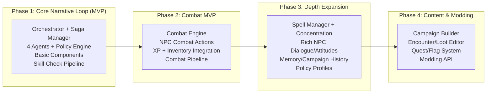

.
# Hybrid D&D Game Assistant Implementation Plan - REVISED
*Progressive Architecture: Simple Start → Full Feature Implementation*

## Overview

This revised plan implements a **hybrid approach** that starts with a simple, playable D&D game but builds the **infrastructure foundation** needed to evolve into the full sophisticated system. **UPDATED** to include all original plan features: Combat MVP, Depth Expansion, and Content & Modding.

**Key Principles:**
- ✅ **Haystack Framework**: Used for all RAG, document processing, and LLM interactions
- ✅ **hwtgenielib**: Used for Apple GenAI chat generators and components
- ✅ **Progressive Architecture**: Simple start with extensible foundation
- ✅ **Original Plan Features**: Combat MVP, Spell Manager, NPC depth, Quest systems, Modding API
- ✅ **Backward Compatibility**: Each phase builds on the previous without breaking changes

---

## Architecture Evolution Path



---

## Phase 1: Core Narrative Loop MVP (Weeks 1-6)
**Goal**: Playable D&D game with full infrastructure foundation

### Week 1-2: Foundation Infrastructure

#### 1.1 Project Setup Following Original Plan Structure
```bash
# Exact structure from original plan
dnd_game/
├── orchestrator/
│   ├── __init__.py
│   ├── router.py               # Single orchestrator routing
│   ├── saga_manager.py         # Multi-step flow tracking  
│   └── context_broker.py       # RAG/Rules query decisions
├── agents/
│   ├── __init__.py
│   ├── rag_agent.py           # RAG Retriever Agent
│   ├── scenario_agent.py      # Scenario Generator Agent
│   ├── npc_agent.py          # NPC & Enemy Controller Agent  
│   └── interface_agent.py    # Main Interface Agent
├── components/
│   ├── __init__.py
│   ├── character_manager.py   # Character Manager
│   ├── dice.py               # Dice Roller
│   ├── rules.py              # Rules Enforcer
│   ├── policy.py             # Policy Engine
│   ├── game_engine.py        # Game Engine (authoritative state)
│   ├── campaign_manager.py   # Campaign Manager
│   ├── combat_engine.py      # Combat Engine (Phase 2 focus)
│   ├── inventory.py          # Inventory/Loot Manager
│   ├── xp.py                 # Experience/Leveling
│   ├── spell_manager.py      # Spell Manager (Phase 3 focus)
│   └── session_manager.py    # Session Manager
├── storage/
│   ├── __init__.py
│   ├── document_store.py     # Document Store / Vector DB
│   └── state_repo.py        # Game state persistence
└── tests/
    ├── e2e/
    ├── contracts/
    └── golden/
```

#### 1.2 Orchestrator with Saga Manager (From Day 1)
```python
# orchestrator/router.py
from typing import Dict, Any, List
from .saga_manager import SagaManager
from .context_broker import ContextBroker

class GameOrchestrator:
    """Single orchestrator with saga tracking from Phase 1"""
    
    def __init__(self):
        # Core infrastructure from start
        self.saga_manager = SagaManager()
        self.context_broker = ContextBroker()
        self.agents = {}
        self.components = {}
        
        # Decision logging from start
        self.decision_logs = []
        
    def route_request(self, request: Dict[str, Any]) -> Dict[str, Any]:
        """Route with saga tracking and decision logging"""
        
        # Start saga if multi-step operation
        saga_id = None
        if self._is_multi_step_operation(request):
            saga_id = self.saga_manager.start_saga(
                request.get("type", "unknown"), request
            )
        
        # Context broker decides RAG/Rules queries needed
        context_needs = self.context_broker.determine_context_needs(request)
        
        # Route to appropriate agent/component
        result = self._execute_request(request, context_needs, saga_id)
        
        # Log decision if applicable
        if saga_id:
            self._log_decision(saga_id, request, result)
        
        return result
```

#### 1.3 Policy Engine (Phase 1 Implementation)
```python
# components/policy.py
from typing import Dict, Any, List
from enum import Enum

class PolicyProfile(Enum):
    RAW = "raw"          # Rules as written
    HOUSE = "house"      # Common house rules  
    EASY = "easy"        # Beginner friendly

class PolicyEngine:
    """Centralized rule mediation from Phase 1"""
    
    PROFILES = {
        PolicyProfile.RAW: {
            "flanking_advantage": False,
            "crit_range": [20],
            "death_saves": "standard",
            "dc_adjustment": 0
        },
        PolicyProfile.HOUSE: {
            "flanking_advantage": True,
            "crit_range": [19, 20], 
            "death_saves": "standard",
            "dc_adjustment": 0
        },
        PolicyProfile.EASY: {
            "flanking_advantage": True,
            "crit_range": [19, 20],
            "death_saves": "forgiving",
            "dc_adjustment": -2
        }
    }
    
    def __init__(self, profile: PolicyProfile = PolicyProfile.RAW):
        self.active_profile = self.PROFILES[profile]
    
    def compute_advantage(self, state: Dict[str, Any], actor: str, skill: str) -> str:
        """Determine advantage/disadvantage from context"""
        # Implementation for advantage computation
        return "normal"  # Basic implementation
    
    def adjust_difficulty(self, base_dc: int, context: Dict[str, Any]) -> int:
        """Apply difficulty scaling"""
        adjustment = self.active_profile.get("dc_adjustment", 0)
        return max(5, base_dc + adjustment)
    
    def passive_score(self, ability_mod: int, prof: int, bonus: int = 0) -> int:
        """Calculate passive scores"""
        return 10 + ability_mod + prof + bonus
```

### Week 3-4: 7-Step Skill Check Pipeline

#### 1.4 Deterministic Skill Check Pipeline
```python
# components/game_engine.py  
from typing import Dict, Any
from .policy import PolicyEngine
from .dice import DiceRoller
from .rules import RulesEnforcer
from .character_manager import CharacterManager

class GameEngine:
    """Authoritative state writer with skill check pipeline"""
    
    def __init__(self):
        self.policy_engine = PolicyEngine()
        self.dice_roller = DiceRoller()
        self.rules_enforcer = RulesEnforcer()
        self.character_manager = CharacterManager()
        self.game_state = self._initialize_state()
        
    def process_skill_check(self, check_request: Dict[str, Any]) -> Dict[str, Any]:
        """7-step deterministic skill check pipeline from original plan"""
        correlation_id = check_request.get("correlation_id", "")
        
        # Step 1: Rules Enforcer → do we need a check? derive DC
        rules_result = self.rules_enforcer.determine_check_needed(check_request)
        if not rules_result["check_needed"]:
            return {"success": True, "auto_success": True}
        
        dc = rules_result["dc"]
        dc_source = rules_result["dc_source"]
        
        # Step 2: Character Manager → skill/ability mod, conditions
        char_data = self.character_manager.get_skill_data(
            check_request["actor"], check_request["skill"]
        )
        
        # Step 3: Policy Engine → advantage/disadvantage, house rules
        advantage_state = self.policy_engine.compute_advantage(
            self.game_state, check_request["actor"], check_request["skill"]
        )
        adjusted_dc = self.policy_engine.adjust_difficulty(dc, check_request)
        
        # Step 4: Dice Roller → raw rolls (logged)
        roll_result = self.dice_roller.skill_roll(
            check_request["skill"], 
            char_data["modifier"],
            advantage_state,
            correlation_id
        )
        
        # Step 5: Rules Enforcer → compare vs DC, success/fail
        success = roll_result["total"] >= adjusted_dc
        
        # Step 6: Game Engine → apply state, log outcome
        outcome = {
            "success": success,
            "roll_total": roll_result["total"],
            "dc": adjusted_dc,
            "dc_source": dc_source,
            "advantage_state": advantage_state,
            "character_modifier": char_data["modifier"]
        }
        self._apply_skill_check_outcome(check_request, outcome)
        
        # Step 7: Decision Log → roll breakdown, DC provenance, advantage sources
        self._log_skill_check_decision(correlation_id, check_request, outcome, roll_result)
        
        return outcome
```

### Week 5-6: Scenario Generator Contract & Basic Components

#### 1.5 Standardized Scenario Generator Contract
```python
# agents/scenario_agent.py
from hwtgenielib.components.generators.chat import AppleGenAIChatGenerator
from hwtgenielib.dataclasses import ChatMessage
from typing import Dict, List, Any

class ScenarioGeneratorAgent:
    """Scenario generator with full contract from Phase 1"""
    
    def __init__(self, rag_agent, verbose: bool = False):
        self.rag_agent = rag_agent
        self.chat_generator = AppleGenAIChatGenerator(
            model="aws:anthropic.claude-sonnet-4-20250514-v1:0"
        )
        
    def generate_scenario(self, context: Dict[str, Any]) -> Dict[str, Any]:
        """Generate with full contract compliance"""
        
        # Get RAG context
        campaign_docs = self.rag_agent.retrieve_context(
            f"campaign {context.get('campaign', '')}", "campaign"
        )
        
        # Build enhanced prompt
        prompt = self._build_contract_prompt(context, campaign_docs)
        
        # Generate with hwtgenielib
        messages = [ChatMessage.from_user(prompt)]
        response = self.chat_generator.run(messages=messages)
        
        if response and "replies" in response:
            scenario_text = response["replies"][0].text
            return self._parse_to_contract_format(scenario_text)
        
        return self._fallback_scenario()
    
    def _parse_to_contract_format(self, text: str) -> Dict[str, Any]:
        """Parse to exact contract format from original plan"""
        return {
            "scene": self._extract_scene_description(text),
            "choices": self._extract_choices_with_metadata(text),
            "effects": self._extract_effects(text),
            "hooks": self._extract_hooks(text)
        }
    
    def _extract_choices_with_metadata(self, text: str) -> List[Dict[str, Any]]:
        """Extract choices with full metadata"""
        choices = []
        choice_lines = self._find_choice_lines(text)
        
        for i, line in enumerate(choice_lines):
            choice = {
                "id": f"c{i+1}",
                "title": self._extract_choice_title(line),
                "description": self._extract_choice_description(line), 
                "skill_hints": self._extract_skills(line),
                "suggested_dc": self._extract_dc_levels(line),
                "combat_trigger": self._has_combat_keywords(line)
            }
            choices.append(choice)
        
        return choices
    
    def _extract_effects(self, text: str) -> List[Dict[str, Any]]:
        """Extract state effects and flags"""
        effects = []
        # Look for flag/state change indicators in text
        if "alert" in text.lower():
            effects.append({"type": "flag", "name": "alert_guard", "value": True})
        if "stealth" in text.lower():
            effects.append({"type": "flag", "name": "stealth_mode", "value": True})
        return effects
    
    def _extract_hooks(self, text: str) -> List[Dict[str, Any]]:
        """Extract quest/story hooks"""
        hooks = []
        # Look for quest progression indicators
        if "rescue" in text.lower():
            hooks.append({"quest": "rescue_mission", "progress": "advance"})
        if "investigate" in text.lower():
            hooks.append({"quest": "investigation", "progress": "start"})
        return hooks
```

### Phase 1 Success Criteria
- [ ] Orchestrator routes all requests through single point
- [ ] Saga Manager tracks multi-step flows with correlation IDs
- [ ] Policy Engine mediates house rules and difficulty
- [ ] 7-step skill check pipeline fully deterministic and logged
- [ ] Scenario Generator outputs full contract format
- [ ] Campaign selection → Scenario → Choices → Consequences working
- [ ] Save/Load with Session Manager functional

---

## Phase 2: Combat MVP (Weeks 7-10)
**Goal**: Full D&D combat system with NPC actions and rewards

### Week 7-8: Combat Engine & Initiative

#### 2.1 Combat Engine Implementation
```python
# components/combat_engine.py
from typing import Dict, List, Any, Optional
from dataclasses import dataclass
from enum import Enum

class CombatState(Enum):
    INACTIVE = "inactive"
    INITIATIVE = "initiative"
    ACTIVE = "active"
    ENDED = "ended"

@dataclass
class Combatant:
    id: str
    name: str
    max_hp: int
    current_hp: int
    armor_class: int
    initiative: int
    is_player: bool
    conditions: List[str] = None
    
    def __post_init__(self):
        if self.conditions is None:
            self.conditions = []

class CombatEngine:
    """Full D&D combat engine from original plan Phase 2"""
    
    def __init__(self, dice_roller, policy_engine):
        self.dice_roller = dice_roller
        self.policy_engine = policy_engine
        self.state = CombatState.INACTIVE
        self.combatants: Dict[str, Combatant] = {}
        self.initiative_order: List[str] = []
        self.current_turn_index = 0
        self.round_number = 0
        
    def start_combat(self, participants: List[Dict[str, Any]]) -> Dict[str, Any]:
        """Initialize combat with initiative rolling"""
        self.state = CombatState.INITIATIVE
        
        # Add all combatants
        for participant in participants:
            combatant = Combatant(
                id=participant["id"],
                name=participant["name"],
                max_hp=participant["max_hp"],
                current_hp=participant["max_hp"],
                armor_class=participant["armor_class"],
                initiative=0,
                is_player=participant.get("is_player", False)
            )
            self.combatants[combatant.id] = combatant
        
        # Roll initiative for all
        initiative_results = self._roll_initiative()
        
        # Set turn order
        self.initiative_order = sorted(
            self.combatants.keys(),
            key=lambda x: self.combatants[x].initiative,
            reverse=True
        )
        
        self.state = CombatState.ACTIVE
        self.current_turn_index = 0
        self.round_number = 1
        
        return {
            "success": True,
            "initiative_results": initiative_results,
            "initiative_order": [
                (id, self.combatants[id].name, self.combatants[id].initiative)
                for id in self.initiative_order
            ],
            "current_combatant": self.get_current_combatant_info()
        }
    
    def process_combat_action(self, action: Dict[str, Any]) -> Dict[str, Any]:
        """Process combat action through validation pipeline"""
        
        # Validate action legality
        validation = self._validate_action(action)
        if not validation["valid"]:
            return {"success": False, "error": validation["reason"]}
        
        # Execute action deterministically
        if action["type"] == "attack":
            return self._process_attack(action)
        elif action["type"] == "spell":
            return self._process_spell(action)
        elif action["type"] == "move":
            return self._process_movement(action)
        else:
            return {"success": False, "error": "Unknown action type"}
    
    def _process_attack(self, action: Dict[str, Any]) -> Dict[str, Any]:
        """Process attack with full D&D rules"""
        attacker_id = action["actor"]
        target_id = action["target"]
        
        attacker = self.combatants[attacker_id]
        target = self.combatants[target_id]
        
        # Attack roll with advantage/disadvantage from Policy Engine
        advantage_state = self.policy_engine.compute_advantage(
            {"combat_state": self.get_combat_state()}, attacker_id, "attack"
        )
        
        attack_roll = self.dice_roller.attack_roll(
            attacker_id, target_id, advantage_state
        )
        
        hit = attack_roll["total"] >= target.armor_class
        result = {
            "success": True,
            "attacker": attacker.name,
            "target": target.name,
            "attack_roll": attack_roll["total"],
            "target_ac": target.armor_class,
            "hit": hit
        }
        
        if hit:
            # Roll damage
            damage_roll = self.dice_roller.damage_roll(
                action.get("weapon", "1d6"), attack_roll.get("critical", False)
            )
            
            # Apply damage
            damage_taken = max(0, damage_roll["total"])
            target.current_hp -= damage_taken
            
            result.update({
                "damage": damage_taken,
                "target_hp": f"{target.current_hp}/{target.max_hp}"
            })
            
            # Check for unconscious/death
            if target.current_hp <= 0:
                if target.is_player:
                    target.conditions.append("unconscious")
                    result["target_unconscious"] = True
                else:
                    result["target_dead"] = True
        
        return result
    
    def next_turn(self) -> Dict[str, Any]:
        """Advance to next turn"""
        self.current_turn_index += 1
        
        if self.current_turn_index >= len(self.initiative_order):
            self.current_turn_index = 0
            self.round_number += 1
            
            # Process start of round effects
            self._process_round_start()
        
        return {
            "success": True,
            "round": self.round_number,
            "current_combatant": self.get_current_combatant_info()
        }
    
    def check_combat_end(self) -> Dict[str, Any]:
        """Check if combat should end"""
        players_alive = any(
            c.is_player and c.current_hp > 0 
            for c in self.combatants.values()
        )
        enemies_alive = any(
            not c.is_player and c.current_hp > 0 
            for c in self.combatants.values()
        )
        
        if not players_alive:
            self.state = CombatState.ENDED
            return {"combat_ended": True, "result": "defeat"}
        elif not enemies_alive:
            self.state = CombatState.ENDED
            return {"combat_ended": True, "result": "victory"}
        
        return {"combat_ended": False}
```

### Week 9-10: NPC Combat Actions & XP/Inventory Integration

#### 2.2 NPC Combat Agent Integration
```python
# agents/npc_agent.py (Enhanced for Combat)
from hwtgenielib.components.generators.chat import AppleGenAIChatGenerator
from typing import Dict, List, Any

class NPCControllerAgent:
    """NPC & Enemy Controller with combat actions"""
    
    def __init__(self, rag_agent):
        self.rag_agent = rag_agent
        self.chat_generator = AppleGenAIChatGenerator(
            model="aws:anthropic.claude-sonnet-4-20250514-v1:0"
        )
        
    def generate_combat_actions(self, combat_state: Dict[str, Any]) -> List[Dict[str, Any]]:
        """Generate NPC combat actions based on tactical situation"""
        
        current_npc = combat_state["current_combatant"]
        if current_npc["is_player"]:
            return []  # Not an NPC turn
        
        # Get tactical context
        tactical_prompt = self._build_tactical_prompt(combat_state, current_npc)
        
        # Generate action using LLM
        messages = [ChatMessage.from_user(tactical_prompt)]
        response = self.chat_generator.run(messages=messages)
        
        if response and "replies" in response:
            action_text = response["replies"][0].text
            return self._parse_combat_actions(action_text, current_npc)
        
        return self._fallback_combat_action(current_npc)
    
    def _build_tactical_prompt(self, combat_state: Dict[str, Any], 
                              npc: Dict[str, Any]) -> str:
        """Build tactical analysis prompt"""
        return f"""You are controlling {npc['name']} in D&D combat.

Current situation:
- {npc['name']} HP: {npc['current_hp']}/{npc['max_hp']}
- Round: {combat_state['round']}
- Enemies visible: {self._list_enemy_targets(combat_state, npc)}
- {npc['name']} conditions: {npc.get('conditions', [])}

Choose the best tactical action:
1. Attack (specify target and weapon/spell)
2. Move (specify position/distance)  
3. Cast Spell (specify spell and target)
4. Use Special Ability
5. Defend/Dodge

Respond with: ACTION_TYPE: [action] TARGET: [target] REASON: [tactical reasoning]"""
    
    def _parse_combat_actions(self, action_text: str, npc: Dict[str, Any]) -> List[Dict[str, Any]]:
        """Parse LLM response into structured combat actions"""
        actions = []
        
        # Parse action type and target
        if "ATTACK" in action_text.upper():
            target = self._extract_target(action_text)
            actions.append({
                "type": "attack",
                "actor": npc["id"],
                "target": target,
                "weapon": self._extract_weapon(action_text, npc)
            })
        elif "SPELL" in action_text.upper():
            spell = self._extract_spell(action_text)
            target = self._extract_target(action_text)
            actions.append({
                "type": "spell",
                "actor": npc["id"],
                "spell": spell,
                "target": target
            })
        elif "MOVE" in action_text.upper():
            actions.append({
                "type": "move",
                "actor": npc["id"],
                "distance": self._extract_movement(action_text)
            })
        
        return actions
```

#### 2.3 XP and Inventory Integration
```python
# components/xp.py (Experience Manager)
from typing import Dict, List, Any

class ExperienceManager:
    """Handle XP awards and leveling from combat"""
    
    def __init__(self):
        self.xp_tables = {
            1: 0, 2: 300, 3: 900, 4: 2700, 5: 6500,
            # ... complete XP table
        }
        
    def calculate_combat_xp(self, defeated_enemies: List[Dict[str, Any]], 
                           party_size: int) -> Dict[str, Any]:
        """Calculate XP from combat encounter"""
        total_xp = 0
        
        for enemy in defeated_enemies:
            enemy_cr = enemy.get("challenge_rating", 0.125)
            xp_value = self._cr_to_xp(enemy_cr)
            total_xp += xp_value
        
        # Apply multiplier for encounter difficulty
        encounter_multiplier = self._calculate_encounter_multiplier(
            len(defeated_enemies), party_size
        )
        
        adjusted_xp = total_xp * encounter_multiplier
        xp_per_player = adjusted_xp // party_size
        
        return {
            "total_encounter_xp": total_xp,
            "adjusted_xp": adjusted_xp,
            "xp_per_player": xp_per_player,
            "encounter_difficulty": self._determine_difficulty(adjusted_xp, party_size)
        }
    
    def award_xp(self, character_id: str, xp_amount: int) -> Dict[str, Any]:
        """Award XP and check for level up"""
        # Implementation for XP tracking and level up checks
        pass

# components/inventory.py (Loot Manager)
class InventoryManager:
    """Handle loot drops and inventory management"""
    
    def __init__(self):
        self.loot_tables = self._load_loot_tables()
        
    def generate_combat_loot(self, defeated_enemies: List[Dict[str, Any]]) -> List[Dict[str, Any]]:
        """Generate loot from defeated enemies"""
        loot = []
        
        for enemy in defeated_enemies:
            enemy_type = enemy.get("type", "humanoid")
            cr = enemy.get("challenge_rating", 0.125)
            
            # Roll on appropriate loot table
            enemy_loot = self._roll_loot_table(enemy_type, cr)
            loot.extend(enemy_loot)
        
        return loot
    
    def _roll_loot_table(self, enemy_type: str, cr: float) -> List[Dict[str, Any]]:
        """Roll on loot table for enemy type and CR"""
        # Implementation for loot table rolling
        pass
```

### Phase 2 Success Criteria
- [ ] Combat Engine handles initiative, basic actions, HP, damage
- [ ] NPC Agent generates intelligent combat actions
- [ ] XP calculation and awards work correctly after combat
- [ ] Inventory system generates appropriate loot
- [ ] Combat pipeline: scenario → combat flags → combat → post-combat scene
- [ ] All combat actions logged with decision provenance

---

## Phase 3: Depth Expansion (Weeks 11-14)
**Goal**: Rich spell system, advanced NPCs, and campaign memory

### Week 11-12: Spell Manager & Concentration Rules

#### 3.1 Comprehensive Spell Manager
```python
# components/spell_manager.py
from typing import Dict, List, Any, Optional
from dataclasses import dataclass
from enum import Enum

class SpellSchool(Enum):
    ABJURATION = "abjuration"
    CONJURATION = "conjuration"
    DIVINATION = "divination"
    ENCHANTMENT = "enchantment"
    EVOCATION = "evocation"
    ILLUSION = "illusion"
    NECROMANCY = "necromancy"
    TRANSMUTATION = "transmutation"

class SpellLevel(Enum):
    CANTRIP = 0
    FIRST = 1
    SECOND = 2
    THIRD = 3
    FOURTH = 4
    FIFTH = 5
    SIXTH = 6
    SEVENTH = 7
    EIGHTH = 8
    NINTH = 9

@dataclass
class Spell:
    name: str
    level: SpellLevel
    school: SpellSchool
    casting_time: str
    range: str
    components: List[str]
    duration: str
    concentration: bool
    description: str
    higher_levels: Optional[str] = None

@dataclass
class ConcentrationEffect:
    caster_id: str
    spell_name: str
    targets: List[str]
    duration_remaining: int
    effects: Dict[str, Any]
    dc: int = 10  # Base concentration DC

class SpellManager:
    """Comprehensive spell system with concentration rules"""
    
    def __init__(self, dice_roller, policy_engine):
        self.dice_roller = dice_roller
        self.policy_engine = policy_engine 
        self.spell_database = self._load_spell_database()
        self.active_concentrations: Dict[str, ConcentrationEffect] = {}
        
    def cast_spell(self, caster_id: str, spell_name: str, spell_level: int,
                   targets: List[str], context: Dict[str, Any]) -> Dict[str, Any]:
        """Cast spell with full D&D mechanics"""
        
        spell = self.spell_database.get(spell_name.lower())
        if not spell:
            return {"success": False, "error": f"Unknown spell: {spell_name}"}
        
        # Check spell slot availability
        slot_check = self._check_spell_slots(caster_id, spell_level)
        if not slot_check["available"]:
            return {"success": False, "error": "No spell slots available"}
        
        # Handle concentration spells
        if spell.concentration:
            self._break_existing_concentration(caster_id)
        
        # Execute spell effects
        spell_result = self._execute_spell_effects(
            spell, caster_id, targets, spell_level, context
        )
        
        # Set up concentration if needed
        if spell.concentration and spell_result["success"]:
            self._start_concentration(
                caster_id, spell_name, targets, spell, spell_level
            )
        
        # Consume spell slot
        self._consume_spell_slot(caster_id, spell_level)
        
        return spell_result
    
    def handle_concentration_damage(self, caster_id: str, damage: int) -> Dict[str, Any]:
        """Handle concentration save when caster takes damage"""
        if caster_id not in self.active_concentrations:
            return {"concentration_maintained": True}
        
        concentration = self.active_concentrations[caster_id]
        
        # Calculate DC (10 or half damage, whichever is higher)
        dc = max(10, damage // 2)
        
        # Roll concentration save (Constitution save)
        save_result = self.dice_roller.constitution_save(caster_id, dc)
        
        if save_result["success"]:
            return {
                "concentration_maintained": True,
                "save_result": save_result
            }
        else:
            # Break concentration
            self._break_concentration(caster_id)
            return {
                "concentration_maintained": False,
                "concentration_broken": True,
                "spell_ended": concentration.spell_name,
                "save_result": save_result
            }
    
    def _start_concentration(self, caster_id: str, spell_name: str, 
                           targets: List[str], spell: Spell, level: int):
        """Start concentration tracking"""
        # Parse duration (e.g., "Concentration, up to 1 minute")
        duration = self._parse_spell_duration(spell.duration)
        
        concentration = ConcentrationEffect(
            caster_id=caster_id,
            spell_name=spell_name,
            targets=targets,
            duration_remaining=duration,
            effects=self._get_spell_effects(spell, level),
            dc=10
        )
        
        self.active_concentrations[caster_id] = concentration
    
    def _break_concentration(self, caster_id: str):
        """Break concentration and end spell effects"""
        if caster_id in self.active_concentrations:
            concentration = self.active_concentrations[caster_id]
            
            # Remove spell effects from targets
            self._remove_spell_effects(concentration)
            
            del self.active_concentrations[caster_id]
    
    def process_turn_end(self, character_id: str):
        """Process concentration duration at turn end"""
        if character_id in self.active_concentrations:
            concentration = self.active_concentrations[character_id]
            concentration.duration_remaining -= 1
            
            if concentration.duration_remaining <= 0:
                self._break_concentration(character_id)
```

### Week 13-14: Rich NPC System & Memory Module

#### 3.2 Advanced NPC Dialogue and Attitudes
```python
# agents/npc_agent.py (Enhanced for Phase 3)
from typing import Dict, List, Any
import json

class NPCControllerAgent:
    """Enhanced NPC system with dialogue and attitudes"""
    
    def __init__(self, rag_agent, memory_manager):
        self.rag_agent = rag_agent
        self.memory_manager = memory_manager
        self.chat_generator = AppleGenAIChatGenerator(
            model="aws:anthropic.claude-sonnet-4-20250514-v1:0"
        )
        
        # NPC relationship tracking
        self.npc_attitudes: Dict[str, Dict[str, Any]] = {}
        self.npc_memories: Dict[str, List[Dict]] = {}
        
    def generate_npc_dialogue(self, npc_id: str, player_input: str, 
                             context: Dict[str, Any]) -> Dict[str, Any]:
        """Generate contextual NPC dialogue with attitude tracking"""
        
        # Get NPC background from RAG
        npc_docs = self.rag_agent.retrieve_context(f"npc {npc_id}", "campaign")
        
        # Get NPC's memory of previous interactions
        npc_history = self.npc_memories.get(npc_id, [])
        
        # Get current attitude toward party
        attitude = self.npc_attitudes.get(npc_id, {
            "disposition": "neutral",
            "trust_level": 50,
            "relationship_status": "stranger"
        })
        
        # Build dialogue prompt
        dialogue_prompt = self._build_dialogue_prompt(
            npc_id, npc_docs, npc_history, attitude, player_input, context
        )
        
        # Generate response
        messages = [ChatMessage.from_user(dialogue_prompt)]
        response = self.chat_generator.run(messages=messages)
        
        if response and "replies" in response:
            dialogue = response["replies"][0].text
            
            # Parse attitude changes from response
            attitude_change = self._parse_attitude_change(dialogue, player_input)
            self._update_npc_attitude(npc_id, attitude_change)
            
            # Store interaction in memory
            self._record_interaction(npc_id, player_input, dialogue)
            
            return {
                "success": True,
                "dialogue": dialogue,
                "attitude_change": attitude_change,
                "current_attitude": self.npc_attitudes[npc_id]
            }
        
        return {"success": False, "error": "Failed to generate dialogue"}
    
    def _build_dialogue_prompt(self, npc_id: str, npc_docs: List, history: List,
                              attitude: Dict, player_input: str, context: Dict) -> str:
        """Build comprehensive dialogue prompt with personality and memory"""
        
        # Extract NPC personality from documents
        personality = self._extract_personality(npc_docs)
        
        prompt = f"""You are {npc_id}, an NPC in a D&D campaign.

PERSONALITY & BACKGROUND:
{personality}

RELATIONSHIP WITH PARTY:
- Disposition: {attitude['disposition']}
- Trust Level: {attitude['trust_level']}/100
- Status: {attitude['relationship_status']}

PREVIOUS INTERACTIONS:
{self._format_interaction_history(history[-3:])}  # Last 3 interactions

CURRENT SITUATION:
{context.get('scene_description', '')}

PLAYER SAYS: "{player_input}"

Respond as {npc_id} would, considering:
1. Your personality and background
2. Your current relationship with the party
3. The context of previous interactions
4. The current situation

Include in your response:
- What you say (in character)
- How your attitude might change based on this interaction
- Any relevant information you might share or withhold

Format: DIALOGUE: [your response] ATTITUDE: [any attitude shift]"""

        return prompt
    
    def _update_npc_attitude(self, npc_id: str, attitude_change: Dict[str, Any]):
        """Update NPC attitude based on interaction"""
        if npc_id not in self.npc_attitudes:
            self.npc_attitudes[npc_id] = {
                "disposition": "neutral",
                "trust_level": 50,
                "relationship_status": "stranger"
            }
        
        attitude = self.npc_attitudes[npc_id]
        
        # Apply changes
        if "trust_change" in attitude_change:
            attitude["trust_level"] = max(0, min(100, 
                attitude["trust_level"] + attitude_change["trust_change"]
            ))
        
        # Update disposition based on trust level
        if attitude["trust_level"] >= 80:
            attitude["disposition"] = "friendly"
            attitude["relationship_status"] = "ally"
        elif attitude["trust_level"] >= 60:
            attitude["disposition"] = "helpful"
            attitude["relationship_status"] = "acquaintance"
        elif attitude["trust_level"] <= 20:
            attitude["disposition"] = "hostile"
            attitude["relationship_status"] = "enemy"
        elif attitude["trust_level"] <= 40:
            attitude["disposition"] = "unfriendly"
            attitude["relationship_status"] = "rival"
```

#### 3.3 Memory Module for Campaign History
```python
# components/memory.py
from typing import Dict, List, Any, Optional
import time
from collections import deque

class CampaignMemoryManager:
    """Manage campaign history and world state summaries"""
    
    def __init__(self, scenario_agent, max_events: int = 500):
        self.scenario_agent = scenario_agent
        self.max_events = max_events
        
        # Event storage
        self.event_history = deque(maxlen=max_events)
        self.session_summaries: List[Dict[str, Any]] = []
        
        # World state tracking
        self.location_states: Dict[str, Dict[str, Any]] = {}
        self.character_arcs: Dict[str, List[Dict]] = {}
        self.story_threads: Dict[str, Dict[str, Any]] = {}
        
        # Summary thresholds
        self.events_per_summary = 25
        
    def record_event(self, event: Dict[str, Any]):
        """Record significant campaign event"""
        event["timestamp"] = time.time()
        event["event_id"] = len(self.event_history)
        
        self.event_history.append(event)
        
        # Update location state
        if "location" in event:
            self._update_location_state(event)
        
        # Update character arcs
        if "characters" in event:
            self._update_character_arcs(event)
        
        # Update story threads
        if "story_thread" in event:
            self._update_story_threads(event)
        
        # Check if summary is needed
        if len(self.event_history) % self.events_per_summary == 0:
            self._create_session_summary()
    
    def get_campaign_context(self, location: Optional[str] = None,
                           characters: Optional[List[str]] = None) -> Dict[str, Any]:
        """Get relevant campaign context for scenario generation"""
        
        context = {
            "recent_events": list(self.event_history)[-10:],  # Last 10 events
            "session_summaries": self.session_summaries[-3:],  # Last 3 summaries
            "active_story_threads": self._get_active_story_threads()
        }
        
        # Add location-specific context
        if location and location in self.location_states:
            context["location_state"] = self.location_states[location]
        
        # Add character-specific context
        if characters:
            context["character_arcs"] = {
                char: self.character_arcs.get(char, [])[-5:]  # Last 5 arc events
                for char in characters
            }
        
        return context
    
    def _create_session_summary(self):
        """Create narrative summary of recent events using LLM"""
        recent_events = list(self.event_history)[-self.events_per_summary:]
        
        summary_prompt = self._build_summary_prompt(recent_events)
        
        # Use scenario agent to create narrative summary
        summary_context = {
            "query": "summarize recent campaign events",
            "events": recent_events,
            "type": "campaign_summary"
        }
        
        # This would call the scenario agent to create a narrative summary
        # summary_result = self.scenario_agent.generate_summary(summary_context)
        
        session_summary = {
            "summary_id": len(self.session_summaries),
            "timestamp": time.time(),
            "events_covered": len(recent_events),
            "narrative_summary": "Generated narrative summary would go here",
            "key_developments": self._extract_key_developments(recent_events)
        }
        
        self.session_summaries.append(session_summary)
    
    def _update_location_state(self, event: Dict[str, Any]):
        """Update location state based on event"""
        location = event["location"]
        
        if location not in self.location_states:
            self.location_states[location] = {
                "first_visited": event["timestamp"],
                "visit_count": 0,
                "notable_events": [],
                "current_state": "normal"
            }
        
        location_state = self.location_states[location]
        location_state["visit_count"] += 1
        location_state["last_visited"] = event["timestamp"]
        
        # Track significant events at this location
        if event.get("significance", "minor") in ["major", "critical"]:
            location_state["notable_events"].append({
                "event": event["description"],
                "timestamp": event["timestamp"]
            })
        
        # Update location state based on event type
        if event.get("type") == "combat":
            location_state["current_state"] = "hostile"
        elif event.get("type") == "peaceful_resolution":
            location_state["current_state"] = "peaceful"
```

### Phase 3 Success Criteria
- [ ] Spell Manager handles concentration rules correctly
- [ ] Spell slots and higher-level casting work properly
- [ ] NPC dialogue system tracks attitudes and relationships
- [ ] NPCs remember previous interactions and respond appropriately
- [ ] Memory module summarizes campaign history for context
- [ ] Policy profiles support different house rule sets

---

## Phase 4: Content & Modding (Weeks 15-18)
**Goal**: Content creation tools and full modding support

### Week 15-16: Campaign Builder & Encounter Editor

#### 4.1 Campaign Builder Tools
```python
# tools/campaign_builder.py
from typing import Dict, List, Any, Optional
import yaml
import json
from pathlib import Path

class CampaignBuilder:
    """Visual campaign creation and editing tools"""
    
    def __init__(self, output_dir: str = "data/campaigns"):
        self.output_dir = Path(output_dir)
        self.template_dir = Path("templates/campaigns")
        
    def create_campaign_wizard(self, campaign_name: str) -> Dict[str, Any]:
        """Interactive campaign creation wizard"""
        
        wizard_data = {
            "campaign_name": campaign_name,
            "created": time.time(),
            "steps_completed": [],
            "current_step": "basic_info"
        }
        
        return {
            "success": True,
            "wizard_id": str(uuid.uuid4()),
            "current_step": "basic_info",
            "step_data": self._get_basic_info_step()
        }
    
    def _get_basic_info_step(self) -> Dict[str, Any]:
        """Campaign basic information step"""
        return {
            "step": "basic_info",
            "title": "Campaign Basic Information",
            "fields": [
                {
                    "name": "title",
                    "type": "text",
                    "label": "Campaign Title",
                    "required": True
                },
                {
                    "name": "theme",
                    "type": "select",
                    "label": "Campaign Theme",
                    "options": ["High Fantasy", "Political Intrigue", "Dungeon Crawl", 
                              "Urban Adventure", "Exploration", "Horror"],
                    "required": True
                },
                {
                    "name": "level_range",
                    "type": "range",
                    "label": "Level Range",
                    "min": 1,
                    "max": 20,
                    "default": [1, 5]
                },
                {
                    "name": "description",
                    "type": "textarea",
                    "label": "Campaign Description",
                    "placeholder": "Brief overview of the campaign setting and goals..."
                }
            ]
        }
    
    def generate_campaign_from_template(self, template_name: str, 
                                      customizations: Dict[str, Any]) -> Dict[str, Any]:
        """Generate campaign from template with customizations"""
        
        template_path = self.template_dir / f"{template_name}.yaml"
        if not template_path.exists():
            return {"success": False, "error": f"Template {template_name} not found"}
        
        # Load template
        with open(template_path) as f:
            template = yaml.safe_load(f)
        
        # Apply customizations
        campaign_data = self._apply_customizations(template, customizations)
        
        # Generate campaign files
        campaign_dir = self.output_dir / customizations["campaign_name"]
        campaign_dir.mkdir(exist_ok=True)
        
        files_created = self._generate_campaign_files(campaign_dir, campaign_data)
        
        return {
            "success": True,
            "campaign_path": str(campaign_dir),
            "files_created": files_created
        }

# tools/encounter_builder.py
class EncounterBuilder:
    """Build and balance encounters with loot tables"""
    
    def __init__(self, monster_db, loot_db):
        self.monster_db = monster_db
        self.loot_db = loot_db
        
    def create_encounter(self, party_level: int, party_size: int,
                        difficulty: str, environment: str) -> Dict[str, Any]:
        """Create balanced encounter"""
        
        # Calculate XP budget based on difficulty
        xp_budget = self._calculate_xp_budget(party_level, party_size, difficulty)
        
        # Select appropriate monsters for environment
        candidate_monsters = self._filter_monsters_by_environment(environment, party_level)
        
        # Build encounter within XP budget
        encounter = self._build_encounter(candidate_monsters, xp_budget)
        
        # Generate appropriate loot
        loot = self._generate_encounter_loot(encounter["monsters"], party_level)
        
        return {
            "encounter_id": str(uuid.uuid4()),
            "difficulty": difficulty,
            "xp_budget": xp_budget,
            "actual_xp": encounter["total_xp"],
            "monsters": encounter["monsters"],
            "loot": loot,
            "tactical_notes": self._generate_tactical_notes(encounter),
            "environment_features": self._get_environment_features(environment)
        }
    
    def create_loot_table(self, table_name: str, cr_range: tuple,
                         loot_types: List[str]) -> Dict[str, Any]:
        """Create custom loot table"""
        
        loot_table = {
            "name": table_name,
            "cr_range": cr_range,
            "entries": []
        }
        
        for loot_type in loot_types:
            entries = self._generate_loot_entries(loot_type, cr_range)
            loot_table["entries"].extend(entries)
        
        return loot_table
```

### Week 17-18: Quest System & Modding API

#### 4.2 Quest/Flag System
```python
# components/quest_system.py
from typing import Dict, List, Any, Optional
from dataclasses import dataclass
from enum import Enum

class QuestStatus(Enum):
    NOT_STARTED = "not_started"
    ACTIVE = "active"
    COMPLETED = "completed"
    FAILED = "failed"
    ABANDONED = "abandoned"

@dataclass 
class QuestObjective:
    id: str
    description: str
    type: str  # "kill", "collect", "talk_to", "reach_location", "flag_check"
    target: str
    current_progress: int = 0
    required_progress: int = 1
    completed: bool = False

@dataclass
class Quest:
    id: str
    name: str
    description: str
    giver: Optional[str]
    objectives: List[QuestObjective]
    status: QuestStatus = QuestStatus.NOT_STARTED
    rewards: Dict[str, Any] = None
    prerequisites: List[str] = None
    
    def __post_init__(self):
        if self.rewards is None:
            self.rewards = {}
        if self.prerequisites is None:
            self.prerequisites = []

class QuestManager:
    """Full quest and flag management system"""
    
    def __init__(self, game_engine):
        self.game_engine = game_engine
        self.quests: Dict[str, Quest] = {}
        self.global_flags: Dict[str, Any] = {}
        self.quest_templates = self._load_quest_templates()
        
    def start_quest(self, quest_id: str, giver: Optional[str] = None) -> Dict[str, Any]:
        """Start a quest if prerequisites are met"""
        
        if quest_id not in self.quest_templates:
            return {"success": False, "error": f"Unknown quest: {quest_id}"}
        
        template = self.quest_templates[quest_id]
        
        # Check prerequisites
        prereq_check = self._check_prerequisites(template.get("prerequisites", []))
        if not prereq_check["met"]:
            return {
                "success": False,
                "error": "Prerequisites not met",
                "missing_prerequisites": prereq_check["missing"]
            }
        
        # Create quest instance
        quest = Quest(
            id=quest_id,
            name=template["name"],
            description=template["description"],
            giver=giver,
            objectives=[
                QuestObjective(**obj) for obj in template["objectives"]
            ],
            status=QuestStatus.ACTIVE,
            rewards=template.get("rewards", {}),
            prerequisites=template.get("prerequisites", [])
        )
        
        self.quests[quest_id] = quest
        
        # Set initial flags
        if "initial_flags" in template:
            for flag_name, flag_value in template["initial_flags"].items():
                self.set_flag(flag_name, flag_value)
        
        return {
            "success": True,
            "quest": quest,
            "message": f"Quest '{quest.name}' started!"
        }
    
    def update_quest_progress(self, quest_id: str, objective_id: str,
                             progress: int = 1) -> Dict[str, Any]:
        """Update progress on quest objective"""
        
        if quest_id not in self.quests:
            return {"success": False, "error": "Quest not active"}
        
        quest = self.quests[quest_id]
        objective = next((obj for obj in quest.objectives if obj.id == objective_id), None)
        
        if not objective:
            return {"success": False, "error": "Objective not found"}
        
        if objective.completed:
            return {"success": False, "error": "Objective already completed"}
        
        objective.current_progress += progress
        
        if objective.current_progress >= objective.required_progress:
            objective.completed = True
            
            # Check if quest is complete
            if all(obj.completed for obj in quest.objectives):
                self._complete_quest(quest_id)
        
        return {
            "success": True,
            "objective_completed": objective.completed,
            "quest_completed": quest.status == QuestStatus.COMPLETED,
            "progress": f"{objective.current_progress}/{objective.required_progress}"
        }
    
    def set_flag(self, flag_name: str, value: Any):
        """Set global flag value"""
        self.global_flags[flag_name] = value
        
        # Check for flag-triggered quest updates
        self._check_flag_triggers(flag_name, value)
    
    def get_flag(self, flag_name: str, default: Any = None) -> Any:
        """Get global flag value"""
        return self.global_flags.get(flag_name, default)
    
    def _check_flag_triggers(self, flag_name: str, value: Any):
        """Check if flag change triggers quest updates"""
        for quest in self.quests.values():
            if quest.status != QuestStatus.ACTIVE:
                continue
                
            for objective in quest.objectives:
                if (objective.type == "flag_check" and 
                    objective.target == flag_name and
                    not objective.completed):
                    
                    # Check if flag value meets objective requirement
                    if self._flag_meets_requirement(value, objective):
                        objective.completed = True
```

#### 4.3 Modding API Framework
```python
# modding/api.py
from typing import Dict, List, Any, Protocol, runtime_checkable
import importlib.util
import inspect
from pathlib import Path

@runtime_checkable
class CampaignPlugin(Protocol):
    """Protocol for campaign plugins"""
    def get_name(self) -> str: ...
    def get_version(self) -> str: ...
    def get_documents(self) -> List[Document]: ...
    def get_scenarios(self) -> List[Dict[str, Any]]: ...
    def get_npcs(self) -> List[Dict[str, Any]]: ...
    def get_quests(self) -> List[Dict[str, Any]]: ...

@runtime_checkable  
class RulePlugin(Protocol):
    """Protocol for rule modification plugins"""
    def get_name(self) -> str: ...
    def get_version(self) -> str: ...
    def modify_policy(self, policy_engine) -> None: ...
    def get_spell_modifications(self) -> Dict[str, Any]: ...
    def get_condition_modifications(self) -> List[Dict[str, Any]]: ...

@runtime_checkable
class ComponentPlugin(Protocol):
    """Protocol for component extension plugins"""
    def get_name(self) -> str: ...
    def get_version(self) -> str: ...
    def extend_component(self, component_name: str, component: Any) -> Any: ...

class ModdingAPI:
    """Safe plugin loading and management system"""
    
    def __init__(self, game_orchestrator):
        self.orchestrator = game_orchestrator
        self.loaded_plugins: Dict[str, Any] = {}
        self.plugin_registry = {
            "campaign": [],
            "rules": [],
            "components": []
        }
        
    def load_plugin(self, plugin_path: Path, plugin_type: str) -> Dict[str, Any]:
        """Load and validate plugin"""
        
        try:
            # Load plugin module
            spec = importlib.util.spec_from_file_location("plugin", plugin_path)
            if not spec or not spec.loader:
                return {"success": False, "error": "Failed to load plugin spec"}
            
            module = importlib.util.module_from_spec(spec)
            spec.loader.exec_module(module)
            
            # Get plugin class
            if not hasattr(module, "Plugin"):
                return {"success": False, "error": "Plugin class not found"}
            
            plugin_class = module.Plugin
            
            # Validate plugin implements correct protocol
            validation = self._validate_plugin(plugin_class, plugin_type)
            if not validation["valid"]:
                return {"success": False, "error": validation["error"]}
            
            # Instantiate plugin
            plugin_instance = plugin_class()
            
            # Register plugin
            plugin_id = f"{plugin_instance.get_name()}_{plugin_instance.get_version()}"
            self.loaded_plugins[plugin_id] = plugin_instance
            self.plugin_registry[plugin_type].append(plugin_id)
            
            # Apply plugin modifications
            self._apply_plugin(plugin_instance, plugin_type)
            
            return {
                "success": True,
                "plugin_id": plugin_id,
                "name": plugin_instance.get_name(),
                "version": plugin_instance.get_version()
            }
            
        except Exception as e:
            return {"success": False, "error": f"Plugin loading failed: {str(e)}"}
    
    def _validate_plugin(self, plugin_class: type, plugin_type: str) -> Dict[str, Any]:
        """Validate plugin implements required protocol"""
        
        protocols = {
            "campaign": CampaignPlugin,
            "rules": RulePlugin,
            "components": ComponentPlugin
        }
        
        if plugin_type not in protocols:
            return {"valid": False, "error": f"Unknown plugin type: {plugin_type}"}
        
        protocol = protocols[plugin_type]
        
        # Check if class implements protocol
        if not issubclass(plugin_class, protocol):
            # Manual protocol checking
            required_methods = [name for name, _ in inspect.getmembers(protocol, inspect.isfunction)]
            class_methods = [name for name, _ in inspect.getmembers(plugin_class, inspect.ismethod)]
            
            missing_methods = [method for method in required_methods if method not in class_methods]
            
            if missing_methods:
                return {
                    "valid": False,
                    "error": f"Plugin missing required methods: {missing_methods}"
                }
        
        return {"valid": True}
    
    def _apply_plugin(self, plugin: Any, plugin_type: str):
        """Apply plugin modifications to game system"""
        
        if plugin_type == "campaign":
            # Add campaign content
            documents = plugin.get_documents()
            self.orchestrator.rag_agent.add_documents(documents)
            
            # Register scenarios, NPCs, quests
            scenarios = plugin.get_scenarios()
            npcs = plugin.get_npcs()
            quests = plugin.get_quests()
            
            # Add to appropriate managers
            # Implementation would integrate with existing systems
            
        elif plugin_type == "rules":
            # Apply rule modifications
            plugin.modify_policy(self.orchestrator.policy_engine)
            
            # Apply spell modifications
            spell_mods = plugin.get_spell_modifications()
            self.orchestrator.spell_manager.apply_modifications(spell_mods)
            
        elif plugin_type == "components":
            # Extend components
            for component_name in ["combat_engine", "character_manager", "spell_manager"]:
                if hasattr(self.orchestrator, component_name):
                    component = getattr(self.orchestrator, component_name)
                    extended_component = plugin.extend_component(component_name, component)
                    setattr(self.orchestrator, component_name, extended_component)
```

### Phase 4 Success Criteria
- [ ] Campaign builder creates structured campaigns from templates
- [ ] Encounter builder balances encounters and generates loot
- [ ] Quest system tracks objectives and manages flags
- [ ] Modding API loads plugins safely with validation
- [ ] Content creators can build campaigns without coding
- [ ] Plugin system supports campaign, rule, and component extensions

---

## Integration & Backward Compatibility Strategy

### Maintaining Compatibility Across Phases
```python
# Example: Phase 1 → Phase 2 Integration
class GameOrchestrator:
    def __init__(self):
        # Phase 1 components (always present)
        self.router = Router()
        self.saga_manager = SagaManager()
        self.policy_engine = PolicyEngine()
        
        # Phase 2 components (added seamlessly)
        self.combat_engine = None
        self.xp_manager = None
        self.inventory_manager = None
        
        # Phase 3 components (added seamlessly)
        self.spell_manager = None