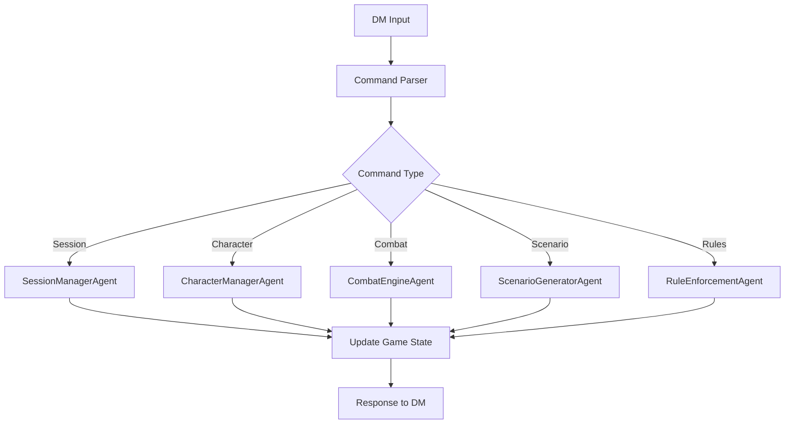
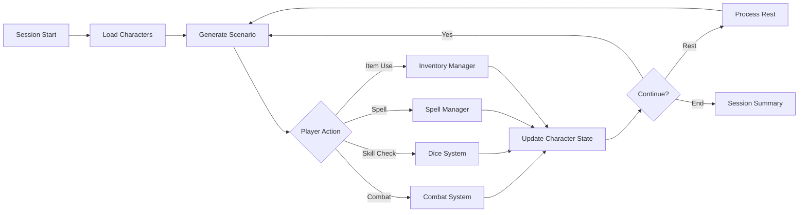

# Improved D&D Assistant Architecture Design

This document outlines the streamlined architecture design for the Modular DM Assistant, addressing redundancies and improving D&D gameplay consistency.

## Current Issues Summary

### Major Problems Identified:
1. **Dual RAG Systems**: Both `HaystackPipelineAgent` and `RAGAgent` create confusion and redundancy
2. **Over-Engineering**: Complex pipeline routing adds overhead without proportional benefit
3. **Missing Core D&D Features**: No inventory, spells, XP, or proper session management
4. **Inconsistent Game Flow**: Poor integration between scenario generation and other systems
5. **Performance Overhead**: Unnecessary monitoring and caching complexity

## Improved Architecture Overview

### Core Principle: **Simplicity with D&D Focus**
- Single RAG system for consistency
- Direct agent communication instead of complex routing
- Core D&D mechanics as first-class citizens
- Session-based workflow alignment

## New Architecture Layers

### 1. **Foundation Layer**
```
┌─────────────────────────────────────┐
│           AgentOrchestrator         │ ← Message bus and coordination
└─────────────────────────────────────┘
┌─────────────────────────────────────┐
│        HaystackPipelineAgent        │ ← Single RAG system
└─────────────────────────────────────┘
```

### 2. **Session Management Layer** (New)
```
┌─────────────────────────────────────┐
│         SessionManagerAgent         │ ← Time, rests, session notes
├─────────────────────────────────────┤
│        CampaignManagerAgent         │ ← Campaign data and context
├─────────────────────────────────────┤
│          GameEngineAgent            │ ← Game state persistence
└─────────────────────────────────────┘
```

### 3. **Character Management Layer** (Enhanced)
```
┌─────────────────────────────────────┐
│       CharacterManagerAgent         │ ← Enhanced player management
├─────────────────────────────────────┤
│       InventoryManagerAgent         │ ← Equipment and items (NEW)
├─────────────────────────────────────┤
│        SpellManagerAgent            │ ← Spells and magic (NEW)
├─────────────────────────────────────┤
│      ExperienceManagerAgent         │ ← XP and leveling (NEW)
└─────────────────────────────────────┘
```

### 4. **Gameplay Layer** (Streamlined)
```
┌─────────────────────────────────────┐
│      ScenarioGeneratorAgent         │ ← Story and encounter generation
├─────────────────────────────────────┤
│        CombatEngineAgent            │ ← Combat mechanics
├─────────────────────────────────────┤
│         DiceSystemAgent             │ ← Dice rolling and checks
├─────────────────────────────────────┤
│        NPCControllerAgent           │ ← NPC behavior
├─────────────────────────────────────┤
│      RuleEnforcementAgent           │ ← D&D rules and mechanics
└─────────────────────────────────────┘
```

## Data Flow Improvements

### Simplified Command Processing Flow


### Integrated D&D Session Flow


## New Agent Specifications

### **SessionManagerAgent** (New)
**Purpose**: Manage D&D session lifecycle and time tracking

**Key Methods**:
- `start_session()` - Initialize new game session
- `process_rest(rest_type)` - Handle short/long rests
- `track_time(minutes)` - Update in-game time
- `end_session()` - Generate session summary
- `get_session_status()` - Current session information

**Integration**: Updates all character resources, manages campaign calendar

### **InventoryManagerAgent** (New)
**Purpose**: Track equipment, items, and inventory management

**Key Methods**:
- `get_character_inventory(character_name)` - Get full inventory
- `add_item(character_name, item)` - Add item to inventory
- `use_item(character_name, item_name)` - Use consumable item
- `equip_item(character_name, item_name)` - Equip weapon/armor
- `transfer_item(from_char, to_char, item)` - Item trading

**Integration**: Provides combat bonuses, affects skill checks, manages encumbrance

### **SpellManagerAgent** (New)
**Purpose**: Handle spellcasting, spell slots, and magical effects

**Key Methods**:
- `get_spell_slots(character_name)` - Current spell slot status
- `cast_spell(character_name, spell_name, level)` - Cast spell and consume slot
- `restore_spell_slots(character_name, rest_type)` - Restore slots on rest
- `get_known_spells(character_name)` - List available spells
- `apply_spell_effect(target, spell, duration)` - Apply ongoing effects

**Integration**: Affects combat, skill checks, and scenario outcomes

### **ExperienceManagerAgent** (New)
**Purpose**: Track experience points and character progression

**Key Methods**:
- `award_xp(character_names, amount, reason)` - Award experience points
- `check_level_up(character_name)` - Check if character can level up
- `process_level_up(character_name)` - Handle leveling process
- `get_xp_status(character_name)` - Current XP and next level requirement
- `milestone_progression(party, milestone)` - Alternative progression system

**Integration**: Triggered by combat victories, quest completion, good roleplay

## Removed Components

### **Eliminated for Simplicity**:
- `SmartPipelineRouter` - Direct agent calls instead
- `ErrorRecoveryPipeline` - Simple try/catch error handling
- `CreativeGenerationPipeline` - Integrated into ScenarioGeneratorAgent
- `FactualRetrievalPipeline` - Direct HaystackPipelineAgent usage
- `RulesQueryPipeline` - Direct RuleEnforcementAgent usage
- `HybridCreativeFactualPipeline` - Unnecessary abstraction
- `PerformanceMonitoringDashboard` - Overhead without benefit
- `AdaptiveErrorRecovery` - Over-engineered for use case
- `NarrativeContinuityTracker` - Logic moved to ScenarioGeneratorAgent
- `RAGAgent` - Replaced by single HaystackPipelineAgent

### **Simplified Systems**:
- **Caching**: Basic key-value for static content only
- **Error Handling**: Standard try/catch with simple fallbacks
- **Message Routing**: Direct agent-to-agent communication
- **Performance**: Remove monitoring overhead

## Command Structure Improvements

### **New Command Categories**:

#### Session Management
```
- "start session" - Begin new game session
- "end session" - Close session and save progress
- "short rest" - 1-hour rest, restore some resources
- "long rest" - 8-hour rest, restore all resources
- "time [amount]" - Advance game time
```

#### Character Management
```
- "hp [character] [±amount]" - Adjust character HP
- "xp [amount] [reason]" - Award experience points
- "level up [character]" - Process character leveling
- "inventory [character]" - Show character inventory
- "equip [character] [item]" - Equip item
- "cast [character] [spell]" - Cast spell
```

#### Enhanced Gameplay
```
- "initiative" - Roll initiative for all participants
- "condition [character] [condition]" - Apply status condition
- "heal [character] [amount]" - Restore HP
- "restore [character] [resource]" - Restore spell slots/abilities
```

## Implementation Priority Order

### **Phase 1: Core Cleanup** (Highest Priority)
1. Remove RAGAgent and consolidate to HaystackPipelineAgent
2. Eliminate complex pipeline routing
3. Simplify caching and error handling
4. Remove performance monitoring overhead

### **Phase 2: Essential D&D Features** (High Priority)
1. Implement SessionManagerAgent
2. Add basic inventory management
3. Enhance character state tracking
4. Improve combat integration

### **Phase 3: Advanced Features** (Medium Priority)
1. Add SpellManagerAgent
2. Implement ExperienceManagerAgent  
3. Enhanced session management
4. Advanced character progression

### **Phase 4: Polish** (Lower Priority)
1. Improved command parsing
2. Better error messages
3. Enhanced save/load functionality
4. Documentation and help system

## Benefits of New Architecture

### **For Developers**:
- **Reduced Complexity**: Fewer abstraction layers
- **Better Maintainability**: Clear separation of concerns
- **Easier Testing**: Simpler component interactions
- **Focused Codebase**: D&D-specific functionality

### **For Users (DMs)**:
- **Proper D&D Flow**: Sessions, rests, progression work correctly
- **Character Management**: Full character state tracking
- **Integrated Systems**: Combat, spells, inventory work together
- **Intuitive Commands**: Natural D&D terminology

### **Performance Benefits**:
- **Reduced Overhead**: No unnecessary monitoring or routing
- **Faster Response**: Direct agent communication
- **Lower Memory Usage**: Simplified caching and state management
- **Better Reliability**: Fewer failure points

## Migration Strategy

### **Backward Compatibility**:
- Existing save files remain compatible
- Current commands continue to work
- Gradual feature enhancement without breaking changes

### **Testing Strategy**:
- Unit tests for each new agent
- Integration tests for D&D workflows
- Performance benchmarks vs current system
- User acceptance testing with actual D&D sessions

This improved architecture provides a solid foundation for a D&D-focused assistant that matches actual gameplay patterns while maintaining simplicity and reliability.