# Merged Modular DM Assistant — Final Architecture & Implementation Instructions (Revised)

This document merges the original proposal with the key adjustments you approved:

- **Keep CharacterManagerAgent** as a dedicated agent.
- Remove AdaptiveErrorRecovery.
- Remove RAGAgent duplication.
- Simplify command handling with a single mapping.
- Inline cache logic (no separate CacheManager file).
- Use built-in logging with a debug flag instead of a DebugLogger middleware.
- Reduce middleware layers.

---

## Revised Architecture Diagram

```mermaid
flowchart TB
    User[👤 DM User Input] --> DMA[🎭 ModularDMAssistant]
    DMA --> CR[📜 Command Map]
    CR --> AO[🤖 AgentOrchestrator]
    AO --> CMA[📚 CampaignManagerAgent]
    AO --> ChMA[🧑‍🤝‍🧑 CharacterManagerAgent]
    AO --> GEA[⚙️ GameEngineAgent]
    AO --> SMA[🕒 SessionManagerAgent]
    AO --> InvA[🎒 InventoryManagerAgent]
    AO --> SpA[✨ SpellManagerAgent]
    AO --> XPA[📈 ExperienceManagerAgent]
    AO --> SGA[🎲 ScenarioGeneratorAgent]
    AO --> CEA[⚔️ CombatEngineAgent]
    AO --> DSA[🎲 DiceSystemAgent]
    AO --> NCA[👥 NPCControllerAgent]
    AO --> REA[📖 RuleEnforcementAgent]
    AO --> HPA[🔍 HaystackPipelineAgent]
    SGA --> NCT[📈 Narrative Continuity]
    NCT --> HPA
    GEA --> Save[💾 Save/Load System]
```

---

## Step-by-Step Implementation Guide for Coding Assistant

### Step 1 — Preparation

- Create branch: `feature/revised-merged-architecture`.
- Add `pytest` test harness with `tests/test_smoke.py` importing `ModularDMAssistant`.

### Step 2 — Remove Redundancies

1. Delete `RAGAgent`; replace all references with `HaystackPipelineAgent`.
2. Remove `AdaptiveErrorRecovery`; replace with a simple retry in `AgentOrchestrator`.
3. Remove any standalone `CacheManager` and integrate cache functions directly into `ModularDMAssistant`.
4. Delete `DebugLogger` middleware; enable `logging` with a `debug` flag.

### Step 3 — Command Routing

1. Add `COMMAND_MAP` to `ModularDMAssistant`: dictionary mapping commands/patterns to `(agent, action)`.
2. In `process_dm_input()`, match input against `COMMAND_MAP` and route accordingly.
3. Keep matching simple; avoid over-engineering.

### Step 4 — Inline Cache Logic

1. Add `_cache_get(key)` and `_cache_set(key, value, ttl)` methods.
2. Only cache:
   - Rule lookups
   - Scenario generation results
3. Never cache dice rolls.

### Step 5 — Agents to Implement or Modify

- **CharacterManagerAgent**: manage player/NPC stats, HP, XP, and attributes.
- **SessionManagerAgent**: session lifecycle, rest handling, in-game time tracking.
- **InventoryManagerAgent**: manage items, add/remove/use/equip.
- **SpellManagerAgent**: spell slots, casting, restoration, and active effects.
- **ExperienceManagerAgent**: XP awards, level checks, and progression.

### Step 6 — Gameplay Flow Improvements

1. Move combat parsing into `CombatEngineAgent.start_combat_from_text()`.
2. Consolidate all scenario continuity logic into `ScenarioGeneratorAgent.get_enriched_context()`.
3. After scenario resolution, coordinate:
   - XP updates via `ExperienceManagerAgent`
   - Inventory changes via `InventoryManagerAgent`
   - Spell effects via `SpellManagerAgent`
4. Implement `save_game()` and `load_game()` in `GameEngineAgent` to include all agent states.

### Step 7 — Reliability & Debugging

1. Add a retry wrapper in `AgentOrchestrator` for transient errors.
2. Enable `--debug` CLI flag or `debug=True` parameter to `ModularDMAssistant`.
3. Add integration test:
   - Start session → Generate scenario → Start combat → Award XP → Save → Load → Verify state integrity.

### Step 8 — Cleanup

1. Remove all unused files and legacy routing after successful testing.
2. Update README with new architecture and commands.

---

## Acceptance Criteria

- One RAG system only (`HaystackPipelineAgent`).
- No `AdaptiveErrorRecovery`.
- Command routing via `COMMAND_MAP` works.
- Inline TTL cache implemented and functional.
- All agents operational with unit tests.
- Combat parsing isolated in `CombatEngineAgent`.
- Save/Load restores full game state.

