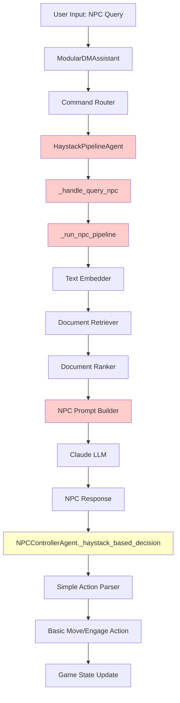
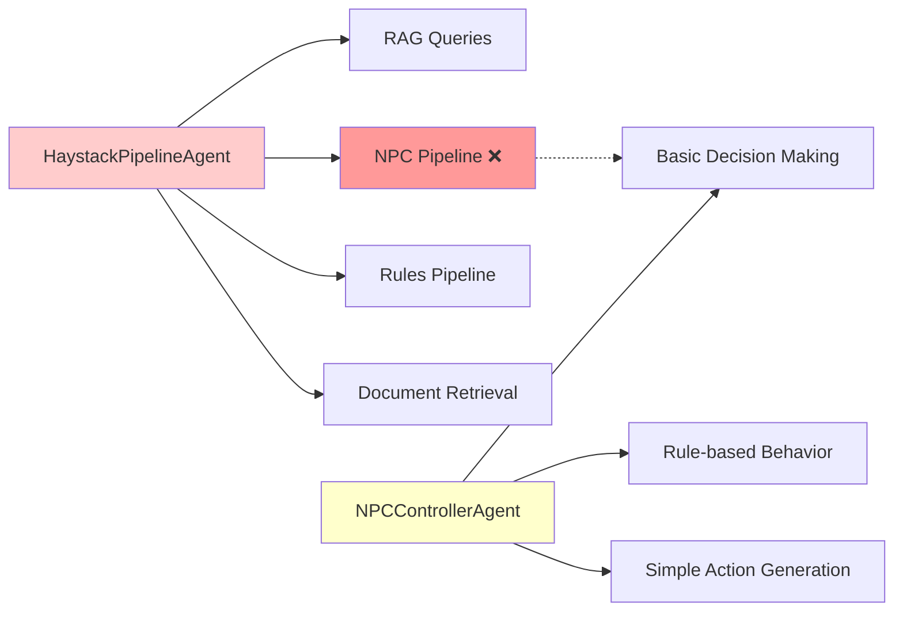
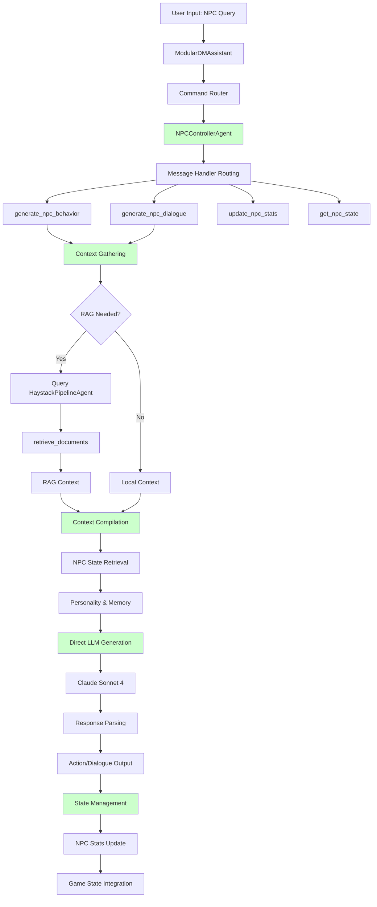
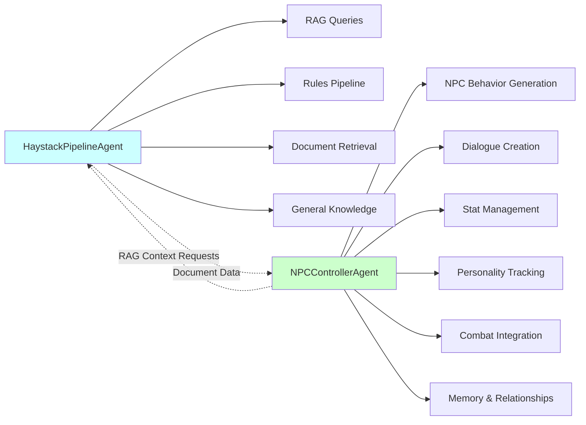
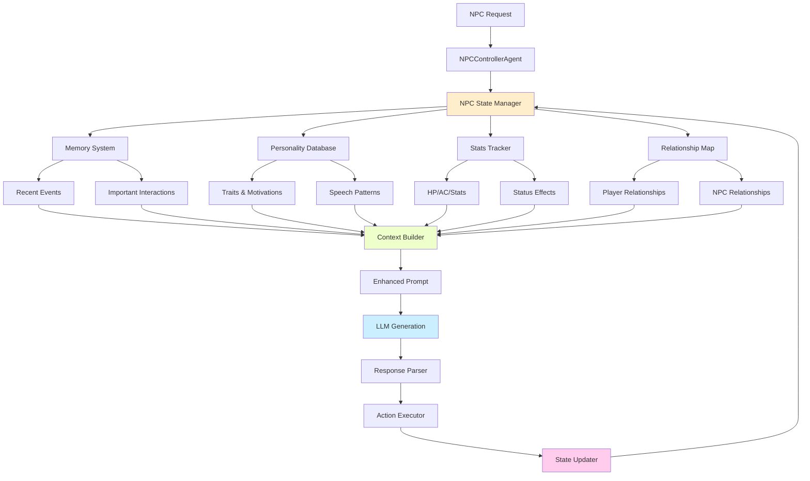
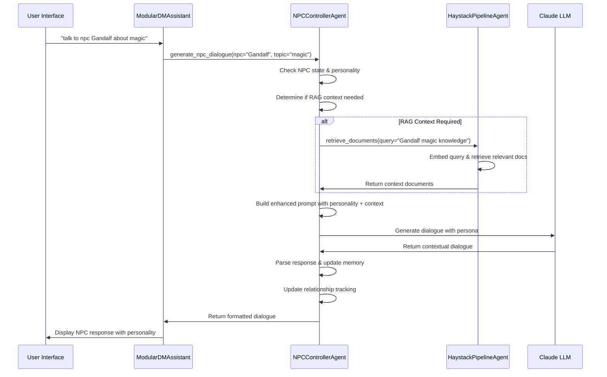
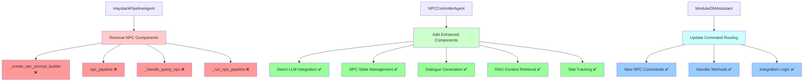
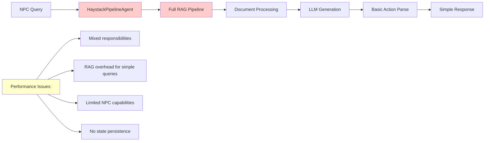
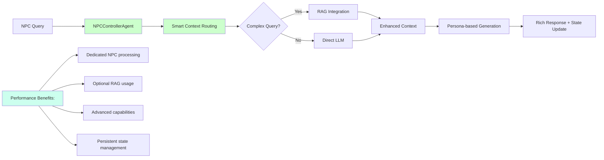
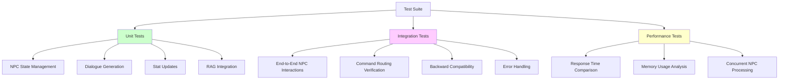

# NPC Pipeline Separation - Architectural Diagrams

## Current Architecture (Before Separation)

### Current NPC Processing Flow

### Current Agent Responsibilities

## Proposed Architecture (After Separation)

### Enhanced NPC Processing Flow

### Separated Agent Responsibilities

## Data Flow Architecture

### NPC State Management System

### RAG Integration Flow

## Component Migration Map

### Files to Modify

## Performance Comparison

### Before Separation (Current)

### After Separation (Proposed)

## Integration Testing Strategy

### Test Scenarios Flow

These architectural diagrams illustrate the comprehensive transformation from the current embedded NPC functionality to a dedicated, enhanced NPC management system that provides superior capabilities while maintaining clean separation of concerns.