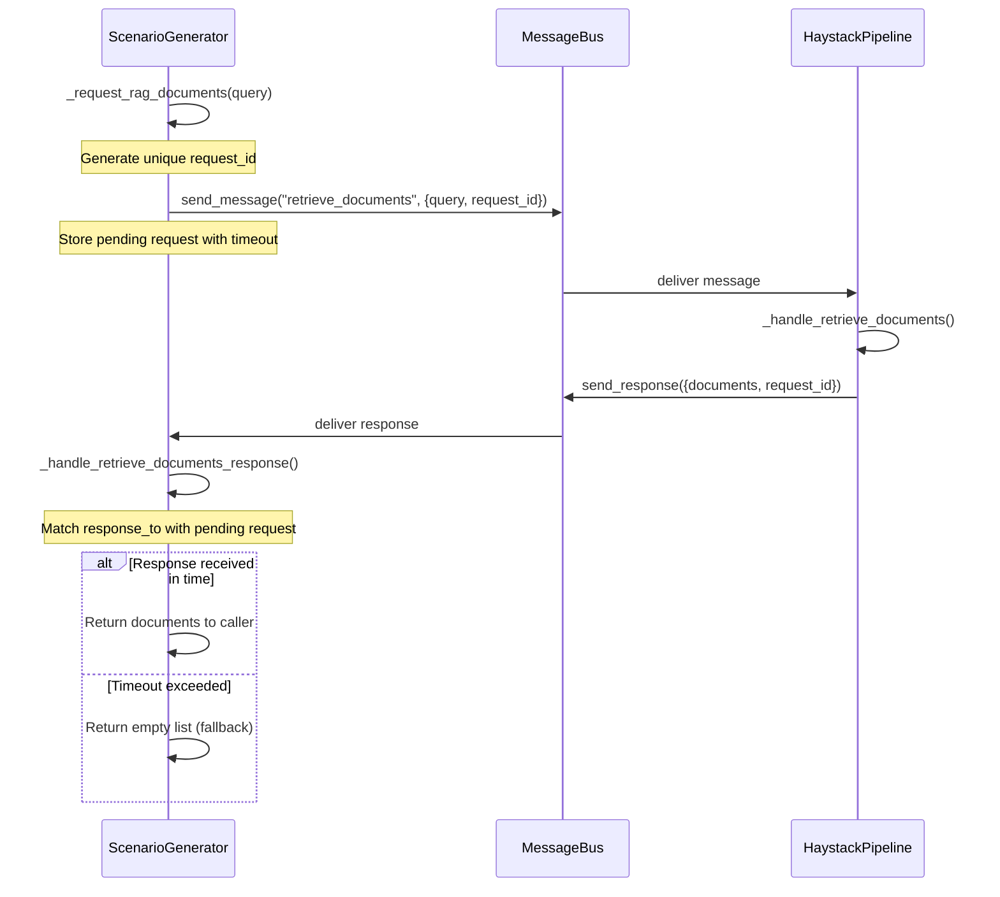

# ScenarioGenerator Async RAG Implementation Plan

## Problem Statement

The current [`_request_rag_documents`](agents/scenario_generator.py:75-107) function in ScenarioGeneratorAgent sends an async message to the haystack pipeline but immediately returns an empty list after a timeout, completely bypassing the RAG-first approach. This defeats the purpose of RAG enhancement and results in always falling back to creative generation.

## Current Implementation Issues

1. **No Response Handling**: The function sends a message but doesn't wait for or process responses
2. **Immediate Fallback**: Always returns empty list, causing RAG to never be used
3. **Missing Handler**: No message handler to receive `retrieve_documents` responses
4. **Broken Async Pattern**: Uses synchronous sleep instead of async response correlation

## Solution Architecture

### Overview
Implement a proper async request-response correlation system with timeout handling that allows ScenarioGenerator to:
1. Send RAG document requests to HaystackPipeline
2. Wait for responses with configurable timeout
3. Process retrieved documents when available
4. Gracefully fall back to creative generation on timeout/failure

### Communication Flow



## Implementation Plan

### Phase 1: Data Structures and Request Tracking

#### 1.1 Add Pending Request Tracking
```python
# Add to __init__
self.pending_rag_requests: Dict[str, Dict[str, Any]] = {}
self.rag_request_lock = threading.Lock()
```

#### 1.2 Pending Request Structure
```python
{
    "message_id": {
        "query": str,
        "max_docs": int, 
        "timestamp": float,
        "timeout": float,
        "event": threading.Event(),  # For signaling completion
        "result": List[Dict[str, Any]]  # Stores response documents
    }
}
```

### Phase 2: Message Handler Registration

#### 2.1 Update _setup_handlers()
Add handler for receiving RAG responses:
```python
def _setup_handlers(self):
    # Existing handlers...
    self.register_handler("retrieve_documents_response", self._handle_retrieve_documents_response)
```

#### 2.2 Implement Response Handler
```python
def _handle_retrieve_documents_response(self, message: AgentMessage):
    """Handle response from haystack pipeline with retrieved documents"""
    # Extract response data
    # Match with pending request using response_to field
    # Store documents and signal completion event
    # Clean up completed request
```

### Phase 3: Async Request Implementation

#### 3.1 Refactor _request_rag_documents()
```python
def _request_rag_documents(self, query: str, max_docs: int = MAX_RAG_DOCUMENTS, timeout: float = RAG_REQUEST_TIMEOUT) -> List[Dict[str, Any]]:
    """
    Request RAG documents with proper async handling and timeout
    
    Flow:
    1. Generate unique message_id
    2. Store pending request with threading.Event
    3. Send message to haystack_pipeline
    4. Wait for response with timeout using Event.wait()
    5. Return documents or empty list on timeout
    """
```

#### 3.2 Core Implementation Logic
1. **Request Creation**: Generate unique request ID and store in pending requests
2. **Message Sending**: Send retrieve_documents message with request ID
3. **Response Waiting**: Use threading.Event.wait(timeout) for blocking wait
4. **Result Processing**: Extract documents from completed request or handle timeout
5. **Cleanup**: Remove completed/timed-out requests from tracking

### Phase 4: Response Processing and Cleanup

#### 4.1 Response Correlation
- Use `message.response_to` field to match responses with original requests
- Validate response data format and extract documents
- Signal completion using threading.Event.set()

#### 4.2 Timeout Handling
- Implement cleanup mechanism for expired requests
- Log timeout events for monitoring
- Ensure graceful fallback to creative generation

#### 4.3 Error Handling
- Handle malformed responses gracefully
- Log errors without breaking the request flow
- Maintain RAG metrics for monitoring

### Phase 5: Integration and Testing

#### 5.1 Update Comment Implementation
Replace the current comment block:
```python
#Wait for <timeout> to see if a message from haystack_pipeline with action of retrieve_documents is received. 
#if received, use the documents in the query to generate scenario 
#if not received in RAG_REQUEST_TIMEOUT, default to _generate_creative_scenario
```

With the actual implementation described above.

#### 5.2 Verification Points
- [ ] RAG requests are properly tracked and correlated
- [ ] Timeout mechanism works correctly
- [ ] Documents are successfully retrieved and used
- [ ] Fallback to creative generation works on timeout/failure
- [ ] No memory leaks from uncleaned pending requests
- [ ] Threading safety with concurrent requests

## Technical Considerations

### Threading Safety
- Use `threading.Lock()` for protecting pending request dictionary
- Use `threading.Event()` for signaling between threads
- Ensure atomic operations for request lifecycle management

### Performance
- Limit maximum concurrent RAG requests to prevent resource exhaustion
- Implement request cleanup to prevent memory leaks
- Use appropriate timeout values to balance responsiveness vs success rate

### Error Recovery
- Graceful degradation when RAG pipeline is unavailable
- Proper logging for debugging and monitoring
- Maintain RAG success/failure metrics

### Configuration
- Configurable timeout values via constants
- Adjustable max concurrent requests
- Debug logging controls via verbose flag

## Implementation Order

1. **Data Structures**: Add request tracking and threading primitives
2. **Response Handler**: Implement message handler for RAG responses  
3. **Request Refactor**: Replace current _request_rag_documents implementation
4. **Integration**: Update _setup_handlers and test end-to-end flow
5. **Error Handling**: Add comprehensive error handling and logging
6. **Testing**: Verify timeout, success, and failure scenarios

## Success Criteria

- [ ] RAG documents are successfully retrieved and used for scenario generation
- [ ] Timeout mechanism prevents hanging requests
- [ ] Fallback to creative generation works seamlessly
- [ ] No degradation in system performance or stability
- [ ] Comprehensive logging for debugging and monitoring
- [ ] Thread-safe operation under concurrent load

## Rollback Plan

If implementation causes issues:
1. Revert to current implementation (always return empty list)
2. Disable RAG functionality via configuration flag
3. Fall back to pure creative generation mode

This ensures system stability while allowing for iterative improvement.