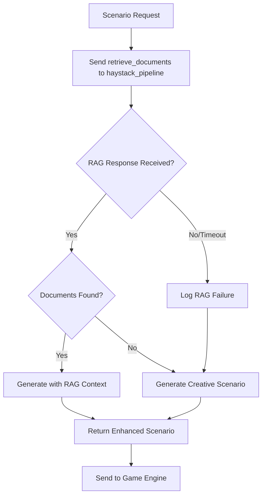

# Scenario Generator RAG Integration Cleanup Plan

## Overview

This document outlines the architectural changes needed to clean up the `agents/scenario_generator.py` code to implement a proper RAG-first approach with orchestrator communication for scenario generation.

## Current Issues Analysis

### 1. Inconsistent RAG Integration
- **Problem**: The current code has mixed approaches - sometimes trying RAG, sometimes skipping it
- **Location**: Lines 156-159, 203-211, 276-284
- **Impact**: Inconsistent user experience and underutilized RAG capabilities

### 2. Incomplete Async Communication
- **Problem**: Agent communication is async, but code doesn't properly handle waiting for responses
- **Location**: Lines 204-211, 276-283
- **Impact**: RAG responses may not be received before fallback execution

### 3. Synchronous RAG Calls in Async Environment
- **Problem**: Code attempts synchronous RAG calls using `self.send_message()` but doesn't wait for responses
- **Location**: Lines 204-207, 276-279
- **Impact**: RAG context is lost, always falls back to creative generation

### 4. Mixed Communication Patterns
- **Problem**: Some methods use orchestrator communication, others bypass it
- **Location**: Throughout the file, inconsistent patterns
- **Impact**: Violates architectural principles and creates maintenance issues

### 5. Redundant Code Paths
- **Problem**: Multiple similar methods with slightly different RAG integration approaches
- **Location**: `generate()`, `_handle_generate_with_context()`, `apply_player_choice()`
- **Impact**: Code duplication and maintenance burden

## Proposed Architecture: RAG-First with Orchestrator Communication

### Core Principles

1. **RAG-First**: Always attempt RAG document retrieval before creative generation
2. **Orchestrator Communication**: All inter-agent communication goes through the message bus
3. **Graceful Fallback**: If RAG fails or returns no results, fallback to creative generation
4. **Consistent Interface**: Standardize all scenario generation methods

### New Workflow Design



## Implementation Plan

### Phase 1: Message Handler Restructuring

#### 1.1 Simplify Message Handlers
- **Target**: Reduce handler complexity and improve consistency
- **Changes**:
  - Remove `_handle_generate_with_context()` - merge into `_handle_generate_scenario()`
  - Standardize all handlers to use the same RAG-first pattern
  - Improve error handling and response formatting

#### 1.2 Create Unified RAG Request Method
- **Target**: Single method for all RAG document retrieval
- **Method**: `_request_rag_documents(query: str, max_docs: int = 3) -> List[Dict]`
- **Features**:
  - Sends message to haystack_pipeline agent
  - Implements timeout handling (since async responses may be delayed)
  - Returns empty list on failure (graceful degradation)

### Phase 2: Core Method Refactoring

#### 2.1 Refactor `generate()` Method
- **Current Issues**: Mixed RAG integration, synchronous calls in async environment
- **New Approach**:
  ```python
  def generate(self, state: Dict[str, Any]) -> Tuple[str, str]:
      # 1. Build scenario seed
      seed = self._seed_scene(state)
      prompt = self._build_creative_prompt(seed)
      
      # 2. Request RAG documents (with timeout)
      documents = self._request_rag_documents(prompt, max_docs=3)
      
      # 3. Generate scenario (RAG-enhanced or creative fallback)
      if documents:
          scenario = self._generate_rag_enhanced_scenario(prompt, documents, seed)
      else:
          scenario = self._generate_creative_scenario(prompt, [], seed.get('story_arc', ''), str(seed))
      
      # 4. Format and return response
      return self._format_scenario_response(scenario, seed)
  ```

#### 2.2 Refactor `apply_player_choice()` Method
- **Current Issues**: Similar RAG integration inconsistencies
- **New Approach**: Apply same RAG-first pattern for choice consequences

#### 2.3 Create New Helper Methods
- **`_request_rag_documents()`**: Unified RAG request handling
- **`_generate_rag_enhanced_scenario()`**: Scenario generation with RAG context
- **`_format_scenario_response()`**: Consistent response formatting
- **`_create_timeout_handler()`**: Handle async communication timeouts

### Phase 3: Communication Pattern Standardization

#### 3.1 Standardize Message Sending
- **Target**: All haystack_pipeline communication uses consistent patterns
- **Implementation**:
  - Use `send_message()` for all inter-agent communication
  - Implement proper timeout handling for async responses
  - Add logging for communication success/failure

#### 3.2 Remove Direct Agent References
- **Target**: Remove any remaining direct coupling
- **Changes**:
  - Ensure no direct imports of other agents
  - All communication through orchestrator message bus
  - Update comments to reflect orchestrator-based architecture

### Phase 4: Error Handling and Resilience

#### 4.1 Implement Robust Error Handling
- **RAG Failures**: Graceful fallback to creative generation
- **Communication Timeouts**: Default timeout of 2 seconds for RAG requests
- **Malformed Responses**: Validation and error recovery

#### 4.2 Add Comprehensive Logging
- **RAG Success/Failure**: Track RAG utilization rates
- **Communication Issues**: Log failed inter-agent messages
- **Performance Metrics**: Track scenario generation times

### Phase 5: Code Cleanup and Optimization

#### 5.1 Remove Redundant Code
- **Target Methods**:
  - Remove `_handle_generate_with_context()` (merge functionality)
  - Simplify `_handle_retrieve_documents()` (if not needed)
  - Clean up unused imports and methods

#### 5.2 Improve Code Organization
- **Group Related Methods**: RAG methods together, generation methods together
- **Consistent Naming**: Use clear, descriptive method names
- **Better Documentation**: Update docstrings to reflect new architecture

## Implementation Details

### New Method Signatures

```python
def _request_rag_documents(self, query: str, max_docs: int = 3, timeout: float = 2.0) -> List[Dict]:
    """Request RAG documents with timeout handling"""

def _generate_rag_enhanced_scenario(self, query: str, documents: List[Dict], 
                                   seed: Dict[str, Any]) -> Dict[str, Any]:
    """Generate scenario enhanced with RAG context"""

def _format_scenario_response(self, scenario: Dict[str, Any], 
                             seed: Dict[str, Any]) -> Tuple[str, str]:
    """Format scenario response consistently"""
```

### Message Flow Examples

#### Scenario Generation Flow
1. **Request**: `game_engine` → `scenario_generator` : `generate_scenario`
2. **RAG Query**: `scenario_generator` → `haystack_pipeline` : `retrieve_documents`
3. **RAG Response**: `haystack_pipeline` → `scenario_generator` : response with documents
4. **Generation**: Enhanced scenario with RAG context or creative fallback
5. **Response**: `scenario_generator` → `game_engine` : formatted scenario

#### Player Choice Flow
1. **Request**: `game_engine` → `scenario_generator` : `apply_player_choice`
2. **RAG Query**: `scenario_generator` → `haystack_pipeline` : `retrieve_documents`
3. **RAG Response**: `haystack_pipeline` → `scenario_generator` : response with documents
4. **Consequence**: Enhanced consequence with RAG context or creative fallback
5. **Response**: `scenario_generator` → `game_engine` : formatted consequence

## Testing Strategy

### Unit Tests
- **RAG Integration**: Test RAG document retrieval and timeout handling
- **Fallback Logic**: Verify creative generation when RAG fails
- **Message Handling**: Test all message handlers with various inputs

### Integration Tests
- **Full Scenario Generation**: End-to-end scenario generation with RAG
- **Agent Communication**: Test orchestrator-mediated communication
- **Error Recovery**: Test resilience to various failure modes

## Success Metrics

### Functional Goals
1. **RAG-First**: All scenario generation attempts RAG before creative fallback
2. **Orchestrator Communication**: No direct agent coupling remains
3. **Consistent Interface**: All generation methods use same RAG-first pattern
4. **Error Resilience**: System gracefully handles RAG failures

### Performance Goals
1. **Response Time**: Scenario generation under 5 seconds (including RAG)
2. **RAG Utilization**: >70% of scenarios use RAG enhancement when documents available
3. **Error Rate**: <5% failure rate for scenario generation

## Migration Path

### Step 1: Backup and Preparation
- Create backup of current `scenario_generator.py`
- Set up testing environment
- Document current behavior for regression testing

### Step 2: Incremental Implementation
- Implement new helper methods first
- Gradually refactor existing methods
- Test each change incrementally

### Step 3: Integration and Testing
- Full integration testing with other agents
- Performance testing and optimization
- User acceptance testing

### Step 4: Deployment and Monitoring
- Deploy to production environment
- Monitor RAG utilization and performance
- Gather feedback and iterate

## Risks and Mitigation

### Risk 1: Async Communication Complexity
- **Mitigation**: Implement proper timeout handling and fallback logic
- **Fallback**: Maintain creative generation as reliable backup

### Risk 2: RAG Performance Impact
- **Mitigation**: Optimize RAG queries and implement caching
- **Fallback**: Configurable timeout to prevent blocking

### Risk 3: Breaking Changes
- **Mitigation**: Incremental implementation with regression testing
- **Fallback**: Rollback plan with backup of original code

## Conclusion

This cleanup plan will transform the scenario generator from an inconsistent, partially-integrated RAG system into a robust, RAG-first architecture that properly leverages the orchestrator communication pattern. The result will be more consistent, maintainable, and powerful scenario generation capabilities.